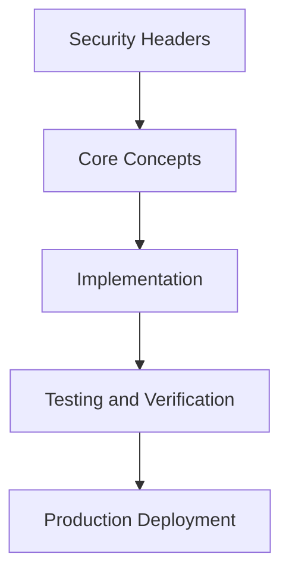

# Day 71 [Advanced]: Security Headers

## Index

- [Goal](#goal)
- [Prerequisites](#prerequisites)
- [Explanation](#explanation)
- [Topic by Topic](#topic-by-topic)
- [Key Concepts](#key-concepts)
- [Visual Concept Map](#visual-concept-map)
- [End-to-End Practical](#end-to-end-practical)
- [Hands-on Coding](#hands-on-coding)
- [Mini Exercise](#mini-exercise)
- [Assessment Quiz](#assessment-quiz)
- [Task](#task)
- [Self Check](#self-check)
- [Interview Questions and Answers](#interview-questions-and-answers)
- [Day 71 Outcome](#day-71-outcome)

## Goal

Understand and apply Security Headers in a Next.js application to build production-quality features.

## Prerequisites

- Day 70 completed
- Solid understanding of Next.js App Router and TypeScript basics
- Familiarity with Server Components and data fetching patterns

## Explanation

Security headers are a core browser-side defense layer for Next.js applications. Correct policies reduce XSS, clickjacking, mixed-content risks, and data exfiltration vectors.

This lesson focuses on choosing practical header policies, rollout strategy, and monitoring so security improvements do not break critical user journeys.


## Topic by Topic

### Topic 1: Security Header Threat Model

Theory:
This topic covers Security Header Threat Model in production Next.js systems, with emphasis on safety, scalability, and maintainable implementation choices.

Practical:
Apply Security Header Threat Model in a realistic feature or service flow, validate edge cases, and document tradeoffs for team-level review.

Code Example:

```tsx
// Security Headers — Topic 1
// Implementation depends on your specific use case.
// Refer to the Next.js documentation for detailed API reference.
export default function Example1() {
  return <div>Security Headers — Example 1</div>;
}
```
**Explanation:**
Security Header Threat Model helps turn framework capabilities into dependable production behavior that teams can monitor and evolve confidently.

**Key Points:**
- Understand why Security Header Threat Model matters in real deployments.
- Use explicit boundaries and defaults when implementing it.
- Validate results with tests, metrics, or review checklists.


### Topic 2: CSP Strategy and Nonce Design

Theory:
This topic covers CSP Strategy and Nonce Design in production Next.js systems, with emphasis on safety, scalability, and maintainable implementation choices.

Practical:
Apply CSP Strategy and Nonce Design in a realistic feature or service flow, validate edge cases, and document tradeoffs for team-level review.

Code Example:

```tsx
// Security Headers — Topic 2
// Implementation depends on your specific use case.
// Refer to the Next.js documentation for detailed API reference.
export default function Example2() {
  return <div>Security Headers — Example 2</div>;
}
```
**Explanation:**
CSP Strategy and Nonce Design helps turn framework capabilities into dependable production behavior that teams can monitor and evolve confidently.

**Key Points:**
- Understand why CSP Strategy and Nonce Design matters in real deployments.
- Use explicit boundaries and defaults when implementing it.
- Validate results with tests, metrics, or review checklists.


### Topic 3: HSTS and Transport Security

Theory:
This topic covers HSTS and Transport Security in production Next.js systems, with emphasis on safety, scalability, and maintainable implementation choices.

Practical:
Apply HSTS and Transport Security in a realistic feature or service flow, validate edge cases, and document tradeoffs for team-level review.

Code Example:

```tsx
// Security Headers — Topic 3
// Implementation depends on your specific use case.
// Refer to the Next.js documentation for detailed API reference.
export default function Example3() {
  return <div>Security Headers — Example 3</div>;
}
```
**Explanation:**
HSTS and Transport Security helps turn framework capabilities into dependable production behavior that teams can monitor and evolve confidently.

**Key Points:**
- Understand why HSTS and Transport Security matters in real deployments.
- Use explicit boundaries and defaults when implementing it.
- Validate results with tests, metrics, or review checklists.


### Topic 4: Frame and Content Type Protections

Theory:
This topic covers Frame and Content Type Protections in production Next.js systems, with emphasis on safety, scalability, and maintainable implementation choices.

Practical:
Apply Frame and Content Type Protections in a realistic feature or service flow, validate edge cases, and document tradeoffs for team-level review.

Code Example:

```tsx
// Security Headers — Topic 4
// Implementation depends on your specific use case.
// Refer to the Next.js documentation for detailed API reference.
export default function Example4() {
  return <div>Security Headers — Example 4</div>;
}
```
**Explanation:**
Frame and Content Type Protections helps turn framework capabilities into dependable production behavior that teams can monitor and evolve confidently.

**Key Points:**
- Understand why Frame and Content Type Protections matters in real deployments.
- Use explicit boundaries and defaults when implementing it.
- Validate results with tests, metrics, or review checklists.


### Topic 5: Rollout and Compatibility Testing

Theory:
This topic covers Rollout and Compatibility Testing in production Next.js systems, with emphasis on safety, scalability, and maintainable implementation choices.

Practical:
Apply Rollout and Compatibility Testing in a realistic feature or service flow, validate edge cases, and document tradeoffs for team-level review.

Code Example:

```tsx
// Security Headers — Topic 5
// Implementation depends on your specific use case.
// Refer to the Next.js documentation for detailed API reference.
export default function Example5() {
  return <div>Security Headers — Example 5</div>;
}
```
**Explanation:**
Rollout and Compatibility Testing helps turn framework capabilities into dependable production behavior that teams can monitor and evolve confidently.

**Key Points:**
- Understand why Rollout and Compatibility Testing matters in real deployments.
- Use explicit boundaries and defaults when implementing it.
- Validate results with tests, metrics, or review checklists.


### Topic 6: Monitoring and Policy Evolution

Theory:
This topic covers Monitoring and Policy Evolution in production Next.js systems, with emphasis on safety, scalability, and maintainable implementation choices.

Practical:
Apply Monitoring and Policy Evolution in a realistic feature or service flow, validate edge cases, and document tradeoffs for team-level review.

Code Example:

```tsx
// Security Headers — Topic 6
// Implementation depends on your specific use case.
// Refer to the Next.js documentation for detailed API reference.
export default function Example6() {
  return <div>Security Headers — Example 6</div>;
}
```
**Explanation:**
Monitoring and Policy Evolution helps turn framework capabilities into dependable production behavior that teams can monitor and evolve confidently.

**Key Points:**
- Understand why Monitoring and Policy Evolution matters in real deployments.
- Use explicit boundaries and defaults when implementing it.
- Validate results with tests, metrics, or review checklists.


## Key Concepts

- Security Headers: Core concept for advanced Next.js development
- Next.js App Router: The modern routing system using the app/ directory
- Server Component: A component that runs on the server only
- TypeScript: Strongly typed JavaScript used throughout Next.js projects

## Visual Concept Map



## End-to-End Practical

1. Review the explanation and all topic examples.
2. Set up a clean Next.js project or use your existing one.
3. Implement each topic example step by step.
4. Verify the behavior in the browser.
5. Refactor and clean up your implementation.
6. Write a brief note on what you learned.

## Hands-on Coding

### Example 1: Basic Security Headers Implementation

```tsx
// Basic implementation of Security Headers
// Follow the topic examples above to build this out.
export default function Example() {
  return (
    <div style={{ padding: "24px" }}>
      <h1>Security Headers</h1>
      <p>Implementation complete for Day 71.</p>
    </div>
  );
}
```

### Example 2: Practical Use Case

```tsx
// A real-world use case for Security Headers
// Refer to the Topic by Topic section for code details.
export default function PracticalExample() {
  return (
    <div>
      <h2>Practical: Security Headers</h2>
    </div>
  );
}
```

### Example 3: Combined Pattern

```tsx
// Combining Security Headers with other Next.js features
// This example shows integration with the App Router.
export default function CombinedExample() {
  return (
    <section>
      <h2>Security Headers — Combined Pattern</h2>
      <p>See topic sections above for detailed code.</p>
    </section>
  );
}
```

## Mini Exercise

Scenario:
You are adding Security Headers to a Next.js application for a real-world feature.

Steps:

1. Create a new route or component relevant to this topic.
2. Implement the core pattern from the Topic by Topic section.
3. Test the implementation thoroughly.
4. Verify edge cases are handled.
5. Clean up and document your code.

Expected output:

- Working implementation of Security Headers
- All edge cases handled correctly
- Clean, readable code following Next.js conventions

## Assessment Quiz

### Quiz Questions

1. What is the primary purpose of Security Headers in Next.js?
2. Where in the project structure do you implement this pattern?
3. What is a common mistake when using Security Headers?
4. True or False: Security Headers only applies to Client Components.
5. How does Security Headers improve the user or developer experience?

### Quiz Answers

1. To enable advanced-level functionality in a Next.js application efficiently.
2. In the App Router directory structure, using Server Components by default.
3. Mixing server and client concerns incorrectly, or skipping error handling.
4. False. This concept applies broadly across the Next.js architecture.
5. It improves maintainability, performance, and scalability of the application.

## Task

- Study all topic examples in today's lesson
- Implement the core pattern in a Next.js project
- Test all scenarios including error and edge cases
- Complete the mini exercise
- Attempt the quiz before checking answers

## Self Check

- You can implement Security Headers from scratch
- You understand when and why to use this pattern
- You can explain the concept in simple terms
- You have tested the implementation in a running app
- You can answer at least 4 out of 5 quiz questions correctly

## Interview Questions and Answers

### Beginner

**Question:** What is Security Headers in Next.js?

**Answer:** Security Headers is a advanced-level Next.js feature that helps developers build robust, scalable applications by handling a specific aspect of the framework architecture.

**Question:** When would you use Security Headers?

**Answer:** When you need to implement the specific functionality it provides in a production Next.js application, particularly in advanced-stage projects.

### Middle

**Question:** How does Security Headers interact with the Next.js App Router?

**Answer:** It integrates with the App Router through Server Components, Route Handlers, or middleware, depending on the specific implementation pattern required.

**Question:** What are common pitfalls with Security Headers?

**Answer:** The most common pitfalls are improper handling of server/client boundaries, missing error states, and not considering caching behavior when relevant.

### Advanced

**Question:** How would you scale Security Headers in a large Next.js application with multiple teams?

**Answer:** By establishing clear conventions, creating reusable utilities, documenting patterns in an Architecture Decision Record, and enforcing consistency through code review and linting rules.

**Question:** What performance considerations apply to Security Headers?

**Answer:** Consider bundle size impact for client-side features, caching strategies for data fetching, and rendering mode selection to balance performance with data freshness.

## Day 71 Outcome

- You understand Security Headers and its role in Next.js
- You can implement this pattern in a real project
- You know when to use and when to avoid this pattern
- You are ready for Day 71 — moving on to the next topic
