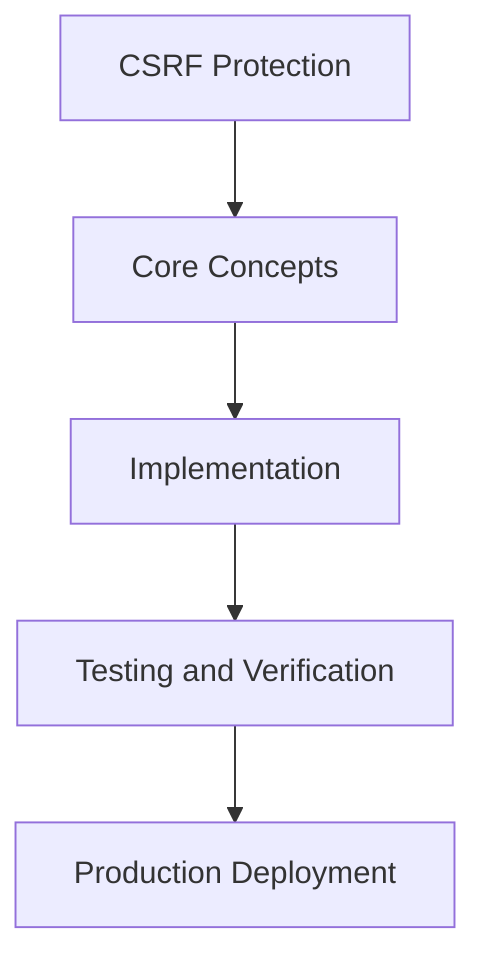

# Day 72 [Advanced]: CSRF Protection

## Index

- [Goal](#goal)
- [Prerequisites](#prerequisites)
- [Explanation](#explanation)
- [Topic by Topic](#topic-by-topic)
- [Key Concepts](#key-concepts)
- [Visual Concept Map](#visual-concept-map)
- [End-to-End Practical](#end-to-end-practical)
- [Hands-on Coding](#hands-on-coding)
- [Mini Exercise](#mini-exercise)
- [Assessment Quiz](#assessment-quiz)
- [Task](#task)
- [Self Check](#self-check)
- [Interview Questions and Answers](#interview-questions-and-answers)
- [Day 72 Outcome](#day-72-outcome)

## Goal

Understand and apply CSRF Protection in a Next.js application to build production-quality features.

## Prerequisites

- Day 71 completed
- Solid understanding of Next.js App Router and TypeScript basics
- Familiarity with Server Components and data fetching patterns

## Explanation

CSRF protection is essential for state-changing flows such as profile updates, checkout, and account actions. In Next.js, protection must align with cookie strategy, server boundaries, and form architecture.

A good implementation combines secure defaults, token validation, and clear failure handling without degrading user experience.


## Topic by Topic

### Topic 1: CSRF Threat Surfaces in Next.js

Theory:
This topic covers CSRF Threat Surfaces in Next.js in production Next.js systems, with emphasis on safety, scalability, and maintainable implementation choices.

Practical:
Apply CSRF Threat Surfaces in Next.js in a realistic feature or service flow, validate edge cases, and document tradeoffs for team-level review.

Code Example:

```tsx
// CSRF Protection — Topic 1
// Implementation depends on your specific use case.
// Refer to the Next.js documentation for detailed API reference.
export default function Example1() {
  return <div>CSRF Protection — Example 1</div>;
}
```
**Explanation:**
CSRF Threat Surfaces in Next.js helps turn framework capabilities into dependable production behavior that teams can monitor and evolve confidently.

**Key Points:**
- Understand why CSRF Threat Surfaces in Next.js matters in real deployments.
- Use explicit boundaries and defaults when implementing it.
- Validate results with tests, metrics, or review checklists.


### Topic 2: Cookie and SameSite Foundations

Theory:
This topic covers Cookie and SameSite Foundations in production Next.js systems, with emphasis on safety, scalability, and maintainable implementation choices.

Practical:
Apply Cookie and SameSite Foundations in a realistic feature or service flow, validate edge cases, and document tradeoffs for team-level review.

Code Example:

```tsx
// CSRF Protection — Topic 2
// Implementation depends on your specific use case.
// Refer to the Next.js documentation for detailed API reference.
export default function Example2() {
  return <div>CSRF Protection — Example 2</div>;
}
```
**Explanation:**
Cookie and SameSite Foundations helps turn framework capabilities into dependable production behavior that teams can monitor and evolve confidently.

**Key Points:**
- Understand why Cookie and SameSite Foundations matters in real deployments.
- Use explicit boundaries and defaults when implementing it.
- Validate results with tests, metrics, or review checklists.


### Topic 3: Anti-CSRF Token Patterns

Theory:
This topic covers Anti-CSRF Token Patterns in production Next.js systems, with emphasis on safety, scalability, and maintainable implementation choices.

Practical:
Apply Anti-CSRF Token Patterns in a realistic feature or service flow, validate edge cases, and document tradeoffs for team-level review.

Code Example:

```tsx
// CSRF Protection — Topic 3
// Implementation depends on your specific use case.
// Refer to the Next.js documentation for detailed API reference.
export default function Example3() {
  return <div>CSRF Protection — Example 3</div>;
}
```
**Explanation:**
Anti-CSRF Token Patterns helps turn framework capabilities into dependable production behavior that teams can monitor and evolve confidently.

**Key Points:**
- Understand why Anti-CSRF Token Patterns matters in real deployments.
- Use explicit boundaries and defaults when implementing it.
- Validate results with tests, metrics, or review checklists.


### Topic 4: Validating Mutations Server-side

Theory:
This topic covers Validating Mutations Server-side in production Next.js systems, with emphasis on safety, scalability, and maintainable implementation choices.

Practical:
Apply Validating Mutations Server-side in a realistic feature or service flow, validate edge cases, and document tradeoffs for team-level review.

Code Example:

```tsx
// CSRF Protection — Topic 4
// Implementation depends on your specific use case.
// Refer to the Next.js documentation for detailed API reference.
export default function Example4() {
  return <div>CSRF Protection — Example 4</div>;
}
```
**Explanation:**
Validating Mutations Server-side helps turn framework capabilities into dependable production behavior that teams can monitor and evolve confidently.

**Key Points:**
- Understand why Validating Mutations Server-side matters in real deployments.
- Use explicit boundaries and defaults when implementing it.
- Validate results with tests, metrics, or review checklists.


### Topic 5: Error Handling and UX for CSRF Failures

Theory:
This topic covers Error Handling and UX for CSRF Failures in production Next.js systems, with emphasis on safety, scalability, and maintainable implementation choices.

Practical:
Apply Error Handling and UX for CSRF Failures in a realistic feature or service flow, validate edge cases, and document tradeoffs for team-level review.

Code Example:

```tsx
// CSRF Protection — Topic 5
// Implementation depends on your specific use case.
// Refer to the Next.js documentation for detailed API reference.
export default function Example5() {
  return <div>CSRF Protection — Example 5</div>;
}
```
**Explanation:**
Error Handling and UX for CSRF Failures helps turn framework capabilities into dependable production behavior that teams can monitor and evolve confidently.

**Key Points:**
- Understand why Error Handling and UX for CSRF Failures matters in real deployments.
- Use explicit boundaries and defaults when implementing it.
- Validate results with tests, metrics, or review checklists.


### Topic 6: Testing CSRF Defenses End-to-End

Theory:
This topic covers Testing CSRF Defenses End-to-End in production Next.js systems, with emphasis on safety, scalability, and maintainable implementation choices.

Practical:
Apply Testing CSRF Defenses End-to-End in a realistic feature or service flow, validate edge cases, and document tradeoffs for team-level review.

Code Example:

```tsx
// CSRF Protection — Topic 6
// Implementation depends on your specific use case.
// Refer to the Next.js documentation for detailed API reference.
export default function Example6() {
  return <div>CSRF Protection — Example 6</div>;
}
```
**Explanation:**
Testing CSRF Defenses End-to-End helps turn framework capabilities into dependable production behavior that teams can monitor and evolve confidently.

**Key Points:**
- Understand why Testing CSRF Defenses End-to-End matters in real deployments.
- Use explicit boundaries and defaults when implementing it.
- Validate results with tests, metrics, or review checklists.


## Key Concepts

- CSRF Protection: Core concept for advanced Next.js development
- Next.js App Router: The modern routing system using the app/ directory
- Server Component: A component that runs on the server only
- TypeScript: Strongly typed JavaScript used throughout Next.js projects

## Visual Concept Map



## End-to-End Practical

1. Review the explanation and all topic examples.
2. Set up a clean Next.js project or use your existing one.
3. Implement each topic example step by step.
4. Verify the behavior in the browser.
5. Refactor and clean up your implementation.
6. Write a brief note on what you learned.

## Hands-on Coding

### Example 1: Basic CSRF Protection Implementation

```tsx
// Basic implementation of CSRF Protection
// Follow the topic examples above to build this out.
export default function Example() {
  return (
    <div style={{ padding: "24px" }}>
      <h1>CSRF Protection</h1>
      <p>Implementation complete for Day 72.</p>
    </div>
  );
}
```

### Example 2: Practical Use Case

```tsx
// A real-world use case for CSRF Protection
// Refer to the Topic by Topic section for code details.
export default function PracticalExample() {
  return (
    <div>
      <h2>Practical: CSRF Protection</h2>
    </div>
  );
}
```

### Example 3: Combined Pattern

```tsx
// Combining CSRF Protection with other Next.js features
// This example shows integration with the App Router.
export default function CombinedExample() {
  return (
    <section>
      <h2>CSRF Protection — Combined Pattern</h2>
      <p>See topic sections above for detailed code.</p>
    </section>
  );
}
```

## Mini Exercise

Scenario:
You are adding CSRF Protection to a Next.js application for a real-world feature.

Steps:

1. Create a new route or component relevant to this topic.
2. Implement the core pattern from the Topic by Topic section.
3. Test the implementation thoroughly.
4. Verify edge cases are handled.
5. Clean up and document your code.

Expected output:

- Working implementation of CSRF Protection
- All edge cases handled correctly
- Clean, readable code following Next.js conventions

## Assessment Quiz

### Quiz Questions

1. What is the primary purpose of CSRF Protection in Next.js?
2. Where in the project structure do you implement this pattern?
3. What is a common mistake when using CSRF Protection?
4. True or False: CSRF Protection only applies to Client Components.
5. How does CSRF Protection improve the user or developer experience?

### Quiz Answers

1. To enable advanced-level functionality in a Next.js application efficiently.
2. In the App Router directory structure, using Server Components by default.
3. Mixing server and client concerns incorrectly, or skipping error handling.
4. False. This concept applies broadly across the Next.js architecture.
5. It improves maintainability, performance, and scalability of the application.

## Task

- Study all topic examples in today's lesson
- Implement the core pattern in a Next.js project
- Test all scenarios including error and edge cases
- Complete the mini exercise
- Attempt the quiz before checking answers

## Self Check

- You can implement CSRF Protection from scratch
- You understand when and why to use this pattern
- You can explain the concept in simple terms
- You have tested the implementation in a running app
- You can answer at least 4 out of 5 quiz questions correctly

## Interview Questions and Answers

### Beginner

**Question:** What is CSRF Protection in Next.js?

**Answer:** CSRF Protection is a advanced-level Next.js feature that helps developers build robust, scalable applications by handling a specific aspect of the framework architecture.

**Question:** When would you use CSRF Protection?

**Answer:** When you need to implement the specific functionality it provides in a production Next.js application, particularly in advanced-stage projects.

### Middle

**Question:** How does CSRF Protection interact with the Next.js App Router?

**Answer:** It integrates with the App Router through Server Components, Route Handlers, or middleware, depending on the specific implementation pattern required.

**Question:** What are common pitfalls with CSRF Protection?

**Answer:** The most common pitfalls are improper handling of server/client boundaries, missing error states, and not considering caching behavior when relevant.

### Advanced

**Question:** How would you scale CSRF Protection in a large Next.js application with multiple teams?

**Answer:** By establishing clear conventions, creating reusable utilities, documenting patterns in an Architecture Decision Record, and enforcing consistency through code review and linting rules.

**Question:** What performance considerations apply to CSRF Protection?

**Answer:** Consider bundle size impact for client-side features, caching strategies for data fetching, and rendering mode selection to balance performance with data freshness.

## Day 72 Outcome

- You understand CSRF Protection and its role in Next.js
- You can implement this pattern in a real project
- You know when to use and when to avoid this pattern
- You are ready for Day 72 — moving on to the next topic
