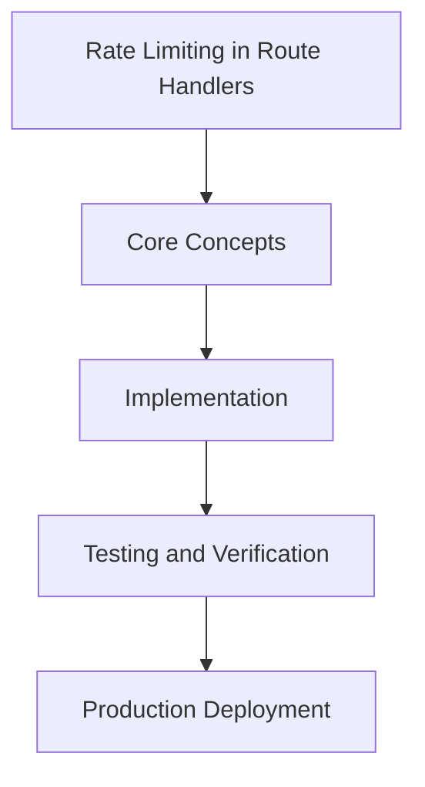

# Day 73 [Advanced]: Rate Limiting in Route Handlers

## Index

- [Goal](#goal)
- [Prerequisites](#prerequisites)
- [Explanation](#explanation)
- [Topic by Topic](#topic-by-topic)
- [Key Concepts](#key-concepts)
- [Visual Concept Map](#visual-concept-map)
- [End-to-End Practical](#end-to-end-practical)
- [Hands-on Coding](#hands-on-coding)
- [Mini Exercise](#mini-exercise)
- [Assessment Quiz](#assessment-quiz)
- [Task](#task)
- [Self Check](#self-check)
- [Interview Questions and Answers](#interview-questions-and-answers)
- [Day 73 Outcome](#day-73-outcome)

## Goal

Understand and apply Rate Limiting in Route Handlers in a Next.js application to build production-quality features.

## Prerequisites

- Day 72 completed
- Solid understanding of Next.js App Router and TypeScript basics
- Familiarity with Server Components and data fetching patterns

## Explanation

Rate limiting in route handlers protects APIs from abuse, accidental spikes, and costly backend overload. For Next.js services, limits should be tied to endpoint sensitivity and client identity quality.

This lesson covers policy design, storage backends, and operational tuning for fair usage and resilient performance.


## Topic by Topic

### Topic 1: Rate-limit Policy Design

Theory:
This topic covers Rate-limit Policy Design in production Next.js systems, with emphasis on safety, scalability, and maintainable implementation choices.

Practical:
Apply Rate-limit Policy Design in a realistic feature or service flow, validate edge cases, and document tradeoffs for team-level review.

Code Example:

```tsx
// Rate Limiting in Route Handlers — Topic 1
// Implementation depends on your specific use case.
// Refer to the Next.js documentation for detailed API reference.
export default function Example1() {
  return <div>Rate Limiting in Route Handlers — Example 1</div>;
}
```
**Explanation:**
Rate-limit Policy Design helps turn framework capabilities into dependable production behavior that teams can monitor and evolve confidently.

**Key Points:**
- Understand why Rate-limit Policy Design matters in real deployments.
- Use explicit boundaries and defaults when implementing it.
- Validate results with tests, metrics, or review checklists.


### Topic 2: Identity Keys and Trust Boundaries

Theory:
This topic covers Identity Keys and Trust Boundaries in production Next.js systems, with emphasis on safety, scalability, and maintainable implementation choices.

Practical:
Apply Identity Keys and Trust Boundaries in a realistic feature or service flow, validate edge cases, and document tradeoffs for team-level review.

Code Example:

```tsx
// Rate Limiting in Route Handlers — Topic 2
// Implementation depends on your specific use case.
// Refer to the Next.js documentation for detailed API reference.
export default function Example2() {
  return <div>Rate Limiting in Route Handlers — Example 2</div>;
}
```
**Explanation:**
Identity Keys and Trust Boundaries helps turn framework capabilities into dependable production behavior that teams can monitor and evolve confidently.

**Key Points:**
- Understand why Identity Keys and Trust Boundaries matters in real deployments.
- Use explicit boundaries and defaults when implementing it.
- Validate results with tests, metrics, or review checklists.


### Topic 3: Storage Backends for Counters

Theory:
This topic covers Storage Backends for Counters in production Next.js systems, with emphasis on safety, scalability, and maintainable implementation choices.

Practical:
Apply Storage Backends for Counters in a realistic feature or service flow, validate edge cases, and document tradeoffs for team-level review.

Code Example:

```tsx
// Rate Limiting in Route Handlers — Topic 3
// Implementation depends on your specific use case.
// Refer to the Next.js documentation for detailed API reference.
export default function Example3() {
  return <div>Rate Limiting in Route Handlers — Example 3</div>;
}
```
**Explanation:**
Storage Backends for Counters helps turn framework capabilities into dependable production behavior that teams can monitor and evolve confidently.

**Key Points:**
- Understand why Storage Backends for Counters matters in real deployments.
- Use explicit boundaries and defaults when implementing it.
- Validate results with tests, metrics, or review checklists.


### Topic 4: Route Handler Enforcement Patterns

Theory:
This topic covers Route Handler Enforcement Patterns in production Next.js systems, with emphasis on safety, scalability, and maintainable implementation choices.

Practical:
Apply Route Handler Enforcement Patterns in a realistic feature or service flow, validate edge cases, and document tradeoffs for team-level review.

Code Example:

```tsx
// Rate Limiting in Route Handlers — Topic 4
// Implementation depends on your specific use case.
// Refer to the Next.js documentation for detailed API reference.
export default function Example4() {
  return <div>Rate Limiting in Route Handlers — Example 4</div>;
}
```
**Explanation:**
Route Handler Enforcement Patterns helps turn framework capabilities into dependable production behavior that teams can monitor and evolve confidently.

**Key Points:**
- Understand why Route Handler Enforcement Patterns matters in real deployments.
- Use explicit boundaries and defaults when implementing it.
- Validate results with tests, metrics, or review checklists.


### Topic 5: Handling Limit Responses Gracefully

Theory:
This topic covers Handling Limit Responses Gracefully in production Next.js systems, with emphasis on safety, scalability, and maintainable implementation choices.

Practical:
Apply Handling Limit Responses Gracefully in a realistic feature or service flow, validate edge cases, and document tradeoffs for team-level review.

Code Example:

```tsx
// Rate Limiting in Route Handlers — Topic 5
// Implementation depends on your specific use case.
// Refer to the Next.js documentation for detailed API reference.
export default function Example5() {
  return <div>Rate Limiting in Route Handlers — Example 5</div>;
}
```
**Explanation:**
Handling Limit Responses Gracefully helps turn framework capabilities into dependable production behavior that teams can monitor and evolve confidently.

**Key Points:**
- Understand why Handling Limit Responses Gracefully matters in real deployments.
- Use explicit boundaries and defaults when implementing it.
- Validate results with tests, metrics, or review checklists.


### Topic 6: Observability and Adaptive Tuning

Theory:
This topic covers Observability and Adaptive Tuning in production Next.js systems, with emphasis on safety, scalability, and maintainable implementation choices.

Practical:
Apply Observability and Adaptive Tuning in a realistic feature or service flow, validate edge cases, and document tradeoffs for team-level review.

Code Example:

```tsx
// Rate Limiting in Route Handlers — Topic 6
// Implementation depends on your specific use case.
// Refer to the Next.js documentation for detailed API reference.
export default function Example6() {
  return <div>Rate Limiting in Route Handlers — Example 6</div>;
}
```
**Explanation:**
Observability and Adaptive Tuning helps turn framework capabilities into dependable production behavior that teams can monitor and evolve confidently.

**Key Points:**
- Understand why Observability and Adaptive Tuning matters in real deployments.
- Use explicit boundaries and defaults when implementing it.
- Validate results with tests, metrics, or review checklists.


## Key Concepts

- Rate Limiting in Route Handlers: Core concept for advanced Next.js development
- Next.js App Router: The modern routing system using the app/ directory
- Server Component: A component that runs on the server only
- TypeScript: Strongly typed JavaScript used throughout Next.js projects

## Visual Concept Map



## End-to-End Practical

1. Review the explanation and all topic examples.
2. Set up a clean Next.js project or use your existing one.
3. Implement each topic example step by step.
4. Verify the behavior in the browser.
5. Refactor and clean up your implementation.
6. Write a brief note on what you learned.

## Hands-on Coding

### Example 1: Basic Rate Limiting in Route Handlers Implementation

```tsx
// Basic implementation of Rate Limiting in Route Handlers
// Follow the topic examples above to build this out.
export default function Example() {
  return (
    <div style={{ padding: "24px" }}>
      <h1>Rate Limiting in Route Handlers</h1>
      <p>Implementation complete for Day 73.</p>
    </div>
  );
}
```

### Example 2: Practical Use Case

```tsx
// A real-world use case for Rate Limiting in Route Handlers
// Refer to the Topic by Topic section for code details.
export default function PracticalExample() {
  return (
    <div>
      <h2>Practical: Rate Limiting in Route Handlers</h2>
    </div>
  );
}
```

### Example 3: Combined Pattern

```tsx
// Combining Rate Limiting in Route Handlers with other Next.js features
// This example shows integration with the App Router.
export default function CombinedExample() {
  return (
    <section>
      <h2>Rate Limiting in Route Handlers — Combined Pattern</h2>
      <p>See topic sections above for detailed code.</p>
    </section>
  );
}
```

## Mini Exercise

Scenario:
You are adding Rate Limiting in Route Handlers to a Next.js application for a real-world feature.

Steps:

1. Create a new route or component relevant to this topic.
2. Implement the core pattern from the Topic by Topic section.
3. Test the implementation thoroughly.
4. Verify edge cases are handled.
5. Clean up and document your code.

Expected output:

- Working implementation of Rate Limiting in Route Handlers
- All edge cases handled correctly
- Clean, readable code following Next.js conventions

## Assessment Quiz

### Quiz Questions

1. What is the primary purpose of Rate Limiting in Route Handlers in Next.js?
2. Where in the project structure do you implement this pattern?
3. What is a common mistake when using Rate Limiting in Route Handlers?
4. True or False: Rate Limiting in Route Handlers only applies to Client Components.
5. How does Rate Limiting in Route Handlers improve the user or developer experience?

### Quiz Answers

1. To enable advanced-level functionality in a Next.js application efficiently.
2. In the App Router directory structure, using Server Components by default.
3. Mixing server and client concerns incorrectly, or skipping error handling.
4. False. This concept applies broadly across the Next.js architecture.
5. It improves maintainability, performance, and scalability of the application.

## Task

- Study all topic examples in today's lesson
- Implement the core pattern in a Next.js project
- Test all scenarios including error and edge cases
- Complete the mini exercise
- Attempt the quiz before checking answers

## Self Check

- You can implement Rate Limiting in Route Handlers from scratch
- You understand when and why to use this pattern
- You can explain the concept in simple terms
- You have tested the implementation in a running app
- You can answer at least 4 out of 5 quiz questions correctly

## Interview Questions and Answers

### Beginner

**Question:** What is Rate Limiting in Route Handlers in Next.js?

**Answer:** Rate Limiting in Route Handlers is a advanced-level Next.js feature that helps developers build robust, scalable applications by handling a specific aspect of the framework architecture.

**Question:** When would you use Rate Limiting in Route Handlers?

**Answer:** When you need to implement the specific functionality it provides in a production Next.js application, particularly in advanced-stage projects.

### Middle

**Question:** How does Rate Limiting in Route Handlers interact with the Next.js App Router?

**Answer:** It integrates with the App Router through Server Components, Route Handlers, or middleware, depending on the specific implementation pattern required.

**Question:** What are common pitfalls with Rate Limiting in Route Handlers?

**Answer:** The most common pitfalls are improper handling of server/client boundaries, missing error states, and not considering caching behavior when relevant.

### Advanced

**Question:** How would you scale Rate Limiting in Route Handlers in a large Next.js application with multiple teams?

**Answer:** By establishing clear conventions, creating reusable utilities, documenting patterns in an Architecture Decision Record, and enforcing consistency through code review and linting rules.

**Question:** What performance considerations apply to Rate Limiting in Route Handlers?

**Answer:** Consider bundle size impact for client-side features, caching strategies for data fetching, and rendering mode selection to balance performance with data freshness.

## Day 73 Outcome

- You understand Rate Limiting in Route Handlers and its role in Next.js
- You can implement this pattern in a real project
- You know when to use and when to avoid this pattern
- You are ready for Day 73 — moving on to the next topic
