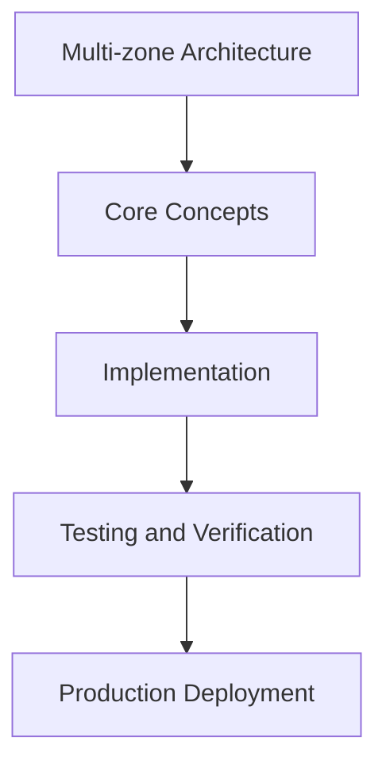

# Day 74 [Advanced]: Multi-zone Architecture

## Index

- [Goal](#goal)
- [Prerequisites](#prerequisites)
- [Explanation](#explanation)
- [Topic by Topic](#topic-by-topic)
- [Key Concepts](#key-concepts)
- [Visual Concept Map](#visual-concept-map)
- [End-to-End Practical](#end-to-end-practical)
- [Hands-on Coding](#hands-on-coding)
- [Mini Exercise](#mini-exercise)
- [Assessment Quiz](#assessment-quiz)
- [Task](#task)
- [Self Check](#self-check)
- [Interview Questions and Answers](#interview-questions-and-answers)
- [Day 74 Outcome](#day-74-outcome)

## Goal

Understand and apply Multi-zone Architecture in a Next.js application to build production-quality features.

## Prerequisites

- Day 73 completed
- Solid understanding of Next.js App Router and TypeScript basics
- Familiarity with Server Components and data fetching patterns

## Explanation

Multi-zone architecture helps large Next.js programs split ownership, scale independently, and release subsystems safely. It is useful when one codebase becomes too coupled for team velocity.

Success depends on clear boundaries, routing contracts, and shared platform governance across zones.


## Topic by Topic

### Topic 1: When to Adopt Multi-zone

Theory:
This topic covers When to Adopt Multi-zone in production Next.js systems, with emphasis on safety, scalability, and maintainable implementation choices.

Practical:
Apply When to Adopt Multi-zone in a realistic feature or service flow, validate edge cases, and document tradeoffs for team-level review.

Code Example:

```tsx
// Multi-zone Architecture — Topic 1
// Implementation depends on your specific use case.
// Refer to the Next.js documentation for detailed API reference.
export default function Example1() {
  return <div>Multi-zone Architecture — Example 1</div>;
}
```
**Explanation:**
When to Adopt Multi-zone helps turn framework capabilities into dependable production behavior that teams can monitor and evolve confidently.

**Key Points:**
- Understand why When to Adopt Multi-zone matters in real deployments.
- Use explicit boundaries and defaults when implementing it.
- Validate results with tests, metrics, or review checklists.


### Topic 2: Routing Contracts Between Zones

Theory:
This topic covers Routing Contracts Between Zones in production Next.js systems, with emphasis on safety, scalability, and maintainable implementation choices.

Practical:
Apply Routing Contracts Between Zones in a realistic feature or service flow, validate edge cases, and document tradeoffs for team-level review.

Code Example:

```tsx
// Multi-zone Architecture — Topic 2
// Implementation depends on your specific use case.
// Refer to the Next.js documentation for detailed API reference.
export default function Example2() {
  return <div>Multi-zone Architecture — Example 2</div>;
}
```
**Explanation:**
Routing Contracts Between Zones helps turn framework capabilities into dependable production behavior that teams can monitor and evolve confidently.

**Key Points:**
- Understand why Routing Contracts Between Zones matters in real deployments.
- Use explicit boundaries and defaults when implementing it.
- Validate results with tests, metrics, or review checklists.


### Topic 3: Shared Design and Auth Boundaries

Theory:
This topic covers Shared Design and Auth Boundaries in production Next.js systems, with emphasis on safety, scalability, and maintainable implementation choices.

Practical:
Apply Shared Design and Auth Boundaries in a realistic feature or service flow, validate edge cases, and document tradeoffs for team-level review.

Code Example:

```tsx
// Multi-zone Architecture — Topic 3
// Implementation depends on your specific use case.
// Refer to the Next.js documentation for detailed API reference.
export default function Example3() {
  return <div>Multi-zone Architecture — Example 3</div>;
}
```
**Explanation:**
Shared Design and Auth Boundaries helps turn framework capabilities into dependable production behavior that teams can monitor and evolve confidently.

**Key Points:**
- Understand why Shared Design and Auth Boundaries matters in real deployments.
- Use explicit boundaries and defaults when implementing it.
- Validate results with tests, metrics, or review checklists.


### Topic 4: Deployment Coordination and Versioning

Theory:
This topic covers Deployment Coordination and Versioning in production Next.js systems, with emphasis on safety, scalability, and maintainable implementation choices.

Practical:
Apply Deployment Coordination and Versioning in a realistic feature or service flow, validate edge cases, and document tradeoffs for team-level review.

Code Example:

```tsx
// Multi-zone Architecture — Topic 4
// Implementation depends on your specific use case.
// Refer to the Next.js documentation for detailed API reference.
export default function Example4() {
  return <div>Multi-zone Architecture — Example 4</div>;
}
```
**Explanation:**
Deployment Coordination and Versioning helps turn framework capabilities into dependable production behavior that teams can monitor and evolve confidently.

**Key Points:**
- Understand why Deployment Coordination and Versioning matters in real deployments.
- Use explicit boundaries and defaults when implementing it.
- Validate results with tests, metrics, or review checklists.


### Topic 5: Failure Isolation and Rollback

Theory:
This topic covers Failure Isolation and Rollback in production Next.js systems, with emphasis on safety, scalability, and maintainable implementation choices.

Practical:
Apply Failure Isolation and Rollback in a realistic feature or service flow, validate edge cases, and document tradeoffs for team-level review.

Code Example:

```tsx
// Multi-zone Architecture — Topic 5
// Implementation depends on your specific use case.
// Refer to the Next.js documentation for detailed API reference.
export default function Example5() {
  return <div>Multi-zone Architecture — Example 5</div>;
}
```
**Explanation:**
Failure Isolation and Rollback helps turn framework capabilities into dependable production behavior that teams can monitor and evolve confidently.

**Key Points:**
- Understand why Failure Isolation and Rollback matters in real deployments.
- Use explicit boundaries and defaults when implementing it.
- Validate results with tests, metrics, or review checklists.


### Topic 6: Operational Governance Across Teams

Theory:
This topic covers Operational Governance Across Teams in production Next.js systems, with emphasis on safety, scalability, and maintainable implementation choices.

Practical:
Apply Operational Governance Across Teams in a realistic feature or service flow, validate edge cases, and document tradeoffs for team-level review.

Code Example:

```tsx
// Multi-zone Architecture — Topic 6
// Implementation depends on your specific use case.
// Refer to the Next.js documentation for detailed API reference.
export default function Example6() {
  return <div>Multi-zone Architecture — Example 6</div>;
}
```
**Explanation:**
Operational Governance Across Teams helps turn framework capabilities into dependable production behavior that teams can monitor and evolve confidently.

**Key Points:**
- Understand why Operational Governance Across Teams matters in real deployments.
- Use explicit boundaries and defaults when implementing it.
- Validate results with tests, metrics, or review checklists.


## Key Concepts

- Multi-zone Architecture: Core concept for advanced Next.js development
- Next.js App Router: The modern routing system using the app/ directory
- Server Component: A component that runs on the server only
- TypeScript: Strongly typed JavaScript used throughout Next.js projects

## Visual Concept Map



## End-to-End Practical

1. Review the explanation and all topic examples.
2. Set up a clean Next.js project or use your existing one.
3. Implement each topic example step by step.
4. Verify the behavior in the browser.
5. Refactor and clean up your implementation.
6. Write a brief note on what you learned.

## Hands-on Coding

### Example 1: Basic Multi-zone Architecture Implementation

```tsx
// Basic implementation of Multi-zone Architecture
// Follow the topic examples above to build this out.
export default function Example() {
  return (
    <div style={{ padding: "24px" }}>
      <h1>Multi-zone Architecture</h1>
      <p>Implementation complete for Day 74.</p>
    </div>
  );
}
```

### Example 2: Practical Use Case

```tsx
// A real-world use case for Multi-zone Architecture
// Refer to the Topic by Topic section for code details.
export default function PracticalExample() {
  return (
    <div>
      <h2>Practical: Multi-zone Architecture</h2>
    </div>
  );
}
```

### Example 3: Combined Pattern

```tsx
// Combining Multi-zone Architecture with other Next.js features
// This example shows integration with the App Router.
export default function CombinedExample() {
  return (
    <section>
      <h2>Multi-zone Architecture — Combined Pattern</h2>
      <p>See topic sections above for detailed code.</p>
    </section>
  );
}
```

## Mini Exercise

Scenario:
You are adding Multi-zone Architecture to a Next.js application for a real-world feature.

Steps:

1. Create a new route or component relevant to this topic.
2. Implement the core pattern from the Topic by Topic section.
3. Test the implementation thoroughly.
4. Verify edge cases are handled.
5. Clean up and document your code.

Expected output:

- Working implementation of Multi-zone Architecture
- All edge cases handled correctly
- Clean, readable code following Next.js conventions

## Assessment Quiz

### Quiz Questions

1. What is the primary purpose of Multi-zone Architecture in Next.js?
2. Where in the project structure do you implement this pattern?
3. What is a common mistake when using Multi-zone Architecture?
4. True or False: Multi-zone Architecture only applies to Client Components.
5. How does Multi-zone Architecture improve the user or developer experience?

### Quiz Answers

1. To enable advanced-level functionality in a Next.js application efficiently.
2. In the App Router directory structure, using Server Components by default.
3. Mixing server and client concerns incorrectly, or skipping error handling.
4. False. This concept applies broadly across the Next.js architecture.
5. It improves maintainability, performance, and scalability of the application.

## Task

- Study all topic examples in today's lesson
- Implement the core pattern in a Next.js project
- Test all scenarios including error and edge cases
- Complete the mini exercise
- Attempt the quiz before checking answers

## Self Check

- You can implement Multi-zone Architecture from scratch
- You understand when and why to use this pattern
- You can explain the concept in simple terms
- You have tested the implementation in a running app
- You can answer at least 4 out of 5 quiz questions correctly

## Interview Questions and Answers

### Beginner

**Question:** What is Multi-zone Architecture in Next.js?

**Answer:** Multi-zone Architecture is a advanced-level Next.js feature that helps developers build robust, scalable applications by handling a specific aspect of the framework architecture.

**Question:** When would you use Multi-zone Architecture?

**Answer:** When you need to implement the specific functionality it provides in a production Next.js application, particularly in advanced-stage projects.

### Middle

**Question:** How does Multi-zone Architecture interact with the Next.js App Router?

**Answer:** It integrates with the App Router through Server Components, Route Handlers, or middleware, depending on the specific implementation pattern required.

**Question:** What are common pitfalls with Multi-zone Architecture?

**Answer:** The most common pitfalls are improper handling of server/client boundaries, missing error states, and not considering caching behavior when relevant.

### Advanced

**Question:** How would you scale Multi-zone Architecture in a large Next.js application with multiple teams?

**Answer:** By establishing clear conventions, creating reusable utilities, documenting patterns in an Architecture Decision Record, and enforcing consistency through code review and linting rules.

**Question:** What performance considerations apply to Multi-zone Architecture?

**Answer:** Consider bundle size impact for client-side features, caching strategies for data fetching, and rendering mode selection to balance performance with data freshness.

## Day 74 Outcome

- You understand Multi-zone Architecture and its role in Next.js
- You can implement this pattern in a real project
- You know when to use and when to avoid this pattern
- You are ready for Day 74 — moving on to the next topic
