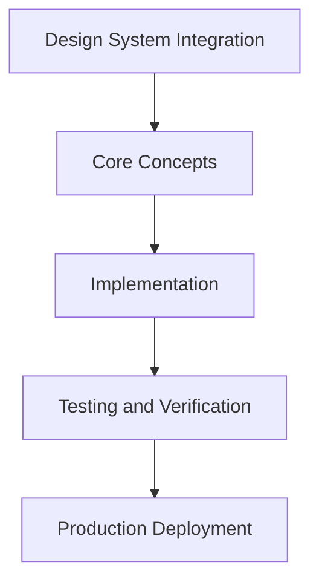

# Day 76 [Advanced]: Design System Integration

## Index

- [Goal](#goal)
- [Prerequisites](#prerequisites)
- [Explanation](#explanation)
- [Topic by Topic](#topic-by-topic)
- [Key Concepts](#key-concepts)
- [Visual Concept Map](#visual-concept-map)
- [End-to-End Practical](#end-to-end-practical)
- [Hands-on Coding](#hands-on-coding)
- [Mini Exercise](#mini-exercise)
- [Assessment Quiz](#assessment-quiz)
- [Task](#task)
- [Self Check](#self-check)
- [Interview Questions and Answers](#interview-questions-and-answers)
- [Day 76 Outcome](#day-76-outcome)

## Goal

Understand and apply Design System Integration in a Next.js application to build production-quality features.

## Prerequisites

- Day 75 completed
- Solid understanding of Next.js App Router and TypeScript basics
- Familiarity with Server Components and data fetching patterns

## Explanation

Design system integration in Next.js should provide consistency without slowing teams. Integration quality depends on token architecture, component contracts, and release discipline.

A robust approach keeps UI cohesive across products while allowing controlled customization where needed.


## Topic by Topic

### Topic 1: Token and Theme Integration

Theory:
This topic covers Token and Theme Integration in production Next.js systems, with emphasis on safety, scalability, and maintainable implementation choices.

Practical:
Apply Token and Theme Integration in a realistic feature or service flow, validate edge cases, and document tradeoffs for team-level review.

Code Example:

```tsx
// Design System Integration — Topic 1
// Implementation depends on your specific use case.
// Refer to the Next.js documentation for detailed API reference.
export default function Example1() {
  return <div>Design System Integration — Example 1</div>;
}
```
**Explanation:**
Token and Theme Integration helps turn framework capabilities into dependable production behavior that teams can monitor and evolve confidently.

**Key Points:**
- Understand why Token and Theme Integration matters in real deployments.
- Use explicit boundaries and defaults when implementing it.
- Validate results with tests, metrics, or review checklists.


### Topic 2: Component API Consistency Rules

Theory:
This topic covers Component API Consistency Rules in production Next.js systems, with emphasis on safety, scalability, and maintainable implementation choices.

Practical:
Apply Component API Consistency Rules in a realistic feature or service flow, validate edge cases, and document tradeoffs for team-level review.

Code Example:

```tsx
// Design System Integration — Topic 2
// Implementation depends on your specific use case.
// Refer to the Next.js documentation for detailed API reference.
export default function Example2() {
  return <div>Design System Integration — Example 2</div>;
}
```
**Explanation:**
Component API Consistency Rules helps turn framework capabilities into dependable production behavior that teams can monitor and evolve confidently.

**Key Points:**
- Understand why Component API Consistency Rules matters in real deployments.
- Use explicit boundaries and defaults when implementing it.
- Validate results with tests, metrics, or review checklists.


### Topic 3: SSR-safe Styling Patterns

Theory:
This topic covers SSR-safe Styling Patterns in production Next.js systems, with emphasis on safety, scalability, and maintainable implementation choices.

Practical:
Apply SSR-safe Styling Patterns in a realistic feature or service flow, validate edge cases, and document tradeoffs for team-level review.

Code Example:

```tsx
// Design System Integration — Topic 3
// Implementation depends on your specific use case.
// Refer to the Next.js documentation for detailed API reference.
export default function Example3() {
  return <div>Design System Integration — Example 3</div>;
}
```
**Explanation:**
SSR-safe Styling Patterns helps turn framework capabilities into dependable production behavior that teams can monitor and evolve confidently.

**Key Points:**
- Understand why SSR-safe Styling Patterns matters in real deployments.
- Use explicit boundaries and defaults when implementing it.
- Validate results with tests, metrics, or review checklists.


### Topic 4: Versioning and Adoption Workflow

Theory:
This topic covers Versioning and Adoption Workflow in production Next.js systems, with emphasis on safety, scalability, and maintainable implementation choices.

Practical:
Apply Versioning and Adoption Workflow in a realistic feature or service flow, validate edge cases, and document tradeoffs for team-level review.

Code Example:

```tsx
// Design System Integration — Topic 4
// Implementation depends on your specific use case.
// Refer to the Next.js documentation for detailed API reference.
export default function Example4() {
  return <div>Design System Integration — Example 4</div>;
}
```
**Explanation:**
Versioning and Adoption Workflow helps turn framework capabilities into dependable production behavior that teams can monitor and evolve confidently.

**Key Points:**
- Understand why Versioning and Adoption Workflow matters in real deployments.
- Use explicit boundaries and defaults when implementing it.
- Validate results with tests, metrics, or review checklists.


### Topic 5: Accessibility and Quality Guardrails

Theory:
This topic covers Accessibility and Quality Guardrails in production Next.js systems, with emphasis on safety, scalability, and maintainable implementation choices.

Practical:
Apply Accessibility and Quality Guardrails in a realistic feature or service flow, validate edge cases, and document tradeoffs for team-level review.

Code Example:

```tsx
// Design System Integration — Topic 5
// Implementation depends on your specific use case.
// Refer to the Next.js documentation for detailed API reference.
export default function Example5() {
  return <div>Design System Integration — Example 5</div>;
}
```
**Explanation:**
Accessibility and Quality Guardrails helps turn framework capabilities into dependable production behavior that teams can monitor and evolve confidently.

**Key Points:**
- Understand why Accessibility and Quality Guardrails matters in real deployments.
- Use explicit boundaries and defaults when implementing it.
- Validate results with tests, metrics, or review checklists.


### Topic 6: Release Management for Design System Changes

Theory:
This topic covers Release Management for Design System Changes in production Next.js systems, with emphasis on safety, scalability, and maintainable implementation choices.

Practical:
Apply Release Management for Design System Changes in a realistic feature or service flow, validate edge cases, and document tradeoffs for team-level review.

Code Example:

```tsx
// Design System Integration — Topic 6
// Implementation depends on your specific use case.
// Refer to the Next.js documentation for detailed API reference.
export default function Example6() {
  return <div>Design System Integration — Example 6</div>;
}
```
**Explanation:**
Release Management for Design System Changes helps turn framework capabilities into dependable production behavior that teams can monitor and evolve confidently.

**Key Points:**
- Understand why Release Management for Design System Changes matters in real deployments.
- Use explicit boundaries and defaults when implementing it.
- Validate results with tests, metrics, or review checklists.


## Key Concepts

- Design System Integration: Core concept for advanced Next.js development
- Next.js App Router: The modern routing system using the app/ directory
- Server Component: A component that runs on the server only
- TypeScript: Strongly typed JavaScript used throughout Next.js projects

## Visual Concept Map



## End-to-End Practical

1. Review the explanation and all topic examples.
2. Set up a clean Next.js project or use your existing one.
3. Implement each topic example step by step.
4. Verify the behavior in the browser.
5. Refactor and clean up your implementation.
6. Write a brief note on what you learned.

## Hands-on Coding

### Example 1: Basic Design System Integration Implementation

```tsx
// Basic implementation of Design System Integration
// Follow the topic examples above to build this out.
export default function Example() {
  return (
    <div style={{ padding: "24px" }}>
      <h1>Design System Integration</h1>
      <p>Implementation complete for Day 76.</p>
    </div>
  );
}
```

### Example 2: Practical Use Case

```tsx
// A real-world use case for Design System Integration
// Refer to the Topic by Topic section for code details.
export default function PracticalExample() {
  return (
    <div>
      <h2>Practical: Design System Integration</h2>
    </div>
  );
}
```

### Example 3: Combined Pattern

```tsx
// Combining Design System Integration with other Next.js features
// This example shows integration with the App Router.
export default function CombinedExample() {
  return (
    <section>
      <h2>Design System Integration — Combined Pattern</h2>
      <p>See topic sections above for detailed code.</p>
    </section>
  );
}
```

## Mini Exercise

Scenario:
You are adding Design System Integration to a Next.js application for a real-world feature.

Steps:

1. Create a new route or component relevant to this topic.
2. Implement the core pattern from the Topic by Topic section.
3. Test the implementation thoroughly.
4. Verify edge cases are handled.
5. Clean up and document your code.

Expected output:

- Working implementation of Design System Integration
- All edge cases handled correctly
- Clean, readable code following Next.js conventions

## Assessment Quiz

### Quiz Questions

1. What is the primary purpose of Design System Integration in Next.js?
2. Where in the project structure do you implement this pattern?
3. What is a common mistake when using Design System Integration?
4. True or False: Design System Integration only applies to Client Components.
5. How does Design System Integration improve the user or developer experience?

### Quiz Answers

1. To enable advanced-level functionality in a Next.js application efficiently.
2. In the App Router directory structure, using Server Components by default.
3. Mixing server and client concerns incorrectly, or skipping error handling.
4. False. This concept applies broadly across the Next.js architecture.
5. It improves maintainability, performance, and scalability of the application.

## Task

- Study all topic examples in today's lesson
- Implement the core pattern in a Next.js project
- Test all scenarios including error and edge cases
- Complete the mini exercise
- Attempt the quiz before checking answers

## Self Check

- You can implement Design System Integration from scratch
- You understand when and why to use this pattern
- You can explain the concept in simple terms
- You have tested the implementation in a running app
- You can answer at least 4 out of 5 quiz questions correctly

## Interview Questions and Answers

### Beginner

**Question:** What is Design System Integration in Next.js?

**Answer:** Design System Integration is a advanced-level Next.js feature that helps developers build robust, scalable applications by handling a specific aspect of the framework architecture.

**Question:** When would you use Design System Integration?

**Answer:** When you need to implement the specific functionality it provides in a production Next.js application, particularly in advanced-stage projects.

### Middle

**Question:** How does Design System Integration interact with the Next.js App Router?

**Answer:** It integrates with the App Router through Server Components, Route Handlers, or middleware, depending on the specific implementation pattern required.

**Question:** What are common pitfalls with Design System Integration?

**Answer:** The most common pitfalls are improper handling of server/client boundaries, missing error states, and not considering caching behavior when relevant.

### Advanced

**Question:** How would you scale Design System Integration in a large Next.js application with multiple teams?

**Answer:** By establishing clear conventions, creating reusable utilities, documenting patterns in an Architecture Decision Record, and enforcing consistency through code review and linting rules.

**Question:** What performance considerations apply to Design System Integration?

**Answer:** Consider bundle size impact for client-side features, caching strategies for data fetching, and rendering mode selection to balance performance with data freshness.

## Day 76 Outcome

- You understand Design System Integration and its role in Next.js
- You can implement this pattern in a real project
- You know when to use and when to avoid this pattern
- You are ready for Day 76 — moving on to the next topic
