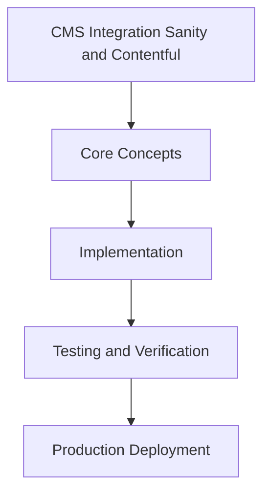

# Day 77 [Advanced]: CMS Integration Sanity and Contentful

## Index

- [Goal](#goal)
- [Prerequisites](#prerequisites)
- [Explanation](#explanation)
- [Topic by Topic](#topic-by-topic)
- [Key Concepts](#key-concepts)
- [Visual Concept Map](#visual-concept-map)
- [End-to-End Practical](#end-to-end-practical)
- [Hands-on Coding](#hands-on-coding)
- [Mini Exercise](#mini-exercise)
- [Assessment Quiz](#assessment-quiz)
- [Task](#task)
- [Self Check](#self-check)
- [Interview Questions and Answers](#interview-questions-and-answers)
- [Day 77 Outcome](#day-77-outcome)

## Goal

Understand and apply CMS Integration Sanity and Contentful in a Next.js application to build production-quality features.

## Prerequisites

- Day 76 completed
- Solid understanding of Next.js App Router and TypeScript basics
- Familiarity with Server Components and data fetching patterns

## Explanation

CMS integration enables content teams to ship quickly, but production readiness requires careful handling of schema drift, caching, and preview workflows in Next.js.

This lesson covers architecture choices that keep authoring flexible while preserving runtime reliability and SEO quality.


## Topic by Topic

### Topic 1: Content Model and Schema Contracts

Theory:
This topic covers Content Model and Schema Contracts in production Next.js systems, with emphasis on safety, scalability, and maintainable implementation choices.

Practical:
Apply Content Model and Schema Contracts in a realistic feature or service flow, validate edge cases, and document tradeoffs for team-level review.

Code Example:

```tsx
// CMS Integration Sanity and Contentful — Topic 1
// Implementation depends on your specific use case.
// Refer to the Next.js documentation for detailed API reference.
export default function Example1() {
  return <div>CMS Integration Sanity and Contentful — Example 1</div>;
}
```
**Explanation:**
Content Model and Schema Contracts helps turn framework capabilities into dependable production behavior that teams can monitor and evolve confidently.

**Key Points:**
- Understand why Content Model and Schema Contracts matters in real deployments.
- Use explicit boundaries and defaults when implementing it.
- Validate results with tests, metrics, or review checklists.


### Topic 2: Fetching and Caching CMS Content

Theory:
This topic covers Fetching and Caching CMS Content in production Next.js systems, with emphasis on safety, scalability, and maintainable implementation choices.

Practical:
Apply Fetching and Caching CMS Content in a realistic feature or service flow, validate edge cases, and document tradeoffs for team-level review.

Code Example:

```tsx
// CMS Integration Sanity and Contentful — Topic 2
// Implementation depends on your specific use case.
// Refer to the Next.js documentation for detailed API reference.
export default function Example2() {
  return <div>CMS Integration Sanity and Contentful — Example 2</div>;
}
```
**Explanation:**
Fetching and Caching CMS Content helps turn framework capabilities into dependable production behavior that teams can monitor and evolve confidently.

**Key Points:**
- Understand why Fetching and Caching CMS Content matters in real deployments.
- Use explicit boundaries and defaults when implementing it.
- Validate results with tests, metrics, or review checklists.


### Topic 3: Preview and Draft Workflows

Theory:
This topic covers Preview and Draft Workflows in production Next.js systems, with emphasis on safety, scalability, and maintainable implementation choices.

Practical:
Apply Preview and Draft Workflows in a realistic feature or service flow, validate edge cases, and document tradeoffs for team-level review.

Code Example:

```tsx
// CMS Integration Sanity and Contentful — Topic 3
// Implementation depends on your specific use case.
// Refer to the Next.js documentation for detailed API reference.
export default function Example3() {
  return <div>CMS Integration Sanity and Contentful — Example 3</div>;
}
```
**Explanation:**
Preview and Draft Workflows helps turn framework capabilities into dependable production behavior that teams can monitor and evolve confidently.

**Key Points:**
- Understand why Preview and Draft Workflows matters in real deployments.
- Use explicit boundaries and defaults when implementing it.
- Validate results with tests, metrics, or review checklists.


### Topic 4: Rendering Safety and Fallbacks

Theory:
This topic covers Rendering Safety and Fallbacks in production Next.js systems, with emphasis on safety, scalability, and maintainable implementation choices.

Practical:
Apply Rendering Safety and Fallbacks in a realistic feature or service flow, validate edge cases, and document tradeoffs for team-level review.

Code Example:

```tsx
// CMS Integration Sanity and Contentful — Topic 4
// Implementation depends on your specific use case.
// Refer to the Next.js documentation for detailed API reference.
export default function Example4() {
  return <div>CMS Integration Sanity and Contentful — Example 4</div>;
}
```
**Explanation:**
Rendering Safety and Fallbacks helps turn framework capabilities into dependable production behavior that teams can monitor and evolve confidently.

**Key Points:**
- Understand why Rendering Safety and Fallbacks matters in real deployments.
- Use explicit boundaries and defaults when implementing it.
- Validate results with tests, metrics, or review checklists.


### Topic 5: SEO and Metadata from CMS

Theory:
This topic covers SEO and Metadata from CMS in production Next.js systems, with emphasis on safety, scalability, and maintainable implementation choices.

Practical:
Apply SEO and Metadata from CMS in a realistic feature or service flow, validate edge cases, and document tradeoffs for team-level review.

Code Example:

```tsx
// CMS Integration Sanity and Contentful — Topic 5
// Implementation depends on your specific use case.
// Refer to the Next.js documentation for detailed API reference.
export default function Example5() {
  return <div>CMS Integration Sanity and Contentful — Example 5</div>;
}
```
**Explanation:**
SEO and Metadata from CMS helps turn framework capabilities into dependable production behavior that teams can monitor and evolve confidently.

**Key Points:**
- Understand why SEO and Metadata from CMS matters in real deployments.
- Use explicit boundaries and defaults when implementing it.
- Validate results with tests, metrics, or review checklists.


### Topic 6: Operational Resilience and Webhook Strategy

Theory:
This topic covers Operational Resilience and Webhook Strategy in production Next.js systems, with emphasis on safety, scalability, and maintainable implementation choices.

Practical:
Apply Operational Resilience and Webhook Strategy in a realistic feature or service flow, validate edge cases, and document tradeoffs for team-level review.

Code Example:

```tsx
// CMS Integration Sanity and Contentful — Topic 6
// Implementation depends on your specific use case.
// Refer to the Next.js documentation for detailed API reference.
export default function Example6() {
  return <div>CMS Integration Sanity and Contentful — Example 6</div>;
}
```
**Explanation:**
Operational Resilience and Webhook Strategy helps turn framework capabilities into dependable production behavior that teams can monitor and evolve confidently.

**Key Points:**
- Understand why Operational Resilience and Webhook Strategy matters in real deployments.
- Use explicit boundaries and defaults when implementing it.
- Validate results with tests, metrics, or review checklists.


## Key Concepts

- CMS Integration Sanity and Contentful: Core concept for advanced Next.js development
- Next.js App Router: The modern routing system using the app/ directory
- Server Component: A component that runs on the server only
- TypeScript: Strongly typed JavaScript used throughout Next.js projects

## Visual Concept Map



## End-to-End Practical

1. Review the explanation and all topic examples.
2. Set up a clean Next.js project or use your existing one.
3. Implement each topic example step by step.
4. Verify the behavior in the browser.
5. Refactor and clean up your implementation.
6. Write a brief note on what you learned.

## Hands-on Coding

### Example 1: Basic CMS Integration Sanity and Contentful Implementation

```tsx
// Basic implementation of CMS Integration Sanity and Contentful
// Follow the topic examples above to build this out.
export default function Example() {
  return (
    <div style={{ padding: "24px" }}>
      <h1>CMS Integration Sanity and Contentful</h1>
      <p>Implementation complete for Day 77.</p>
    </div>
  );
}
```

### Example 2: Practical Use Case

```tsx
// A real-world use case for CMS Integration Sanity and Contentful
// Refer to the Topic by Topic section for code details.
export default function PracticalExample() {
  return (
    <div>
      <h2>Practical: CMS Integration Sanity and Contentful</h2>
    </div>
  );
}
```

### Example 3: Combined Pattern

```tsx
// Combining CMS Integration Sanity and Contentful with other Next.js features
// This example shows integration with the App Router.
export default function CombinedExample() {
  return (
    <section>
      <h2>CMS Integration Sanity and Contentful — Combined Pattern</h2>
      <p>See topic sections above for detailed code.</p>
    </section>
  );
}
```

## Mini Exercise

Scenario:
You are adding CMS Integration Sanity and Contentful to a Next.js application for a real-world feature.

Steps:

1. Create a new route or component relevant to this topic.
2. Implement the core pattern from the Topic by Topic section.
3. Test the implementation thoroughly.
4. Verify edge cases are handled.
5. Clean up and document your code.

Expected output:

- Working implementation of CMS Integration Sanity and Contentful
- All edge cases handled correctly
- Clean, readable code following Next.js conventions

## Assessment Quiz

### Quiz Questions

1. What is the primary purpose of CMS Integration Sanity and Contentful in Next.js?
2. Where in the project structure do you implement this pattern?
3. What is a common mistake when using CMS Integration Sanity and Contentful?
4. True or False: CMS Integration Sanity and Contentful only applies to Client Components.
5. How does CMS Integration Sanity and Contentful improve the user or developer experience?

### Quiz Answers

1. To enable advanced-level functionality in a Next.js application efficiently.
2. In the App Router directory structure, using Server Components by default.
3. Mixing server and client concerns incorrectly, or skipping error handling.
4. False. This concept applies broadly across the Next.js architecture.
5. It improves maintainability, performance, and scalability of the application.

## Task

- Study all topic examples in today's lesson
- Implement the core pattern in a Next.js project
- Test all scenarios including error and edge cases
- Complete the mini exercise
- Attempt the quiz before checking answers

## Self Check

- You can implement CMS Integration Sanity and Contentful from scratch
- You understand when and why to use this pattern
- You can explain the concept in simple terms
- You have tested the implementation in a running app
- You can answer at least 4 out of 5 quiz questions correctly

## Interview Questions and Answers

### Beginner

**Question:** What is CMS Integration Sanity and Contentful in Next.js?

**Answer:** CMS Integration Sanity and Contentful is a advanced-level Next.js feature that helps developers build robust, scalable applications by handling a specific aspect of the framework architecture.

**Question:** When would you use CMS Integration Sanity and Contentful?

**Answer:** When you need to implement the specific functionality it provides in a production Next.js application, particularly in advanced-stage projects.

### Middle

**Question:** How does CMS Integration Sanity and Contentful interact with the Next.js App Router?

**Answer:** It integrates with the App Router through Server Components, Route Handlers, or middleware, depending on the specific implementation pattern required.

**Question:** What are common pitfalls with CMS Integration Sanity and Contentful?

**Answer:** The most common pitfalls are improper handling of server/client boundaries, missing error states, and not considering caching behavior when relevant.

### Advanced

**Question:** How would you scale CMS Integration Sanity and Contentful in a large Next.js application with multiple teams?

**Answer:** By establishing clear conventions, creating reusable utilities, documenting patterns in an Architecture Decision Record, and enforcing consistency through code review and linting rules.

**Question:** What performance considerations apply to CMS Integration Sanity and Contentful?

**Answer:** Consider bundle size impact for client-side features, caching strategies for data fetching, and rendering mode selection to balance performance with data freshness.

## Day 77 Outcome

- You understand CMS Integration Sanity and Contentful and its role in Next.js
- You can implement this pattern in a real project
- You know when to use and when to avoid this pattern
- You are ready for Day 77 — moving on to the next topic
