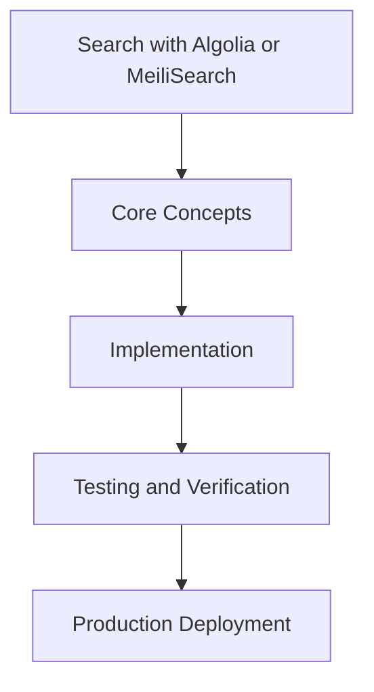

# Day 78 [Advanced]: Search with Algolia or MeiliSearch

## Index

- [Goal](#goal)
- [Prerequisites](#prerequisites)
- [Explanation](#explanation)
- [Topic by Topic](#topic-by-topic)
- [Key Concepts](#key-concepts)
- [Visual Concept Map](#visual-concept-map)
- [End-to-End Practical](#end-to-end-practical)
- [Hands-on Coding](#hands-on-coding)
- [Mini Exercise](#mini-exercise)
- [Assessment Quiz](#assessment-quiz)
- [Task](#task)
- [Self Check](#self-check)
- [Interview Questions and Answers](#interview-questions-and-answers)
- [Day 78 Outcome](#day-78-outcome)

## Goal

Understand and apply Search with Algolia or MeiliSearch in a Next.js application to build production-quality features.

## Prerequisites

- Day 77 completed
- Solid understanding of Next.js App Router and TypeScript basics
- Familiarity with Server Components and data fetching patterns

## Explanation

Search integration affects discovery, conversion, and perceived product quality. In Next.js, robust search requires indexing strategy, query relevance tuning, and observable performance.

The goal is to deliver fast, accurate search experiences that degrade gracefully and improve with usage insights.


## Topic by Topic

### Topic 1: Search Architecture Choices

Theory:
This topic covers Search Architecture Choices in production Next.js systems, with emphasis on safety, scalability, and maintainable implementation choices.

Practical:
Apply Search Architecture Choices in a realistic feature or service flow, validate edge cases, and document tradeoffs for team-level review.

Code Example:

```tsx
// Search with Algolia or MeiliSearch — Topic 1
// Implementation depends on your specific use case.
// Refer to the Next.js documentation for detailed API reference.
export default function Example1() {
  return <div>Search with Algolia or MeiliSearch — Example 1</div>;
}
```
**Explanation:**
Search Architecture Choices helps turn framework capabilities into dependable production behavior that teams can monitor and evolve confidently.

**Key Points:**
- Understand why Search Architecture Choices matters in real deployments.
- Use explicit boundaries and defaults when implementing it.
- Validate results with tests, metrics, or review checklists.


### Topic 2: Indexing and Sync Pipelines

Theory:
This topic covers Indexing and Sync Pipelines in production Next.js systems, with emphasis on safety, scalability, and maintainable implementation choices.

Practical:
Apply Indexing and Sync Pipelines in a realistic feature or service flow, validate edge cases, and document tradeoffs for team-level review.

Code Example:

```tsx
// Search with Algolia or MeiliSearch — Topic 2
// Implementation depends on your specific use case.
// Refer to the Next.js documentation for detailed API reference.
export default function Example2() {
  return <div>Search with Algolia or MeiliSearch — Example 2</div>;
}
```
**Explanation:**
Indexing and Sync Pipelines helps turn framework capabilities into dependable production behavior that teams can monitor and evolve confidently.

**Key Points:**
- Understand why Indexing and Sync Pipelines matters in real deployments.
- Use explicit boundaries and defaults when implementing it.
- Validate results with tests, metrics, or review checklists.


### Topic 3: Query Relevance and Ranking

Theory:
This topic covers Query Relevance and Ranking in production Next.js systems, with emphasis on safety, scalability, and maintainable implementation choices.

Practical:
Apply Query Relevance and Ranking in a realistic feature or service flow, validate edge cases, and document tradeoffs for team-level review.

Code Example:

```tsx
// Search with Algolia or MeiliSearch — Topic 3
// Implementation depends on your specific use case.
// Refer to the Next.js documentation for detailed API reference.
export default function Example3() {
  return <div>Search with Algolia or MeiliSearch — Example 3</div>;
}
```
**Explanation:**
Query Relevance and Ranking helps turn framework capabilities into dependable production behavior that teams can monitor and evolve confidently.

**Key Points:**
- Understand why Query Relevance and Ranking matters in real deployments.
- Use explicit boundaries and defaults when implementing it.
- Validate results with tests, metrics, or review checklists.


### Topic 4: Search UX and Result States

Theory:
This topic covers Search UX and Result States in production Next.js systems, with emphasis on safety, scalability, and maintainable implementation choices.

Practical:
Apply Search UX and Result States in a realistic feature or service flow, validate edge cases, and document tradeoffs for team-level review.

Code Example:

```tsx
// Search with Algolia or MeiliSearch — Topic 4
// Implementation depends on your specific use case.
// Refer to the Next.js documentation for detailed API reference.
export default function Example4() {
  return <div>Search with Algolia or MeiliSearch — Example 4</div>;
}
```
**Explanation:**
Search UX and Result States helps turn framework capabilities into dependable production behavior that teams can monitor and evolve confidently.

**Key Points:**
- Understand why Search UX and Result States matters in real deployments.
- Use explicit boundaries and defaults when implementing it.
- Validate results with tests, metrics, or review checklists.


### Topic 5: Performance and Caching for Search

Theory:
This topic covers Performance and Caching for Search in production Next.js systems, with emphasis on safety, scalability, and maintainable implementation choices.

Practical:
Apply Performance and Caching for Search in a realistic feature or service flow, validate edge cases, and document tradeoffs for team-level review.

Code Example:

```tsx
// Search with Algolia or MeiliSearch — Topic 5
// Implementation depends on your specific use case.
// Refer to the Next.js documentation for detailed API reference.
export default function Example5() {
  return <div>Search with Algolia or MeiliSearch — Example 5</div>;
}
```
**Explanation:**
Performance and Caching for Search helps turn framework capabilities into dependable production behavior that teams can monitor and evolve confidently.

**Key Points:**
- Understand why Performance and Caching for Search matters in real deployments.
- Use explicit boundaries and defaults when implementing it.
- Validate results with tests, metrics, or review checklists.


### Topic 6: Analytics-driven Relevance Improvement

Theory:
This topic covers Analytics-driven Relevance Improvement in production Next.js systems, with emphasis on safety, scalability, and maintainable implementation choices.

Practical:
Apply Analytics-driven Relevance Improvement in a realistic feature or service flow, validate edge cases, and document tradeoffs for team-level review.

Code Example:

```tsx
// Search with Algolia or MeiliSearch — Topic 6
// Implementation depends on your specific use case.
// Refer to the Next.js documentation for detailed API reference.
export default function Example6() {
  return <div>Search with Algolia or MeiliSearch — Example 6</div>;
}
```
**Explanation:**
Analytics-driven Relevance Improvement helps turn framework capabilities into dependable production behavior that teams can monitor and evolve confidently.

**Key Points:**
- Understand why Analytics-driven Relevance Improvement matters in real deployments.
- Use explicit boundaries and defaults when implementing it.
- Validate results with tests, metrics, or review checklists.


## Key Concepts

- Search with Algolia or MeiliSearch: Core concept for advanced Next.js development
- Next.js App Router: The modern routing system using the app/ directory
- Server Component: A component that runs on the server only
- TypeScript: Strongly typed JavaScript used throughout Next.js projects

## Visual Concept Map



## End-to-End Practical

1. Review the explanation and all topic examples.
2. Set up a clean Next.js project or use your existing one.
3. Implement each topic example step by step.
4. Verify the behavior in the browser.
5. Refactor and clean up your implementation.
6. Write a brief note on what you learned.

## Hands-on Coding

### Example 1: Basic Search with Algolia or MeiliSearch Implementation

```tsx
// Basic implementation of Search with Algolia or MeiliSearch
// Follow the topic examples above to build this out.
export default function Example() {
  return (
    <div style={{ padding: "24px" }}>
      <h1>Search with Algolia or MeiliSearch</h1>
      <p>Implementation complete for Day 78.</p>
    </div>
  );
}
```

### Example 2: Practical Use Case

```tsx
// A real-world use case for Search with Algolia or MeiliSearch
// Refer to the Topic by Topic section for code details.
export default function PracticalExample() {
  return (
    <div>
      <h2>Practical: Search with Algolia or MeiliSearch</h2>
    </div>
  );
}
```

### Example 3: Combined Pattern

```tsx
// Combining Search with Algolia or MeiliSearch with other Next.js features
// This example shows integration with the App Router.
export default function CombinedExample() {
  return (
    <section>
      <h2>Search with Algolia or MeiliSearch — Combined Pattern</h2>
      <p>See topic sections above for detailed code.</p>
    </section>
  );
}
```

## Mini Exercise

Scenario:
You are adding Search with Algolia or MeiliSearch to a Next.js application for a real-world feature.

Steps:

1. Create a new route or component relevant to this topic.
2. Implement the core pattern from the Topic by Topic section.
3. Test the implementation thoroughly.
4. Verify edge cases are handled.
5. Clean up and document your code.

Expected output:

- Working implementation of Search with Algolia or MeiliSearch
- All edge cases handled correctly
- Clean, readable code following Next.js conventions

## Assessment Quiz

### Quiz Questions

1. What is the primary purpose of Search with Algolia or MeiliSearch in Next.js?
2. Where in the project structure do you implement this pattern?
3. What is a common mistake when using Search with Algolia or MeiliSearch?
4. True or False: Search with Algolia or MeiliSearch only applies to Client Components.
5. How does Search with Algolia or MeiliSearch improve the user or developer experience?

### Quiz Answers

1. To enable advanced-level functionality in a Next.js application efficiently.
2. In the App Router directory structure, using Server Components by default.
3. Mixing server and client concerns incorrectly, or skipping error handling.
4. False. This concept applies broadly across the Next.js architecture.
5. It improves maintainability, performance, and scalability of the application.

## Task

- Study all topic examples in today's lesson
- Implement the core pattern in a Next.js project
- Test all scenarios including error and edge cases
- Complete the mini exercise
- Attempt the quiz before checking answers

## Self Check

- You can implement Search with Algolia or MeiliSearch from scratch
- You understand when and why to use this pattern
- You can explain the concept in simple terms
- You have tested the implementation in a running app
- You can answer at least 4 out of 5 quiz questions correctly

## Interview Questions and Answers

### Beginner

**Question:** What is Search with Algolia or MeiliSearch in Next.js?

**Answer:** Search with Algolia or MeiliSearch is a advanced-level Next.js feature that helps developers build robust, scalable applications by handling a specific aspect of the framework architecture.

**Question:** When would you use Search with Algolia or MeiliSearch?

**Answer:** When you need to implement the specific functionality it provides in a production Next.js application, particularly in advanced-stage projects.

### Middle

**Question:** How does Search with Algolia or MeiliSearch interact with the Next.js App Router?

**Answer:** It integrates with the App Router through Server Components, Route Handlers, or middleware, depending on the specific implementation pattern required.

**Question:** What are common pitfalls with Search with Algolia or MeiliSearch?

**Answer:** The most common pitfalls are improper handling of server/client boundaries, missing error states, and not considering caching behavior when relevant.

### Advanced

**Question:** How would you scale Search with Algolia or MeiliSearch in a large Next.js application with multiple teams?

**Answer:** By establishing clear conventions, creating reusable utilities, documenting patterns in an Architecture Decision Record, and enforcing consistency through code review and linting rules.

**Question:** What performance considerations apply to Search with Algolia or MeiliSearch?

**Answer:** Consider bundle size impact for client-side features, caching strategies for data fetching, and rendering mode selection to balance performance with data freshness.

## Day 78 Outcome

- You understand Search with Algolia or MeiliSearch and its role in Next.js
- You can implement this pattern in a real project
- You know when to use and when to avoid this pattern
- You are ready for Day 78 — moving on to the next topic
