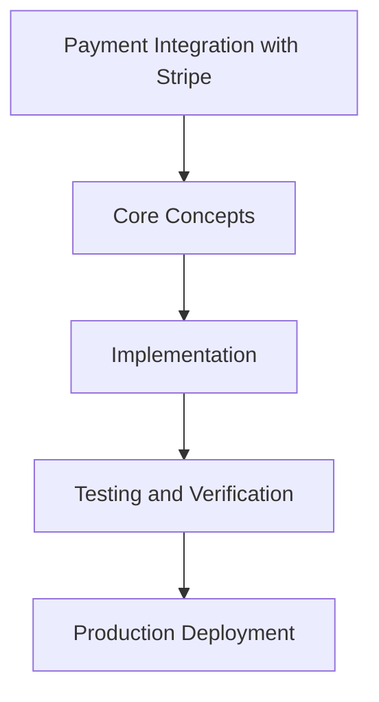

# Day 79 [Advanced]: Payment Integration with Stripe

## Index

- [Goal](#goal)
- [Prerequisites](#prerequisites)
- [Explanation](#explanation)
- [Topic by Topic](#topic-by-topic)
- [Key Concepts](#key-concepts)
- [Visual Concept Map](#visual-concept-map)
- [End-to-End Practical](#end-to-end-practical)
- [Hands-on Coding](#hands-on-coding)
- [Mini Exercise](#mini-exercise)
- [Assessment Quiz](#assessment-quiz)
- [Task](#task)
- [Self Check](#self-check)
- [Interview Questions and Answers](#interview-questions-and-answers)
- [Day 79 Outcome](#day-79-outcome)

## Goal

Understand and apply Payment Integration with Stripe in a Next.js application to build production-quality features.

## Prerequisites

- Day 78 completed
- Solid understanding of Next.js App Router and TypeScript basics
- Familiarity with Server Components and data fetching patterns

## Explanation

Stripe integration in Next.js must prioritize correctness, security, and reconciliation. Payment systems fail in subtle ways when idempotency, webhook handling, or state transitions are weak.

This lesson focuses on end-to-end payment reliability from checkout initiation to post-payment verification and support operations.


## Topic by Topic

### Topic 1: Payment Flow State Modeling

Theory:
This topic covers Payment Flow State Modeling in production Next.js systems, with emphasis on safety, scalability, and maintainable implementation choices.

Practical:
Apply Payment Flow State Modeling in a realistic feature or service flow, validate edge cases, and document tradeoffs for team-level review.

Code Example:

```tsx
// Payment Integration with Stripe — Topic 1
// Implementation depends on your specific use case.
// Refer to the Next.js documentation for detailed API reference.
export default function Example1() {
  return <div>Payment Integration with Stripe — Example 1</div>;
}
```
**Explanation:**
Payment Flow State Modeling helps turn framework capabilities into dependable production behavior that teams can monitor and evolve confidently.

**Key Points:**
- Understand why Payment Flow State Modeling matters in real deployments.
- Use explicit boundaries and defaults when implementing it.
- Validate results with tests, metrics, or review checklists.


### Topic 2: Checkout Session and Intent Handling

Theory:
This topic covers Checkout Session and Intent Handling in production Next.js systems, with emphasis on safety, scalability, and maintainable implementation choices.

Practical:
Apply Checkout Session and Intent Handling in a realistic feature or service flow, validate edge cases, and document tradeoffs for team-level review.

Code Example:

```tsx
// Payment Integration with Stripe — Topic 2
// Implementation depends on your specific use case.
// Refer to the Next.js documentation for detailed API reference.
export default function Example2() {
  return <div>Payment Integration with Stripe — Example 2</div>;
}
```
**Explanation:**
Checkout Session and Intent Handling helps turn framework capabilities into dependable production behavior that teams can monitor and evolve confidently.

**Key Points:**
- Understand why Checkout Session and Intent Handling matters in real deployments.
- Use explicit boundaries and defaults when implementing it.
- Validate results with tests, metrics, or review checklists.


### Topic 3: Webhook Security and Verification

Theory:
This topic covers Webhook Security and Verification in production Next.js systems, with emphasis on safety, scalability, and maintainable implementation choices.

Practical:
Apply Webhook Security and Verification in a realistic feature or service flow, validate edge cases, and document tradeoffs for team-level review.

Code Example:

```tsx
// Payment Integration with Stripe — Topic 3
// Implementation depends on your specific use case.
// Refer to the Next.js documentation for detailed API reference.
export default function Example3() {
  return <div>Payment Integration with Stripe — Example 3</div>;
}
```
**Explanation:**
Webhook Security and Verification helps turn framework capabilities into dependable production behavior that teams can monitor and evolve confidently.

**Key Points:**
- Understand why Webhook Security and Verification matters in real deployments.
- Use explicit boundaries and defaults when implementing it.
- Validate results with tests, metrics, or review checklists.


### Topic 4: Idempotency and Retry Safety

Theory:
This topic covers Idempotency and Retry Safety in production Next.js systems, with emphasis on safety, scalability, and maintainable implementation choices.

Practical:
Apply Idempotency and Retry Safety in a realistic feature or service flow, validate edge cases, and document tradeoffs for team-level review.

Code Example:

```tsx
// Payment Integration with Stripe — Topic 4
// Implementation depends on your specific use case.
// Refer to the Next.js documentation for detailed API reference.
export default function Example4() {
  return <div>Payment Integration with Stripe — Example 4</div>;
}
```
**Explanation:**
Idempotency and Retry Safety helps turn framework capabilities into dependable production behavior that teams can monitor and evolve confidently.

**Key Points:**
- Understand why Idempotency and Retry Safety matters in real deployments.
- Use explicit boundaries and defaults when implementing it.
- Validate results with tests, metrics, or review checklists.


### Topic 5: Reconciliation and Failure Recovery

Theory:
This topic covers Reconciliation and Failure Recovery in production Next.js systems, with emphasis on safety, scalability, and maintainable implementation choices.

Practical:
Apply Reconciliation and Failure Recovery in a realistic feature or service flow, validate edge cases, and document tradeoffs for team-level review.

Code Example:

```tsx
// Payment Integration with Stripe — Topic 5
// Implementation depends on your specific use case.
// Refer to the Next.js documentation for detailed API reference.
export default function Example5() {
  return <div>Payment Integration with Stripe — Example 5</div>;
}
```
**Explanation:**
Reconciliation and Failure Recovery helps turn framework capabilities into dependable production behavior that teams can monitor and evolve confidently.

**Key Points:**
- Understand why Reconciliation and Failure Recovery matters in real deployments.
- Use explicit boundaries and defaults when implementing it.
- Validate results with tests, metrics, or review checklists.


### Topic 6: Compliance and Audit Readiness

Theory:
This topic covers Compliance and Audit Readiness in production Next.js systems, with emphasis on safety, scalability, and maintainable implementation choices.

Practical:
Apply Compliance and Audit Readiness in a realistic feature or service flow, validate edge cases, and document tradeoffs for team-level review.

Code Example:

```tsx
// Payment Integration with Stripe — Topic 6
// Implementation depends on your specific use case.
// Refer to the Next.js documentation for detailed API reference.
export default function Example6() {
  return <div>Payment Integration with Stripe — Example 6</div>;
}
```
**Explanation:**
Compliance and Audit Readiness helps turn framework capabilities into dependable production behavior that teams can monitor and evolve confidently.

**Key Points:**
- Understand why Compliance and Audit Readiness matters in real deployments.
- Use explicit boundaries and defaults when implementing it.
- Validate results with tests, metrics, or review checklists.


## Key Concepts

- Payment Integration with Stripe: Core concept for advanced Next.js development
- Next.js App Router: The modern routing system using the app/ directory
- Server Component: A component that runs on the server only
- TypeScript: Strongly typed JavaScript used throughout Next.js projects

## Visual Concept Map



## End-to-End Practical

1. Review the explanation and all topic examples.
2. Set up a clean Next.js project or use your existing one.
3. Implement each topic example step by step.
4. Verify the behavior in the browser.
5. Refactor and clean up your implementation.
6. Write a brief note on what you learned.

## Hands-on Coding

### Example 1: Basic Payment Integration with Stripe Implementation

```tsx
// Basic implementation of Payment Integration with Stripe
// Follow the topic examples above to build this out.
export default function Example() {
  return (
    <div style={{ padding: "24px" }}>
      <h1>Payment Integration with Stripe</h1>
      <p>Implementation complete for Day 79.</p>
    </div>
  );
}
```

### Example 2: Practical Use Case

```tsx
// A real-world use case for Payment Integration with Stripe
// Refer to the Topic by Topic section for code details.
export default function PracticalExample() {
  return (
    <div>
      <h2>Practical: Payment Integration with Stripe</h2>
    </div>
  );
}
```

### Example 3: Combined Pattern

```tsx
// Combining Payment Integration with Stripe with other Next.js features
// This example shows integration with the App Router.
export default function CombinedExample() {
  return (
    <section>
      <h2>Payment Integration with Stripe — Combined Pattern</h2>
      <p>See topic sections above for detailed code.</p>
    </section>
  );
}
```

## Mini Exercise

Scenario:
You are adding Payment Integration with Stripe to a Next.js application for a real-world feature.

Steps:

1. Create a new route or component relevant to this topic.
2. Implement the core pattern from the Topic by Topic section.
3. Test the implementation thoroughly.
4. Verify edge cases are handled.
5. Clean up and document your code.

Expected output:

- Working implementation of Payment Integration with Stripe
- All edge cases handled correctly
- Clean, readable code following Next.js conventions

## Assessment Quiz

### Quiz Questions

1. What is the primary purpose of Payment Integration with Stripe in Next.js?
2. Where in the project structure do you implement this pattern?
3. What is a common mistake when using Payment Integration with Stripe?
4. True or False: Payment Integration with Stripe only applies to Client Components.
5. How does Payment Integration with Stripe improve the user or developer experience?

### Quiz Answers

1. To enable advanced-level functionality in a Next.js application efficiently.
2. In the App Router directory structure, using Server Components by default.
3. Mixing server and client concerns incorrectly, or skipping error handling.
4. False. This concept applies broadly across the Next.js architecture.
5. It improves maintainability, performance, and scalability of the application.

## Task

- Study all topic examples in today's lesson
- Implement the core pattern in a Next.js project
- Test all scenarios including error and edge cases
- Complete the mini exercise
- Attempt the quiz before checking answers

## Self Check

- You can implement Payment Integration with Stripe from scratch
- You understand when and why to use this pattern
- You can explain the concept in simple terms
- You have tested the implementation in a running app
- You can answer at least 4 out of 5 quiz questions correctly

## Interview Questions and Answers

### Beginner

**Question:** What is Payment Integration with Stripe in Next.js?

**Answer:** Payment Integration with Stripe is a advanced-level Next.js feature that helps developers build robust, scalable applications by handling a specific aspect of the framework architecture.

**Question:** When would you use Payment Integration with Stripe?

**Answer:** When you need to implement the specific functionality it provides in a production Next.js application, particularly in advanced-stage projects.

### Middle

**Question:** How does Payment Integration with Stripe interact with the Next.js App Router?

**Answer:** It integrates with the App Router through Server Components, Route Handlers, or middleware, depending on the specific implementation pattern required.

**Question:** What are common pitfalls with Payment Integration with Stripe?

**Answer:** The most common pitfalls are improper handling of server/client boundaries, missing error states, and not considering caching behavior when relevant.

### Advanced

**Question:** How would you scale Payment Integration with Stripe in a large Next.js application with multiple teams?

**Answer:** By establishing clear conventions, creating reusable utilities, documenting patterns in an Architecture Decision Record, and enforcing consistency through code review and linting rules.

**Question:** What performance considerations apply to Payment Integration with Stripe?

**Answer:** Consider bundle size impact for client-side features, caching strategies for data fetching, and rendering mode selection to balance performance with data freshness.

## Day 79 Outcome

- You understand Payment Integration with Stripe and its role in Next.js
- You can implement this pattern in a real project
- You know when to use and when to avoid this pattern
- You are ready for Day 79 — moving on to the next topic
