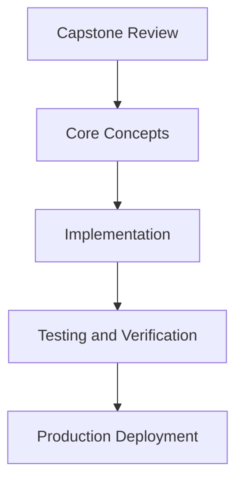

# Day 80 [Advanced]: Capstone Review

## Index

- [Goal](#goal)
- [Prerequisites](#prerequisites)
- [Explanation](#explanation)
- [Topic by Topic](#topic-by-topic)
- [Key Concepts](#key-concepts)
- [Visual Concept Map](#visual-concept-map)
- [End-to-End Practical](#end-to-end-practical)
- [Hands-on Coding](#hands-on-coding)
- [Mini Exercise](#mini-exercise)
- [Assessment Quiz](#assessment-quiz)
- [Task](#task)
- [Self Check](#self-check)
- [Interview Questions and Answers](#interview-questions-and-answers)
- [Day 80 Outcome](#day-80-outcome)

## Goal

Understand and apply Capstone Review in a Next.js application to build production-quality features.

## Prerequisites

- Day 79 completed
- Solid understanding of Next.js App Router and TypeScript basics
- Familiarity with Server Components and data fetching patterns

## Explanation

A capstone review consolidates architecture, quality, performance, and operational readiness across your Next.js work. The objective is to evaluate whether the solution is production-fit, not just feature-complete.

This lesson provides a structured review framework for technical decisions, risks, and delivery confidence before final presentation or deployment.


## Topic by Topic

### Topic 1: Review Scope and Success Criteria

Theory:
This topic covers Review Scope and Success Criteria in production Next.js systems, with emphasis on safety, scalability, and maintainable implementation choices.

Practical:
Apply Review Scope and Success Criteria in a realistic feature or service flow, validate edge cases, and document tradeoffs for team-level review.

Code Example:

```tsx
// Capstone Review — Topic 1
// Implementation depends on your specific use case.
// Refer to the Next.js documentation for detailed API reference.
export default function Example1() {
  return <div>Capstone Review — Example 1</div>;
}
```
**Explanation:**
Review Scope and Success Criteria helps turn framework capabilities into dependable production behavior that teams can monitor and evolve confidently.

**Key Points:**
- Understand why Review Scope and Success Criteria matters in real deployments.
- Use explicit boundaries and defaults when implementing it.
- Validate results with tests, metrics, or review checklists.


### Topic 2: Architecture and Tradeoff Assessment

Theory:
This topic covers Architecture and Tradeoff Assessment in production Next.js systems, with emphasis on safety, scalability, and maintainable implementation choices.

Practical:
Apply Architecture and Tradeoff Assessment in a realistic feature or service flow, validate edge cases, and document tradeoffs for team-level review.

Code Example:

```tsx
// Capstone Review — Topic 2
// Implementation depends on your specific use case.
// Refer to the Next.js documentation for detailed API reference.
export default function Example2() {
  return <div>Capstone Review — Example 2</div>;
}
```
**Explanation:**
Architecture and Tradeoff Assessment helps turn framework capabilities into dependable production behavior that teams can monitor and evolve confidently.

**Key Points:**
- Understand why Architecture and Tradeoff Assessment matters in real deployments.
- Use explicit boundaries and defaults when implementing it.
- Validate results with tests, metrics, or review checklists.


### Topic 3: Quality, Testing, and Reliability Review

Theory:
This topic covers Quality, Testing, and Reliability Review in production Next.js systems, with emphasis on safety, scalability, and maintainable implementation choices.

Practical:
Apply Quality, Testing, and Reliability Review in a realistic feature or service flow, validate edge cases, and document tradeoffs for team-level review.

Code Example:

```tsx
// Capstone Review — Topic 3
// Implementation depends on your specific use case.
// Refer to the Next.js documentation for detailed API reference.
export default function Example3() {
  return <div>Capstone Review — Example 3</div>;
}
```
**Explanation:**
Quality, Testing, and Reliability Review helps turn framework capabilities into dependable production behavior that teams can monitor and evolve confidently.

**Key Points:**
- Understand why Quality, Testing, and Reliability Review matters in real deployments.
- Use explicit boundaries and defaults when implementing it.
- Validate results with tests, metrics, or review checklists.


### Topic 4: Security and Performance Audit

Theory:
This topic covers Security and Performance Audit in production Next.js systems, with emphasis on safety, scalability, and maintainable implementation choices.

Practical:
Apply Security and Performance Audit in a realistic feature or service flow, validate edge cases, and document tradeoffs for team-level review.

Code Example:

```tsx
// Capstone Review — Topic 4
// Implementation depends on your specific use case.
// Refer to the Next.js documentation for detailed API reference.
export default function Example4() {
  return <div>Capstone Review — Example 4</div>;
}
```
**Explanation:**
Security and Performance Audit helps turn framework capabilities into dependable production behavior that teams can monitor and evolve confidently.

**Key Points:**
- Understand why Security and Performance Audit matters in real deployments.
- Use explicit boundaries and defaults when implementing it.
- Validate results with tests, metrics, or review checklists.


### Topic 5: Delivery Readiness and Risk Register

Theory:
This topic covers Delivery Readiness and Risk Register in production Next.js systems, with emphasis on safety, scalability, and maintainable implementation choices.

Practical:
Apply Delivery Readiness and Risk Register in a realistic feature or service flow, validate edge cases, and document tradeoffs for team-level review.

Code Example:

```tsx
// Capstone Review — Topic 5
// Implementation depends on your specific use case.
// Refer to the Next.js documentation for detailed API reference.
export default function Example5() {
  return <div>Capstone Review — Example 5</div>;
}
```
**Explanation:**
Delivery Readiness and Risk Register helps turn framework capabilities into dependable production behavior that teams can monitor and evolve confidently.

**Key Points:**
- Understand why Delivery Readiness and Risk Register matters in real deployments.
- Use explicit boundaries and defaults when implementing it.
- Validate results with tests, metrics, or review checklists.


### Topic 6: Presentation and Defense Strategy

Theory:
This topic covers Presentation and Defense Strategy in production Next.js systems, with emphasis on safety, scalability, and maintainable implementation choices.

Practical:
Apply Presentation and Defense Strategy in a realistic feature or service flow, validate edge cases, and document tradeoffs for team-level review.

Code Example:

```tsx
// Capstone Review — Topic 6
// Implementation depends on your specific use case.
// Refer to the Next.js documentation for detailed API reference.
export default function Example6() {
  return <div>Capstone Review — Example 6</div>;
}
```
**Explanation:**
Presentation and Defense Strategy helps turn framework capabilities into dependable production behavior that teams can monitor and evolve confidently.

**Key Points:**
- Understand why Presentation and Defense Strategy matters in real deployments.
- Use explicit boundaries and defaults when implementing it.
- Validate results with tests, metrics, or review checklists.


## Key Concepts

- Capstone Review: Core concept for advanced Next.js development
- Next.js App Router: The modern routing system using the app/ directory
- Server Component: A component that runs on the server only
- TypeScript: Strongly typed JavaScript used throughout Next.js projects

## Visual Concept Map



## End-to-End Practical

1. Review the explanation and all topic examples.
2. Set up a clean Next.js project or use your existing one.
3. Implement each topic example step by step.
4. Verify the behavior in the browser.
5. Refactor and clean up your implementation.
6. Write a brief note on what you learned.

## Hands-on Coding

### Example 1: Basic Capstone Review Implementation

```tsx
// Basic implementation of Capstone Review
// Follow the topic examples above to build this out.
export default function Example() {
  return (
    <div style={{ padding: "24px" }}>
      <h1>Capstone Review</h1>
      <p>Implementation complete for Day 80.</p>
    </div>
  );
}
```

### Example 2: Practical Use Case

```tsx
// A real-world use case for Capstone Review
// Refer to the Topic by Topic section for code details.
export default function PracticalExample() {
  return (
    <div>
      <h2>Practical: Capstone Review</h2>
    </div>
  );
}
```

### Example 3: Combined Pattern

```tsx
// Combining Capstone Review with other Next.js features
// This example shows integration with the App Router.
export default function CombinedExample() {
  return (
    <section>
      <h2>Capstone Review — Combined Pattern</h2>
      <p>See topic sections above for detailed code.</p>
    </section>
  );
}
```

## Mini Exercise

Scenario:
You are adding Capstone Review to a Next.js application for a real-world feature.

Steps:

1. Create a new route or component relevant to this topic.
2. Implement the core pattern from the Topic by Topic section.
3. Test the implementation thoroughly.
4. Verify edge cases are handled.
5. Clean up and document your code.

Expected output:

- Working implementation of Capstone Review
- All edge cases handled correctly
- Clean, readable code following Next.js conventions

## Assessment Quiz

### Quiz Questions

1. What is the primary purpose of Capstone Review in Next.js?
2. Where in the project structure do you implement this pattern?
3. What is a common mistake when using Capstone Review?
4. True or False: Capstone Review only applies to Client Components.
5. How does Capstone Review improve the user or developer experience?

### Quiz Answers

1. To enable advanced-level functionality in a Next.js application efficiently.
2. In the App Router directory structure, using Server Components by default.
3. Mixing server and client concerns incorrectly, or skipping error handling.
4. False. This concept applies broadly across the Next.js architecture.
5. It improves maintainability, performance, and scalability of the application.

## Task

- Study all topic examples in today's lesson
- Implement the core pattern in a Next.js project
- Test all scenarios including error and edge cases
- Complete the mini exercise
- Attempt the quiz before checking answers

## Self Check

- You can implement Capstone Review from scratch
- You understand when and why to use this pattern
- You can explain the concept in simple terms
- You have tested the implementation in a running app
- You can answer at least 4 out of 5 quiz questions correctly

## Interview Questions and Answers

### Beginner

**Question:** What is Capstone Review in Next.js?

**Answer:** Capstone Review is a advanced-level Next.js feature that helps developers build robust, scalable applications by handling a specific aspect of the framework architecture.

**Question:** When would you use Capstone Review?

**Answer:** When you need to implement the specific functionality it provides in a production Next.js application, particularly in advanced-stage projects.

### Middle

**Question:** How does Capstone Review interact with the Next.js App Router?

**Answer:** It integrates with the App Router through Server Components, Route Handlers, or middleware, depending on the specific implementation pattern required.

**Question:** What are common pitfalls with Capstone Review?

**Answer:** The most common pitfalls are improper handling of server/client boundaries, missing error states, and not considering caching behavior when relevant.

### Advanced

**Question:** How would you scale Capstone Review in a large Next.js application with multiple teams?

**Answer:** By establishing clear conventions, creating reusable utilities, documenting patterns in an Architecture Decision Record, and enforcing consistency through code review and linting rules.

**Question:** What performance considerations apply to Capstone Review?

**Answer:** Consider bundle size impact for client-side features, caching strategies for data fetching, and rendering mode selection to balance performance with data freshness.

## Day 80 Outcome

- You understand Capstone Review and its role in Next.js
- You can implement this pattern in a real project
- You know when to use and when to avoid this pattern
- You are ready for Day 80 — moving on to the next topic
