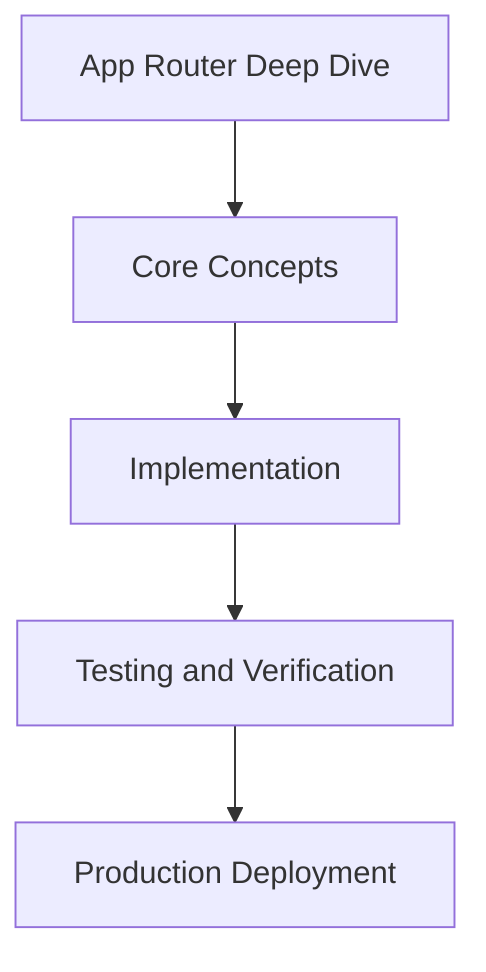

# Day 81 [Expert]: App Router Deep Dive

## Index

- [Goal](#goal)
- [Prerequisites](#prerequisites)
- [Explanation](#explanation)
- [Topic by Topic](#topic-by-topic)
- [Key Concepts](#key-concepts)
- [Visual Concept Map](#visual-concept-map)
- [End-to-End Practical](#end-to-end-practical)
- [Hands-on Coding](#hands-on-coding)
- [Mini Exercise](#mini-exercise)
- [Assessment Quiz](#assessment-quiz)
- [Task](#task)
- [Self Check](#self-check)
- [Interview Questions and Answers](#interview-questions-and-answers)
- [Day 81 Outcome](#day-81-outcome)

## Goal

Understand and apply App Router Deep Dive in a Next.js application to build production-quality features.

## Prerequisites

- Day 80 completed
- Solid understanding of Next.js App Router and TypeScript basics
- Familiarity with Server Components and data fetching patterns

## Explanation

A deep understanding of App Router is essential for building large Next.js systems with clear boundaries, predictable rendering, and maintainable navigation architecture.

This lesson focuses on route composition, data boundaries, and scaling patterns so teams can avoid hidden coupling and performance regressions.


## Topic by Topic

### Topic 1: Route Segment Architecture

Theory:
This topic covers Route Segment Architecture in production Next.js systems, with emphasis on explicit boundaries, tradeoff-aware design, and long-term maintainability.

Practical:
Apply Route Segment Architecture in a realistic project workflow, validate edge cases, and document implementation decisions for team reuse.

Code Example:

```tsx
// App Router Deep Dive — Topic 1
// Implementation depends on your specific use case.
// Refer to the Next.js documentation for detailed API reference.
export default function Example1() {
  return <div>App Router Deep Dive — Example 1</div>;
}
```
**Explanation:**
Route Segment Architecture helps convert framework capabilities into dependable production behavior that can be tested, observed, and evolved safely.

**Key Points:**
- Understand why Route Segment Architecture matters at scale.
- Use clear contracts and defaults when implementing it.
- Validate outcomes through tests, metrics, and review gates.


### Topic 2: Layouts, Templates, and Nested UI

Theory:
This topic covers Layouts, Templates, and Nested UI in production Next.js systems, with emphasis on explicit boundaries, tradeoff-aware design, and long-term maintainability.

Practical:
Apply Layouts, Templates, and Nested UI in a realistic project workflow, validate edge cases, and document implementation decisions for team reuse.

Code Example:

```tsx
// App Router Deep Dive — Topic 2
// Implementation depends on your specific use case.
// Refer to the Next.js documentation for detailed API reference.
export default function Example2() {
  return <div>App Router Deep Dive — Example 2</div>;
}
```
**Explanation:**
Layouts, Templates, and Nested UI helps convert framework capabilities into dependable production behavior that can be tested, observed, and evolved safely.

**Key Points:**
- Understand why Layouts, Templates, and Nested UI matters at scale.
- Use clear contracts and defaults when implementing it.
- Validate outcomes through tests, metrics, and review gates.


### Topic 3: Data Fetching Boundaries

Theory:
This topic covers Data Fetching Boundaries in production Next.js systems, with emphasis on explicit boundaries, tradeoff-aware design, and long-term maintainability.

Practical:
Apply Data Fetching Boundaries in a realistic project workflow, validate edge cases, and document implementation decisions for team reuse.

Code Example:

```tsx
// App Router Deep Dive — Topic 3
// Implementation depends on your specific use case.
// Refer to the Next.js documentation for detailed API reference.
export default function Example3() {
  return <div>App Router Deep Dive — Example 3</div>;
}
```
**Explanation:**
Data Fetching Boundaries helps convert framework capabilities into dependable production behavior that can be tested, observed, and evolved safely.

**Key Points:**
- Understand why Data Fetching Boundaries matters at scale.
- Use clear contracts and defaults when implementing it.
- Validate outcomes through tests, metrics, and review gates.


### Topic 4: Navigation and State Transitions

Theory:
This topic covers Navigation and State Transitions in production Next.js systems, with emphasis on explicit boundaries, tradeoff-aware design, and long-term maintainability.

Practical:
Apply Navigation and State Transitions in a realistic project workflow, validate edge cases, and document implementation decisions for team reuse.

Code Example:

```tsx
// App Router Deep Dive — Topic 4
// Implementation depends on your specific use case.
// Refer to the Next.js documentation for detailed API reference.
export default function Example4() {
  return <div>App Router Deep Dive — Example 4</div>;
}
```
**Explanation:**
Navigation and State Transitions helps convert framework capabilities into dependable production behavior that can be tested, observed, and evolved safely.

**Key Points:**
- Understand why Navigation and State Transitions matters at scale.
- Use clear contracts and defaults when implementing it.
- Validate outcomes through tests, metrics, and review gates.


### Topic 5: Error/Loading Composition

Theory:
This topic covers Error/Loading Composition in production Next.js systems, with emphasis on explicit boundaries, tradeoff-aware design, and long-term maintainability.

Practical:
Apply Error/Loading Composition in a realistic project workflow, validate edge cases, and document implementation decisions for team reuse.

Code Example:

```tsx
// App Router Deep Dive — Topic 5
// Implementation depends on your specific use case.
// Refer to the Next.js documentation for detailed API reference.
export default function Example5() {
  return <div>App Router Deep Dive — Example 5</div>;
}
```
**Explanation:**
Error/Loading Composition helps convert framework capabilities into dependable production behavior that can be tested, observed, and evolved safely.

**Key Points:**
- Understand why Error/Loading Composition matters at scale.
- Use clear contracts and defaults when implementing it.
- Validate outcomes through tests, metrics, and review gates.


### Topic 6: Scaling App Router in Large Codebases

Theory:
This topic covers Scaling App Router in Large Codebases in production Next.js systems, with emphasis on explicit boundaries, tradeoff-aware design, and long-term maintainability.

Practical:
Apply Scaling App Router in Large Codebases in a realistic project workflow, validate edge cases, and document implementation decisions for team reuse.

Code Example:

```tsx
// App Router Deep Dive — Topic 6
// Implementation depends on your specific use case.
// Refer to the Next.js documentation for detailed API reference.
export default function Example6() {
  return <div>App Router Deep Dive — Example 6</div>;
}
```
**Explanation:**
Scaling App Router in Large Codebases helps convert framework capabilities into dependable production behavior that can be tested, observed, and evolved safely.

**Key Points:**
- Understand why Scaling App Router in Large Codebases matters at scale.
- Use clear contracts and defaults when implementing it.
- Validate outcomes through tests, metrics, and review gates.


## Key Concepts

- App Router Deep Dive: Core concept for expert Next.js development
- Next.js App Router: The modern routing system using the app/ directory
- Server Component: A component that runs on the server only
- TypeScript: Strongly typed JavaScript used throughout Next.js projects

## Visual Concept Map



## End-to-End Practical

1. Review the explanation and all topic examples.
2. Set up a clean Next.js project or use your existing one.
3. Implement each topic example step by step.
4. Verify the behavior in the browser.
5. Refactor and clean up your implementation.
6. Write a brief note on what you learned.

## Hands-on Coding

### Example 1: Basic App Router Deep Dive Implementation

```tsx
// Basic implementation of App Router Deep Dive
// Follow the topic examples above to build this out.
export default function Example() {
  return (
    <div style={{ padding: "24px" }}>
      <h1>App Router Deep Dive</h1>
      <p>Implementation complete for Day 81.</p>
    </div>
  );
}
```

### Example 2: Practical Use Case

```tsx
// A real-world use case for App Router Deep Dive
// Refer to the Topic by Topic section for code details.
export default function PracticalExample() {
  return (
    <div>
      <h2>Practical: App Router Deep Dive</h2>
    </div>
  );
}
```

### Example 3: Combined Pattern

```tsx
// Combining App Router Deep Dive with other Next.js features
// This example shows integration with the App Router.
export default function CombinedExample() {
  return (
    <section>
      <h2>App Router Deep Dive — Combined Pattern</h2>
      <p>See topic sections above for detailed code.</p>
    </section>
  );
}
```

## Mini Exercise

Scenario:
You are adding App Router Deep Dive to a Next.js application for a real-world feature.

Steps:

1. Create a new route or component relevant to this topic.
2. Implement the core pattern from the Topic by Topic section.
3. Test the implementation thoroughly.
4. Verify edge cases are handled.
5. Clean up and document your code.

Expected output:

- Working implementation of App Router Deep Dive
- All edge cases handled correctly
- Clean, readable code following Next.js conventions

## Assessment Quiz

### Quiz Questions

1. What is the primary purpose of App Router Deep Dive in Next.js?
2. Where in the project structure do you implement this pattern?
3. What is a common mistake when using App Router Deep Dive?
4. True or False: App Router Deep Dive only applies to Client Components.
5. How does App Router Deep Dive improve the user or developer experience?

### Quiz Answers

1. To enable expert-level functionality in a Next.js application efficiently.
2. In the App Router directory structure, using Server Components by default.
3. Mixing server and client concerns incorrectly, or skipping error handling.
4. False. This concept applies broadly across the Next.js architecture.
5. It improves maintainability, performance, and scalability of the application.

## Task

- Study all topic examples in today's lesson
- Implement the core pattern in a Next.js project
- Test all scenarios including error and edge cases
- Complete the mini exercise
- Attempt the quiz before checking answers

## Self Check

- You can implement App Router Deep Dive from scratch
- You understand when and why to use this pattern
- You can explain the concept in simple terms
- You have tested the implementation in a running app
- You can answer at least 4 out of 5 quiz questions correctly

## Interview Questions and Answers

### Beginner

**Question:** What is App Router Deep Dive in Next.js?

**Answer:** App Router Deep Dive is a expert-level Next.js feature that helps developers build robust, scalable applications by handling a specific aspect of the framework architecture.

**Question:** When would you use App Router Deep Dive?

**Answer:** When you need to implement the specific functionality it provides in a production Next.js application, particularly in expert-stage projects.

### Middle

**Question:** How does App Router Deep Dive interact with the Next.js App Router?

**Answer:** It integrates with the App Router through Server Components, Route Handlers, or middleware, depending on the specific implementation pattern required.

**Question:** What are common pitfalls with App Router Deep Dive?

**Answer:** The most common pitfalls are improper handling of server/client boundaries, missing error states, and not considering caching behavior when relevant.

### Advanced

**Question:** How would you scale App Router Deep Dive in a large Next.js application with multiple teams?

**Answer:** By establishing clear conventions, creating reusable utilities, documenting patterns in an Architecture Decision Record, and enforcing consistency through code review and linting rules.

**Question:** What performance considerations apply to App Router Deep Dive?

**Answer:** Consider bundle size impact for client-side features, caching strategies for data fetching, and rendering mode selection to balance performance with data freshness.

## Day 81 Outcome

- You understand App Router Deep Dive and its role in Next.js
- You can implement this pattern in a real project
- You know when to use and when to avoid this pattern
- You are ready for Day 81 — moving on to the next topic
