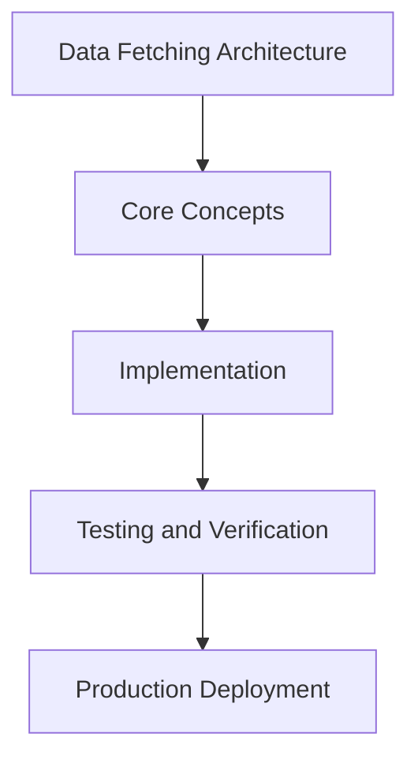

# Day 83 [Expert]: Data Fetching Architecture

## Index

- [Goal](#goal)
- [Prerequisites](#prerequisites)
- [Explanation](#explanation)
- [Topic by Topic](#topic-by-topic)
- [Key Concepts](#key-concepts)
- [Visual Concept Map](#visual-concept-map)
- [End-to-End Practical](#end-to-end-practical)
- [Hands-on Coding](#hands-on-coding)
- [Mini Exercise](#mini-exercise)
- [Assessment Quiz](#assessment-quiz)
- [Task](#task)
- [Self Check](#self-check)
- [Interview Questions and Answers](#interview-questions-and-answers)
- [Day 83 Outcome](#day-83-outcome)

## Goal

Understand and apply Data Fetching Architecture in a Next.js application to build production-quality features.

## Prerequisites

- Day 82 completed
- Solid understanding of Next.js App Router and TypeScript basics
- Familiarity with Server Components and data fetching patterns

## Explanation

Data fetching architecture determines freshness, latency, and reliability across Next.js applications. Good architecture aligns caching strategy with business requirements, not framework defaults alone.

This lesson covers how to design fetch layers that are observable, testable, and resilient at scale.


## Topic by Topic

### Topic 1: Fetch Layer Design Principles

Theory:
This topic covers Fetch Layer Design Principles in production Next.js systems, with emphasis on explicit boundaries, tradeoff-aware design, and long-term maintainability.

Practical:
Apply Fetch Layer Design Principles in a realistic project workflow, validate edge cases, and document implementation decisions for team reuse.

Code Example:

```tsx
// Data Fetching Architecture — Topic 1
// Implementation depends on your specific use case.
// Refer to the Next.js documentation for detailed API reference.
export default function Example1() {
  return <div>Data Fetching Architecture — Example 1</div>;
}
```
**Explanation:**
Fetch Layer Design Principles helps convert framework capabilities into dependable production behavior that can be tested, observed, and evolved safely.

**Key Points:**
- Understand why Fetch Layer Design Principles matters at scale.
- Use clear contracts and defaults when implementing it.
- Validate outcomes through tests, metrics, and review gates.


### Topic 2: Cache Policy and Revalidation Rules

Theory:
This topic covers Cache Policy and Revalidation Rules in production Next.js systems, with emphasis on explicit boundaries, tradeoff-aware design, and long-term maintainability.

Practical:
Apply Cache Policy and Revalidation Rules in a realistic project workflow, validate edge cases, and document implementation decisions for team reuse.

Code Example:

```tsx
// Data Fetching Architecture — Topic 2
// Implementation depends on your specific use case.
// Refer to the Next.js documentation for detailed API reference.
export default function Example2() {
  return <div>Data Fetching Architecture — Example 2</div>;
}
```
**Explanation:**
Cache Policy and Revalidation Rules helps convert framework capabilities into dependable production behavior that can be tested, observed, and evolved safely.

**Key Points:**
- Understand why Cache Policy and Revalidation Rules matters at scale.
- Use clear contracts and defaults when implementing it.
- Validate outcomes through tests, metrics, and review gates.


### Topic 3: Concurrency and Waterfall Avoidance

Theory:
This topic covers Concurrency and Waterfall Avoidance in production Next.js systems, with emphasis on explicit boundaries, tradeoff-aware design, and long-term maintainability.

Practical:
Apply Concurrency and Waterfall Avoidance in a realistic project workflow, validate edge cases, and document implementation decisions for team reuse.

Code Example:

```tsx
// Data Fetching Architecture — Topic 3
// Implementation depends on your specific use case.
// Refer to the Next.js documentation for detailed API reference.
export default function Example3() {
  return <div>Data Fetching Architecture — Example 3</div>;
}
```
**Explanation:**
Concurrency and Waterfall Avoidance helps convert framework capabilities into dependable production behavior that can be tested, observed, and evolved safely.

**Key Points:**
- Understand why Concurrency and Waterfall Avoidance matters at scale.
- Use clear contracts and defaults when implementing it.
- Validate outcomes through tests, metrics, and review gates.


### Topic 4: Error and Timeout Strategies

Theory:
This topic covers Error and Timeout Strategies in production Next.js systems, with emphasis on explicit boundaries, tradeoff-aware design, and long-term maintainability.

Practical:
Apply Error and Timeout Strategies in a realistic project workflow, validate edge cases, and document implementation decisions for team reuse.

Code Example:

```tsx
// Data Fetching Architecture — Topic 4
// Implementation depends on your specific use case.
// Refer to the Next.js documentation for detailed API reference.
export default function Example4() {
  return <div>Data Fetching Architecture — Example 4</div>;
}
```
**Explanation:**
Error and Timeout Strategies helps convert framework capabilities into dependable production behavior that can be tested, observed, and evolved safely.

**Key Points:**
- Understand why Error and Timeout Strategies matters at scale.
- Use clear contracts and defaults when implementing it.
- Validate outcomes through tests, metrics, and review gates.


### Topic 5: Domain-level Data Contracts

Theory:
This topic covers Domain-level Data Contracts in production Next.js systems, with emphasis on explicit boundaries, tradeoff-aware design, and long-term maintainability.

Practical:
Apply Domain-level Data Contracts in a realistic project workflow, validate edge cases, and document implementation decisions for team reuse.

Code Example:

```tsx
// Data Fetching Architecture — Topic 5
// Implementation depends on your specific use case.
// Refer to the Next.js documentation for detailed API reference.
export default function Example5() {
  return <div>Data Fetching Architecture — Example 5</div>;
}
```
**Explanation:**
Domain-level Data Contracts helps convert framework capabilities into dependable production behavior that can be tested, observed, and evolved safely.

**Key Points:**
- Understand why Domain-level Data Contracts matters at scale.
- Use clear contracts and defaults when implementing it.
- Validate outcomes through tests, metrics, and review gates.


### Topic 6: Operational Monitoring for Fetch Health

Theory:
This topic covers Operational Monitoring for Fetch Health in production Next.js systems, with emphasis on explicit boundaries, tradeoff-aware design, and long-term maintainability.

Practical:
Apply Operational Monitoring for Fetch Health in a realistic project workflow, validate edge cases, and document implementation decisions for team reuse.

Code Example:

```tsx
// Data Fetching Architecture — Topic 6
// Implementation depends on your specific use case.
// Refer to the Next.js documentation for detailed API reference.
export default function Example6() {
  return <div>Data Fetching Architecture — Example 6</div>;
}
```
**Explanation:**
Operational Monitoring for Fetch Health helps convert framework capabilities into dependable production behavior that can be tested, observed, and evolved safely.

**Key Points:**
- Understand why Operational Monitoring for Fetch Health matters at scale.
- Use clear contracts and defaults when implementing it.
- Validate outcomes through tests, metrics, and review gates.


## Key Concepts

- Data Fetching Architecture: Core concept for expert Next.js development
- Next.js App Router: The modern routing system using the app/ directory
- Server Component: A component that runs on the server only
- TypeScript: Strongly typed JavaScript used throughout Next.js projects

## Visual Concept Map



## End-to-End Practical

1. Review the explanation and all topic examples.
2. Set up a clean Next.js project or use your existing one.
3. Implement each topic example step by step.
4. Verify the behavior in the browser.
5. Refactor and clean up your implementation.
6. Write a brief note on what you learned.

## Hands-on Coding

### Example 1: Basic Data Fetching Architecture Implementation

```tsx
// Basic implementation of Data Fetching Architecture
// Follow the topic examples above to build this out.
export default function Example() {
  return (
    <div style={{ padding: "24px" }}>
      <h1>Data Fetching Architecture</h1>
      <p>Implementation complete for Day 83.</p>
    </div>
  );
}
```

### Example 2: Practical Use Case

```tsx
// A real-world use case for Data Fetching Architecture
// Refer to the Topic by Topic section for code details.
export default function PracticalExample() {
  return (
    <div>
      <h2>Practical: Data Fetching Architecture</h2>
    </div>
  );
}
```

### Example 3: Combined Pattern

```tsx
// Combining Data Fetching Architecture with other Next.js features
// This example shows integration with the App Router.
export default function CombinedExample() {
  return (
    <section>
      <h2>Data Fetching Architecture — Combined Pattern</h2>
      <p>See topic sections above for detailed code.</p>
    </section>
  );
}
```

## Mini Exercise

Scenario:
You are adding Data Fetching Architecture to a Next.js application for a real-world feature.

Steps:

1. Create a new route or component relevant to this topic.
2. Implement the core pattern from the Topic by Topic section.
3. Test the implementation thoroughly.
4. Verify edge cases are handled.
5. Clean up and document your code.

Expected output:

- Working implementation of Data Fetching Architecture
- All edge cases handled correctly
- Clean, readable code following Next.js conventions

## Assessment Quiz

### Quiz Questions

1. What is the primary purpose of Data Fetching Architecture in Next.js?
2. Where in the project structure do you implement this pattern?
3. What is a common mistake when using Data Fetching Architecture?
4. True or False: Data Fetching Architecture only applies to Client Components.
5. How does Data Fetching Architecture improve the user or developer experience?

### Quiz Answers

1. To enable expert-level functionality in a Next.js application efficiently.
2. In the App Router directory structure, using Server Components by default.
3. Mixing server and client concerns incorrectly, or skipping error handling.
4. False. This concept applies broadly across the Next.js architecture.
5. It improves maintainability, performance, and scalability of the application.

## Task

- Study all topic examples in today's lesson
- Implement the core pattern in a Next.js project
- Test all scenarios including error and edge cases
- Complete the mini exercise
- Attempt the quiz before checking answers

## Self Check

- You can implement Data Fetching Architecture from scratch
- You understand when and why to use this pattern
- You can explain the concept in simple terms
- You have tested the implementation in a running app
- You can answer at least 4 out of 5 quiz questions correctly

## Interview Questions and Answers

### Beginner

**Question:** What is Data Fetching Architecture in Next.js?

**Answer:** Data Fetching Architecture is a expert-level Next.js feature that helps developers build robust, scalable applications by handling a specific aspect of the framework architecture.

**Question:** When would you use Data Fetching Architecture?

**Answer:** When you need to implement the specific functionality it provides in a production Next.js application, particularly in expert-stage projects.

### Middle

**Question:** How does Data Fetching Architecture interact with the Next.js App Router?

**Answer:** It integrates with the App Router through Server Components, Route Handlers, or middleware, depending on the specific implementation pattern required.

**Question:** What are common pitfalls with Data Fetching Architecture?

**Answer:** The most common pitfalls are improper handling of server/client boundaries, missing error states, and not considering caching behavior when relevant.

### Advanced

**Question:** How would you scale Data Fetching Architecture in a large Next.js application with multiple teams?

**Answer:** By establishing clear conventions, creating reusable utilities, documenting patterns in an Architecture Decision Record, and enforcing consistency through code review and linting rules.

**Question:** What performance considerations apply to Data Fetching Architecture?

**Answer:** Consider bundle size impact for client-side features, caching strategies for data fetching, and rendering mode selection to balance performance with data freshness.

## Day 83 Outcome

- You understand Data Fetching Architecture and its role in Next.js
- You can implement this pattern in a real project
- You know when to use and when to avoid this pattern
- You are ready for Day 83 — moving on to the next topic
