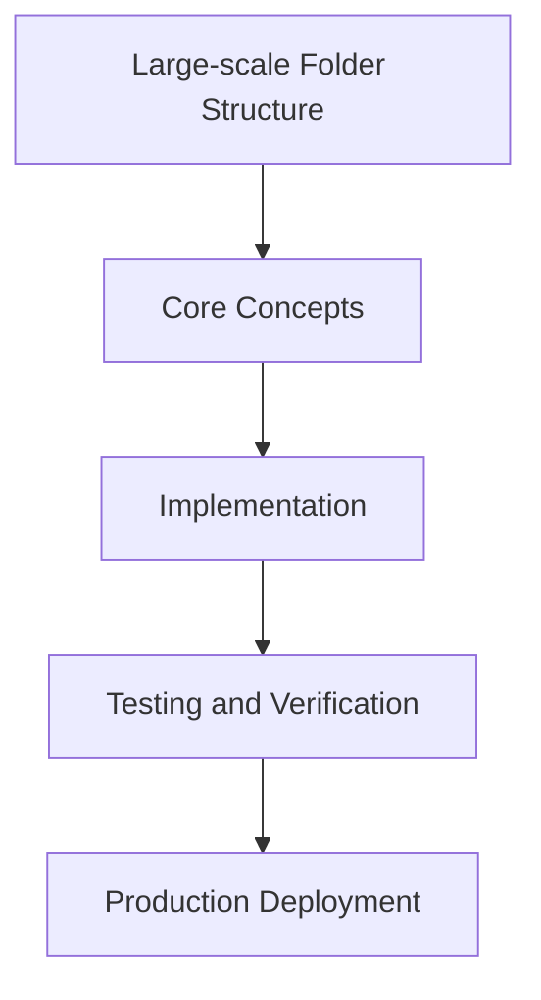

# Day 84 [Expert]: Large-scale Folder Structure

## Index

- [Goal](#goal)
- [Prerequisites](#prerequisites)
- [Explanation](#explanation)
- [Topic by Topic](#topic-by-topic)
- [Key Concepts](#key-concepts)
- [Visual Concept Map](#visual-concept-map)
- [End-to-End Practical](#end-to-end-practical)
- [Hands-on Coding](#hands-on-coding)
- [Mini Exercise](#mini-exercise)
- [Assessment Quiz](#assessment-quiz)
- [Task](#task)
- [Self Check](#self-check)
- [Interview Questions and Answers](#interview-questions-and-answers)
- [Day 84 Outcome](#day-84-outcome)

## Goal

Understand and apply Large-scale Folder Structure in a Next.js application to build production-quality features.

## Prerequisites

- Day 83 completed
- Solid understanding of Next.js App Router and TypeScript basics
- Familiarity with Server Components and data fetching patterns

## Explanation

Folder structure at scale affects onboarding speed, ownership clarity, and architectural consistency in Next.js repositories.

A maintainable structure should reflect domain boundaries, runtime concerns, and team collaboration patterns without excessive nesting complexity.


## Topic by Topic

### Topic 1: Domain-oriented Structure Design

Theory:
This topic covers Domain-oriented Structure Design in production Next.js systems, with emphasis on explicit boundaries, tradeoff-aware design, and long-term maintainability.

Practical:
Apply Domain-oriented Structure Design in a realistic project workflow, validate edge cases, and document implementation decisions for team reuse.

Code Example:

```tsx
// Large-scale Folder Structure — Topic 1
// Implementation depends on your specific use case.
// Refer to the Next.js documentation for detailed API reference.
export default function Example1() {
  return <div>Large-scale Folder Structure — Example 1</div>;
}
```
**Explanation:**
Domain-oriented Structure Design helps convert framework capabilities into dependable production behavior that can be tested, observed, and evolved safely.

**Key Points:**
- Understand why Domain-oriented Structure Design matters at scale.
- Use clear contracts and defaults when implementing it.
- Validate outcomes through tests, metrics, and review gates.


### Topic 2: Shared vs Feature-local Modules

Theory:
This topic covers Shared vs Feature-local Modules in production Next.js systems, with emphasis on explicit boundaries, tradeoff-aware design, and long-term maintainability.

Practical:
Apply Shared vs Feature-local Modules in a realistic project workflow, validate edge cases, and document implementation decisions for team reuse.

Code Example:

```tsx
// Large-scale Folder Structure — Topic 2
// Implementation depends on your specific use case.
// Refer to the Next.js documentation for detailed API reference.
export default function Example2() {
  return <div>Large-scale Folder Structure — Example 2</div>;
}
```
**Explanation:**
Shared vs Feature-local Modules helps convert framework capabilities into dependable production behavior that can be tested, observed, and evolved safely.

**Key Points:**
- Understand why Shared vs Feature-local Modules matters at scale.
- Use clear contracts and defaults when implementing it.
- Validate outcomes through tests, metrics, and review gates.


### Topic 3: Route Co-location Conventions

Theory:
This topic covers Route Co-location Conventions in production Next.js systems, with emphasis on explicit boundaries, tradeoff-aware design, and long-term maintainability.

Practical:
Apply Route Co-location Conventions in a realistic project workflow, validate edge cases, and document implementation decisions for team reuse.

Code Example:

```tsx
// Large-scale Folder Structure — Topic 3
// Implementation depends on your specific use case.
// Refer to the Next.js documentation for detailed API reference.
export default function Example3() {
  return <div>Large-scale Folder Structure — Example 3</div>;
}
```
**Explanation:**
Route Co-location Conventions helps convert framework capabilities into dependable production behavior that can be tested, observed, and evolved safely.

**Key Points:**
- Understand why Route Co-location Conventions matters at scale.
- Use clear contracts and defaults when implementing it.
- Validate outcomes through tests, metrics, and review gates.


### Topic 4: Naming and Ownership Rules

Theory:
This topic covers Naming and Ownership Rules in production Next.js systems, with emphasis on explicit boundaries, tradeoff-aware design, and long-term maintainability.

Practical:
Apply Naming and Ownership Rules in a realistic project workflow, validate edge cases, and document implementation decisions for team reuse.

Code Example:

```tsx
// Large-scale Folder Structure — Topic 4
// Implementation depends on your specific use case.
// Refer to the Next.js documentation for detailed API reference.
export default function Example4() {
  return <div>Large-scale Folder Structure — Example 4</div>;
}
```
**Explanation:**
Naming and Ownership Rules helps convert framework capabilities into dependable production behavior that can be tested, observed, and evolved safely.

**Key Points:**
- Understand why Naming and Ownership Rules matters at scale.
- Use clear contracts and defaults when implementing it.
- Validate outcomes through tests, metrics, and review gates.


### Topic 5: Refactor-safe Organization Patterns

Theory:
This topic covers Refactor-safe Organization Patterns in production Next.js systems, with emphasis on explicit boundaries, tradeoff-aware design, and long-term maintainability.

Practical:
Apply Refactor-safe Organization Patterns in a realistic project workflow, validate edge cases, and document implementation decisions for team reuse.

Code Example:

```tsx
// Large-scale Folder Structure — Topic 5
// Implementation depends on your specific use case.
// Refer to the Next.js documentation for detailed API reference.
export default function Example5() {
  return <div>Large-scale Folder Structure — Example 5</div>;
}
```
**Explanation:**
Refactor-safe Organization Patterns helps convert framework capabilities into dependable production behavior that can be tested, observed, and evolved safely.

**Key Points:**
- Understand why Refactor-safe Organization Patterns matters at scale.
- Use clear contracts and defaults when implementing it.
- Validate outcomes through tests, metrics, and review gates.


### Topic 6: Scaling Structure with Team Growth

Theory:
This topic covers Scaling Structure with Team Growth in production Next.js systems, with emphasis on explicit boundaries, tradeoff-aware design, and long-term maintainability.

Practical:
Apply Scaling Structure with Team Growth in a realistic project workflow, validate edge cases, and document implementation decisions for team reuse.

Code Example:

```tsx
// Large-scale Folder Structure — Topic 6
// Implementation depends on your specific use case.
// Refer to the Next.js documentation for detailed API reference.
export default function Example6() {
  return <div>Large-scale Folder Structure — Example 6</div>;
}
```
**Explanation:**
Scaling Structure with Team Growth helps convert framework capabilities into dependable production behavior that can be tested, observed, and evolved safely.

**Key Points:**
- Understand why Scaling Structure with Team Growth matters at scale.
- Use clear contracts and defaults when implementing it.
- Validate outcomes through tests, metrics, and review gates.


## Key Concepts

- Large-scale Folder Structure: Core concept for expert Next.js development
- Next.js App Router: The modern routing system using the app/ directory
- Server Component: A component that runs on the server only
- TypeScript: Strongly typed JavaScript used throughout Next.js projects

## Visual Concept Map



## End-to-End Practical

1. Review the explanation and all topic examples.
2. Set up a clean Next.js project or use your existing one.
3. Implement each topic example step by step.
4. Verify the behavior in the browser.
5. Refactor and clean up your implementation.
6. Write a brief note on what you learned.

## Hands-on Coding

### Example 1: Basic Large-scale Folder Structure Implementation

```tsx
// Basic implementation of Large-scale Folder Structure
// Follow the topic examples above to build this out.
export default function Example() {
  return (
    <div style={{ padding: "24px" }}>
      <h1>Large-scale Folder Structure</h1>
      <p>Implementation complete for Day 84.</p>
    </div>
  );
}
```

### Example 2: Practical Use Case

```tsx
// A real-world use case for Large-scale Folder Structure
// Refer to the Topic by Topic section for code details.
export default function PracticalExample() {
  return (
    <div>
      <h2>Practical: Large-scale Folder Structure</h2>
    </div>
  );
}
```

### Example 3: Combined Pattern

```tsx
// Combining Large-scale Folder Structure with other Next.js features
// This example shows integration with the App Router.
export default function CombinedExample() {
  return (
    <section>
      <h2>Large-scale Folder Structure — Combined Pattern</h2>
      <p>See topic sections above for detailed code.</p>
    </section>
  );
}
```

## Mini Exercise

Scenario:
You are adding Large-scale Folder Structure to a Next.js application for a real-world feature.

Steps:

1. Create a new route or component relevant to this topic.
2. Implement the core pattern from the Topic by Topic section.
3. Test the implementation thoroughly.
4. Verify edge cases are handled.
5. Clean up and document your code.

Expected output:

- Working implementation of Large-scale Folder Structure
- All edge cases handled correctly
- Clean, readable code following Next.js conventions

## Assessment Quiz

### Quiz Questions

1. What is the primary purpose of Large-scale Folder Structure in Next.js?
2. Where in the project structure do you implement this pattern?
3. What is a common mistake when using Large-scale Folder Structure?
4. True or False: Large-scale Folder Structure only applies to Client Components.
5. How does Large-scale Folder Structure improve the user or developer experience?

### Quiz Answers

1. To enable expert-level functionality in a Next.js application efficiently.
2. In the App Router directory structure, using Server Components by default.
3. Mixing server and client concerns incorrectly, or skipping error handling.
4. False. This concept applies broadly across the Next.js architecture.
5. It improves maintainability, performance, and scalability of the application.

## Task

- Study all topic examples in today's lesson
- Implement the core pattern in a Next.js project
- Test all scenarios including error and edge cases
- Complete the mini exercise
- Attempt the quiz before checking answers

## Self Check

- You can implement Large-scale Folder Structure from scratch
- You understand when and why to use this pattern
- You can explain the concept in simple terms
- You have tested the implementation in a running app
- You can answer at least 4 out of 5 quiz questions correctly

## Interview Questions and Answers

### Beginner

**Question:** What is Large-scale Folder Structure in Next.js?

**Answer:** Large-scale Folder Structure is a expert-level Next.js feature that helps developers build robust, scalable applications by handling a specific aspect of the framework architecture.

**Question:** When would you use Large-scale Folder Structure?

**Answer:** When you need to implement the specific functionality it provides in a production Next.js application, particularly in expert-stage projects.

### Middle

**Question:** How does Large-scale Folder Structure interact with the Next.js App Router?

**Answer:** It integrates with the App Router through Server Components, Route Handlers, or middleware, depending on the specific implementation pattern required.

**Question:** What are common pitfalls with Large-scale Folder Structure?

**Answer:** The most common pitfalls are improper handling of server/client boundaries, missing error states, and not considering caching behavior when relevant.

### Advanced

**Question:** How would you scale Large-scale Folder Structure in a large Next.js application with multiple teams?

**Answer:** By establishing clear conventions, creating reusable utilities, documenting patterns in an Architecture Decision Record, and enforcing consistency through code review and linting rules.

**Question:** What performance considerations apply to Large-scale Folder Structure?

**Answer:** Consider bundle size impact for client-side features, caching strategies for data fetching, and rendering mode selection to balance performance with data freshness.

## Day 84 Outcome

- You understand Large-scale Folder Structure and its role in Next.js
- You can implement this pattern in a real project
- You know when to use and when to avoid this pattern
- You are ready for Day 84 — moving on to the next topic
