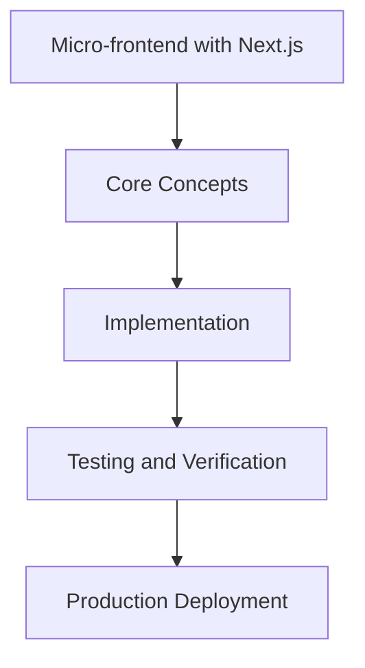

# Day 85 [Expert]: Micro-frontend with Next.js

## Index

- [Goal](#goal)
- [Prerequisites](#prerequisites)
- [Explanation](#explanation)
- [Topic by Topic](#topic-by-topic)
- [Key Concepts](#key-concepts)
- [Visual Concept Map](#visual-concept-map)
- [End-to-End Practical](#end-to-end-practical)
- [Hands-on Coding](#hands-on-coding)
- [Mini Exercise](#mini-exercise)
- [Assessment Quiz](#assessment-quiz)
- [Task](#task)
- [Self Check](#self-check)
- [Interview Questions and Answers](#interview-questions-and-answers)
- [Day 85 Outcome](#day-85-outcome)

## Goal

Understand and apply Micro-frontend with Next.js in a Next.js application to build production-quality features.

## Prerequisites

- Day 84 completed
- Solid understanding of Next.js App Router and TypeScript basics
- Familiarity with Server Components and data fetching patterns

## Explanation

Micro-frontend architecture can improve team autonomy, but it introduces complexity around composition, contracts, and runtime performance.

This lesson focuses on pragmatic adoption patterns, boundaries, and governance needed for reliable Next.js micro-frontend systems.


## Topic by Topic

### Topic 1: Adoption Criteria and Tradeoffs

Theory:
This topic covers Adoption Criteria and Tradeoffs in production Next.js systems, with emphasis on explicit boundaries, tradeoff-aware design, and long-term maintainability.

Practical:
Apply Adoption Criteria and Tradeoffs in a realistic project workflow, validate edge cases, and document implementation decisions for team reuse.

Code Example:

```tsx
// Micro-frontend with Next.js — Topic 1
// Implementation depends on your specific use case.
// Refer to the Next.js documentation for detailed API reference.
export default function Example1() {
  return <div>Micro-frontend with Next.js — Example 1</div>;
}
```
**Explanation:**
Adoption Criteria and Tradeoffs helps convert framework capabilities into dependable production behavior that can be tested, observed, and evolved safely.

**Key Points:**
- Understand why Adoption Criteria and Tradeoffs matters at scale.
- Use clear contracts and defaults when implementing it.
- Validate outcomes through tests, metrics, and review gates.


### Topic 2: Composition Models and Integration Points

Theory:
This topic covers Composition Models and Integration Points in production Next.js systems, with emphasis on explicit boundaries, tradeoff-aware design, and long-term maintainability.

Practical:
Apply Composition Models and Integration Points in a realistic project workflow, validate edge cases, and document implementation decisions for team reuse.

Code Example:

```tsx
// Micro-frontend with Next.js — Topic 2
// Implementation depends on your specific use case.
// Refer to the Next.js documentation for detailed API reference.
export default function Example2() {
  return <div>Micro-frontend with Next.js — Example 2</div>;
}
```
**Explanation:**
Composition Models and Integration Points helps convert framework capabilities into dependable production behavior that can be tested, observed, and evolved safely.

**Key Points:**
- Understand why Composition Models and Integration Points matters at scale.
- Use clear contracts and defaults when implementing it.
- Validate outcomes through tests, metrics, and review gates.


### Topic 3: Contract and Version Management

Theory:
This topic covers Contract and Version Management in production Next.js systems, with emphasis on explicit boundaries, tradeoff-aware design, and long-term maintainability.

Practical:
Apply Contract and Version Management in a realistic project workflow, validate edge cases, and document implementation decisions for team reuse.

Code Example:

```tsx
// Micro-frontend with Next.js — Topic 3
// Implementation depends on your specific use case.
// Refer to the Next.js documentation for detailed API reference.
export default function Example3() {
  return <div>Micro-frontend with Next.js — Example 3</div>;
}
```
**Explanation:**
Contract and Version Management helps convert framework capabilities into dependable production behavior that can be tested, observed, and evolved safely.

**Key Points:**
- Understand why Contract and Version Management matters at scale.
- Use clear contracts and defaults when implementing it.
- Validate outcomes through tests, metrics, and review gates.


### Topic 4: Shared Identity and Navigation

Theory:
This topic covers Shared Identity and Navigation in production Next.js systems, with emphasis on explicit boundaries, tradeoff-aware design, and long-term maintainability.

Practical:
Apply Shared Identity and Navigation in a realistic project workflow, validate edge cases, and document implementation decisions for team reuse.

Code Example:

```tsx
// Micro-frontend with Next.js — Topic 4
// Implementation depends on your specific use case.
// Refer to the Next.js documentation for detailed API reference.
export default function Example4() {
  return <div>Micro-frontend with Next.js — Example 4</div>;
}
```
**Explanation:**
Shared Identity and Navigation helps convert framework capabilities into dependable production behavior that can be tested, observed, and evolved safely.

**Key Points:**
- Understand why Shared Identity and Navigation matters at scale.
- Use clear contracts and defaults when implementing it.
- Validate outcomes through tests, metrics, and review gates.


### Topic 5: Performance and Bundle Governance

Theory:
This topic covers Performance and Bundle Governance in production Next.js systems, with emphasis on explicit boundaries, tradeoff-aware design, and long-term maintainability.

Practical:
Apply Performance and Bundle Governance in a realistic project workflow, validate edge cases, and document implementation decisions for team reuse.

Code Example:

```tsx
// Micro-frontend with Next.js — Topic 5
// Implementation depends on your specific use case.
// Refer to the Next.js documentation for detailed API reference.
export default function Example5() {
  return <div>Micro-frontend with Next.js — Example 5</div>;
}
```
**Explanation:**
Performance and Bundle Governance helps convert framework capabilities into dependable production behavior that can be tested, observed, and evolved safely.

**Key Points:**
- Understand why Performance and Bundle Governance matters at scale.
- Use clear contracts and defaults when implementing it.
- Validate outcomes through tests, metrics, and review gates.


### Topic 6: Operational Reliability and Rollbacks

Theory:
This topic covers Operational Reliability and Rollbacks in production Next.js systems, with emphasis on explicit boundaries, tradeoff-aware design, and long-term maintainability.

Practical:
Apply Operational Reliability and Rollbacks in a realistic project workflow, validate edge cases, and document implementation decisions for team reuse.

Code Example:

```tsx
// Micro-frontend with Next.js — Topic 6
// Implementation depends on your specific use case.
// Refer to the Next.js documentation for detailed API reference.
export default function Example6() {
  return <div>Micro-frontend with Next.js — Example 6</div>;
}
```
**Explanation:**
Operational Reliability and Rollbacks helps convert framework capabilities into dependable production behavior that can be tested, observed, and evolved safely.

**Key Points:**
- Understand why Operational Reliability and Rollbacks matters at scale.
- Use clear contracts and defaults when implementing it.
- Validate outcomes through tests, metrics, and review gates.


## Key Concepts

- Micro-frontend with Next.js: Core concept for expert Next.js development
- Next.js App Router: The modern routing system using the app/ directory
- Server Component: A component that runs on the server only
- TypeScript: Strongly typed JavaScript used throughout Next.js projects

## Visual Concept Map



## End-to-End Practical

1. Review the explanation and all topic examples.
2. Set up a clean Next.js project or use your existing one.
3. Implement each topic example step by step.
4. Verify the behavior in the browser.
5. Refactor and clean up your implementation.
6. Write a brief note on what you learned.

## Hands-on Coding

### Example 1: Basic Micro-frontend with Next.js Implementation

```tsx
// Basic implementation of Micro-frontend with Next.js
// Follow the topic examples above to build this out.
export default function Example() {
  return (
    <div style={{ padding: "24px" }}>
      <h1>Micro-frontend with Next.js</h1>
      <p>Implementation complete for Day 85.</p>
    </div>
  );
}
```

### Example 2: Practical Use Case

```tsx
// A real-world use case for Micro-frontend with Next.js
// Refer to the Topic by Topic section for code details.
export default function PracticalExample() {
  return (
    <div>
      <h2>Practical: Micro-frontend with Next.js</h2>
    </div>
  );
}
```

### Example 3: Combined Pattern

```tsx
// Combining Micro-frontend with Next.js with other Next.js features
// This example shows integration with the App Router.
export default function CombinedExample() {
  return (
    <section>
      <h2>Micro-frontend with Next.js — Combined Pattern</h2>
      <p>See topic sections above for detailed code.</p>
    </section>
  );
}
```

## Mini Exercise

Scenario:
You are adding Micro-frontend with Next.js to a Next.js application for a real-world feature.

Steps:

1. Create a new route or component relevant to this topic.
2. Implement the core pattern from the Topic by Topic section.
3. Test the implementation thoroughly.
4. Verify edge cases are handled.
5. Clean up and document your code.

Expected output:

- Working implementation of Micro-frontend with Next.js
- All edge cases handled correctly
- Clean, readable code following Next.js conventions

## Assessment Quiz

### Quiz Questions

1. What is the primary purpose of Micro-frontend with Next.js in Next.js?
2. Where in the project structure do you implement this pattern?
3. What is a common mistake when using Micro-frontend with Next.js?
4. True or False: Micro-frontend with Next.js only applies to Client Components.
5. How does Micro-frontend with Next.js improve the user or developer experience?

### Quiz Answers

1. To enable expert-level functionality in a Next.js application efficiently.
2. In the App Router directory structure, using Server Components by default.
3. Mixing server and client concerns incorrectly, or skipping error handling.
4. False. This concept applies broadly across the Next.js architecture.
5. It improves maintainability, performance, and scalability of the application.

## Task

- Study all topic examples in today's lesson
- Implement the core pattern in a Next.js project
- Test all scenarios including error and edge cases
- Complete the mini exercise
- Attempt the quiz before checking answers

## Self Check

- You can implement Micro-frontend with Next.js from scratch
- You understand when and why to use this pattern
- You can explain the concept in simple terms
- You have tested the implementation in a running app
- You can answer at least 4 out of 5 quiz questions correctly

## Interview Questions and Answers

### Beginner

**Question:** What is Micro-frontend with Next.js in Next.js?

**Answer:** Micro-frontend with Next.js is a expert-level Next.js feature that helps developers build robust, scalable applications by handling a specific aspect of the framework architecture.

**Question:** When would you use Micro-frontend with Next.js?

**Answer:** When you need to implement the specific functionality it provides in a production Next.js application, particularly in expert-stage projects.

### Middle

**Question:** How does Micro-frontend with Next.js interact with the Next.js App Router?

**Answer:** It integrates with the App Router through Server Components, Route Handlers, or middleware, depending on the specific implementation pattern required.

**Question:** What are common pitfalls with Micro-frontend with Next.js?

**Answer:** The most common pitfalls are improper handling of server/client boundaries, missing error states, and not considering caching behavior when relevant.

### Advanced

**Question:** How would you scale Micro-frontend with Next.js in a large Next.js application with multiple teams?

**Answer:** By establishing clear conventions, creating reusable utilities, documenting patterns in an Architecture Decision Record, and enforcing consistency through code review and linting rules.

**Question:** What performance considerations apply to Micro-frontend with Next.js?

**Answer:** Consider bundle size impact for client-side features, caching strategies for data fetching, and rendering mode selection to balance performance with data freshness.

## Day 85 Outcome

- You understand Micro-frontend with Next.js and its role in Next.js
- You can implement this pattern in a real project
- You know when to use and when to avoid this pattern
- You are ready for Day 85 — moving on to the next topic
