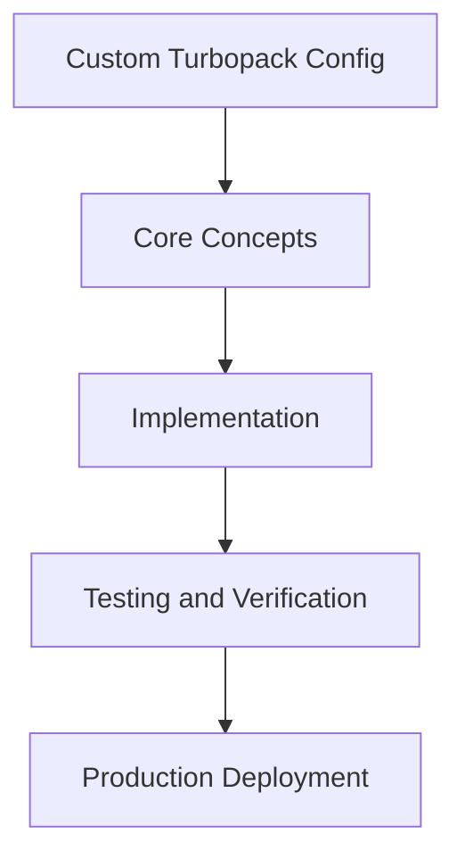

# Day 86 [Expert]: Custom Turbopack Config

## Index

- [Goal](#goal)
- [Prerequisites](#prerequisites)
- [Explanation](#explanation)
- [Topic by Topic](#topic-by-topic)
- [Key Concepts](#key-concepts)
- [Visual Concept Map](#visual-concept-map)
- [End-to-End Practical](#end-to-end-practical)
- [Hands-on Coding](#hands-on-coding)
- [Mini Exercise](#mini-exercise)
- [Assessment Quiz](#assessment-quiz)
- [Task](#task)
- [Self Check](#self-check)
- [Interview Questions and Answers](#interview-questions-and-answers)
- [Day 86 Outcome](#day-86-outcome)

## Goal

Understand and apply Custom Turbopack Config in a Next.js application to build production-quality features.

## Prerequisites

- Day 85 completed
- Solid understanding of Next.js App Router and TypeScript basics
- Familiarity with Server Components and data fetching patterns

## Explanation

Custom Turbopack configuration can improve developer feedback loops and build behavior, but changes should be measured and governed to avoid unstable tooling experiences.

This lesson emphasizes safe customization, compatibility checks, and team-level build observability.


## Topic by Topic

### Topic 1: When Custom Configuration Is Justified

Theory:
This topic covers When Custom Configuration Is Justified in production Next.js systems, with emphasis on explicit boundaries, tradeoff-aware design, and long-term maintainability.

Practical:
Apply When Custom Configuration Is Justified in a realistic project workflow, validate edge cases, and document implementation decisions for team reuse.

Code Example:

```tsx
// Custom Turbopack Config — Topic 1
// Implementation depends on your specific use case.
// Refer to the Next.js documentation for detailed API reference.
export default function Example1() {
  return <div>Custom Turbopack Config — Example 1</div>;
}
```
**Explanation:**
When Custom Configuration Is Justified helps convert framework capabilities into dependable production behavior that can be tested, observed, and evolved safely.

**Key Points:**
- Understand why When Custom Configuration Is Justified matters at scale.
- Use clear contracts and defaults when implementing it.
- Validate outcomes through tests, metrics, and review gates.


### Topic 2: Build Pipeline and Resolver Controls

Theory:
This topic covers Build Pipeline and Resolver Controls in production Next.js systems, with emphasis on explicit boundaries, tradeoff-aware design, and long-term maintainability.

Practical:
Apply Build Pipeline and Resolver Controls in a realistic project workflow, validate edge cases, and document implementation decisions for team reuse.

Code Example:

```tsx
// Custom Turbopack Config — Topic 2
// Implementation depends on your specific use case.
// Refer to the Next.js documentation for detailed API reference.
export default function Example2() {
  return <div>Custom Turbopack Config — Example 2</div>;
}
```
**Explanation:**
Build Pipeline and Resolver Controls helps convert framework capabilities into dependable production behavior that can be tested, observed, and evolved safely.

**Key Points:**
- Understand why Build Pipeline and Resolver Controls matters at scale.
- Use clear contracts and defaults when implementing it.
- Validate outcomes through tests, metrics, and review gates.


### Topic 3: Plugin/Loader Compatibility Checks

Theory:
This topic covers Plugin/Loader Compatibility Checks in production Next.js systems, with emphasis on explicit boundaries, tradeoff-aware design, and long-term maintainability.

Practical:
Apply Plugin/Loader Compatibility Checks in a realistic project workflow, validate edge cases, and document implementation decisions for team reuse.

Code Example:

```tsx
// Custom Turbopack Config — Topic 3
// Implementation depends on your specific use case.
// Refer to the Next.js documentation for detailed API reference.
export default function Example3() {
  return <div>Custom Turbopack Config — Example 3</div>;
}
```
**Explanation:**
Plugin/Loader Compatibility Checks helps convert framework capabilities into dependable production behavior that can be tested, observed, and evolved safely.

**Key Points:**
- Understand why Plugin/Loader Compatibility Checks matters at scale.
- Use clear contracts and defaults when implementing it.
- Validate outcomes through tests, metrics, and review gates.


### Topic 4: Dev Experience Performance Tuning

Theory:
This topic covers Dev Experience Performance Tuning in production Next.js systems, with emphasis on explicit boundaries, tradeoff-aware design, and long-term maintainability.

Practical:
Apply Dev Experience Performance Tuning in a realistic project workflow, validate edge cases, and document implementation decisions for team reuse.

Code Example:

```tsx
// Custom Turbopack Config — Topic 4
// Implementation depends on your specific use case.
// Refer to the Next.js documentation for detailed API reference.
export default function Example4() {
  return <div>Custom Turbopack Config — Example 4</div>;
}
```
**Explanation:**
Dev Experience Performance Tuning helps convert framework capabilities into dependable production behavior that can be tested, observed, and evolved safely.

**Key Points:**
- Understand why Dev Experience Performance Tuning matters at scale.
- Use clear contracts and defaults when implementing it.
- Validate outcomes through tests, metrics, and review gates.


### Topic 5: Configuration Testing and Validation

Theory:
This topic covers Configuration Testing and Validation in production Next.js systems, with emphasis on explicit boundaries, tradeoff-aware design, and long-term maintainability.

Practical:
Apply Configuration Testing and Validation in a realistic project workflow, validate edge cases, and document implementation decisions for team reuse.

Code Example:

```tsx
// Custom Turbopack Config — Topic 5
// Implementation depends on your specific use case.
// Refer to the Next.js documentation for detailed API reference.
export default function Example5() {
  return <div>Custom Turbopack Config — Example 5</div>;
}
```
**Explanation:**
Configuration Testing and Validation helps convert framework capabilities into dependable production behavior that can be tested, observed, and evolved safely.

**Key Points:**
- Understand why Configuration Testing and Validation matters at scale.
- Use clear contracts and defaults when implementing it.
- Validate outcomes through tests, metrics, and review gates.


### Topic 6: Maintaining Build Config Over Time

Theory:
This topic covers Maintaining Build Config Over Time in production Next.js systems, with emphasis on explicit boundaries, tradeoff-aware design, and long-term maintainability.

Practical:
Apply Maintaining Build Config Over Time in a realistic project workflow, validate edge cases, and document implementation decisions for team reuse.

Code Example:

```tsx
// Custom Turbopack Config — Topic 6
// Implementation depends on your specific use case.
// Refer to the Next.js documentation for detailed API reference.
export default function Example6() {
  return <div>Custom Turbopack Config — Example 6</div>;
}
```
**Explanation:**
Maintaining Build Config Over Time helps convert framework capabilities into dependable production behavior that can be tested, observed, and evolved safely.

**Key Points:**
- Understand why Maintaining Build Config Over Time matters at scale.
- Use clear contracts and defaults when implementing it.
- Validate outcomes through tests, metrics, and review gates.


## Key Concepts

- Custom Turbopack Config: Core concept for expert Next.js development
- Next.js App Router: The modern routing system using the app/ directory
- Server Component: A component that runs on the server only
- TypeScript: Strongly typed JavaScript used throughout Next.js projects

## Visual Concept Map



## End-to-End Practical

1. Review the explanation and all topic examples.
2. Set up a clean Next.js project or use your existing one.
3. Implement each topic example step by step.
4. Verify the behavior in the browser.
5. Refactor and clean up your implementation.
6. Write a brief note on what you learned.

## Hands-on Coding

### Example 1: Basic Custom Turbopack Config Implementation

```tsx
// Basic implementation of Custom Turbopack Config
// Follow the topic examples above to build this out.
export default function Example() {
  return (
    <div style={{ padding: "24px" }}>
      <h1>Custom Turbopack Config</h1>
      <p>Implementation complete for Day 86.</p>
    </div>
  );
}
```

### Example 2: Practical Use Case

```tsx
// A real-world use case for Custom Turbopack Config
// Refer to the Topic by Topic section for code details.
export default function PracticalExample() {
  return (
    <div>
      <h2>Practical: Custom Turbopack Config</h2>
    </div>
  );
}
```

### Example 3: Combined Pattern

```tsx
// Combining Custom Turbopack Config with other Next.js features
// This example shows integration with the App Router.
export default function CombinedExample() {
  return (
    <section>
      <h2>Custom Turbopack Config — Combined Pattern</h2>
      <p>See topic sections above for detailed code.</p>
    </section>
  );
}
```

## Mini Exercise

Scenario:
You are adding Custom Turbopack Config to a Next.js application for a real-world feature.

Steps:

1. Create a new route or component relevant to this topic.
2. Implement the core pattern from the Topic by Topic section.
3. Test the implementation thoroughly.
4. Verify edge cases are handled.
5. Clean up and document your code.

Expected output:

- Working implementation of Custom Turbopack Config
- All edge cases handled correctly
- Clean, readable code following Next.js conventions

## Assessment Quiz

### Quiz Questions

1. What is the primary purpose of Custom Turbopack Config in Next.js?
2. Where in the project structure do you implement this pattern?
3. What is a common mistake when using Custom Turbopack Config?
4. True or False: Custom Turbopack Config only applies to Client Components.
5. How does Custom Turbopack Config improve the user or developer experience?

### Quiz Answers

1. To enable expert-level functionality in a Next.js application efficiently.
2. In the App Router directory structure, using Server Components by default.
3. Mixing server and client concerns incorrectly, or skipping error handling.
4. False. This concept applies broadly across the Next.js architecture.
5. It improves maintainability, performance, and scalability of the application.

## Task

- Study all topic examples in today's lesson
- Implement the core pattern in a Next.js project
- Test all scenarios including error and edge cases
- Complete the mini exercise
- Attempt the quiz before checking answers

## Self Check

- You can implement Custom Turbopack Config from scratch
- You understand when and why to use this pattern
- You can explain the concept in simple terms
- You have tested the implementation in a running app
- You can answer at least 4 out of 5 quiz questions correctly

## Interview Questions and Answers

### Beginner

**Question:** What is Custom Turbopack Config in Next.js?

**Answer:** Custom Turbopack Config is a expert-level Next.js feature that helps developers build robust, scalable applications by handling a specific aspect of the framework architecture.

**Question:** When would you use Custom Turbopack Config?

**Answer:** When you need to implement the specific functionality it provides in a production Next.js application, particularly in expert-stage projects.

### Middle

**Question:** How does Custom Turbopack Config interact with the Next.js App Router?

**Answer:** It integrates with the App Router through Server Components, Route Handlers, or middleware, depending on the specific implementation pattern required.

**Question:** What are common pitfalls with Custom Turbopack Config?

**Answer:** The most common pitfalls are improper handling of server/client boundaries, missing error states, and not considering caching behavior when relevant.

### Advanced

**Question:** How would you scale Custom Turbopack Config in a large Next.js application with multiple teams?

**Answer:** By establishing clear conventions, creating reusable utilities, documenting patterns in an Architecture Decision Record, and enforcing consistency through code review and linting rules.

**Question:** What performance considerations apply to Custom Turbopack Config?

**Answer:** Consider bundle size impact for client-side features, caching strategies for data fetching, and rendering mode selection to balance performance with data freshness.

## Day 86 Outcome

- You understand Custom Turbopack Config and its role in Next.js
- You can implement this pattern in a real project
- You know when to use and when to avoid this pattern
- You are ready for Day 86 — moving on to the next topic
