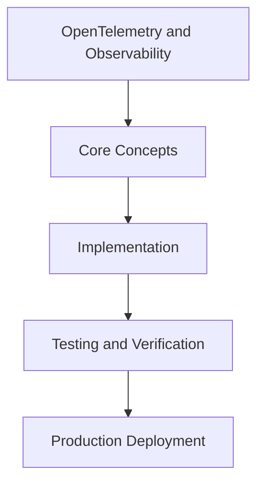

# Day 87 [Expert]: OpenTelemetry and Observability

## Index

- [Goal](#goal)
- [Prerequisites](#prerequisites)
- [Explanation](#explanation)
- [Topic by Topic](#topic-by-topic)
- [Key Concepts](#key-concepts)
- [Visual Concept Map](#visual-concept-map)
- [End-to-End Practical](#end-to-end-practical)
- [Hands-on Coding](#hands-on-coding)
- [Mini Exercise](#mini-exercise)
- [Assessment Quiz](#assessment-quiz)
- [Task](#task)
- [Self Check](#self-check)
- [Interview Questions and Answers](#interview-questions-and-answers)
- [Day 87 Outcome](#day-87-outcome)

## Goal

Understand and apply OpenTelemetry and Observability in a Next.js application to build production-quality features.

## Prerequisites

- Day 86 completed
- Solid understanding of Next.js App Router and TypeScript basics
- Familiarity with Server Components and data fetching patterns

## Explanation

OpenTelemetry gives a standard way to capture traces, metrics, and logs across Next.js services and dependencies. It turns distributed behavior into diagnosable evidence.

This lesson focuses on instrumentation strategy, correlation design, and using telemetry to improve reliability decisions.


## Topic by Topic

### Topic 1: Telemetry Signal Strategy

Theory:
This topic covers Telemetry Signal Strategy in production Next.js systems, with emphasis on explicit boundaries, tradeoff-aware design, and long-term maintainability.

Practical:
Apply Telemetry Signal Strategy in a realistic project workflow, validate edge cases, and document implementation decisions for team reuse.

Code Example:

```tsx
// OpenTelemetry and Observability — Topic 1
// Implementation depends on your specific use case.
// Refer to the Next.js documentation for detailed API reference.
export default function Example1() {
  return <div>OpenTelemetry and Observability — Example 1</div>;
}
```
**Explanation:**
Telemetry Signal Strategy helps convert framework capabilities into dependable production behavior that can be tested, observed, and evolved safely.

**Key Points:**
- Understand why Telemetry Signal Strategy matters at scale.
- Use clear contracts and defaults when implementing it.
- Validate outcomes through tests, metrics, and review gates.


### Topic 2: Instrumentation in Next.js Layers

Theory:
This topic covers Instrumentation in Next.js Layers in production Next.js systems, with emphasis on explicit boundaries, tradeoff-aware design, and long-term maintainability.

Practical:
Apply Instrumentation in Next.js Layers in a realistic project workflow, validate edge cases, and document implementation decisions for team reuse.

Code Example:

```tsx
// OpenTelemetry and Observability — Topic 2
// Implementation depends on your specific use case.
// Refer to the Next.js documentation for detailed API reference.
export default function Example2() {
  return <div>OpenTelemetry and Observability — Example 2</div>;
}
```
**Explanation:**
Instrumentation in Next.js Layers helps convert framework capabilities into dependable production behavior that can be tested, observed, and evolved safely.

**Key Points:**
- Understand why Instrumentation in Next.js Layers matters at scale.
- Use clear contracts and defaults when implementing it.
- Validate outcomes through tests, metrics, and review gates.


### Topic 3: Trace Context Propagation

Theory:
This topic covers Trace Context Propagation in production Next.js systems, with emphasis on explicit boundaries, tradeoff-aware design, and long-term maintainability.

Practical:
Apply Trace Context Propagation in a realistic project workflow, validate edge cases, and document implementation decisions for team reuse.

Code Example:

```tsx
// OpenTelemetry and Observability — Topic 3
// Implementation depends on your specific use case.
// Refer to the Next.js documentation for detailed API reference.
export default function Example3() {
  return <div>OpenTelemetry and Observability — Example 3</div>;
}
```
**Explanation:**
Trace Context Propagation helps convert framework capabilities into dependable production behavior that can be tested, observed, and evolved safely.

**Key Points:**
- Understand why Trace Context Propagation matters at scale.
- Use clear contracts and defaults when implementing it.
- Validate outcomes through tests, metrics, and review gates.


### Topic 4: Metrics and Error Correlation

Theory:
This topic covers Metrics and Error Correlation in production Next.js systems, with emphasis on explicit boundaries, tradeoff-aware design, and long-term maintainability.

Practical:
Apply Metrics and Error Correlation in a realistic project workflow, validate edge cases, and document implementation decisions for team reuse.

Code Example:

```tsx
// OpenTelemetry and Observability — Topic 4
// Implementation depends on your specific use case.
// Refer to the Next.js documentation for detailed API reference.
export default function Example4() {
  return <div>OpenTelemetry and Observability — Example 4</div>;
}
```
**Explanation:**
Metrics and Error Correlation helps convert framework capabilities into dependable production behavior that can be tested, observed, and evolved safely.

**Key Points:**
- Understand why Metrics and Error Correlation matters at scale.
- Use clear contracts and defaults when implementing it.
- Validate outcomes through tests, metrics, and review gates.


### Topic 5: Alerting and SLO Alignment

Theory:
This topic covers Alerting and SLO Alignment in production Next.js systems, with emphasis on explicit boundaries, tradeoff-aware design, and long-term maintainability.

Practical:
Apply Alerting and SLO Alignment in a realistic project workflow, validate edge cases, and document implementation decisions for team reuse.

Code Example:

```tsx
// OpenTelemetry and Observability — Topic 5
// Implementation depends on your specific use case.
// Refer to the Next.js documentation for detailed API reference.
export default function Example5() {
  return <div>OpenTelemetry and Observability — Example 5</div>;
}
```
**Explanation:**
Alerting and SLO Alignment helps convert framework capabilities into dependable production behavior that can be tested, observed, and evolved safely.

**Key Points:**
- Understand why Alerting and SLO Alignment matters at scale.
- Use clear contracts and defaults when implementing it.
- Validate outcomes through tests, metrics, and review gates.


### Topic 6: Using Observability for Architecture Feedback

Theory:
This topic covers Using Observability for Architecture Feedback in production Next.js systems, with emphasis on explicit boundaries, tradeoff-aware design, and long-term maintainability.

Practical:
Apply Using Observability for Architecture Feedback in a realistic project workflow, validate edge cases, and document implementation decisions for team reuse.

Code Example:

```tsx
// OpenTelemetry and Observability — Topic 6
// Implementation depends on your specific use case.
// Refer to the Next.js documentation for detailed API reference.
export default function Example6() {
  return <div>OpenTelemetry and Observability — Example 6</div>;
}
```
**Explanation:**
Using Observability for Architecture Feedback helps convert framework capabilities into dependable production behavior that can be tested, observed, and evolved safely.

**Key Points:**
- Understand why Using Observability for Architecture Feedback matters at scale.
- Use clear contracts and defaults when implementing it.
- Validate outcomes through tests, metrics, and review gates.


## Key Concepts

- OpenTelemetry and Observability: Core concept for expert Next.js development
- Next.js App Router: The modern routing system using the app/ directory
- Server Component: A component that runs on the server only
- TypeScript: Strongly typed JavaScript used throughout Next.js projects

## Visual Concept Map



## End-to-End Practical

1. Review the explanation and all topic examples.
2. Set up a clean Next.js project or use your existing one.
3. Implement each topic example step by step.
4. Verify the behavior in the browser.
5. Refactor and clean up your implementation.
6. Write a brief note on what you learned.

## Hands-on Coding

### Example 1: Basic OpenTelemetry and Observability Implementation

```tsx
// Basic implementation of OpenTelemetry and Observability
// Follow the topic examples above to build this out.
export default function Example() {
  return (
    <div style={{ padding: "24px" }}>
      <h1>OpenTelemetry and Observability</h1>
      <p>Implementation complete for Day 87.</p>
    </div>
  );
}
```

### Example 2: Practical Use Case

```tsx
// A real-world use case for OpenTelemetry and Observability
// Refer to the Topic by Topic section for code details.
export default function PracticalExample() {
  return (
    <div>
      <h2>Practical: OpenTelemetry and Observability</h2>
    </div>
  );
}
```

### Example 3: Combined Pattern

```tsx
// Combining OpenTelemetry and Observability with other Next.js features
// This example shows integration with the App Router.
export default function CombinedExample() {
  return (
    <section>
      <h2>OpenTelemetry and Observability — Combined Pattern</h2>
      <p>See topic sections above for detailed code.</p>
    </section>
  );
}
```

## Mini Exercise

Scenario:
You are adding OpenTelemetry and Observability to a Next.js application for a real-world feature.

Steps:

1. Create a new route or component relevant to this topic.
2. Implement the core pattern from the Topic by Topic section.
3. Test the implementation thoroughly.
4. Verify edge cases are handled.
5. Clean up and document your code.

Expected output:

- Working implementation of OpenTelemetry and Observability
- All edge cases handled correctly
- Clean, readable code following Next.js conventions

## Assessment Quiz

### Quiz Questions

1. What is the primary purpose of OpenTelemetry and Observability in Next.js?
2. Where in the project structure do you implement this pattern?
3. What is a common mistake when using OpenTelemetry and Observability?
4. True or False: OpenTelemetry and Observability only applies to Client Components.
5. How does OpenTelemetry and Observability improve the user or developer experience?

### Quiz Answers

1. To enable expert-level functionality in a Next.js application efficiently.
2. In the App Router directory structure, using Server Components by default.
3. Mixing server and client concerns incorrectly, or skipping error handling.
4. False. This concept applies broadly across the Next.js architecture.
5. It improves maintainability, performance, and scalability of the application.

## Task

- Study all topic examples in today's lesson
- Implement the core pattern in a Next.js project
- Test all scenarios including error and edge cases
- Complete the mini exercise
- Attempt the quiz before checking answers

## Self Check

- You can implement OpenTelemetry and Observability from scratch
- You understand when and why to use this pattern
- You can explain the concept in simple terms
- You have tested the implementation in a running app
- You can answer at least 4 out of 5 quiz questions correctly

## Interview Questions and Answers

### Beginner

**Question:** What is OpenTelemetry and Observability in Next.js?

**Answer:** OpenTelemetry and Observability is a expert-level Next.js feature that helps developers build robust, scalable applications by handling a specific aspect of the framework architecture.

**Question:** When would you use OpenTelemetry and Observability?

**Answer:** When you need to implement the specific functionality it provides in a production Next.js application, particularly in expert-stage projects.

### Middle

**Question:** How does OpenTelemetry and Observability interact with the Next.js App Router?

**Answer:** It integrates with the App Router through Server Components, Route Handlers, or middleware, depending on the specific implementation pattern required.

**Question:** What are common pitfalls with OpenTelemetry and Observability?

**Answer:** The most common pitfalls are improper handling of server/client boundaries, missing error states, and not considering caching behavior when relevant.

### Advanced

**Question:** How would you scale OpenTelemetry and Observability in a large Next.js application with multiple teams?

**Answer:** By establishing clear conventions, creating reusable utilities, documenting patterns in an Architecture Decision Record, and enforcing consistency through code review and linting rules.

**Question:** What performance considerations apply to OpenTelemetry and Observability?

**Answer:** Consider bundle size impact for client-side features, caching strategies for data fetching, and rendering mode selection to balance performance with data freshness.

## Day 87 Outcome

- You understand OpenTelemetry and Observability and its role in Next.js
- You can implement this pattern in a real project
- You know when to use and when to avoid this pattern
- You are ready for Day 87 — moving on to the next topic
