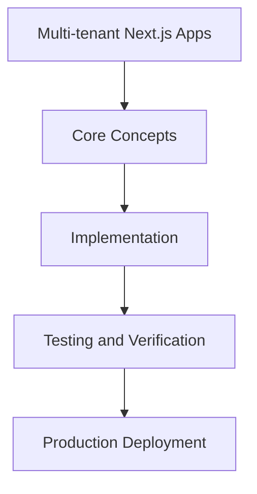

# Day 88 [Expert]: Multi-tenant Next.js Apps

## Index

- [Goal](#goal)
- [Prerequisites](#prerequisites)
- [Explanation](#explanation)
- [Topic by Topic](#topic-by-topic)
- [Key Concepts](#key-concepts)
- [Visual Concept Map](#visual-concept-map)
- [End-to-End Practical](#end-to-end-practical)
- [Hands-on Coding](#hands-on-coding)
- [Mini Exercise](#mini-exercise)
- [Assessment Quiz](#assessment-quiz)
- [Task](#task)
- [Self Check](#self-check)
- [Interview Questions and Answers](#interview-questions-and-answers)
- [Day 88 Outcome](#day-88-outcome)

## Goal

Understand and apply Multi-tenant Next.js Apps in a Next.js application to build production-quality features.

## Prerequisites

- Day 87 completed
- Solid understanding of Next.js App Router and TypeScript basics
- Familiarity with Server Components and data fetching patterns

## Explanation

Multi-tenant Next.js applications require strict isolation of data, configuration, and runtime behavior across tenants. Weak boundaries lead to security and reliability risks.

This lesson covers tenant-aware routing, caching, authorization, and operational governance for production-grade multi-tenant platforms.


## Topic by Topic

### Topic 1: Tenant Boundary Models

Theory:
This topic covers Tenant Boundary Models in production Next.js systems, with emphasis on explicit boundaries, tradeoff-aware design, and long-term maintainability.

Practical:
Apply Tenant Boundary Models in a realistic project workflow, validate edge cases, and document implementation decisions for team reuse.

Code Example:

```tsx
// Multi-tenant Next.js Apps — Topic 1
// Implementation depends on your specific use case.
// Refer to the Next.js documentation for detailed API reference.
export default function Example1() {
  return <div>Multi-tenant Next.js Apps — Example 1</div>;
}
```
**Explanation:**
Tenant Boundary Models helps convert framework capabilities into dependable production behavior that can be tested, observed, and evolved safely.

**Key Points:**
- Understand why Tenant Boundary Models matters at scale.
- Use clear contracts and defaults when implementing it.
- Validate outcomes through tests, metrics, and review gates.


### Topic 2: Tenant Context Resolution

Theory:
This topic covers Tenant Context Resolution in production Next.js systems, with emphasis on explicit boundaries, tradeoff-aware design, and long-term maintainability.

Practical:
Apply Tenant Context Resolution in a realistic project workflow, validate edge cases, and document implementation decisions for team reuse.

Code Example:

```tsx
// Multi-tenant Next.js Apps — Topic 2
// Implementation depends on your specific use case.
// Refer to the Next.js documentation for detailed API reference.
export default function Example2() {
  return <div>Multi-tenant Next.js Apps — Example 2</div>;
}
```
**Explanation:**
Tenant Context Resolution helps convert framework capabilities into dependable production behavior that can be tested, observed, and evolved safely.

**Key Points:**
- Understand why Tenant Context Resolution matters at scale.
- Use clear contracts and defaults when implementing it.
- Validate outcomes through tests, metrics, and review gates.


### Topic 3: Isolation in Data and Caching

Theory:
This topic covers Isolation in Data and Caching in production Next.js systems, with emphasis on explicit boundaries, tradeoff-aware design, and long-term maintainability.

Practical:
Apply Isolation in Data and Caching in a realistic project workflow, validate edge cases, and document implementation decisions for team reuse.

Code Example:

```tsx
// Multi-tenant Next.js Apps — Topic 3
// Implementation depends on your specific use case.
// Refer to the Next.js documentation for detailed API reference.
export default function Example3() {
  return <div>Multi-tenant Next.js Apps — Example 3</div>;
}
```
**Explanation:**
Isolation in Data and Caching helps convert framework capabilities into dependable production behavior that can be tested, observed, and evolved safely.

**Key Points:**
- Understand why Isolation in Data and Caching matters at scale.
- Use clear contracts and defaults when implementing it.
- Validate outcomes through tests, metrics, and review gates.


### Topic 4: Authorization and Policy Enforcement

Theory:
This topic covers Authorization and Policy Enforcement in production Next.js systems, with emphasis on explicit boundaries, tradeoff-aware design, and long-term maintainability.

Practical:
Apply Authorization and Policy Enforcement in a realistic project workflow, validate edge cases, and document implementation decisions for team reuse.

Code Example:

```tsx
// Multi-tenant Next.js Apps — Topic 4
// Implementation depends on your specific use case.
// Refer to the Next.js documentation for detailed API reference.
export default function Example4() {
  return <div>Multi-tenant Next.js Apps — Example 4</div>;
}
```
**Explanation:**
Authorization and Policy Enforcement helps convert framework capabilities into dependable production behavior that can be tested, observed, and evolved safely.

**Key Points:**
- Understand why Authorization and Policy Enforcement matters at scale.
- Use clear contracts and defaults when implementing it.
- Validate outcomes through tests, metrics, and review gates.


### Topic 5: Tenant-aware Operations and Monitoring

Theory:
This topic covers Tenant-aware Operations and Monitoring in production Next.js systems, with emphasis on explicit boundaries, tradeoff-aware design, and long-term maintainability.

Practical:
Apply Tenant-aware Operations and Monitoring in a realistic project workflow, validate edge cases, and document implementation decisions for team reuse.

Code Example:

```tsx
// Multi-tenant Next.js Apps — Topic 5
// Implementation depends on your specific use case.
// Refer to the Next.js documentation for detailed API reference.
export default function Example5() {
  return <div>Multi-tenant Next.js Apps — Example 5</div>;
}
```
**Explanation:**
Tenant-aware Operations and Monitoring helps convert framework capabilities into dependable production behavior that can be tested, observed, and evolved safely.

**Key Points:**
- Understand why Tenant-aware Operations and Monitoring matters at scale.
- Use clear contracts and defaults when implementing it.
- Validate outcomes through tests, metrics, and review gates.


### Topic 6: Migration and Lifecycle Management

Theory:
This topic covers Migration and Lifecycle Management in production Next.js systems, with emphasis on explicit boundaries, tradeoff-aware design, and long-term maintainability.

Practical:
Apply Migration and Lifecycle Management in a realistic project workflow, validate edge cases, and document implementation decisions for team reuse.

Code Example:

```tsx
// Multi-tenant Next.js Apps — Topic 6
// Implementation depends on your specific use case.
// Refer to the Next.js documentation for detailed API reference.
export default function Example6() {
  return <div>Multi-tenant Next.js Apps — Example 6</div>;
}
```
**Explanation:**
Migration and Lifecycle Management helps convert framework capabilities into dependable production behavior that can be tested, observed, and evolved safely.

**Key Points:**
- Understand why Migration and Lifecycle Management matters at scale.
- Use clear contracts and defaults when implementing it.
- Validate outcomes through tests, metrics, and review gates.


## Key Concepts

- Multi-tenant Next.js Apps: Core concept for expert Next.js development
- Next.js App Router: The modern routing system using the app/ directory
- Server Component: A component that runs on the server only
- TypeScript: Strongly typed JavaScript used throughout Next.js projects

## Visual Concept Map



## End-to-End Practical

1. Review the explanation and all topic examples.
2. Set up a clean Next.js project or use your existing one.
3. Implement each topic example step by step.
4. Verify the behavior in the browser.
5. Refactor and clean up your implementation.
6. Write a brief note on what you learned.

## Hands-on Coding

### Example 1: Basic Multi-tenant Next.js Apps Implementation

```tsx
// Basic implementation of Multi-tenant Next.js Apps
// Follow the topic examples above to build this out.
export default function Example() {
  return (
    <div style={{ padding: "24px" }}>
      <h1>Multi-tenant Next.js Apps</h1>
      <p>Implementation complete for Day 88.</p>
    </div>
  );
}
```

### Example 2: Practical Use Case

```tsx
// A real-world use case for Multi-tenant Next.js Apps
// Refer to the Topic by Topic section for code details.
export default function PracticalExample() {
  return (
    <div>
      <h2>Practical: Multi-tenant Next.js Apps</h2>
    </div>
  );
}
```

### Example 3: Combined Pattern

```tsx
// Combining Multi-tenant Next.js Apps with other Next.js features
// This example shows integration with the App Router.
export default function CombinedExample() {
  return (
    <section>
      <h2>Multi-tenant Next.js Apps — Combined Pattern</h2>
      <p>See topic sections above for detailed code.</p>
    </section>
  );
}
```

## Mini Exercise

Scenario:
You are adding Multi-tenant Next.js Apps to a Next.js application for a real-world feature.

Steps:

1. Create a new route or component relevant to this topic.
2. Implement the core pattern from the Topic by Topic section.
3. Test the implementation thoroughly.
4. Verify edge cases are handled.
5. Clean up and document your code.

Expected output:

- Working implementation of Multi-tenant Next.js Apps
- All edge cases handled correctly
- Clean, readable code following Next.js conventions

## Assessment Quiz

### Quiz Questions

1. What is the primary purpose of Multi-tenant Next.js Apps in Next.js?
2. Where in the project structure do you implement this pattern?
3. What is a common mistake when using Multi-tenant Next.js Apps?
4. True or False: Multi-tenant Next.js Apps only applies to Client Components.
5. How does Multi-tenant Next.js Apps improve the user or developer experience?

### Quiz Answers

1. To enable expert-level functionality in a Next.js application efficiently.
2. In the App Router directory structure, using Server Components by default.
3. Mixing server and client concerns incorrectly, or skipping error handling.
4. False. This concept applies broadly across the Next.js architecture.
5. It improves maintainability, performance, and scalability of the application.

## Task

- Study all topic examples in today's lesson
- Implement the core pattern in a Next.js project
- Test all scenarios including error and edge cases
- Complete the mini exercise
- Attempt the quiz before checking answers

## Self Check

- You can implement Multi-tenant Next.js Apps from scratch
- You understand when and why to use this pattern
- You can explain the concept in simple terms
- You have tested the implementation in a running app
- You can answer at least 4 out of 5 quiz questions correctly

## Interview Questions and Answers

### Beginner

**Question:** What is Multi-tenant Next.js Apps in Next.js?

**Answer:** Multi-tenant Next.js Apps is a expert-level Next.js feature that helps developers build robust, scalable applications by handling a specific aspect of the framework architecture.

**Question:** When would you use Multi-tenant Next.js Apps?

**Answer:** When you need to implement the specific functionality it provides in a production Next.js application, particularly in expert-stage projects.

### Middle

**Question:** How does Multi-tenant Next.js Apps interact with the Next.js App Router?

**Answer:** It integrates with the App Router through Server Components, Route Handlers, or middleware, depending on the specific implementation pattern required.

**Question:** What are common pitfalls with Multi-tenant Next.js Apps?

**Answer:** The most common pitfalls are improper handling of server/client boundaries, missing error states, and not considering caching behavior when relevant.

### Advanced

**Question:** How would you scale Multi-tenant Next.js Apps in a large Next.js application with multiple teams?

**Answer:** By establishing clear conventions, creating reusable utilities, documenting patterns in an Architecture Decision Record, and enforcing consistency through code review and linting rules.

**Question:** What performance considerations apply to Multi-tenant Next.js Apps?

**Answer:** Consider bundle size impact for client-side features, caching strategies for data fetching, and rendering mode selection to balance performance with data freshness.

## Day 88 Outcome

- You understand Multi-tenant Next.js Apps and its role in Next.js
- You can implement this pattern in a real project
- You know when to use and when to avoid this pattern
- You are ready for Day 88 — moving on to the next topic
