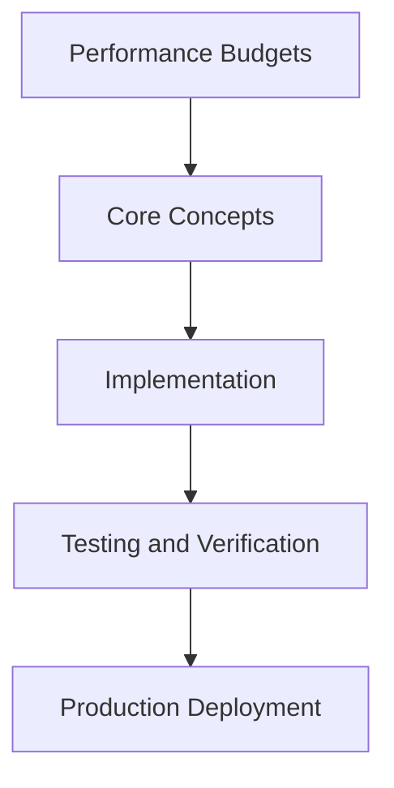

# Day 91 [Expert]: Performance Budgets

## Index

- [Goal](#goal)
- [Prerequisites](#prerequisites)
- [Explanation](#explanation)
- [Topic by Topic](#topic-by-topic)
- [Key Concepts](#key-concepts)
- [Visual Concept Map](#visual-concept-map)
- [End-to-End Practical](#end-to-end-practical)
- [Hands-on Coding](#hands-on-coding)
- [Mini Exercise](#mini-exercise)
- [Assessment Quiz](#assessment-quiz)
- [Task](#task)
- [Self Check](#self-check)
- [Interview Questions and Answers](#interview-questions-and-answers)
- [Day 91 Outcome](#day-91-outcome)

## Goal

Understand and apply Performance Budgets in a Next.js application to build production-quality features.

## Prerequisites

- Day 90 completed
- Solid understanding of Next.js App Router and TypeScript basics
- Familiarity with Server Components and data fetching patterns

## Explanation

Performance budgets convert speed goals into enforceable engineering constraints. In Next.js, budgets help teams prevent gradual regressions in bundle size, render latency, and Core Web Vitals.

This lesson focuses on defining realistic thresholds, enforcing them in CI, and iterating budgets as product requirements evolve.


## Topic by Topic

### Topic 1: Budget Scope and Metric Selection

Theory:
This topic covers Budget Scope and Metric Selection in production Next.js systems, emphasizing explicit boundaries, measurable outcomes, and maintainable implementation strategy.

Practical:
Apply Budget Scope and Metric Selection in a realistic team workflow, validate edge cases, and capture decisions so the approach is reusable across projects.

Code Example:

```tsx
// Performance Budgets — Topic 1
// Implementation depends on your specific use case.
// Refer to the Next.js documentation for detailed API reference.
export default function Example1() {
  return <div>Performance Budgets — Example 1</div>;
}
```
**Explanation:**
Budget Scope and Metric Selection helps transform framework knowledge into dependable production execution that can be tested, monitored, and continuously improved.

**Key Points:**
- Understand where Budget Scope and Metric Selection affects production outcomes.
- Use clear contracts and default-safe implementation choices.
- Validate impact through tests, metrics, and review feedback.


### Topic 2: Defining Thresholds by Route Type

Theory:
This topic covers Defining Thresholds by Route Type in production Next.js systems, emphasizing explicit boundaries, measurable outcomes, and maintainable implementation strategy.

Practical:
Apply Defining Thresholds by Route Type in a realistic team workflow, validate edge cases, and capture decisions so the approach is reusable across projects.

Code Example:

```tsx
// Performance Budgets — Topic 2
// Implementation depends on your specific use case.
// Refer to the Next.js documentation for detailed API reference.
export default function Example2() {
  return <div>Performance Budgets — Example 2</div>;
}
```
**Explanation:**
Defining Thresholds by Route Type helps transform framework knowledge into dependable production execution that can be tested, monitored, and continuously improved.

**Key Points:**
- Understand where Defining Thresholds by Route Type affects production outcomes.
- Use clear contracts and default-safe implementation choices.
- Validate impact through tests, metrics, and review feedback.


### Topic 3: CI Enforcement and Failing Rules

Theory:
This topic covers CI Enforcement and Failing Rules in production Next.js systems, emphasizing explicit boundaries, measurable outcomes, and maintainable implementation strategy.

Practical:
Apply CI Enforcement and Failing Rules in a realistic team workflow, validate edge cases, and capture decisions so the approach is reusable across projects.

Code Example:

```tsx
// Performance Budgets — Topic 3
// Implementation depends on your specific use case.
// Refer to the Next.js documentation for detailed API reference.
export default function Example3() {
  return <div>Performance Budgets — Example 3</div>;
}
```
**Explanation:**
CI Enforcement and Failing Rules helps transform framework knowledge into dependable production execution that can be tested, monitored, and continuously improved.

**Key Points:**
- Understand where CI Enforcement and Failing Rules affects production outcomes.
- Use clear contracts and default-safe implementation choices.
- Validate impact through tests, metrics, and review feedback.


### Topic 4: Diagnosing Budget Breaches

Theory:
This topic covers Diagnosing Budget Breaches in production Next.js systems, emphasizing explicit boundaries, measurable outcomes, and maintainable implementation strategy.

Practical:
Apply Diagnosing Budget Breaches in a realistic team workflow, validate edge cases, and capture decisions so the approach is reusable across projects.

Code Example:

```tsx
// Performance Budgets — Topic 4
// Implementation depends on your specific use case.
// Refer to the Next.js documentation for detailed API reference.
export default function Example4() {
  return <div>Performance Budgets — Example 4</div>;
}
```
**Explanation:**
Diagnosing Budget Breaches helps transform framework knowledge into dependable production execution that can be tested, monitored, and continuously improved.

**Key Points:**
- Understand where Diagnosing Budget Breaches affects production outcomes.
- Use clear contracts and default-safe implementation choices.
- Validate impact through tests, metrics, and review feedback.


### Topic 5: Exception Workflow and Governance

Theory:
This topic covers Exception Workflow and Governance in production Next.js systems, emphasizing explicit boundaries, measurable outcomes, and maintainable implementation strategy.

Practical:
Apply Exception Workflow and Governance in a realistic team workflow, validate edge cases, and capture decisions so the approach is reusable across projects.

Code Example:

```tsx
// Performance Budgets — Topic 5
// Implementation depends on your specific use case.
// Refer to the Next.js documentation for detailed API reference.
export default function Example5() {
  return <div>Performance Budgets — Example 5</div>;
}
```
**Explanation:**
Exception Workflow and Governance helps transform framework knowledge into dependable production execution that can be tested, monitored, and continuously improved.

**Key Points:**
- Understand where Exception Workflow and Governance affects production outcomes.
- Use clear contracts and default-safe implementation choices.
- Validate impact through tests, metrics, and review feedback.


### Topic 6: Continuous Budget Recalibration

Theory:
This topic covers Continuous Budget Recalibration in production Next.js systems, emphasizing explicit boundaries, measurable outcomes, and maintainable implementation strategy.

Practical:
Apply Continuous Budget Recalibration in a realistic team workflow, validate edge cases, and capture decisions so the approach is reusable across projects.

Code Example:

```tsx
// Performance Budgets — Topic 6
// Implementation depends on your specific use case.
// Refer to the Next.js documentation for detailed API reference.
export default function Example6() {
  return <div>Performance Budgets — Example 6</div>;
}
```
**Explanation:**
Continuous Budget Recalibration helps transform framework knowledge into dependable production execution that can be tested, monitored, and continuously improved.

**Key Points:**
- Understand where Continuous Budget Recalibration affects production outcomes.
- Use clear contracts and default-safe implementation choices.
- Validate impact through tests, metrics, and review feedback.


## Key Concepts

- Performance Budgets: Core concept for expert Next.js development
- Next.js App Router: The modern routing system using the app/ directory
- Server Component: A component that runs on the server only
- TypeScript: Strongly typed JavaScript used throughout Next.js projects

## Visual Concept Map



## End-to-End Practical

1. Review the explanation and all topic examples.
2. Set up a clean Next.js project or use your existing one.
3. Implement each topic example step by step.
4. Verify the behavior in the browser.
5. Refactor and clean up your implementation.
6. Write a brief note on what you learned.

## Hands-on Coding

### Example 1: Basic Performance Budgets Implementation

```tsx
// Basic implementation of Performance Budgets
// Follow the topic examples above to build this out.
export default function Example() {
  return (
    <div style={{ padding: "24px" }}>
      <h1>Performance Budgets</h1>
      <p>Implementation complete for Day 91.</p>
    </div>
  );
}
```

### Example 2: Practical Use Case

```tsx
// A real-world use case for Performance Budgets
// Refer to the Topic by Topic section for code details.
export default function PracticalExample() {
  return (
    <div>
      <h2>Practical: Performance Budgets</h2>
    </div>
  );
}
```

### Example 3: Combined Pattern

```tsx
// Combining Performance Budgets with other Next.js features
// This example shows integration with the App Router.
export default function CombinedExample() {
  return (
    <section>
      <h2>Performance Budgets — Combined Pattern</h2>
      <p>See topic sections above for detailed code.</p>
    </section>
  );
}
```

## Mini Exercise

Scenario:
You are adding Performance Budgets to a Next.js application for a real-world feature.

Steps:

1. Create a new route or component relevant to this topic.
2. Implement the core pattern from the Topic by Topic section.
3. Test the implementation thoroughly.
4. Verify edge cases are handled.
5. Clean up and document your code.

Expected output:

- Working implementation of Performance Budgets
- All edge cases handled correctly
- Clean, readable code following Next.js conventions

## Assessment Quiz

### Quiz Questions

1. What is the primary purpose of Performance Budgets in Next.js?
2. Where in the project structure do you implement this pattern?
3. What is a common mistake when using Performance Budgets?
4. True or False: Performance Budgets only applies to Client Components.
5. How does Performance Budgets improve the user or developer experience?

### Quiz Answers

1. To enable expert-level functionality in a Next.js application efficiently.
2. In the App Router directory structure, using Server Components by default.
3. Mixing server and client concerns incorrectly, or skipping error handling.
4. False. This concept applies broadly across the Next.js architecture.
5. It improves maintainability, performance, and scalability of the application.

## Task

- Study all topic examples in today's lesson
- Implement the core pattern in a Next.js project
- Test all scenarios including error and edge cases
- Complete the mini exercise
- Attempt the quiz before checking answers

## Self Check

- You can implement Performance Budgets from scratch
- You understand when and why to use this pattern
- You can explain the concept in simple terms
- You have tested the implementation in a running app
- You can answer at least 4 out of 5 quiz questions correctly

## Interview Questions and Answers

### Beginner

**Question:** What is Performance Budgets in Next.js?

**Answer:** Performance Budgets is a expert-level Next.js feature that helps developers build robust, scalable applications by handling a specific aspect of the framework architecture.

**Question:** When would you use Performance Budgets?

**Answer:** When you need to implement the specific functionality it provides in a production Next.js application, particularly in expert-stage projects.

### Middle

**Question:** How does Performance Budgets interact with the Next.js App Router?

**Answer:** It integrates with the App Router through Server Components, Route Handlers, or middleware, depending on the specific implementation pattern required.

**Question:** What are common pitfalls with Performance Budgets?

**Answer:** The most common pitfalls are improper handling of server/client boundaries, missing error states, and not considering caching behavior when relevant.

### Advanced

**Question:** How would you scale Performance Budgets in a large Next.js application with multiple teams?

**Answer:** By establishing clear conventions, creating reusable utilities, documenting patterns in an Architecture Decision Record, and enforcing consistency through code review and linting rules.

**Question:** What performance considerations apply to Performance Budgets?

**Answer:** Consider bundle size impact for client-side features, caching strategies for data fetching, and rendering mode selection to balance performance with data freshness.

## Day 91 Outcome

- You understand Performance Budgets and its role in Next.js
- You can implement this pattern in a real project
- You know when to use and when to avoid this pattern
- You are ready for Day 91 — moving on to the next topic
