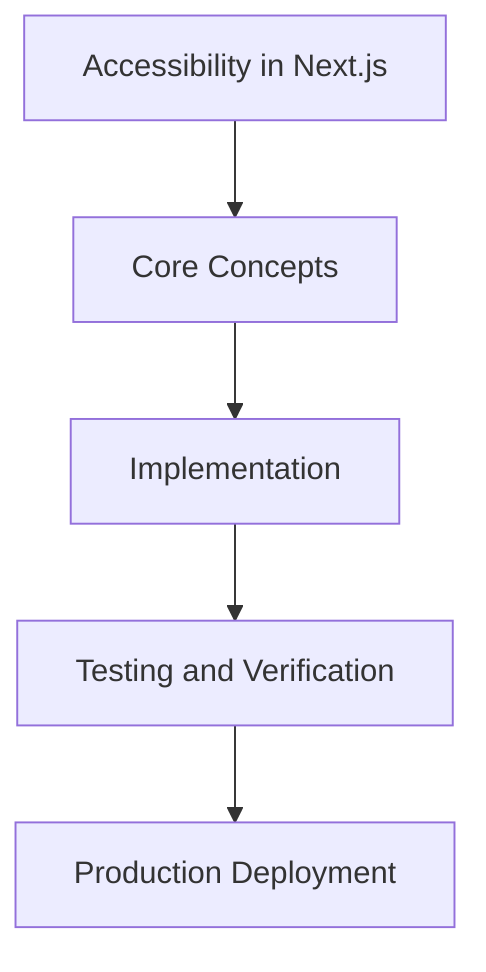

# Day 92 [Expert]: Accessibility in Next.js

## Index

- [Goal](#goal)
- [Prerequisites](#prerequisites)
- [Explanation](#explanation)
- [Topic by Topic](#topic-by-topic)
- [Key Concepts](#key-concepts)
- [Visual Concept Map](#visual-concept-map)
- [End-to-End Practical](#end-to-end-practical)
- [Hands-on Coding](#hands-on-coding)
- [Mini Exercise](#mini-exercise)
- [Assessment Quiz](#assessment-quiz)
- [Task](#task)
- [Self Check](#self-check)
- [Interview Questions and Answers](#interview-questions-and-answers)
- [Day 92 Outcome](#day-92-outcome)

## Goal

Understand and apply Accessibility in Next.js in a Next.js application to build production-quality features.

## Prerequisites

- Day 91 completed
- Solid understanding of Next.js App Router and TypeScript basics
- Familiarity with Server Components and data fetching patterns

## Explanation

Accessibility in Next.js should be treated as a product quality requirement, not a final checklist. Good accessibility improves usability, compliance, and long-term maintainability.

This lesson covers architecture-level accessibility decisions, testing workflows, and team practices that keep inclusive design consistent at scale.


## Topic by Topic

### Topic 1: Accessibility Requirements as Architecture Inputs

Theory:
This topic covers Accessibility Requirements as Architecture Inputs in production Next.js systems, emphasizing explicit boundaries, measurable outcomes, and maintainable implementation strategy.

Practical:
Apply Accessibility Requirements as Architecture Inputs in a realistic team workflow, validate edge cases, and capture decisions so the approach is reusable across projects.

Code Example:

```tsx
// Accessibility in Next.js — Topic 1
// Implementation depends on your specific use case.
// Refer to the Next.js documentation for detailed API reference.
export default function Example1() {
  return <div>Accessibility in Next.js — Example 1</div>;
}
```
**Explanation:**
Accessibility Requirements as Architecture Inputs helps transform framework knowledge into dependable production execution that can be tested, monitored, and continuously improved.

**Key Points:**
- Understand where Accessibility Requirements as Architecture Inputs affects production outcomes.
- Use clear contracts and default-safe implementation choices.
- Validate impact through tests, metrics, and review feedback.


### Topic 2: Semantic Structure and Navigation

Theory:
This topic covers Semantic Structure and Navigation in production Next.js systems, emphasizing explicit boundaries, measurable outcomes, and maintainable implementation strategy.

Practical:
Apply Semantic Structure and Navigation in a realistic team workflow, validate edge cases, and capture decisions so the approach is reusable across projects.

Code Example:

```tsx
// Accessibility in Next.js — Topic 2
// Implementation depends on your specific use case.
// Refer to the Next.js documentation for detailed API reference.
export default function Example2() {
  return <div>Accessibility in Next.js — Example 2</div>;
}
```
**Explanation:**
Semantic Structure and Navigation helps transform framework knowledge into dependable production execution that can be tested, monitored, and continuously improved.

**Key Points:**
- Understand where Semantic Structure and Navigation affects production outcomes.
- Use clear contracts and default-safe implementation choices.
- Validate impact through tests, metrics, and review feedback.


### Topic 3: Form and Error Accessibility Patterns

Theory:
This topic covers Form and Error Accessibility Patterns in production Next.js systems, emphasizing explicit boundaries, measurable outcomes, and maintainable implementation strategy.

Practical:
Apply Form and Error Accessibility Patterns in a realistic team workflow, validate edge cases, and capture decisions so the approach is reusable across projects.

Code Example:

```tsx
// Accessibility in Next.js — Topic 3
// Implementation depends on your specific use case.
// Refer to the Next.js documentation for detailed API reference.
export default function Example3() {
  return <div>Accessibility in Next.js — Example 3</div>;
}
```
**Explanation:**
Form and Error Accessibility Patterns helps transform framework knowledge into dependable production execution that can be tested, monitored, and continuously improved.

**Key Points:**
- Understand where Form and Error Accessibility Patterns affects production outcomes.
- Use clear contracts and default-safe implementation choices.
- Validate impact through tests, metrics, and review feedback.


### Topic 4: Keyboard and Focus Management

Theory:
This topic covers Keyboard and Focus Management in production Next.js systems, emphasizing explicit boundaries, measurable outcomes, and maintainable implementation strategy.

Practical:
Apply Keyboard and Focus Management in a realistic team workflow, validate edge cases, and capture decisions so the approach is reusable across projects.

Code Example:

```tsx
// Accessibility in Next.js — Topic 4
// Implementation depends on your specific use case.
// Refer to the Next.js documentation for detailed API reference.
export default function Example4() {
  return <div>Accessibility in Next.js — Example 4</div>;
}
```
**Explanation:**
Keyboard and Focus Management helps transform framework knowledge into dependable production execution that can be tested, monitored, and continuously improved.

**Key Points:**
- Understand where Keyboard and Focus Management affects production outcomes.
- Use clear contracts and default-safe implementation choices.
- Validate impact through tests, metrics, and review feedback.


### Topic 5: Automated and Manual Testing Strategy

Theory:
This topic covers Automated and Manual Testing Strategy in production Next.js systems, emphasizing explicit boundaries, measurable outcomes, and maintainable implementation strategy.

Practical:
Apply Automated and Manual Testing Strategy in a realistic team workflow, validate edge cases, and capture decisions so the approach is reusable across projects.

Code Example:

```tsx
// Accessibility in Next.js — Topic 5
// Implementation depends on your specific use case.
// Refer to the Next.js documentation for detailed API reference.
export default function Example5() {
  return <div>Accessibility in Next.js — Example 5</div>;
}
```
**Explanation:**
Automated and Manual Testing Strategy helps transform framework knowledge into dependable production execution that can be tested, monitored, and continuously improved.

**Key Points:**
- Understand where Automated and Manual Testing Strategy affects production outcomes.
- Use clear contracts and default-safe implementation choices.
- Validate impact through tests, metrics, and review feedback.


### Topic 6: Accessibility Governance in Delivery

Theory:
This topic covers Accessibility Governance in Delivery in production Next.js systems, emphasizing explicit boundaries, measurable outcomes, and maintainable implementation strategy.

Practical:
Apply Accessibility Governance in Delivery in a realistic team workflow, validate edge cases, and capture decisions so the approach is reusable across projects.

Code Example:

```tsx
// Accessibility in Next.js — Topic 6
// Implementation depends on your specific use case.
// Refer to the Next.js documentation for detailed API reference.
export default function Example6() {
  return <div>Accessibility in Next.js — Example 6</div>;
}
```
**Explanation:**
Accessibility Governance in Delivery helps transform framework knowledge into dependable production execution that can be tested, monitored, and continuously improved.

**Key Points:**
- Understand where Accessibility Governance in Delivery affects production outcomes.
- Use clear contracts and default-safe implementation choices.
- Validate impact through tests, metrics, and review feedback.


## Key Concepts

- Accessibility in Next.js: Core concept for expert Next.js development
- Next.js App Router: The modern routing system using the app/ directory
- Server Component: A component that runs on the server only
- TypeScript: Strongly typed JavaScript used throughout Next.js projects

## Visual Concept Map



## End-to-End Practical

1. Review the explanation and all topic examples.
2. Set up a clean Next.js project or use your existing one.
3. Implement each topic example step by step.
4. Verify the behavior in the browser.
5. Refactor and clean up your implementation.
6. Write a brief note on what you learned.

## Hands-on Coding

### Example 1: Basic Accessibility in Next.js Implementation

```tsx
// Basic implementation of Accessibility in Next.js
// Follow the topic examples above to build this out.
export default function Example() {
  return (
    <div style={{ padding: "24px" }}>
      <h1>Accessibility in Next.js</h1>
      <p>Implementation complete for Day 92.</p>
    </div>
  );
}
```

### Example 2: Practical Use Case

```tsx
// A real-world use case for Accessibility in Next.js
// Refer to the Topic by Topic section for code details.
export default function PracticalExample() {
  return (
    <div>
      <h2>Practical: Accessibility in Next.js</h2>
    </div>
  );
}
```

### Example 3: Combined Pattern

```tsx
// Combining Accessibility in Next.js with other Next.js features
// This example shows integration with the App Router.
export default function CombinedExample() {
  return (
    <section>
      <h2>Accessibility in Next.js — Combined Pattern</h2>
      <p>See topic sections above for detailed code.</p>
    </section>
  );
}
```

## Mini Exercise

Scenario:
You are adding Accessibility in Next.js to a Next.js application for a real-world feature.

Steps:

1. Create a new route or component relevant to this topic.
2. Implement the core pattern from the Topic by Topic section.
3. Test the implementation thoroughly.
4. Verify edge cases are handled.
5. Clean up and document your code.

Expected output:

- Working implementation of Accessibility in Next.js
- All edge cases handled correctly
- Clean, readable code following Next.js conventions

## Assessment Quiz

### Quiz Questions

1. What is the primary purpose of Accessibility in Next.js in Next.js?
2. Where in the project structure do you implement this pattern?
3. What is a common mistake when using Accessibility in Next.js?
4. True or False: Accessibility in Next.js only applies to Client Components.
5. How does Accessibility in Next.js improve the user or developer experience?

### Quiz Answers

1. To enable expert-level functionality in a Next.js application efficiently.
2. In the App Router directory structure, using Server Components by default.
3. Mixing server and client concerns incorrectly, or skipping error handling.
4. False. This concept applies broadly across the Next.js architecture.
5. It improves maintainability, performance, and scalability of the application.

## Task

- Study all topic examples in today's lesson
- Implement the core pattern in a Next.js project
- Test all scenarios including error and edge cases
- Complete the mini exercise
- Attempt the quiz before checking answers

## Self Check

- You can implement Accessibility in Next.js from scratch
- You understand when and why to use this pattern
- You can explain the concept in simple terms
- You have tested the implementation in a running app
- You can answer at least 4 out of 5 quiz questions correctly

## Interview Questions and Answers

### Beginner

**Question:** What is Accessibility in Next.js in Next.js?

**Answer:** Accessibility in Next.js is a expert-level Next.js feature that helps developers build robust, scalable applications by handling a specific aspect of the framework architecture.

**Question:** When would you use Accessibility in Next.js?

**Answer:** When you need to implement the specific functionality it provides in a production Next.js application, particularly in expert-stage projects.

### Middle

**Question:** How does Accessibility in Next.js interact with the Next.js App Router?

**Answer:** It integrates with the App Router through Server Components, Route Handlers, or middleware, depending on the specific implementation pattern required.

**Question:** What are common pitfalls with Accessibility in Next.js?

**Answer:** The most common pitfalls are improper handling of server/client boundaries, missing error states, and not considering caching behavior when relevant.

### Advanced

**Question:** How would you scale Accessibility in Next.js in a large Next.js application with multiple teams?

**Answer:** By establishing clear conventions, creating reusable utilities, documenting patterns in an Architecture Decision Record, and enforcing consistency through code review and linting rules.

**Question:** What performance considerations apply to Accessibility in Next.js?

**Answer:** Consider bundle size impact for client-side features, caching strategies for data fetching, and rendering mode selection to balance performance with data freshness.

## Day 92 Outcome

- You understand Accessibility in Next.js and its role in Next.js
- You can implement this pattern in a real project
- You know when to use and when to avoid this pattern
- You are ready for Day 92 — moving on to the next topic
