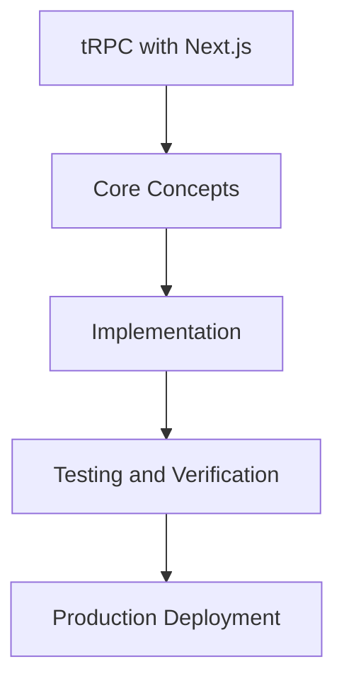

# Day 93 [Expert]: tRPC with Next.js

## Index

- [Goal](#goal)
- [Prerequisites](#prerequisites)
- [Explanation](#explanation)
- [Topic by Topic](#topic-by-topic)
- [Key Concepts](#key-concepts)
- [Visual Concept Map](#visual-concept-map)
- [End-to-End Practical](#end-to-end-practical)
- [Hands-on Coding](#hands-on-coding)
- [Mini Exercise](#mini-exercise)
- [Assessment Quiz](#assessment-quiz)
- [Task](#task)
- [Self Check](#self-check)
- [Interview Questions and Answers](#interview-questions-and-answers)
- [Day 93 Outcome](#day-93-outcome)

## Goal

Understand and apply tRPC with Next.js in a Next.js application to build production-quality features.

## Prerequisites

- Day 92 completed
- Solid understanding of Next.js App Router and TypeScript basics
- Familiarity with Server Components and data fetching patterns

## Explanation

tRPC with Next.js enables end-to-end type safety across client and server boundaries, reducing contract mismatch bugs and improving refactor confidence.

This lesson focuses on practical tRPC architecture choices, boundary design, and operational practices for production systems.


## Topic by Topic

### Topic 1: tRPC Architecture and Boundary Design

Theory:
This topic covers tRPC Architecture and Boundary Design in production Next.js systems, emphasizing explicit boundaries, measurable outcomes, and maintainable implementation strategy.

Practical:
Apply tRPC Architecture and Boundary Design in a realistic team workflow, validate edge cases, and capture decisions so the approach is reusable across projects.

Code Example:

```tsx
// tRPC with Next.js — Topic 1
// Implementation depends on your specific use case.
// Refer to the Next.js documentation for detailed API reference.
export default function Example1() {
  return <div>tRPC with Next.js — Example 1</div>;
}
```
**Explanation:**
tRPC Architecture and Boundary Design helps transform framework knowledge into dependable production execution that can be tested, monitored, and continuously improved.

**Key Points:**
- Understand where tRPC Architecture and Boundary Design affects production outcomes.
- Use clear contracts and default-safe implementation choices.
- Validate impact through tests, metrics, and review feedback.


### Topic 2: Router Organization and Domain Modules

Theory:
This topic covers Router Organization and Domain Modules in production Next.js systems, emphasizing explicit boundaries, measurable outcomes, and maintainable implementation strategy.

Practical:
Apply Router Organization and Domain Modules in a realistic team workflow, validate edge cases, and capture decisions so the approach is reusable across projects.

Code Example:

```tsx
// tRPC with Next.js — Topic 2
// Implementation depends on your specific use case.
// Refer to the Next.js documentation for detailed API reference.
export default function Example2() {
  return <div>tRPC with Next.js — Example 2</div>;
}
```
**Explanation:**
Router Organization and Domain Modules helps transform framework knowledge into dependable production execution that can be tested, monitored, and continuously improved.

**Key Points:**
- Understand where Router Organization and Domain Modules affects production outcomes.
- Use clear contracts and default-safe implementation choices.
- Validate impact through tests, metrics, and review feedback.


### Topic 3: Input Validation and Error Modeling

Theory:
This topic covers Input Validation and Error Modeling in production Next.js systems, emphasizing explicit boundaries, measurable outcomes, and maintainable implementation strategy.

Practical:
Apply Input Validation and Error Modeling in a realistic team workflow, validate edge cases, and capture decisions so the approach is reusable across projects.

Code Example:

```tsx
// tRPC with Next.js — Topic 3
// Implementation depends on your specific use case.
// Refer to the Next.js documentation for detailed API reference.
export default function Example3() {
  return <div>tRPC with Next.js — Example 3</div>;
}
```
**Explanation:**
Input Validation and Error Modeling helps transform framework knowledge into dependable production execution that can be tested, monitored, and continuously improved.

**Key Points:**
- Understand where Input Validation and Error Modeling affects production outcomes.
- Use clear contracts and default-safe implementation choices.
- Validate impact through tests, metrics, and review feedback.


### Topic 4: Caching and Client Data Synchronization

Theory:
This topic covers Caching and Client Data Synchronization in production Next.js systems, emphasizing explicit boundaries, measurable outcomes, and maintainable implementation strategy.

Practical:
Apply Caching and Client Data Synchronization in a realistic team workflow, validate edge cases, and capture decisions so the approach is reusable across projects.

Code Example:

```tsx
// tRPC with Next.js — Topic 4
// Implementation depends on your specific use case.
// Refer to the Next.js documentation for detailed API reference.
export default function Example4() {
  return <div>tRPC with Next.js — Example 4</div>;
}
```
**Explanation:**
Caching and Client Data Synchronization helps transform framework knowledge into dependable production execution that can be tested, monitored, and continuously improved.

**Key Points:**
- Understand where Caching and Client Data Synchronization affects production outcomes.
- Use clear contracts and default-safe implementation choices.
- Validate impact through tests, metrics, and review feedback.


### Topic 5: Auth Context and Procedure Safety

Theory:
This topic covers Auth Context and Procedure Safety in production Next.js systems, emphasizing explicit boundaries, measurable outcomes, and maintainable implementation strategy.

Practical:
Apply Auth Context and Procedure Safety in a realistic team workflow, validate edge cases, and capture decisions so the approach is reusable across projects.

Code Example:

```tsx
// tRPC with Next.js — Topic 5
// Implementation depends on your specific use case.
// Refer to the Next.js documentation for detailed API reference.
export default function Example5() {
  return <div>tRPC with Next.js — Example 5</div>;
}
```
**Explanation:**
Auth Context and Procedure Safety helps transform framework knowledge into dependable production execution that can be tested, monitored, and continuously improved.

**Key Points:**
- Understand where Auth Context and Procedure Safety affects production outcomes.
- Use clear contracts and default-safe implementation choices.
- Validate impact through tests, metrics, and review feedback.


### Topic 6: Testing and Evolution of API Contracts

Theory:
This topic covers Testing and Evolution of API Contracts in production Next.js systems, emphasizing explicit boundaries, measurable outcomes, and maintainable implementation strategy.

Practical:
Apply Testing and Evolution of API Contracts in a realistic team workflow, validate edge cases, and capture decisions so the approach is reusable across projects.

Code Example:

```tsx
// tRPC with Next.js — Topic 6
// Implementation depends on your specific use case.
// Refer to the Next.js documentation for detailed API reference.
export default function Example6() {
  return <div>tRPC with Next.js — Example 6</div>;
}
```
**Explanation:**
Testing and Evolution of API Contracts helps transform framework knowledge into dependable production execution that can be tested, monitored, and continuously improved.

**Key Points:**
- Understand where Testing and Evolution of API Contracts affects production outcomes.
- Use clear contracts and default-safe implementation choices.
- Validate impact through tests, metrics, and review feedback.


## Key Concepts

- tRPC with Next.js: Core concept for expert Next.js development
- Next.js App Router: The modern routing system using the app/ directory
- Server Component: A component that runs on the server only
- TypeScript: Strongly typed JavaScript used throughout Next.js projects

## Visual Concept Map



## End-to-End Practical

1. Review the explanation and all topic examples.
2. Set up a clean Next.js project or use your existing one.
3. Implement each topic example step by step.
4. Verify the behavior in the browser.
5. Refactor and clean up your implementation.
6. Write a brief note on what you learned.

## Hands-on Coding

### Example 1: Basic tRPC with Next.js Implementation

```tsx
// Basic implementation of tRPC with Next.js
// Follow the topic examples above to build this out.
export default function Example() {
  return (
    <div style={{ padding: "24px" }}>
      <h1>tRPC with Next.js</h1>
      <p>Implementation complete for Day 93.</p>
    </div>
  );
}
```

### Example 2: Practical Use Case

```tsx
// A real-world use case for tRPC with Next.js
// Refer to the Topic by Topic section for code details.
export default function PracticalExample() {
  return (
    <div>
      <h2>Practical: tRPC with Next.js</h2>
    </div>
  );
}
```

### Example 3: Combined Pattern

```tsx
// Combining tRPC with Next.js with other Next.js features
// This example shows integration with the App Router.
export default function CombinedExample() {
  return (
    <section>
      <h2>tRPC with Next.js — Combined Pattern</h2>
      <p>See topic sections above for detailed code.</p>
    </section>
  );
}
```

## Mini Exercise

Scenario:
You are adding tRPC with Next.js to a Next.js application for a real-world feature.

Steps:

1. Create a new route or component relevant to this topic.
2. Implement the core pattern from the Topic by Topic section.
3. Test the implementation thoroughly.
4. Verify edge cases are handled.
5. Clean up and document your code.

Expected output:

- Working implementation of tRPC with Next.js
- All edge cases handled correctly
- Clean, readable code following Next.js conventions

## Assessment Quiz

### Quiz Questions

1. What is the primary purpose of tRPC with Next.js in Next.js?
2. Where in the project structure do you implement this pattern?
3. What is a common mistake when using tRPC with Next.js?
4. True or False: tRPC with Next.js only applies to Client Components.
5. How does tRPC with Next.js improve the user or developer experience?

### Quiz Answers

1. To enable expert-level functionality in a Next.js application efficiently.
2. In the App Router directory structure, using Server Components by default.
3. Mixing server and client concerns incorrectly, or skipping error handling.
4. False. This concept applies broadly across the Next.js architecture.
5. It improves maintainability, performance, and scalability of the application.

## Task

- Study all topic examples in today's lesson
- Implement the core pattern in a Next.js project
- Test all scenarios including error and edge cases
- Complete the mini exercise
- Attempt the quiz before checking answers

## Self Check

- You can implement tRPC with Next.js from scratch
- You understand when and why to use this pattern
- You can explain the concept in simple terms
- You have tested the implementation in a running app
- You can answer at least 4 out of 5 quiz questions correctly

## Interview Questions and Answers

### Beginner

**Question:** What is tRPC with Next.js in Next.js?

**Answer:** tRPC with Next.js is a expert-level Next.js feature that helps developers build robust, scalable applications by handling a specific aspect of the framework architecture.

**Question:** When would you use tRPC with Next.js?

**Answer:** When you need to implement the specific functionality it provides in a production Next.js application, particularly in expert-stage projects.

### Middle

**Question:** How does tRPC with Next.js interact with the Next.js App Router?

**Answer:** It integrates with the App Router through Server Components, Route Handlers, or middleware, depending on the specific implementation pattern required.

**Question:** What are common pitfalls with tRPC with Next.js?

**Answer:** The most common pitfalls are improper handling of server/client boundaries, missing error states, and not considering caching behavior when relevant.

### Advanced

**Question:** How would you scale tRPC with Next.js in a large Next.js application with multiple teams?

**Answer:** By establishing clear conventions, creating reusable utilities, documenting patterns in an Architecture Decision Record, and enforcing consistency through code review and linting rules.

**Question:** What performance considerations apply to tRPC with Next.js?

**Answer:** Consider bundle size impact for client-side features, caching strategies for data fetching, and rendering mode selection to balance performance with data freshness.

## Day 93 Outcome

- You understand tRPC with Next.js and its role in Next.js
- You can implement this pattern in a real project
- You know when to use and when to avoid this pattern
- You are ready for Day 93 — moving on to the next topic
