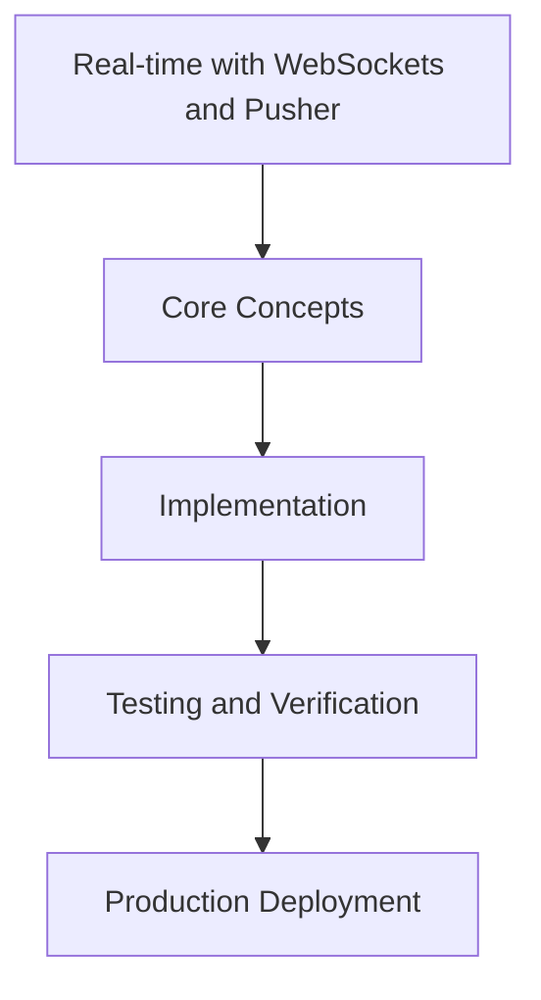

# Day 94 [Expert]: Real-time with WebSockets and Pusher

## Index

- [Goal](#goal)
- [Prerequisites](#prerequisites)
- [Explanation](#explanation)
- [Topic by Topic](#topic-by-topic)
- [Key Concepts](#key-concepts)
- [Visual Concept Map](#visual-concept-map)
- [End-to-End Practical](#end-to-end-practical)
- [Hands-on Coding](#hands-on-coding)
- [Mini Exercise](#mini-exercise)
- [Assessment Quiz](#assessment-quiz)
- [Task](#task)
- [Self Check](#self-check)
- [Interview Questions and Answers](#interview-questions-and-answers)
- [Day 94 Outcome](#day-94-outcome)

## Goal

Understand and apply Real-time with WebSockets and Pusher in a Next.js application to build production-quality features.

## Prerequisites

- Day 93 completed
- Solid understanding of Next.js App Router and TypeScript basics
- Familiarity with Server Components and data fetching patterns

## Explanation

Real-time features in Next.js require reliable event delivery, clear state synchronization, and resilient failure handling. Technology choice is only one part of the architecture.

This lesson covers WebSocket/Pusher integration patterns that keep collaboration features responsive and operable under production load.


## Topic by Topic

### Topic 1: Real-time Architecture Patterns

Theory:
This topic covers Real-time Architecture Patterns in production Next.js systems, emphasizing explicit boundaries, measurable outcomes, and maintainable implementation strategy.

Practical:
Apply Real-time Architecture Patterns in a realistic team workflow, validate edge cases, and capture decisions so the approach is reusable across projects.

Code Example:

```tsx
// Real-time with WebSockets and Pusher — Topic 1
// Implementation depends on your specific use case.
// Refer to the Next.js documentation for detailed API reference.
export default function Example1() {
  return <div>Real-time with WebSockets and Pusher — Example 1</div>;
}
```
**Explanation:**
Real-time Architecture Patterns helps transform framework knowledge into dependable production execution that can be tested, monitored, and continuously improved.

**Key Points:**
- Understand where Real-time Architecture Patterns affects production outcomes.
- Use clear contracts and default-safe implementation choices.
- Validate impact through tests, metrics, and review feedback.


### Topic 2: Connection Lifecycle and Presence

Theory:
This topic covers Connection Lifecycle and Presence in production Next.js systems, emphasizing explicit boundaries, measurable outcomes, and maintainable implementation strategy.

Practical:
Apply Connection Lifecycle and Presence in a realistic team workflow, validate edge cases, and capture decisions so the approach is reusable across projects.

Code Example:

```tsx
// Real-time with WebSockets and Pusher — Topic 2
// Implementation depends on your specific use case.
// Refer to the Next.js documentation for detailed API reference.
export default function Example2() {
  return <div>Real-time with WebSockets and Pusher — Example 2</div>;
}
```
**Explanation:**
Connection Lifecycle and Presence helps transform framework knowledge into dependable production execution that can be tested, monitored, and continuously improved.

**Key Points:**
- Understand where Connection Lifecycle and Presence affects production outcomes.
- Use clear contracts and default-safe implementation choices.
- Validate impact through tests, metrics, and review feedback.


### Topic 3: Event Schema and Ordering Guarantees

Theory:
This topic covers Event Schema and Ordering Guarantees in production Next.js systems, emphasizing explicit boundaries, measurable outcomes, and maintainable implementation strategy.

Practical:
Apply Event Schema and Ordering Guarantees in a realistic team workflow, validate edge cases, and capture decisions so the approach is reusable across projects.

Code Example:

```tsx
// Real-time with WebSockets and Pusher — Topic 3
// Implementation depends on your specific use case.
// Refer to the Next.js documentation for detailed API reference.
export default function Example3() {
  return <div>Real-time with WebSockets and Pusher — Example 3</div>;
}
```
**Explanation:**
Event Schema and Ordering Guarantees helps transform framework knowledge into dependable production execution that can be tested, monitored, and continuously improved.

**Key Points:**
- Understand where Event Schema and Ordering Guarantees affects production outcomes.
- Use clear contracts and default-safe implementation choices.
- Validate impact through tests, metrics, and review feedback.


### Topic 4: State Sync and Conflict Handling

Theory:
This topic covers State Sync and Conflict Handling in production Next.js systems, emphasizing explicit boundaries, measurable outcomes, and maintainable implementation strategy.

Practical:
Apply State Sync and Conflict Handling in a realistic team workflow, validate edge cases, and capture decisions so the approach is reusable across projects.

Code Example:

```tsx
// Real-time with WebSockets and Pusher — Topic 4
// Implementation depends on your specific use case.
// Refer to the Next.js documentation for detailed API reference.
export default function Example4() {
  return <div>Real-time with WebSockets and Pusher — Example 4</div>;
}
```
**Explanation:**
State Sync and Conflict Handling helps transform framework knowledge into dependable production execution that can be tested, monitored, and continuously improved.

**Key Points:**
- Understand where State Sync and Conflict Handling affects production outcomes.
- Use clear contracts and default-safe implementation choices.
- Validate impact through tests, metrics, and review feedback.


### Topic 5: Scalability and Backpressure Controls

Theory:
This topic covers Scalability and Backpressure Controls in production Next.js systems, emphasizing explicit boundaries, measurable outcomes, and maintainable implementation strategy.

Practical:
Apply Scalability and Backpressure Controls in a realistic team workflow, validate edge cases, and capture decisions so the approach is reusable across projects.

Code Example:

```tsx
// Real-time with WebSockets and Pusher — Topic 5
// Implementation depends on your specific use case.
// Refer to the Next.js documentation for detailed API reference.
export default function Example5() {
  return <div>Real-time with WebSockets and Pusher — Example 5</div>;
}
```
**Explanation:**
Scalability and Backpressure Controls helps transform framework knowledge into dependable production execution that can be tested, monitored, and continuously improved.

**Key Points:**
- Understand where Scalability and Backpressure Controls affects production outcomes.
- Use clear contracts and default-safe implementation choices.
- Validate impact through tests, metrics, and review feedback.


### Topic 6: Observability for Real-time Systems

Theory:
This topic covers Observability for Real-time Systems in production Next.js systems, emphasizing explicit boundaries, measurable outcomes, and maintainable implementation strategy.

Practical:
Apply Observability for Real-time Systems in a realistic team workflow, validate edge cases, and capture decisions so the approach is reusable across projects.

Code Example:

```tsx
// Real-time with WebSockets and Pusher — Topic 6
// Implementation depends on your specific use case.
// Refer to the Next.js documentation for detailed API reference.
export default function Example6() {
  return <div>Real-time with WebSockets and Pusher — Example 6</div>;
}
```
**Explanation:**
Observability for Real-time Systems helps transform framework knowledge into dependable production execution that can be tested, monitored, and continuously improved.

**Key Points:**
- Understand where Observability for Real-time Systems affects production outcomes.
- Use clear contracts and default-safe implementation choices.
- Validate impact through tests, metrics, and review feedback.


## Key Concepts

- Real-time with WebSockets and Pusher: Core concept for expert Next.js development
- Next.js App Router: The modern routing system using the app/ directory
- Server Component: A component that runs on the server only
- TypeScript: Strongly typed JavaScript used throughout Next.js projects

## Visual Concept Map



## End-to-End Practical

1. Review the explanation and all topic examples.
2. Set up a clean Next.js project or use your existing one.
3. Implement each topic example step by step.
4. Verify the behavior in the browser.
5. Refactor and clean up your implementation.
6. Write a brief note on what you learned.

## Hands-on Coding

### Example 1: Basic Real-time with WebSockets and Pusher Implementation

```tsx
// Basic implementation of Real-time with WebSockets and Pusher
// Follow the topic examples above to build this out.
export default function Example() {
  return (
    <div style={{ padding: "24px" }}>
      <h1>Real-time with WebSockets and Pusher</h1>
      <p>Implementation complete for Day 94.</p>
    </div>
  );
}
```

### Example 2: Practical Use Case

```tsx
// A real-world use case for Real-time with WebSockets and Pusher
// Refer to the Topic by Topic section for code details.
export default function PracticalExample() {
  return (
    <div>
      <h2>Practical: Real-time with WebSockets and Pusher</h2>
    </div>
  );
}
```

### Example 3: Combined Pattern

```tsx
// Combining Real-time with WebSockets and Pusher with other Next.js features
// This example shows integration with the App Router.
export default function CombinedExample() {
  return (
    <section>
      <h2>Real-time with WebSockets and Pusher — Combined Pattern</h2>
      <p>See topic sections above for detailed code.</p>
    </section>
  );
}
```

## Mini Exercise

Scenario:
You are adding Real-time with WebSockets and Pusher to a Next.js application for a real-world feature.

Steps:

1. Create a new route or component relevant to this topic.
2. Implement the core pattern from the Topic by Topic section.
3. Test the implementation thoroughly.
4. Verify edge cases are handled.
5. Clean up and document your code.

Expected output:

- Working implementation of Real-time with WebSockets and Pusher
- All edge cases handled correctly
- Clean, readable code following Next.js conventions

## Assessment Quiz

### Quiz Questions

1. What is the primary purpose of Real-time with WebSockets and Pusher in Next.js?
2. Where in the project structure do you implement this pattern?
3. What is a common mistake when using Real-time with WebSockets and Pusher?
4. True or False: Real-time with WebSockets and Pusher only applies to Client Components.
5. How does Real-time with WebSockets and Pusher improve the user or developer experience?

### Quiz Answers

1. To enable expert-level functionality in a Next.js application efficiently.
2. In the App Router directory structure, using Server Components by default.
3. Mixing server and client concerns incorrectly, or skipping error handling.
4. False. This concept applies broadly across the Next.js architecture.
5. It improves maintainability, performance, and scalability of the application.

## Task

- Study all topic examples in today's lesson
- Implement the core pattern in a Next.js project
- Test all scenarios including error and edge cases
- Complete the mini exercise
- Attempt the quiz before checking answers

## Self Check

- You can implement Real-time with WebSockets and Pusher from scratch
- You understand when and why to use this pattern
- You can explain the concept in simple terms
- You have tested the implementation in a running app
- You can answer at least 4 out of 5 quiz questions correctly

## Interview Questions and Answers

### Beginner

**Question:** What is Real-time with WebSockets and Pusher in Next.js?

**Answer:** Real-time with WebSockets and Pusher is a expert-level Next.js feature that helps developers build robust, scalable applications by handling a specific aspect of the framework architecture.

**Question:** When would you use Real-time with WebSockets and Pusher?

**Answer:** When you need to implement the specific functionality it provides in a production Next.js application, particularly in expert-stage projects.

### Middle

**Question:** How does Real-time with WebSockets and Pusher interact with the Next.js App Router?

**Answer:** It integrates with the App Router through Server Components, Route Handlers, or middleware, depending on the specific implementation pattern required.

**Question:** What are common pitfalls with Real-time with WebSockets and Pusher?

**Answer:** The most common pitfalls are improper handling of server/client boundaries, missing error states, and not considering caching behavior when relevant.

### Advanced

**Question:** How would you scale Real-time with WebSockets and Pusher in a large Next.js application with multiple teams?

**Answer:** By establishing clear conventions, creating reusable utilities, documenting patterns in an Architecture Decision Record, and enforcing consistency through code review and linting rules.

**Question:** What performance considerations apply to Real-time with WebSockets and Pusher?

**Answer:** Consider bundle size impact for client-side features, caching strategies for data fetching, and rendering mode selection to balance performance with data freshness.

## Day 94 Outcome

- You understand Real-time with WebSockets and Pusher and its role in Next.js
- You can implement this pattern in a real project
- You know when to use and when to avoid this pattern
- You are ready for Day 94 — moving on to the next topic
