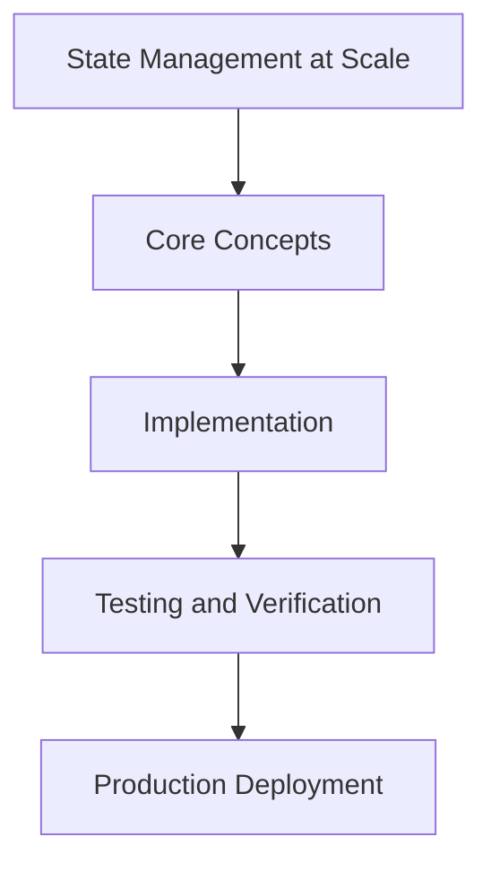

# Day 95 [Expert]: State Management at Scale

## Index

- [Goal](#goal)
- [Prerequisites](#prerequisites)
- [Explanation](#explanation)
- [Topic by Topic](#topic-by-topic)
- [Key Concepts](#key-concepts)
- [Visual Concept Map](#visual-concept-map)
- [End-to-End Practical](#end-to-end-practical)
- [Hands-on Coding](#hands-on-coding)
- [Mini Exercise](#mini-exercise)
- [Assessment Quiz](#assessment-quiz)
- [Task](#task)
- [Self Check](#self-check)
- [Interview Questions and Answers](#interview-questions-and-answers)
- [Day 95 Outcome](#day-95-outcome)

## Goal

Understand and apply State Management at Scale in a Next.js application to build production-quality features.

## Prerequisites

- Day 94 completed
- Solid understanding of Next.js App Router and TypeScript basics
- Familiarity with Server Components and data fetching patterns

## Explanation

State management at scale is about ownership clarity, synchronization rules, and predictable updates across server and client paths. Poor state boundaries create fragile, hard-to-debug systems.

This lesson focuses on designing scalable state flows in Next.js applications with clear contracts and performance awareness.


## Topic by Topic

### Topic 1: State Ownership and Source of Truth

Theory:
This topic covers State Ownership and Source of Truth in production Next.js systems, emphasizing explicit boundaries, measurable outcomes, and maintainable implementation strategy.

Practical:
Apply State Ownership and Source of Truth in a realistic team workflow, validate edge cases, and capture decisions so the approach is reusable across projects.

Code Example:

```tsx
// State Management at Scale — Topic 1
// Implementation depends on your specific use case.
// Refer to the Next.js documentation for detailed API reference.
export default function Example1() {
  return <div>State Management at Scale — Example 1</div>;
}
```
**Explanation:**
State Ownership and Source of Truth helps transform framework knowledge into dependable production execution that can be tested, monitored, and continuously improved.

**Key Points:**
- Understand where State Ownership and Source of Truth affects production outcomes.
- Use clear contracts and default-safe implementation choices.
- Validate impact through tests, metrics, and review feedback.


### Topic 2: Server-client State Boundary Strategy

Theory:
This topic covers Server-client State Boundary Strategy in production Next.js systems, emphasizing explicit boundaries, measurable outcomes, and maintainable implementation strategy.

Practical:
Apply Server-client State Boundary Strategy in a realistic team workflow, validate edge cases, and capture decisions so the approach is reusable across projects.

Code Example:

```tsx
// State Management at Scale — Topic 2
// Implementation depends on your specific use case.
// Refer to the Next.js documentation for detailed API reference.
export default function Example2() {
  return <div>State Management at Scale — Example 2</div>;
}
```
**Explanation:**
Server-client State Boundary Strategy helps transform framework knowledge into dependable production execution that can be tested, monitored, and continuously improved.

**Key Points:**
- Understand where Server-client State Boundary Strategy affects production outcomes.
- Use clear contracts and default-safe implementation choices.
- Validate impact through tests, metrics, and review feedback.


### Topic 3: Cache, Revalidation, and Consistency Rules

Theory:
This topic covers Cache, Revalidation, and Consistency Rules in production Next.js systems, emphasizing explicit boundaries, measurable outcomes, and maintainable implementation strategy.

Practical:
Apply Cache, Revalidation, and Consistency Rules in a realistic team workflow, validate edge cases, and capture decisions so the approach is reusable across projects.

Code Example:

```tsx
// State Management at Scale — Topic 3
// Implementation depends on your specific use case.
// Refer to the Next.js documentation for detailed API reference.
export default function Example3() {
  return <div>State Management at Scale — Example 3</div>;
}
```
**Explanation:**
Cache, Revalidation, and Consistency Rules helps transform framework knowledge into dependable production execution that can be tested, monitored, and continuously improved.

**Key Points:**
- Understand where Cache, Revalidation, and Consistency Rules affects production outcomes.
- Use clear contracts and default-safe implementation choices.
- Validate impact through tests, metrics, and review feedback.


### Topic 4: UI State Isolation Patterns

Theory:
This topic covers UI State Isolation Patterns in production Next.js systems, emphasizing explicit boundaries, measurable outcomes, and maintainable implementation strategy.

Practical:
Apply UI State Isolation Patterns in a realistic team workflow, validate edge cases, and capture decisions so the approach is reusable across projects.

Code Example:

```tsx
// State Management at Scale — Topic 4
// Implementation depends on your specific use case.
// Refer to the Next.js documentation for detailed API reference.
export default function Example4() {
  return <div>State Management at Scale — Example 4</div>;
}
```
**Explanation:**
UI State Isolation Patterns helps transform framework knowledge into dependable production execution that can be tested, monitored, and continuously improved.

**Key Points:**
- Understand where UI State Isolation Patterns affects production outcomes.
- Use clear contracts and default-safe implementation choices.
- Validate impact through tests, metrics, and review feedback.


### Topic 5: Performance Implications of State Design

Theory:
This topic covers Performance Implications of State Design in production Next.js systems, emphasizing explicit boundaries, measurable outcomes, and maintainable implementation strategy.

Practical:
Apply Performance Implications of State Design in a realistic team workflow, validate edge cases, and capture decisions so the approach is reusable across projects.

Code Example:

```tsx
// State Management at Scale — Topic 5
// Implementation depends on your specific use case.
// Refer to the Next.js documentation for detailed API reference.
export default function Example5() {
  return <div>State Management at Scale — Example 5</div>;
}
```
**Explanation:**
Performance Implications of State Design helps transform framework knowledge into dependable production execution that can be tested, monitored, and continuously improved.

**Key Points:**
- Understand where Performance Implications of State Design affects production outcomes.
- Use clear contracts and default-safe implementation choices.
- Validate impact through tests, metrics, and review feedback.


### Topic 6: Debuggability and Refactor Safety

Theory:
This topic covers Debuggability and Refactor Safety in production Next.js systems, emphasizing explicit boundaries, measurable outcomes, and maintainable implementation strategy.

Practical:
Apply Debuggability and Refactor Safety in a realistic team workflow, validate edge cases, and capture decisions so the approach is reusable across projects.

Code Example:

```tsx
// State Management at Scale — Topic 6
// Implementation depends on your specific use case.
// Refer to the Next.js documentation for detailed API reference.
export default function Example6() {
  return <div>State Management at Scale — Example 6</div>;
}
```
**Explanation:**
Debuggability and Refactor Safety helps transform framework knowledge into dependable production execution that can be tested, monitored, and continuously improved.

**Key Points:**
- Understand where Debuggability and Refactor Safety affects production outcomes.
- Use clear contracts and default-safe implementation choices.
- Validate impact through tests, metrics, and review feedback.


## Key Concepts

- State Management at Scale: Core concept for expert Next.js development
- Next.js App Router: The modern routing system using the app/ directory
- Server Component: A component that runs on the server only
- TypeScript: Strongly typed JavaScript used throughout Next.js projects

## Visual Concept Map



## End-to-End Practical

1. Review the explanation and all topic examples.
2. Set up a clean Next.js project or use your existing one.
3. Implement each topic example step by step.
4. Verify the behavior in the browser.
5. Refactor and clean up your implementation.
6. Write a brief note on what you learned.

## Hands-on Coding

### Example 1: Basic State Management at Scale Implementation

```tsx
// Basic implementation of State Management at Scale
// Follow the topic examples above to build this out.
export default function Example() {
  return (
    <div style={{ padding: "24px" }}>
      <h1>State Management at Scale</h1>
      <p>Implementation complete for Day 95.</p>
    </div>
  );
}
```

### Example 2: Practical Use Case

```tsx
// A real-world use case for State Management at Scale
// Refer to the Topic by Topic section for code details.
export default function PracticalExample() {
  return (
    <div>
      <h2>Practical: State Management at Scale</h2>
    </div>
  );
}
```

### Example 3: Combined Pattern

```tsx
// Combining State Management at Scale with other Next.js features
// This example shows integration with the App Router.
export default function CombinedExample() {
  return (
    <section>
      <h2>State Management at Scale — Combined Pattern</h2>
      <p>See topic sections above for detailed code.</p>
    </section>
  );
}
```

## Mini Exercise

Scenario:
You are adding State Management at Scale to a Next.js application for a real-world feature.

Steps:

1. Create a new route or component relevant to this topic.
2. Implement the core pattern from the Topic by Topic section.
3. Test the implementation thoroughly.
4. Verify edge cases are handled.
5. Clean up and document your code.

Expected output:

- Working implementation of State Management at Scale
- All edge cases handled correctly
- Clean, readable code following Next.js conventions

## Assessment Quiz

### Quiz Questions

1. What is the primary purpose of State Management at Scale in Next.js?
2. Where in the project structure do you implement this pattern?
3. What is a common mistake when using State Management at Scale?
4. True or False: State Management at Scale only applies to Client Components.
5. How does State Management at Scale improve the user or developer experience?

### Quiz Answers

1. To enable expert-level functionality in a Next.js application efficiently.
2. In the App Router directory structure, using Server Components by default.
3. Mixing server and client concerns incorrectly, or skipping error handling.
4. False. This concept applies broadly across the Next.js architecture.
5. It improves maintainability, performance, and scalability of the application.

## Task

- Study all topic examples in today's lesson
- Implement the core pattern in a Next.js project
- Test all scenarios including error and edge cases
- Complete the mini exercise
- Attempt the quiz before checking answers

## Self Check

- You can implement State Management at Scale from scratch
- You understand when and why to use this pattern
- You can explain the concept in simple terms
- You have tested the implementation in a running app
- You can answer at least 4 out of 5 quiz questions correctly

## Interview Questions and Answers

### Beginner

**Question:** What is State Management at Scale in Next.js?

**Answer:** State Management at Scale is a expert-level Next.js feature that helps developers build robust, scalable applications by handling a specific aspect of the framework architecture.

**Question:** When would you use State Management at Scale?

**Answer:** When you need to implement the specific functionality it provides in a production Next.js application, particularly in expert-stage projects.

### Middle

**Question:** How does State Management at Scale interact with the Next.js App Router?

**Answer:** It integrates with the App Router through Server Components, Route Handlers, or middleware, depending on the specific implementation pattern required.

**Question:** What are common pitfalls with State Management at Scale?

**Answer:** The most common pitfalls are improper handling of server/client boundaries, missing error states, and not considering caching behavior when relevant.

### Advanced

**Question:** How would you scale State Management at Scale in a large Next.js application with multiple teams?

**Answer:** By establishing clear conventions, creating reusable utilities, documenting patterns in an Architecture Decision Record, and enforcing consistency through code review and linting rules.

**Question:** What performance considerations apply to State Management at Scale?

**Answer:** Consider bundle size impact for client-side features, caching strategies for data fetching, and rendering mode selection to balance performance with data freshness.

## Day 95 Outcome

- You understand State Management at Scale and its role in Next.js
- You can implement this pattern in a real project
- You know when to use and when to avoid this pattern
- You are ready for Day 95 — moving on to the next topic
