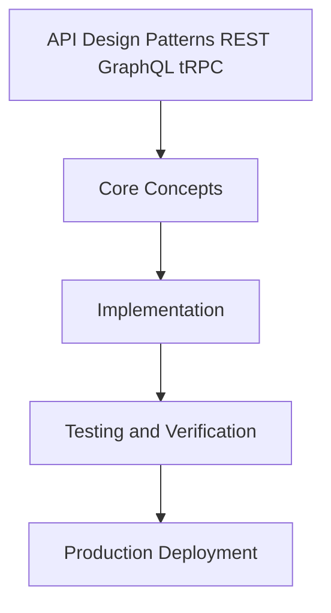

# Day 96 [Expert]: API Design Patterns REST GraphQL tRPC

## Index

- [Goal](#goal)
- [Prerequisites](#prerequisites)
- [Explanation](#explanation)
- [Topic by Topic](#topic-by-topic)
- [Key Concepts](#key-concepts)
- [Visual Concept Map](#visual-concept-map)
- [End-to-End Practical](#end-to-end-practical)
- [Hands-on Coding](#hands-on-coding)
- [Mini Exercise](#mini-exercise)
- [Assessment Quiz](#assessment-quiz)
- [Task](#task)
- [Self Check](#self-check)
- [Interview Questions and Answers](#interview-questions-and-answers)
- [Day 96 Outcome](#day-96-outcome)

## Goal

Understand and apply API Design Patterns REST GraphQL tRPC in a Next.js application to build production-quality features.

## Prerequisites

- Day 95 completed
- Solid understanding of Next.js App Router and TypeScript basics
- Familiarity with Server Components and data fetching patterns

## Explanation

API design patterns shape the long-term reliability and evolution speed of your Next.js backend surface. Good API design minimizes ambiguity and reduces client breakage risk.

This lesson covers practical patterns for endpoint structure, error semantics, versioning, and operational observability.


## Topic by Topic

### Topic 1: Resource Modeling and Endpoint Semantics

Theory:
This topic covers Resource Modeling and Endpoint Semantics in production Next.js systems, emphasizing explicit boundaries, measurable outcomes, and maintainable implementation strategy.

Practical:
Apply Resource Modeling and Endpoint Semantics in a realistic team workflow, validate edge cases, and capture decisions so the approach is reusable across projects.

Code Example:

```tsx
// API Design Patterns REST GraphQL tRPC — Topic 1
// Implementation depends on your specific use case.
// Refer to the Next.js documentation for detailed API reference.
export default function Example1() {
  return <div>API Design Patterns REST GraphQL tRPC — Example 1</div>;
}
```
**Explanation:**
Resource Modeling and Endpoint Semantics helps transform framework knowledge into dependable production execution that can be tested, monitored, and continuously improved.

**Key Points:**
- Understand where Resource Modeling and Endpoint Semantics affects production outcomes.
- Use clear contracts and default-safe implementation choices.
- Validate impact through tests, metrics, and review feedback.


### Topic 2: Consistency in Request/Response Contracts

Theory:
This topic covers Consistency in Request/Response Contracts in production Next.js systems, emphasizing explicit boundaries, measurable outcomes, and maintainable implementation strategy.

Practical:
Apply Consistency in Request/Response Contracts in a realistic team workflow, validate edge cases, and capture decisions so the approach is reusable across projects.

Code Example:

```tsx
// API Design Patterns REST GraphQL tRPC — Topic 2
// Implementation depends on your specific use case.
// Refer to the Next.js documentation for detailed API reference.
export default function Example2() {
  return <div>API Design Patterns REST GraphQL tRPC — Example 2</div>;
}
```
**Explanation:**
Consistency in Request/Response Contracts helps transform framework knowledge into dependable production execution that can be tested, monitored, and continuously improved.

**Key Points:**
- Understand where Consistency in Request/Response Contracts affects production outcomes.
- Use clear contracts and default-safe implementation choices.
- Validate impact through tests, metrics, and review feedback.


### Topic 3: Error Taxonomy and Problem Details

Theory:
This topic covers Error Taxonomy and Problem Details in production Next.js systems, emphasizing explicit boundaries, measurable outcomes, and maintainable implementation strategy.

Practical:
Apply Error Taxonomy and Problem Details in a realistic team workflow, validate edge cases, and capture decisions so the approach is reusable across projects.

Code Example:

```tsx
// API Design Patterns REST GraphQL tRPC — Topic 3
// Implementation depends on your specific use case.
// Refer to the Next.js documentation for detailed API reference.
export default function Example3() {
  return <div>API Design Patterns REST GraphQL tRPC — Example 3</div>;
}
```
**Explanation:**
Error Taxonomy and Problem Details helps transform framework knowledge into dependable production execution that can be tested, monitored, and continuously improved.

**Key Points:**
- Understand where Error Taxonomy and Problem Details affects production outcomes.
- Use clear contracts and default-safe implementation choices.
- Validate impact through tests, metrics, and review feedback.


### Topic 4: Versioning and Deprecation Strategy

Theory:
This topic covers Versioning and Deprecation Strategy in production Next.js systems, emphasizing explicit boundaries, measurable outcomes, and maintainable implementation strategy.

Practical:
Apply Versioning and Deprecation Strategy in a realistic team workflow, validate edge cases, and capture decisions so the approach is reusable across projects.

Code Example:

```tsx
// API Design Patterns REST GraphQL tRPC — Topic 4
// Implementation depends on your specific use case.
// Refer to the Next.js documentation for detailed API reference.
export default function Example4() {
  return <div>API Design Patterns REST GraphQL tRPC — Example 4</div>;
}
```
**Explanation:**
Versioning and Deprecation Strategy helps transform framework knowledge into dependable production execution that can be tested, monitored, and continuously improved.

**Key Points:**
- Understand where Versioning and Deprecation Strategy affects production outcomes.
- Use clear contracts and default-safe implementation choices.
- Validate impact through tests, metrics, and review feedback.


### Topic 5: Security and Validation at Boundaries

Theory:
This topic covers Security and Validation at Boundaries in production Next.js systems, emphasizing explicit boundaries, measurable outcomes, and maintainable implementation strategy.

Practical:
Apply Security and Validation at Boundaries in a realistic team workflow, validate edge cases, and capture decisions so the approach is reusable across projects.

Code Example:

```tsx
// API Design Patterns REST GraphQL tRPC — Topic 5
// Implementation depends on your specific use case.
// Refer to the Next.js documentation for detailed API reference.
export default function Example5() {
  return <div>API Design Patterns REST GraphQL tRPC — Example 5</div>;
}
```
**Explanation:**
Security and Validation at Boundaries helps transform framework knowledge into dependable production execution that can be tested, monitored, and continuously improved.

**Key Points:**
- Understand where Security and Validation at Boundaries affects production outcomes.
- Use clear contracts and default-safe implementation choices.
- Validate impact through tests, metrics, and review feedback.


### Topic 6: API Observability and Operability

Theory:
This topic covers API Observability and Operability in production Next.js systems, emphasizing explicit boundaries, measurable outcomes, and maintainable implementation strategy.

Practical:
Apply API Observability and Operability in a realistic team workflow, validate edge cases, and capture decisions so the approach is reusable across projects.

Code Example:

```tsx
// API Design Patterns REST GraphQL tRPC — Topic 6
// Implementation depends on your specific use case.
// Refer to the Next.js documentation for detailed API reference.
export default function Example6() {
  return <div>API Design Patterns REST GraphQL tRPC — Example 6</div>;
}
```
**Explanation:**
API Observability and Operability helps transform framework knowledge into dependable production execution that can be tested, monitored, and continuously improved.

**Key Points:**
- Understand where API Observability and Operability affects production outcomes.
- Use clear contracts and default-safe implementation choices.
- Validate impact through tests, metrics, and review feedback.


## Key Concepts

- API Design Patterns REST GraphQL tRPC: Core concept for expert Next.js development
- Next.js App Router: The modern routing system using the app/ directory
- Server Component: A component that runs on the server only
- TypeScript: Strongly typed JavaScript used throughout Next.js projects

## Visual Concept Map



## End-to-End Practical

1. Review the explanation and all topic examples.
2. Set up a clean Next.js project or use your existing one.
3. Implement each topic example step by step.
4. Verify the behavior in the browser.
5. Refactor and clean up your implementation.
6. Write a brief note on what you learned.

## Hands-on Coding

### Example 1: Basic API Design Patterns REST GraphQL tRPC Implementation

```tsx
// Basic implementation of API Design Patterns REST GraphQL tRPC
// Follow the topic examples above to build this out.
export default function Example() {
  return (
    <div style={{ padding: "24px" }}>
      <h1>API Design Patterns REST GraphQL tRPC</h1>
      <p>Implementation complete for Day 96.</p>
    </div>
  );
}
```

### Example 2: Practical Use Case

```tsx
// A real-world use case for API Design Patterns REST GraphQL tRPC
// Refer to the Topic by Topic section for code details.
export default function PracticalExample() {
  return (
    <div>
      <h2>Practical: API Design Patterns REST GraphQL tRPC</h2>
    </div>
  );
}
```

### Example 3: Combined Pattern

```tsx
// Combining API Design Patterns REST GraphQL tRPC with other Next.js features
// This example shows integration with the App Router.
export default function CombinedExample() {
  return (
    <section>
      <h2>API Design Patterns REST GraphQL tRPC — Combined Pattern</h2>
      <p>See topic sections above for detailed code.</p>
    </section>
  );
}
```

## Mini Exercise

Scenario:
You are adding API Design Patterns REST GraphQL tRPC to a Next.js application for a real-world feature.

Steps:

1. Create a new route or component relevant to this topic.
2. Implement the core pattern from the Topic by Topic section.
3. Test the implementation thoroughly.
4. Verify edge cases are handled.
5. Clean up and document your code.

Expected output:

- Working implementation of API Design Patterns REST GraphQL tRPC
- All edge cases handled correctly
- Clean, readable code following Next.js conventions

## Assessment Quiz

### Quiz Questions

1. What is the primary purpose of API Design Patterns REST GraphQL tRPC in Next.js?
2. Where in the project structure do you implement this pattern?
3. What is a common mistake when using API Design Patterns REST GraphQL tRPC?
4. True or False: API Design Patterns REST GraphQL tRPC only applies to Client Components.
5. How does API Design Patterns REST GraphQL tRPC improve the user or developer experience?

### Quiz Answers

1. To enable expert-level functionality in a Next.js application efficiently.
2. In the App Router directory structure, using Server Components by default.
3. Mixing server and client concerns incorrectly, or skipping error handling.
4. False. This concept applies broadly across the Next.js architecture.
5. It improves maintainability, performance, and scalability of the application.

## Task

- Study all topic examples in today's lesson
- Implement the core pattern in a Next.js project
- Test all scenarios including error and edge cases
- Complete the mini exercise
- Attempt the quiz before checking answers

## Self Check

- You can implement API Design Patterns REST GraphQL tRPC from scratch
- You understand when and why to use this pattern
- You can explain the concept in simple terms
- You have tested the implementation in a running app
- You can answer at least 4 out of 5 quiz questions correctly

## Interview Questions and Answers

### Beginner

**Question:** What is API Design Patterns REST GraphQL tRPC in Next.js?

**Answer:** API Design Patterns REST GraphQL tRPC is a expert-level Next.js feature that helps developers build robust, scalable applications by handling a specific aspect of the framework architecture.

**Question:** When would you use API Design Patterns REST GraphQL tRPC?

**Answer:** When you need to implement the specific functionality it provides in a production Next.js application, particularly in expert-stage projects.

### Middle

**Question:** How does API Design Patterns REST GraphQL tRPC interact with the Next.js App Router?

**Answer:** It integrates with the App Router through Server Components, Route Handlers, or middleware, depending on the specific implementation pattern required.

**Question:** What are common pitfalls with API Design Patterns REST GraphQL tRPC?

**Answer:** The most common pitfalls are improper handling of server/client boundaries, missing error states, and not considering caching behavior when relevant.

### Advanced

**Question:** How would you scale API Design Patterns REST GraphQL tRPC in a large Next.js application with multiple teams?

**Answer:** By establishing clear conventions, creating reusable utilities, documenting patterns in an Architecture Decision Record, and enforcing consistency through code review and linting rules.

**Question:** What performance considerations apply to API Design Patterns REST GraphQL tRPC?

**Answer:** Consider bundle size impact for client-side features, caching strategies for data fetching, and rendering mode selection to balance performance with data freshness.

## Day 96 Outcome

- You understand API Design Patterns REST GraphQL tRPC and its role in Next.js
- You can implement this pattern in a real project
- You know when to use and when to avoid this pattern
- You are ready for Day 96 — moving on to the next topic
