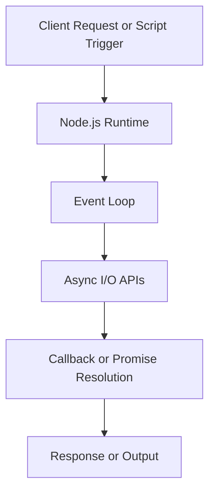

# Day 001 [Beginner]: Introduction to Node.js

## Index

- Goal
- Prerequisites
- Explanation
- Topic by Topic
- Key Concepts
- Visual Concept Map
- End-to-End Practical
- Hands-on Coding
- Mini Exercise
- Assessment Quiz
- Task
- Self Check
- Interview Questions and Answers
- Day Outcome

## Goal

Understand what Node.js is, where it fits in real products, and build your first practical backend-style script.

## Prerequisites

- Basic JavaScript syntax
- Node.js installed

## Explanation

Node.js lets JavaScript run outside the browser. It is built on Chrome V8 and designed for fast I/O-heavy applications like APIs, chat systems, and automation tools.

## Topic by Topic

### Topic 1: What Node.js Is and Is Not

Theory:
Node.js is a JavaScript runtime, not a framework.

Practical:
Use Node.js to run scripts, build APIs, and automate tasks.

Real-world table:

| Use Case      | Why Node.js Works Well                             |
| ------------- | -------------------------------------------------- |
| REST API      | Non-blocking I/O handles many requests efficiently |
| Chat app      | Event-driven model supports real-time messages     |
| CLI tools     | Fast startup and easy package ecosystem            |
| Build scripts | Strong npm ecosystem for tooling                   |

**Explanation:** This topic clarifies what Node.js actually is: a JavaScript runtime for server-side and tooling use, not a framework or a browser replacement.

**Key Points:**

- Node.js runs JavaScript outside the browser.
- It provides runtime APIs for server and system tasks.
- It is a platform, not a UI framework.

### Topic 2: Event-driven and Non-blocking Nature

Theory:
Node.js uses an event loop to handle async operations without blocking the main thread for most I/O.
CPU-heavy work can still block request handling unless moved to worker threads or separate processes.

Practical:
Run async file/network work while still handling other tasks.

**Explanation:** Node.js is designed around events and non-blocking work, which helps it handle many I/O tasks efficiently.

**Key Points:**

- Event-driven flow is central to Node.js design.
- Non-blocking I/O helps concurrency.
- This model is powerful for network and file operations.

### Topic 3: Runtime Components

Theory:
Core pieces include V8 engine, event loop, libuv, Node APIs, and npm ecosystem.

Practical:
Inspect built-in modules like fs, path, and http.

Quick architecture note:

| Component  | Responsibility                        |
| ---------- | ------------------------------------- |
| V8         | Executes JavaScript code              |
| Event Loop | Schedules async callbacks             |
| libuv      | Provides async I/O and thread pool    |
| Node APIs  | Runtime features like fs/http/process |

**Explanation:** Understanding the runtime components helps explain what Node.js can do and why it behaves differently from plain browser JavaScript.

**Key Points:**

- Node.js includes runtime APIs beyond the language itself.
- The runtime environment affects available features.
- Core modules provide many built-in capabilities.

### Topic 4: Node.js vs Browser JavaScript

Theory:
Browser has DOM APIs, Node has server/runtime APIs.
Node modules can be loaded using CommonJS or ESM depending on project setup.

Practical:
Use console, files, process info in Node; DOM code will fail.

**Explanation:** Comparing Node.js with browser JavaScript helps learners avoid assuming the two environments work exactly the same way.

**Key Points:**

- JavaScript syntax may be the same, but runtime APIs differ.
- Node.js has server and system access features.
- Browser-only globals are not always available in Node.js.

### Topic 5: First Production Mindset

Theory:
Start simple, but always think about errors, logs, and maintainability.

Practical:
Add try/catch, input checks, and readable logs in your first script.

**Explanation:** Early production mindset teaches that Node.js code should be written with reliability, maintainability, and operational behavior in mind from the start.

**Key Points:**

- Think beyond just making the script work.
- Reliability and clarity matter early.
- Good habits at Day 1 scale better later.

## Key Concepts

- Node.js runtime fundamentals
- Event-driven architecture basics
- Async I/O mental model
- Event loop vs thread pool responsibilities
- CommonJS vs ESM module awareness
- Real-world use-case mapping
- Production-minded scripting habits

## Visual Concept Map



## End-to-End Practical

1. Create a Node project folder.
2. Add first file app.js.
3. Read command-line input.
4. Print structured output.
5. Add basic error handling and validation.

## Hands-on Coding

### Example 1: Case - Greeting CLI Script

Scenario:
Build a small onboarding script for developer tooling.

```js
// app.js
const name = process.argv[2] || "Developer";
console.log(`Hello, ${name}. Welcome to Node.js basics.`);
```

### Example 2: Case - Environment-aware Startup

Scenario:
Team wants script behavior to differ for development and production.

```js
const env = process.env.NODE_ENV || "development";
if (env === "production") {
  console.log("Running in production mode");
} else {
  console.log("Running in development mode");
}
```

### Example 3: Case - Safe Input Validation

Scenario:
Internal tool should reject invalid port values.

```js
const rawPort = process.argv[2];
const port = Number(rawPort);

if (!Number.isInteger(port) || port <= 0 || port > 65535) {
  console.error("Invalid port. Use a number between 1 and 65535.");
  process.exit(1);
}

console.log(`Service will start on port ${port}`);
```

## Mini Exercise

Scenario:
Create a Node script that takes two CLI inputs: user name and role, then prints a formatted welcome card.

Expected output:

- Works with missing arguments using defaults
- Validates role from allowed list
- Uses clean structured logs

## Assessment Quiz

### Quiz Questions

1. What is Node.js in one line?
2. Why is non-blocking I/O important?
3. True or False: Node.js is only for backend APIs.
4. Name two built-in Node modules.
5. Why can CPU-heavy logic hurt Node throughput?

### Quiz Answers

1. A JavaScript runtime that runs outside the browser.
2. It improves responsiveness for I/O-heavy workloads.
3. False.
4. fs and path.
5. It blocks the main thread and delays other requests/events.

## Task

- Build one practical Node script with CLI input
- Add one validation rule and one environment-based behavior
- Complete mini exercise and quiz

## Self Check

- You can explain where Node.js fits in real projects
- You can write and run practical Node scripts
- You can answer at least 4 out of 5 quiz questions

## Interview Questions and Answers

### Beginner

Question: What is Node.js and why do teams use it?

Answer: Node.js is a JavaScript runtime used for APIs, tooling, and real-time services due to its event-driven non-blocking model.

### Middle

Question: Which kinds of workloads suit Node.js best?

Answer: I/O-heavy workloads like APIs, chat, streaming gateways, and automation scripts.

### Advanced

Question: When might Node.js be a weaker choice?

Answer: CPU-heavy workloads without worker/process strategy, where long computations block throughput.

## Day 001 Outcome

- You understand Node.js runtime fundamentals clearly
- You can build practical starter scripts with safe patterns
- You are ready for setup and toolchain depth in Day 002
