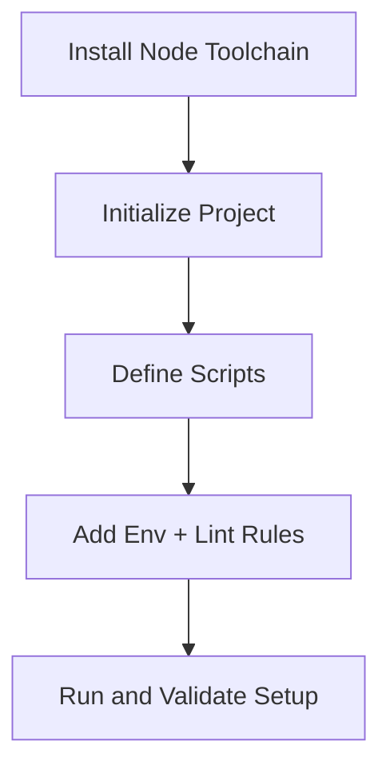

# Day 002 [Beginner]: Setup and Toolchain

## Index

- Goal
- Prerequisites
- Explanation
- Topic by Topic
- Key Concepts
- Visual Concept Map
- End-to-End Practical
- Hands-on Coding
- Mini Exercise
- Assessment Quiz
- Task
- Self Check
- Interview Questions and Answers
- Day Outcome

## Goal

Set up a clean Node.js developer environment with version control, scripts, linting basics, and reproducible project execution.

## Prerequisites

- Day 001 concepts
- Node.js and npm installed

## Explanation

A solid setup reduces team friction and avoids "works on my machine" issues.

## Topic by Topic

### Topic 1: Version and Runtime Management

Theory:
Projects should pin compatible Node versions.

Practical:
Use nvm or Volta and document node version.

Baseline version controls:

| File or Field        | Why It Matters                 |
| -------------------- | ------------------------------ |
| .nvmrc               | Consistent local Node version  |
| package.json engines | Communicates supported runtime |
| package-lock.json    | Reproducible dependency tree   |

**Explanation:** Version and runtime management matter because Node.js projects can behave differently across versions if the team setup is inconsistent.

**Key Points:**

- Keep Node.js versions consistent across environments.
- Use version tools to reduce setup drift.
- Runtime consistency prevents avoidable bugs.

### Topic 2: Project Bootstrap Standards

Theory:
Every project should include scripts, entry file, and metadata.

Practical:
Initialize package.json and define standard scripts.
Prefer npm ci in CI pipelines to guarantee lockfile-based installs.

Script table:

| Script | Purpose                    |
| ------ | -------------------------- |
| start  | Run app in production mode |
| dev    | Run development command    |
| test   | Run test suite             |
| lint   | Run static checks          |

**Explanation:** Project bootstrap standards create a predictable starting point so every Node.js app begins with a clean structure and clear scripts.

**Key Points:**

- Start projects with repeatable setup rules.
- Keep initial structure simple and organized.
- Standard bootstrap improves team speed.

### Topic 3: Environment Configuration

Theory:
Config should vary by environment without hardcoding secrets.

Practical:
Use .env pattern and process.env access.
Keep .env out of source control and commit only .env.example.

**Explanation:** Environment configuration separates machine-specific or secret values from application logic, which improves safety and portability.

**Key Points:**

- Keep config outside hardcoded source when possible.
- Separate environments clearly.
- Treat configuration as part of application design.

### Topic 4: Tooling for Quality

Theory:
Linting and formatting improve consistency.

Practical:
Add ESLint/Prettier in early project stage.
Also run npm audit or equivalent checks in CI for dependency risk visibility.

**Explanation:** Quality tooling helps catch problems earlier, so projects stay cleaner and more maintainable as they grow.

**Key Points:**

- Linting and formatting improve consistency.
- Type or test tooling can prevent common mistakes.
- Tooling should support fast feedback.

### Topic 5: Debug and Run Reliability

Theory:
Fast debug loop helps productivity.

Practical:
Use node --watch and structured logs for fast iteration.

**Explanation:** Reliable run and debug setup helps teams work faster because local execution and troubleshooting become consistent and repeatable.

**Key Points:**

- Make run commands easy and predictable.
- Keep debug workflow simple for learners.
- Reliable setup reduces wasted time.

## Key Concepts

- Runtime version consistency
- Reproducible project scripts
- Lockfile-driven installs for deterministic builds
- Environment-safe configuration
- Quality tooling baseline
- Debug-friendly local workflow

## Visual Concept Map



## End-to-End Practical

1. Create project folder and package.json.
2. Add scripts and entry file.
3. Add .env.example and config loader.
4. Configure lint script.
5. Run full setup validation command sequence.

## Hands-on Coding

### Example 1: Case - Clean Project Bootstrap

Scenario:
New API service needs standardized package scripts.

```json
{
  "name": "user-service",
  "version": "1.0.0",
  "main": "src/index.js",
  "scripts": {
    "start": "node src/index.js",
    "dev": "node --watch src/index.js",
    "lint": "eslint ."
  }
}
```

### Example 2: Case - Safe Environment Config

Scenario:
Team wants to avoid hard-coded port and API URL.

```js
const port = Number(process.env.PORT || 3000);
const mode = process.env.NODE_ENV || "development";

console.log({ port, mode });
```

### Example 3: Case - Setup Health Check Script

Scenario:
Onboarding script validates required runtime assumptions.

```js
const semver = process.versions.node;
console.log(`Node version: ${semver}`);

if (Number(semver.split(".")[0]) < 18) {
  console.error("Node 18+ required.");
  process.exit(1);
}

console.log("Setup validation passed.");
```

## Mini Exercise

Scenario:
Set up a starter Node project called order-cli with scripts: dev, start, lint.

Expected output:

- package.json with working scripts
- config using process.env
- setup-check script that validates Node version

## Assessment Quiz

### Quiz Questions

1. Why pin Node version for a project?
2. What is the purpose of .env.example?
3. True or False: Hardcoding ports is fine for team projects.
4. Why is package-lock.json important for teams?
5. Why is npm ci preferred in CI environments?

### Quiz Answers

1. To avoid runtime mismatches across environments.
2. It documents required environment variables.
3. False.
4. It locks exact dependency versions for reproducible installs.
5. It enforces clean, deterministic installs from lockfile.

## Task

- Build setup and toolchain baseline for one Node project
- Add scripts and environment-driven config
- Complete mini exercise and quiz

## Self Check

- You can bootstrap a reliable Node project setup
- You can configure scripts and env patterns correctly
- You can answer at least 4 out of 5 quiz questions

## Interview Questions and Answers

### Beginner

Question: What are the first files you create in a Node project?

Answer: package.json, source entry file, and env/config scaffolding.

### Middle

Question: Why is toolchain standardization important in teams?

Answer: It makes onboarding faster and reduces environment-specific bugs.

### Advanced

Question: How do you design setup for long-term maintainability?

Answer: Pin runtime versions, enforce scripts/linting, and document environment contracts.

## Day 002 Outcome

- You can create production-friendly Node setup confidently
- You can enforce team consistency with scripts and env conventions
- You are ready for JavaScript refresher focused on Node runtime in Day 003
