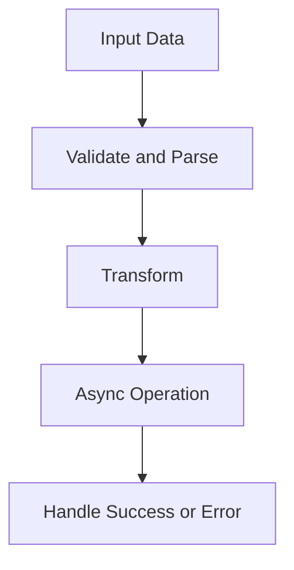

# Day 003 [Beginner]: JavaScript Refresher for Node

## Index

- Goal
- Prerequisites
- Explanation
- Topic by Topic
- Key Concepts
- Visual Concept Map
- End-to-End Practical
- Hands-on Coding
- Mini Exercise
- Assessment Quiz
- Task
- Self Check
- Interview Questions and Answers
- Day Outcome

## Goal

Refresh the JavaScript patterns that matter most in Node.js: async flow, objects/arrays, error handling, and module-ready coding style.

## Prerequisites

- Day 002 setup complete
- Basic JavaScript variables, functions, loops

## Explanation

Node work relies heavily on asynchronous control flow and safe data handling. This refresher focuses only on JS patterns that are used constantly in real Node services.

## Topic by Topic

### Topic 1: Async Foundations for Node

Theory:
Promises and async/await are core for file, API, and database operations.
Know when to run tasks sequentially vs concurrently.

Practical:
Convert callback-style logic to async/await.

**Explanation:** Async foundations are critical in Node.js because much backend work depends on promises, timers, I/O, and non-blocking control flow.

**Key Points:**

- Async thinking is essential in Node.js.
- Understand how JavaScript handles delayed work.
- Strong async basics make backend code easier to reason about.

### Topic 2: Destructuring and Defaults

Theory:
Request data and config objects often need safe extraction.

Practical:
Use defaults to avoid undefined runtime issues.

**Explanation:** Destructuring and defaults improve readability by making data extraction and fallback handling more concise.

**Key Points:**

- Destructuring reduces repeated access code.
- Defaults protect against missing values.
- Cleaner syntax improves maintainability.

### Topic 3: Array Methods for Data Pipelines

Theory:
map/filter/reduce simplify transformation-heavy backend logic.

Practical:
Build summary metrics from raw records.

**Explanation:** Array methods are heavily used in backend data handling, especially when filtering, transforming, and summarizing values.

**Key Points:**

- Use array helpers for clean data flow.
- Prefer readable transformations over manual loops when appropriate.
- These patterns appear often in services and APIs.

### Topic 4: Error-first Mindset

Theory:
Node apps fail at runtime due to external dependencies.

Practical:
Use try/catch and explicit error messages.

**Explanation:** Error-first mindset is important because backend code must assume failures can happen in network, file, or data operations.

**Key Points:**

- Handle failure as a normal case.
- Write code that surfaces errors clearly.
- Defensive thinking improves service reliability.

### Topic 6: Concurrency Utilities for Real Services

Theory:
Promise.all fails fast on first rejection, while Promise.allSettled gives full outcome visibility.

Practical:
Use allSettled for batch jobs where partial success is acceptable.

**Explanation:** Concurrency utilities help services manage multiple async tasks more efficiently when work can happen in parallel.

**Key Points:**

- Concurrency is useful when tasks are independent.
- Choose patterns that balance speed and clarity.
- Be careful with error handling in parallel flows.

### Topic 5: Reusable Function Design

Theory:
Small pure functions make services easier to test and maintain.

Practical:
Extract logic into dedicated helper functions.

**Explanation:** Reusable function design keeps backend logic easier to test and maintain because common operations are expressed once with clear contracts.

**Key Points:**

- Small reusable functions improve code clarity.
- Good function design reduces duplication.
- Reusability supports long-term maintainability.

## Key Concepts

- Async/await correctness
- Sequential vs concurrent execution choice
- Safe object destructuring
- Data transformation patterns
- Practical runtime error handling
- Promise.all vs Promise.allSettled usage
- Maintainable helper function style

## Visual Concept Map



## End-to-End Practical

1. Read JSON-like input data.
2. Validate required fields.
3. Transform records using array methods.
4. Simulate async save step.
5. Handle success/error with clear logs.

## Hands-on Coding

### Example 1: Case - Async Order Processing

Scenario:
Service receives order payload and simulates async save.

```js
async function saveOrder(order) {
  return new Promise((resolve) => setTimeout(() => resolve(order.id), 200));
}

async function processOrder(order) {
  try {
    const savedId = await saveOrder(order);
    console.log(`Order saved: ${savedId}`);
  } catch (error) {
    console.error("Failed to process order", error);
  }
}
```

### Example 2: Case - Safe Config Parsing

Scenario:
CLI config may miss fields in development.

```js
function readConfig(config = {}) {
  const { host = "localhost", port = 3000, retries = 2 } = config;

  return { host, port, retries };
}
```

### Example 3: Case - Revenue Summary Pipeline

Scenario:
Build a quick metric from transaction rows.

```js
const orders = [
  { amount: 200, status: "paid" },
  { amount: 150, status: "failed" },
  { amount: 300, status: "paid" },
];

const paidTotal = orders
  .filter((o) => o.status === "paid")
  .reduce((sum, o) => sum + o.amount, 0);

console.log({ paidTotal });
```

### Example 4: Case - Batch Processing with allSettled

Scenario:
Notification sends should continue even if one provider fails.

```js
const results = await Promise.allSettled([
  sendEmail(user),
  sendSms(user),
  sendPush(user),
]);

const failures = results.filter((r) => r.status === "rejected");
console.log({ total: results.length, failures: failures.length });
```

## Mini Exercise

Scenario:
Write a script that accepts mock user events, filters invalid entries, and produces an async summary output.

Expected output:

- Uses async/await
- Uses at least one map/filter/reduce chain
- Handles bad input safely

## Assessment Quiz

### Quiz Questions

1. Why is async/await preferred in modern Node apps?
2. What is the advantage of destructuring with defaults?
3. When is Promise.allSettled better than Promise.all?
4. Why should service functions throw or handle meaningful errors?
5. What makes a helper function test-friendly?

### Quiz Answers

1. It improves readability of async flows.
2. It avoids undefined field crashes.
3. When you need results from all tasks, even if some fail.
4. Better debugging and operational reliability.
5. Small scope, clear input/output, minimal side effects.

## Task

- Build one async data-processing script
- Add validation and error handling
- Complete mini exercise and quiz

## Self Check

- You can apply core JS patterns in Node context
- You can write safer async data-processing code
- You can answer at least 4 out of 5 quiz questions

## Interview Questions and Answers

### Beginner

Question: Why are Promises important in Node.js?

Answer: Most I/O operations are asynchronous, and Promises help manage them clearly.

### Middle

Question: What common bug appears when destructuring request data?

Answer: Missing fields causing undefined behavior when defaults are not provided.

### Advanced

Question: How do you design async functions for reliability in services?

Answer: Validate inputs, separate pure transformations, wrap external calls in try/catch, and return explicit results.

## Day 003 Outcome

- You refreshed Node-relevant JavaScript deeply
- You can build cleaner async and transformation logic
- You are ready for module systems in Day 004
