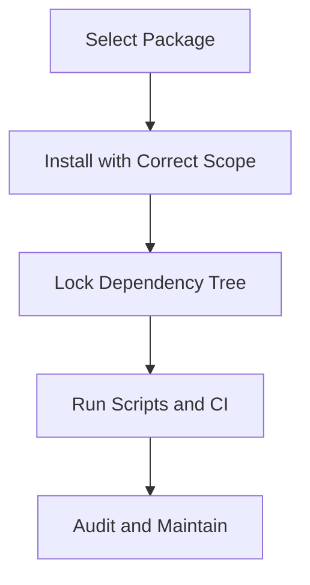

# Day 005 [Beginner]: npm and Package Management

## Index

- Goal
- Prerequisites
- Explanation
- Topic by Topic
- Key Concepts
- Visual Concept Map
- End-to-End Practical
- Hands-on Coding
- Mini Exercise
- Assessment Quiz
- Task
- Self Check
- Interview Questions and Answers
- Day Outcome

## Goal

Master practical npm workflows: dependency installation, semantic versioning, scripts, lockfiles, and package security checks.

## Prerequisites

- Day 004 module basics
- npm available locally

## Explanation

npm is central to Node development. Strong package management habits improve reliability, security, and team reproducibility.

## Topic by Topic

### Topic 1: Dependency Types

Theory:
Dependencies are grouped by runtime and development purpose.

Practical:
Add production packages to dependencies, tooling to devDependencies.

**Explanation:** Dependency types matter because production, development, and peer dependencies serve different roles in a Node.js project.

**Key Points:**

- Classify packages by how the app uses them.
- Keep production dependencies lean.
- Misclassified packages can cause deploy or build issues.

### Topic 2: Semantic Versioning in package.json

Theory:
Version ranges affect update stability.

Practical:
Choose safe ranges for production services.

SemVer table:

| Range  | Meaning             | Risk Level   |
| ------ | ------------------- | ------------ |
| 1.2.3  | Exact version       | Lowest drift |
| ^1.2.3 | Minor/patch allowed | Medium       |
| ~1.2.3 | Patch allowed       | Lower-medium |
| latest | Uncontrolled        | High         |

**Explanation:** Semantic versioning affects how updates are pulled into a project, so understanding it reduces surprise breakages.

**Key Points:**

- Version ranges control update behavior.
- SemVer helps communicate change risk.
- Choose ranges intentionally, not by habit.

### Topic 3: Lockfiles and Reproducible Installs

Theory:
Lockfiles freeze dependency tree for stable builds.

Practical:
Use npm ci in CI pipelines.

**Explanation:** Lockfiles improve reproducibility by helping different environments install the same dependency tree.

**Key Points:**

- Commit lockfiles for stable installs.
- Reproducibility is important for teams and CI.
- Lockfiles reduce environment drift.

### Topic 4: Script-driven Workflows

Theory:
Standard scripts create team consistency.

Practical:
Define lint, test, build, and start scripts.

**Explanation:** Script-driven workflows make common tasks easy to run and standardize how developers work with the project.

**Key Points:**

- Use scripts to simplify routine commands.
- Keep common tasks documented in package scripts.
- Standard scripts improve collaboration.

### Topic 5: Security and Maintenance

Theory:
Package ecosystems change fast; vulnerabilities appear often.

Practical:
Run npm audit and patch responsibly.

**Explanation:** Security and maintenance are part of package management because third-party dependencies can become outdated or vulnerable over time.

**Key Points:**

- Review dependencies regularly.
- Keep updates and audits part of maintenance.
- Dependency health affects application health.

### Topic 6: Update Governance and Dependency Control

Theory:
Safe package management includes controlled upgrades and transitive dependency visibility.

Practical:
Use npm outdated for planning and npm overrides for emergency transitive fixes.

**Explanation:** Update governance and dependency control help teams manage change safely instead of updating packages randomly.

**Key Points:**

- Plan updates deliberately.
- Balance freshness with stability.
- Keep dependency changes observable and reviewable.

## Key Concepts

- Dependency classification
- SemVer impact on stability
- Lockfile-based reproducibility
- Script standardization
- Security-aware package updates
- Transitive dependency control
- Controlled upgrade workflow

## Visual Concept Map



## End-to-End Practical

1. Initialize package.json.
2. Install one runtime and one dev dependency.
3. Add scripts for dev/lint/test.
4. Commit lockfile.
5. Run audit and document results.

## Hands-on Coding

### Example 1: Case - Correct Dependency Scope

Scenario:
Express is needed in runtime, nodemon only for development.

```bash
npm install express
npm install --save-dev nodemon eslint
```

### Example 2: Case - Script-driven Team Workflow

Scenario:
Team wants predictable commands for local and CI use.

```json
{
  "scripts": {
    "dev": "nodemon src/index.js",
    "start": "node src/index.js",
    "lint": "eslint .",
    "test": "node --test"
  }
}
```

### Example 3: Case - Audit and Controlled Upgrade

Scenario:
Security scan flags vulnerable transitive package.

```bash
npm audit
npm audit fix
```

Then validate app behavior with tests before release.

### Example 4: Case - Transitive Dependency Override

Scenario:
Critical vulnerability exists in a nested dependency version.

```json
{
  "overrides": {
    "minimist": "1.2.8"
  }
}
```

Then reinstall and run test plus smoke checks before merging.

## Mini Exercise

Scenario:
Create a starter npm project for a mini API service with scripts, scoped dependencies, and lockfile-aware install process.

Expected output:

- Clean package.json scripts
- dependencies vs devDependencies correctly separated
- audit report reviewed and documented

## Assessment Quiz

### Quiz Questions

1. Why separate dependencies and devDependencies?
2. What does npm ci guarantee in CI pipelines?
3. True or False: Using latest for all packages is safe in production.
4. Why is package-lock.json important?
5. When should npm overrides be considered?

### Quiz Answers

1. To keep runtime bundle clean and tooling scoped correctly.
2. Reproducible install based on lockfile.
3. False.
4. It freezes dependency versions for consistent builds.
5. When a transitive dependency needs urgent controlled pinning.

## Task

- Configure dependency scopes and scripts for one Node project
- Run and document one security audit pass
- Complete mini exercise and quiz

## Self Check

- You can manage npm dependencies with production-safe habits
- You can enforce reproducible and secure package workflows
- You can answer at least 4 out of 5 quiz questions

## Interview Questions and Answers

### Beginner

Question: What is npm used for?

Answer: Managing packages, scripts, and project dependencies in Node.js apps.

### Middle

Question: Why use npm ci instead of npm install in CI?

Answer: It uses lockfile exactly and gives faster, reproducible installs.

### Advanced

Question: What package-management mistakes cause production incidents?

Answer: Loose version ranges, missing lockfile discipline, and unchecked vulnerability updates.

## Day 005 Outcome

- You can run npm with team-grade reliability practices
- You can manage dependency risk and build reproducibility
- You are ready for file-system and Node core module work in Day 006
