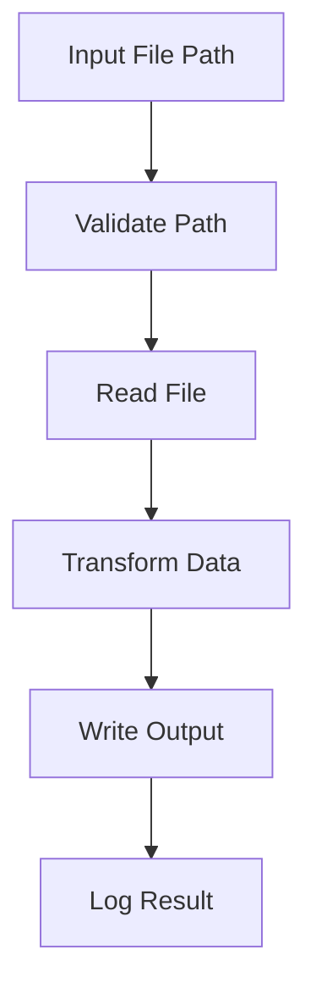

# Day 006 [Beginner]: File System Basics

## Index

- Goal
- Prerequisites
- Explanation
- Topic by Topic
- Key Concepts
- Visual Concept Map
- End-to-End Practical
- Hands-on Coding
- Mini Exercise
- Assessment Quiz
- Task
- Self Check
- Interview Questions and Answers
- Day Outcome

## Goal

Work confidently with Node.js file system operations for reading, writing, and managing files safely.

## Prerequisites

- Day 005 npm basics
- Basic async/await understanding

## Explanation

File operations are core to backend tasks like logs, reports, config loading, and local persistence. You must know when to use async APIs, sync APIs, and streams.

## Topic by Topic

### Topic 1: fs Module Essentials

Theory:
Node `fs` supports callback, promise, and sync styles.

Practical:
Prefer promise-based async APIs for most app code.

**Explanation:** The `fs` module gives Node.js the ability to work with files and directories, which is a core part of many backend and CLI tasks.

**Key Points:**

- `fs` is one of Node.js core modules.
- File operations are common in backend and tooling work.
- Learn the module before building larger automation.

### Topic 2: Read/Write Patterns

Theory:
Simple tasks use `readFile` and `writeFile`; large files need streams.

Practical:
Build a text importer and exporter utility.

**Explanation:** Read and write patterns help you choose the right API based on whether you need simple reads, writes, or more scalable data handling.

**Key Points:**

- Choose the right pattern for the file task.
- Keep reads and writes predictable.
- Simple file access is the base for many real projects.

### Topic 3: Error-aware File Access

Theory:
Common failures: file missing, permission denied, invalid JSON.

Practical:
Handle errors with clear fallback behavior.

Failure table:

| Error Code | Meaning           | Recommended Action            |
| ---------- | ----------------- | ----------------------------- |
| ENOENT     | File not found    | Create file or return default |
| EACCES     | Permission denied | Log and exit gracefully       |
| EISDIR     | Path is directory | Validate input path type      |

**Explanation:** File operations can fail for many reasons, so error-aware access is essential for reliable Node.js applications.

**Key Points:**

- Expect missing files and permission issues.
- Handle failures clearly and safely.
- Defensive file access improves reliability.

### Topic 4: Directory and Path Safety

Theory:
Never assume folders exist.
Cross-platform-safe paths should use Node path utilities.

Practical:
Use `mkdir({ recursive: true })` before writes.

**Explanation:** Directory and path safety matter because file access should stay predictable across machines and folder structures.

**Key Points:**

- Build file paths carefully.
- Avoid risky assumptions about current working directory.
- Safer path handling prevents deployment surprises.

### Topic 6: Streaming for Large Files

Theory:
Large files should be streamed to avoid loading everything into memory.

Practical:
Use `createReadStream` and `createWriteStream` for large transfers.

**Explanation:** Streaming is useful for large files because it reduces memory pressure compared with reading everything at once.

**Key Points:**

- Streams help with large-file efficiency.
- Use them when full-buffer reads are expensive.
- Streaming is a scalability tool, not just an API choice.

### Topic 5: Performance and Tradeoffs

Theory:
Sync file methods block event loop.

Practical:
Use sync only in startup scripts or tiny CLI tasks.

**Explanation:** Performance and tradeoffs help you choose between simple APIs and more scalable approaches depending on file size and workload.

**Key Points:**

- Simpler APIs are fine for small tasks.
- Larger workloads need more careful choices.
- Tradeoffs matter in both memory and code complexity.

## Key Concepts

- Core fs operations
- Async vs sync tradeoffs
- Reliable error handling
- Safe directory creation
- File I/O performance awareness
- Cross-platform path handling
- Stream-based large file processing

## Visual Concept Map



## End-to-End Practical

1. Read raw text file from input folder.
2. Parse and transform data.
3. Ensure output directory exists.
4. Write processed output file.
5. Handle all common fs errors gracefully.

## Hands-on Coding

### Example 1: Case - Read Config File Safely

Scenario:
Service should read app config from local JSON file.

```js
const fs = require("fs/promises");

async function loadConfig() {
  try {
    const raw = await fs.readFile("./config.json", "utf-8");
    return JSON.parse(raw);
  } catch (error) {
    if (error.code === "ENOENT") return { port: 3000 };
    throw error;
  }
}
```

### Example 2: Case - Create Daily Log Directory

Scenario:
CLI tool writes reports to dated folders.

```js
const fs = require("fs/promises");

async function saveLog(text) {
  await fs.mkdir("./logs/daily", { recursive: true });
  await fs.writeFile("./logs/daily/app.log", `${text}\n`, { flag: "a" });
}
```

### Example 3: Case - File Copy with Validation

Scenario:
Import script should fail clearly if source file is missing.

```js
const fs = require("fs/promises");

async function copyFileSafe(source, target) {
  try {
    await fs.copyFile(source, target);
    console.log("File copied successfully");
  } catch (error) {
    if (error.code === "ENOENT") {
      console.error("Source file not found");
      return;
    }
    throw error;
  }
}
```

### Example 4: Case - Cross-platform-safe Path Build

Scenario:
Script should run on Windows and Linux/macOS paths consistently.

```js
const path = require("node:path");

const inputPath = path.join(process.cwd(), "data", "input.txt");
const outputPath = path.join(process.cwd(), "output", "result.txt");

console.log({ inputPath, outputPath });
```

### Example 5: Case - Stream Copy for Large Files

Scenario:
Large file backup should avoid memory spikes.

```js
const fs = require("node:fs");

function streamCopy(source, target) {
  return new Promise((resolve, reject) => {
    const reader = fs.createReadStream(source);
    const writer = fs.createWriteStream(target);
    reader.on("error", reject);
    writer.on("error", reject);
    writer.on("finish", resolve);
    reader.pipe(writer);
  });
}
```

## Mini Exercise

Scenario:
Build a notes-backup script that reads notes.json and writes backup/notes-YYYY-MM-DD.json.

Expected output:

- Creates backup folder automatically
- Handles missing input file gracefully
- Writes backup with timestamped filename

## Assessment Quiz

### Quiz Questions

1. Why prefer fs/promises for app code?
2. When can sync fs methods be acceptable?
3. True or False: `writeFile` automatically creates parent directories.
4. What does ENOENT represent?
5. Why are streams preferred for large files?

### Quiz Answers

1. Cleaner async flow and non-blocking behavior.
2. Startup/bootstrap or tiny single-purpose scripts.
3. False.
4. File/path not found.
5. They reduce memory usage and improve stability for large data.

## Task

- Implement one file read + transform + write workflow
- Add explicit handling for ENOENT and invalid JSON
- Complete mini exercise and quiz

## Self Check

- You can handle common fs operations confidently
- You can write safer file I/O code with proper error handling
- You can answer at least 4 out of 5 quiz questions

## Interview Questions and Answers

### Beginner

Question: What does Node fs module do?

Answer: It provides APIs to read, write, and manage files and directories.

### Middle

Question: Why should backend services avoid heavy sync file operations?

Answer: Sync operations block the event loop and reduce concurrency.

### Advanced

Question: How do you design resilient file-processing pipelines?

Answer: Validate paths, handle expected errors, stream large files, and log outcomes for observability.

## Day 006 Outcome

- You can build practical file-processing scripts in Node.js
- You can handle file failures and directory setup safely
- You are ready for path and process modules in Day 007
