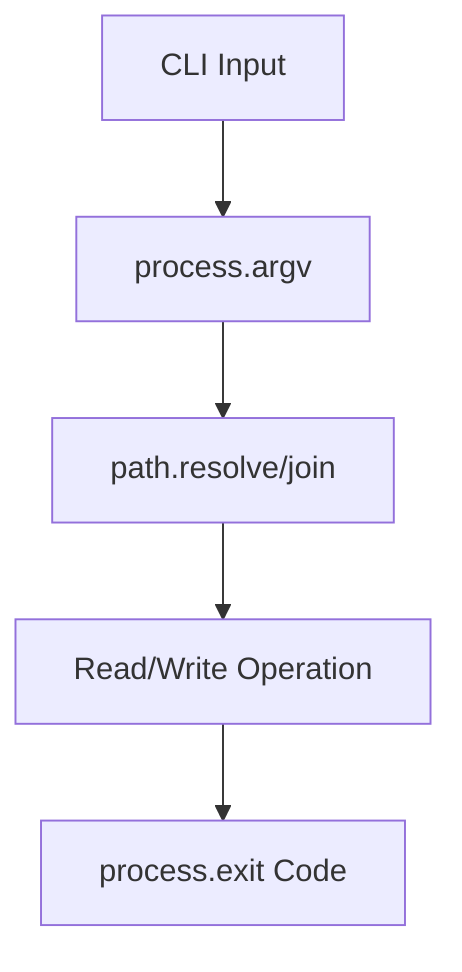

# Day 007 [Beginner]: Path and Process Modules

## Index

- Goal
- Prerequisites
- Explanation
- Topic by Topic
- Key Concepts
- Visual Concept Map
- End-to-End Practical
- Hands-on Coding
- Mini Exercise
- Assessment Quiz
- Task
- Self Check
- Interview Questions and Answers
- Day Outcome

## Goal

Use Node path and process modules to build environment-safe, cross-platform CLI and service scripts.

## Prerequisites

- Day 006 file system basics
- Basic CLI argument familiarity

## Explanation

`path` avoids hardcoded file path mistakes across Windows/Linux/macOS, and `process` gives runtime context, arguments, env variables, and exit controls.

## Topic by Topic

### Topic 1: Path Building and Normalization

Theory:
Use `path.join`, `path.resolve`, and `path.basename` for reliable path handling.

Practical:
Build absolute paths independent of OS separators.

**Explanation:** Path handling is important because file locations and separators differ across operating systems and deployment environments.

**Key Points:**

- Use path utilities instead of manual string joining.
- Normalize paths for portability.
- Cross-platform safety starts with correct path handling.

### Topic 2: Process Arguments and Environment

Theory:
`process.argv` reads CLI args, `process.env` reads configuration.

Practical:
Create CLI command with env fallback.

**Explanation:** Process arguments and environment variables let Node.js programs adapt to runtime input and deployment configuration.

**Key Points:**

- Read CLI arguments intentionally.
- Use environment variables for configuration.
- Keep runtime inputs explicit and validated.

### Topic 3: Process Lifecycle Controls

Theory:
Exit codes and signal handling matter in production scripts.
Use `process.exitCode` when possible so cleanup can finish before exit.

Practical:
Use explicit exit codes for success/failure.

**Explanation:** Process lifecycle controls matter because long-running services and scripts need predictable startup and shutdown behavior.

**Key Points:**

- Understand how Node.js processes start and stop.
- Handle exit conditions deliberately.
- Lifecycle control supports stable operations.

### Topic 6: Graceful Shutdown Basics

Theory:
Apps should stop safely when they receive stop signals like SIGINT or SIGTERM.

Practical:
Close resources and then exit with clear status.

**Explanation:** Graceful shutdown basics are important so services can stop safely without losing in-flight work or corrupting state.

**Key Points:**

- Shutdown should be controlled, not abrupt.
- Clean up resources before exiting.
- Graceful stop behavior matters in production.

### Topic 4: Runtime Metadata

Theory:
Useful values: cwd, platform, pid, version.

Practical:
Log diagnostics for supportability.

**Explanation:** Runtime metadata helps programs inspect useful process details such as platform, cwd, pid, and execution context.

**Key Points:**

- Metadata helps debugging and diagnostics.
- Know which runtime details your app depends on.
- Useful context improves observability.

### Topic 5: Cross-platform Safety

Theory:
Never hardcode path separators or shell assumptions.

Practical:
Use path module and validated command inputs.

**Explanation:** Cross-platform safety keeps scripts and tools working across Windows, macOS, and Linux without hidden environment-specific failures.

**Key Points:**

- Avoid OS-specific assumptions when possible.
- Prefer portable path and process patterns.
- Test scripts in realistic environments.

## Key Concepts

- Cross-platform path management
- CLI input and env configuration
- Process exit and runtime diagnostics
- process.exitCode vs immediate process.exit
- Portable Node scripting patterns
- Operationally safe command behavior

## Visual Concept Map



## End-to-End Practical

1. Build CLI that accepts source and output directories.
2. Normalize paths with path utilities.
3. Read environment configuration.
4. Perform operation and return meaningful exit code.
5. Print diagnostics for troubleshooting.

## Hands-on Coding

### Example 1: Case - Resolve Safe Project Paths

Scenario:
Build script should always find data directory from current working folder.

```js
const path = require("path");

const dataDir = path.resolve(process.cwd(), "data");
const inputFile = path.join(dataDir, "users.json");
console.log({ dataDir, inputFile });
```

### Example 2: Case - CLI Argument Validation

Scenario:
Script requires command and file path.

```js
const [, , command, file] = process.argv;

if (!command || !file) {
  console.error("Usage: node app.js <command> <file>");
  process.exit(1);
}

console.log(`Running ${command} for ${file}`);
```

### Example 3: Case - Environment-based Config

Scenario:
Service should choose log level by environment variable.

```js
const env = process.env.NODE_ENV || "development";
const logLevel =
  process.env.LOG_LEVEL || (env === "production" ? "warn" : "debug");

console.log({ env, logLevel, platform: process.platform, pid: process.pid });
```

### Example 4: Case - Graceful Shutdown Signal Handling

Scenario:
Service should stop cleanly when Ctrl+C or orchestrator stop is triggered.

```js
process.on("SIGINT", () => {
  console.log("Received SIGINT. Cleaning up...");
  process.exitCode = 0;
});

process.on("SIGTERM", () => {
  console.log("Received SIGTERM. Cleaning up...");
  process.exitCode = 0;
});
```

## Mini Exercise

Scenario:
Create a CLI script that takes input filename and output folder, resolves paths safely, and exits with code 1 for invalid inputs.

Expected output:

- Working cross-platform path handling
- Input validation with clear usage instructions
- Correct success/failure exit codes

## Assessment Quiz

### Quiz Questions

1. Why use path.join/path.resolve instead of string concatenation?
2. What is the role of process.argv?
3. True or False: Skipping edge-case handling is acceptable in production.
4. Why are exit codes important for automation scripts?
5. Why can graceful shutdown handling matter in real deployments?

### Quiz Answers

1. They produce OS-safe paths and avoid separator bugs.
2. It contains command-line arguments passed to the Node process.
3. False.
4. CI and shell pipelines rely on them to detect failures.
5. It prevents abrupt termination and reduces risk of incomplete work.

## Task

- Implement one CLI script using path and process modules
- Add argument validation and explicit exit code behavior
- Complete mini exercise and quiz.

## Self Check

- You can build safer cross-platform Node scripts.
- You can use process context for robust automation tasks.
- You can answer at least 4 out of 5 quiz questions.

## Interview Questions and Answers

### Beginner

Question: Why is the path module important in Node.js?

Answer: It prevents cross-platform path bugs and keeps file operations portable.

### Middle

Question: What is a common process-module use case in production?

Answer: Reading environment variables and returning proper exit codes in deployment scripts.

### Advanced

Question: How do you design portable automation scripts across operating systems?

Answer: Use path utilities, avoid shell-specific assumptions, validate args, and use deterministic exit codes.

## Day 007 Outcome

- You can build reliable path and process-driven tooling
- You can avoid common portability and automation failures
- You are ready for Node events and EventEmitter in Day 008
