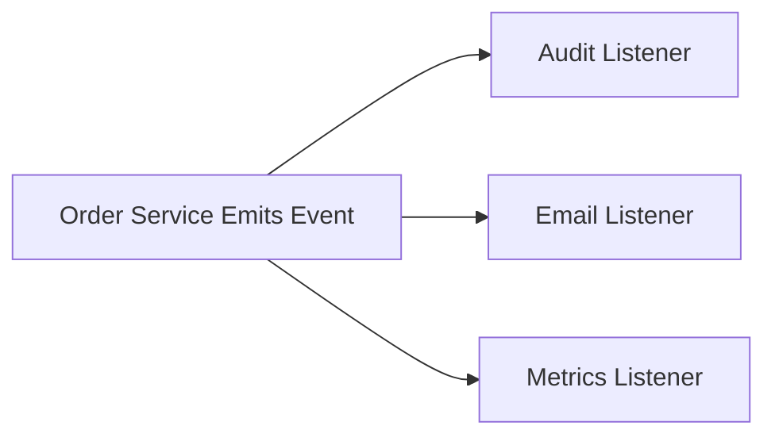

# Day 008 [Beginner]: Events and EventEmitter

## Index

- Goal
- Prerequisites
- Explanation
- Topic by Topic
- Key Concepts
- Visual Concept Map
- End-to-End Practical
- Hands-on Coding
- Mini Exercise
- Assessment Quiz
- Task
- Self Check
- Interview Questions and Answers
- Day Outcome

## Goal

Understand Node's event-driven model and build practical EventEmitter-based workflows for decoupled logic.

## Prerequisites

- Day 007 path/process concepts
- Basic async JavaScript and callbacks

## Explanation

Events are central in Node. EventEmitter enables publish/subscribe patterns where one component emits events and multiple listeners react independently.

## Topic by Topic

### Topic 1: Event-driven Architecture Basics

Theory:
Emitters broadcast named events with optional payloads.
By default, listeners run synchronously in registration order.

Practical:
Design one producer and multiple consumers.

**Explanation:** Event-driven architecture is a natural fit for Node.js because many runtime operations are based on asynchronous events and callbacks.

**Key Points:**

- Events are central to Node.js design.
- Event-driven patterns reduce direct coupling.
- Useful in both core APIs and app-level logic.

### Topic 2: Listener Lifecycle

Theory:
Use on, once, and removeListener carefully to avoid leaks.

Practical:
Attach and clean listeners in long-running services.

**Explanation:** Listener lifecycle matters because adding, removing, and managing listeners incorrectly can cause bugs or memory issues.

**Key Points:**

- Manage listeners deliberately.
- Remove listeners when they are no longer needed.
- Lifecycle mistakes can create leaks.

### Topic 3: Error Events and Safety

Theory:
Unhandled error events can crash process.

Practical:
Always define error listeners.

**Explanation:** Error events are special because unhandled event errors can crash a Node.js process if not managed carefully.

**Key Points:**

- Treat error events with extra care.
- Always plan for event failure paths.
- Safe error handling improves runtime stability.

### Topic 4: Decoupling with Domain Events

Theory:
Events allow logging, notifications, and analytics without tight coupling.

Practical:
Emit ORDER_PLACED and attach separate handlers.

**Explanation:** Domain events help separate producers from consumers so system parts can communicate without tight direct dependencies.

**Key Points:**

- Use events to decouple related modules.
- Keep event names and payloads meaningful.
- Avoid event sprawl without structure.

### Topic 5: Performance and Memory Considerations

Theory:
Too many listeners may indicate architecture issues.

Practical:
Use listener limits and cleanup strategy.

**Explanation:** Event patterns affect performance and memory because too many listeners or poorly managed ones can degrade application health.

**Key Points:**

- Watch listener counts and usage patterns.
- Avoid unnecessary event complexity.
- Performance issues can hide in event-heavy code.

### Topic 6: Async Listener Strategy

Theory:
If one listener does heavy work, it can delay others because emit is synchronous.

Practical:
Move heavy work to async boundaries such as `setImmediate` or job queues.

**Explanation:** Async listener strategy matters because listeners may trigger asynchronous work that needs its own error handling and ordering decisions.

**Key Points:**

- Understand async behavior inside listeners.
- Handle failures from async listener work.
- Keep event flow predictable under load.

## Key Concepts

- Publish/subscribe event flow
- Listener lifecycle management
- Safe error-event handling
- Decoupled feature extension via events
- Synchronous listener execution order
- Async offloading for heavy listeners
- Memory-aware listener practices

## Visual Concept Map



## End-to-End Practical

1. Create custom EventEmitter instance.
2. Emit business event with payload.
3. Attach multiple listeners.
4. Add one-time listener and cleanup flow.
5. Add error handling listener.

## Hands-on Coding

### Example 1: Case - Order Event Fan-out

Scenario:
When order is placed, notify billing and analytics listeners.

```js
const EventEmitter = require("events");
const bus = new EventEmitter();

bus.on("order:placed", (payload) => {
  console.log("Billing queued for", payload.orderId);
});

bus.on("order:placed", (payload) => {
  console.log("Analytics tracked", payload.orderId);
});

bus.emit("order:placed", { orderId: "ORD-101" });
```

### Example 2: Case - once Listener for Startup Event

Scenario:
Warmup task should run only once after app boot.

```js
bus.once("app:ready", () => {
  console.log("Warm cache only once");
});

bus.emit("app:ready");
bus.emit("app:ready");
```

### Example 3: Case - Error Event Safety

Scenario:
Event pipeline should not crash silently on processing failure.

```js
bus.on("error", (error) => {
  console.error("Event pipeline error:", error.message);
});

try {
  throw new Error("Email provider unavailable");
} catch (error) {
  bus.emit("error", error);
}
```

### Example 4: Case - Offload Heavy Listener Work

Scenario:
One event triggers CPU-heavy post-processing; do not block the immediate event chain.

```js
bus.on("report:generate", (payload) => {
  setImmediate(() => {
    console.log("Processing report in async boundary", payload.reportId);
  });
});
```

## Mini Exercise

Scenario:
Build a mini notification bus with events: user:signup and payment:failed.

Expected output:

- Multiple listeners per event
- Error listener present
- one-time listener for startup sequence

## Assessment Quiz

### Quiz Questions

1. Why use EventEmitter instead of direct function calls everywhere?
2. What is the difference between on and once?
3. True or False: Skipping edge-case handling is acceptable in production.
4. Why should you handle the error event explicitly?
5. Why might heavy listener code hurt event-driven performance?

### Quiz Answers

1. It decouples producer and consumers and improves extensibility.
2. on listens repeatedly, once listens for first emission only.
3. False.
4. Unhandled error events can destabilize the process.
5. Because emit runs listeners synchronously and one slow listener delays others.

## Task

- Build one EventEmitter-based mini workflow
- Include listener cleanup and error handling strategy
- Complete mini exercise and quiz.

## Self Check

- You can design and debug event-driven Node patterns.
- You can prevent common listener and error pitfalls.
- You can answer at least 4 out of 5 quiz questions.

## Interview Questions and Answers

### Beginner

Question: What is EventEmitter used for?

Answer: It lets one module emit events and other modules react without tight coupling.

### Middle

Question: When is event-driven design a good fit?

Answer: When multiple independent actions must react to one domain event.

### Advanced

Question: What are tradeoffs of EventEmitter-heavy systems?

Answer: Better decoupling but harder event tracing unless naming and observability are disciplined.

## Day 008 Outcome

- You can implement practical event-driven modules in Node
- You can manage listener lifecycle and error-event safety
- You are ready for CLI mini project in Day 009
