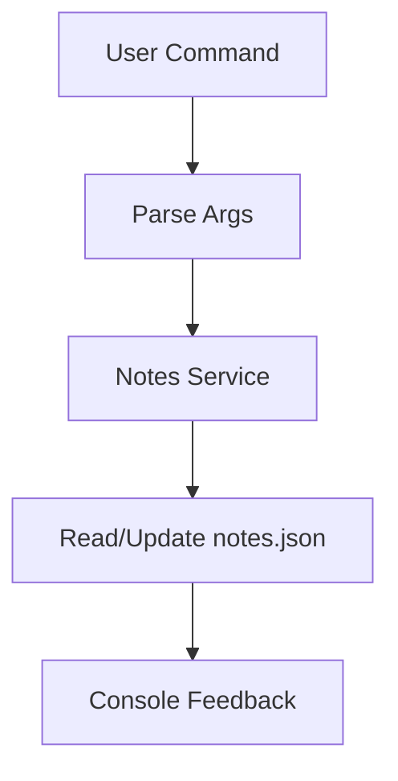

# Day 009 [Beginner]: Mini Project - CLI Notes

## Index

- Goal
- Prerequisites
- Explanation
- Topic by Topic
- Key Concepts
- Visual Concept Map
- End-to-End Practical
- Hands-on Coding
- Mini Exercise
- Assessment Quiz
- Task
- Self Check
- Interview Questions and Answers
- Day Outcome

## Goal

Build a real CLI Notes Manager using Node fundamentals: process args, path/fs modules, and event-driven logging.

## Prerequisites

- Day 001 to Day 008 concepts
- Comfortable running Node scripts with arguments

## Explanation

This mini project combines core Node skills into one practical tool: add/list/remove/search notes from terminal with persistent file storage.

## Topic by Topic

### Topic 1: CLI Command Design

Theory:
Commands should be predictable and user-friendly.

Practical:
Define command syntax: add, list, remove, search.

**Explanation:** Good CLI command design keeps tools intuitive because commands, options, and output should match user intent clearly.

**Key Points:**

- Keep commands simple and memorable.
- Make usage patterns consistent.
- Good DX starts with clear CLI design.

### Topic 2: File-backed Persistence

Theory:
Use JSON file as local datastore for beginner CLI projects.

Practical:
Read/write notes.json safely with defaults.

**Explanation:** File-backed persistence is a practical beginner project pattern because it stores data without requiring a full database setup.

**Key Points:**

- Local files are enough for small CLI projects.
- Persistence makes the tool feel real and useful.
- Keep file format and storage path predictable.

### Topic 3: Validation and Edge Cases

Theory:
CLI inputs can be empty, duplicate, or malformed.

Practical:
Validate title uniqueness and required fields.

**Explanation:** Validation and edge cases matter because CLI tools are easy to misuse if input rules are unclear or missing.

**Key Points:**

- Validate user input before saving.
- Handle empty or malformed commands gracefully.
- Edge-case handling improves trust in the tool.

### Topic 4: User Feedback and DX

Theory:
Good CLI tools provide clear success/failure messages.

Practical:
Add consistent output for each command.

**Explanation:** User feedback and developer experience are both important in CLI apps because clear output makes tools easier to use and debug.

**Key Points:**

- Show clear success and failure messages.
- Keep output concise but informative.
- Friendly CLI output improves usability.

### Topic 6: Safe Write Strategy

Theory:
Directly writing main JSON file can risk data loss if process stops mid-write.

Practical:
Write to a temp file first, then rename to notes.json.

**Explanation:** Safe write strategy helps prevent accidental data loss or corrupted files during save operations.

**Key Points:**

- Think about write safety before the project grows.
- Protect stored notes from accidental overwrite issues.
- Safe persistence improves reliability.

### Topic 5: Refactoring into Modules

Theory:
Separate command parsing, storage, and note logic.

Practical:
Create notes.service and cli.controller modules.

**Explanation:** Refactoring into modules makes the mini project easier to maintain because commands, persistence, and validation become easier to separate.

**Key Points:**

- Split growing CLI logic into modules.
- Keep responsibilities separated clearly.
- Refactoring supports future feature growth.

## Key Concepts

- Command-driven interface design
- JSON file persistence strategy
- Input validation and conflict handling
- User-friendly CLI feedback patterns
- Help/usage-first CLI experience
- Safer write/update behavior
- Modular project organization

## Visual Concept Map



## End-to-End Practical

1. Build command parser for add/list/remove/search.
2. Add storage layer for notes.json.
3. Add validation for empty and duplicate titles.
4. Add error handling for missing datastore file.
5. Refactor into reusable modules.

## Hands-on Coding

### Example 1: Case - Add and List Notes

Scenario:
Developer wants personal CLI note tracker.

```js
const fs = require("fs/promises");

async function loadNotes() {
  try {
    return JSON.parse(await fs.readFile("notes.json", "utf-8"));
  } catch {
    return [];
  }
}

async function addNote(title, body) {
  const notes = await loadNotes();
  notes.push({ id: Date.now(), title, body });
  await fs.writeFile("notes.json", JSON.stringify(notes, null, 2));
}
```

### Example 2: Case - Duplicate Title Guard

Scenario:
Team wants unique note titles to avoid confusion.

```js
async function addNoteUnique(title, body) {
  const notes = await loadNotes();
  if (notes.some((n) => n.title.toLowerCase() === title.toLowerCase())) {
    console.error("Note title already exists.");
    return;
  }
  notes.push({ id: Date.now(), title, body });
  await fs.writeFile("notes.json", JSON.stringify(notes, null, 2));
  console.log("Note added.");
}
```

### Example 3: Case - Search Command

Scenario:
User needs quick text search across notes.

```js
async function searchNotes(keyword) {
  const notes = await loadNotes();
  const matches = notes.filter((n) =>
    `${n.title} ${n.body}`.toLowerCase().includes(keyword.toLowerCase()),
  );
  console.log(matches);
}
```

### Example 4: Case - Command Help Fallback

Scenario:
User runs wrong command and needs immediate guidance.

```js
function printHelp() {
  console.log("Usage: node app.js <add|list|remove|search> [options]");
}

const [, , command] = process.argv;
if (!command || !["add", "list", "remove", "search"].includes(command)) {
  printHelp();
  process.exitCode = 1;
}
```

### Example 5: Case - Atomic-style File Save

Scenario:
Avoid corrupted notes file during unexpected interruption.

```js
const fs = require("fs/promises");

async function saveNotesSafe(notes) {
  const temp = "notes.tmp.json";
  await fs.writeFile(temp, JSON.stringify(notes, null, 2));
  await fs.rename(temp, "notes.json");
}
```

## Mini Exercise

Scenario:
Build a complete CLI notes app with commands add/list/remove/search and data persistence.

Expected output:

- All commands work via terminal
- Handles duplicate title and missing file safely
- Uses modular structure (cli + service)

## Assessment Quiz

### Quiz Questions

1. Why is CLI notes project useful for Node beginners?
2. What should be validated before adding a note?
3. True or False: Skipping edge-case handling is acceptable in production.
4. Why should datastore load have fallback when file is missing?
5. Why can writing to a temp file before rename be safer?

### Quiz Answers

1. It combines core Node modules into a practical product-like tool.
2. Required fields and uniqueness constraints.
3. False.
4. First-run app may not have notes.json yet.
5. It reduces risk of partial/corrupt main file writes.

## Task

- Build working CLI notes mini project end-to-end
- Add at least two edge-case safeguards
- Complete mini exercise and quiz.

## Self Check

- You can build a practical Node CLI project independently.
- You can structure beginner projects with maintainable modules.
- You can answer at least 4 out of 5 quiz questions.

## Interview Questions and Answers

### Beginner

Question: Why is this mini project important?

Answer: It integrates multiple Node fundamentals into one usable tool.

### Middle

Question: How do you keep CLI project maintainable as features grow?

Answer: Separate command parsing, business logic, and storage into dedicated modules.

### Advanced

Question: What are tradeoffs of JSON-file persistence for CLI apps?

Answer: Very simple to implement, but limited for concurrency and large data size.

## Day 009 Outcome

- You can implement a real Node CLI notes application
- You can validate and persist command-driven data safely
- You are ready for stream fundamentals in Day 010
