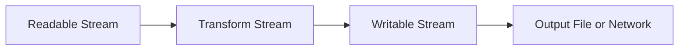

# Day 010 [Beginner]: Streams Fundamentals

## Index

- Goal
- Prerequisites
- Explanation
- Topic by Topic
- Key Concepts
- Visual Concept Map
- End-to-End Practical
- Hands-on Coding
- Mini Exercise
- Assessment Quiz
- Task
- Self Check
- Interview Questions and Answers
- Day Outcome

## Goal

Understand Node streams and build memory-efficient data pipelines for large file processing.

## Prerequisites

- Day 006 file system basics
- Day 008 events basics

## Explanation

Streams process data chunk-by-chunk instead of loading everything in memory. They are essential for large files, logs, media, and network data.

## Topic by Topic

### Topic 1: Stream Types

Theory:
Readable, Writable, Duplex, and Transform are the four main stream types.

Practical:
Use readable + writable for file copy pipeline.

**Explanation:** Stream types are important because Node.js handles many data flows incrementally rather than loading everything into memory at once.

**Key Points:**

- Understand readable, writable, duplex, and transform streams.
- Stream type affects how data moves.
- Stream fundamentals support many backend tasks.

### Topic 2: Pipe-based Data Flow

Theory:
`pipe()` connects streams and handles backpressure automatically in many cases.

Practical:
Pipe input file to output file.

**Explanation:** Pipe-based flow is powerful because it connects stream sources and destinations with simple, readable code.

**Key Points:**

- Pipes connect stream stages cleanly.
- Use pipelines to simplify data movement.
- Pipe patterns reduce manual buffering code.

### Topic 3: Backpressure and Memory

Theory:
Backpressure prevents fast producers from overwhelming consumers.

Practical:
Prefer stream pipeline over readFile for large files.

**Explanation:** Backpressure is one of the most important stream concepts because it protects memory and keeps producers and consumers balanced.

**Key Points:**

- Backpressure prevents overwhelming consumers.
- Stream control affects scalability.
- Memory efficiency depends on balanced flow.

### Topic 4: Stream Error Handling

Theory:
Pipelines must capture and report stream failures.

Practical:
Use pipeline helper with centralized error callback.

**Explanation:** Stream error handling matters because stream pipelines can fail at different stages and need safe recovery paths.

**Key Points:**

- Handle errors across the full stream chain.
- Do not assume every chunk operation succeeds.
- Safe error handling keeps pipelines reliable.

### Topic 5: Transform Streams

Theory:
Transform streams modify data in-flight.

Practical:
Build uppercase or line-prefix transformation pipeline.

**Explanation:** Transform streams are useful when data must be changed while it is moving, such as formatting, parsing, or filtering.

**Key Points:**

- Transform streams combine reading and writing.
- Use them for in-flight data processing.
- They are powerful building blocks in Node.js.

### Topic 6: Flow Tuning Basics

Theory:
`highWaterMark` controls internal buffer size and can affect throughput and memory.

Practical:
Tune only after measurement; start with defaults for beginner projects.

**Explanation:** Flow tuning basics help you understand how stream behavior can be adjusted for better performance and stability in real workloads.

**Key Points:**

- Tune stream flow when workloads demand it.
- Performance and stability often depend on stream configuration.
- Small stream decisions can have large runtime impact.

## Key Concepts

- Stream type mental model
- Chunk-based processing
- Backpressure-aware architecture
- Pipeline-level error handling
- Transform stream extensibility
- stream/promises pipeline usage
- highWaterMark awareness

## Visual Concept Map



## End-to-End Practical

1. Create read stream from large input file.
2. Pipe to transform stream for data formatting.
3. Write into output stream.
4. Handle stream errors.
5. Compare memory usage vs readFile approach.

## Hands-on Coding

### Example 1: Case - File Copy Pipeline

Scenario:
Copy large log file without high memory usage.

```js
const fs = require("fs");

const reader = fs.createReadStream("./big.log");
const writer = fs.createWriteStream("./backup.log");

reader.pipe(writer);
writer.on("finish", () => console.log("Copy complete"));
```

### Example 2: Case - Pipeline Error Handling

Scenario:
Report export pipeline should fail safely if source is missing.

```js
const fs = require("fs");
const { pipeline } = require("stream");

pipeline(
  fs.createReadStream("./missing.txt"),
  fs.createWriteStream("./out.txt"),
  (error) => {
    if (error) console.error("Pipeline failed:", error.code);
    else console.log("Pipeline succeeded");
  },
);
```

### Example 3: Case - Transform Stream Formatter

Scenario:
Convert incoming text stream to uppercase before saving.

```js
const fs = require("fs");
const { Transform, pipeline } = require("stream");

const upper = new Transform({
  transform(chunk, _enc, cb) {
    cb(null, chunk.toString().toUpperCase());
  },
});

pipeline(
  fs.createReadStream("./input.txt"),
  upper,
  fs.createWriteStream("./output.txt"),
  (error) => {
    if (error) console.error(error);
  },
);
```

### Example 4: Case - Promise-based Pipeline

Scenario:
Use async/await style for cleaner stream error handling.

```js
const fs = require("node:fs");
const { pipeline } = require("node:stream/promises");

async function copyLargeFile() {
  await pipeline(
    fs.createReadStream("./input.txt"),
    fs.createWriteStream("./output.txt"),
  );
}
```

### Example 5: Case - Buffer Tuning Option

Scenario:
Large sequential read needs controlled buffering.

```js
const reader = fs.createReadStream("./big.log", {
  highWaterMark: 64 * 1024,
});
```

## Mini Exercise

Scenario:
Build a log processor that reads a large log file, transforms lines, and writes output via streams.

Expected output:

- Uses stream pipeline end-to-end
- Includes error handling callback
- Demonstrates one transform operation

## Assessment Quiz

### Quiz Questions

1. Why are streams preferred for large files?
2. What does pipe do in Node streams?
3. True or False: Skipping edge-case handling is acceptable in production.
4. What is backpressure in simple terms?
5. What does highWaterMark influence in stream processing?

### Quiz Answers

1. They process data in chunks and avoid loading full content into memory.
2. It forwards data from readable to writable stream.
3. False.
4. Producer sends data faster than consumer can handle.
5. Internal buffering size, which impacts memory and throughput behavior.

## Task

- Implement one readable->transform->writable stream pipeline
- Compare memory behavior vs readFile approach
- Complete mini exercise and quiz.

## Self Check

- You can use streams for memory-efficient file processing.
- You can handle stream pipeline failures safely.
- You can answer at least 4 out of 5 quiz questions.

## Interview Questions and Answers

### Beginner

Question: What is a stream in Node.js?

Answer: A stream is a way to process data chunk-by-chunk over time.

### Middle

Question: When should you choose streams over readFile?

Answer: For large data or continuous input where memory efficiency matters.

### Advanced

Question: What are stream architecture tradeoffs?

Answer: Better memory efficiency and throughput, but more complexity in flow control and error handling.

## Day 010 Outcome

- You can build stream-based Node pipelines confidently
- You can reason about performance and backpressure tradeoffs
- You are ready for intermediate Node service architecture topics next
