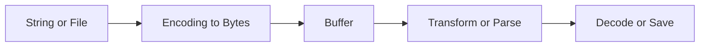

# Day 011 [Beginner]: Buffers and Binary Data

## Index

- Goal
- Prerequisites
- Explanation
- Topic by Topic
- Key Concepts
- Visual Concept Map
- End-to-End Practical
- Hands-on Coding
- Mini Exercise
- Assessment Quiz
- Task
- Self Check
- Interview Questions and Answers
- Day Outcome

## Goal

Learn how Node.js handles binary data using Buffer and apply it in file, network, and encoding scenarios.

## Prerequisites

- Day 010 streams fundamentals
- Basic JavaScript arrays and strings

## Explanation

Buffer is a raw memory structure used for binary data. It is core for streams, file processing, cryptography, and protocol parsing.

## Topic by Topic

### Topic 1: What is a Buffer?

Theory:
Buffer stores bytes directly. Each value is from 0 to 255.

Practical:
Create buffers from strings, arrays, and fixed-size allocations.

**Explanation:** Buffers are Node.js objects for working with raw binary data, which is useful when text strings are not enough.

**Key Points:**

- Buffers store bytes directly.
- They are common in files, streams, and networking.
- They are different from normal JavaScript strings.

### Topic 2: Encoding and Decoding

Theory:
Text is encoded bytes. Common encodings: utf8, base64, hex.
Character count and byte count can be different for non-English text.

Practical:
Convert text to base64 and back.

**Explanation:** Encoding and decoding explain how raw bytes become readable text and how text becomes bytes again.

**Key Points:**

- Encoding affects how bytes are interpreted.
- Use the correct encoding for reliable text handling.
- Wrong encoding can corrupt data.

### Topic 3: Binary Data Operations

Theory:
You can read/write specific bytes and slice sections.
Multi-byte numbers need correct byte order (endianness) when reading or writing.

Practical:
Parse custom binary packet header.

**Explanation:** Binary operations let you inspect, slice, copy, and transform raw byte data for low-level tasks.

**Key Points:**

- Buffer operations work at the byte level.
- Useful for protocols and binary formats.
- Low-level work needs careful attention to detail.

### Topic 6: Byte Length and Endianness Basics

Theory:
`Buffer.byteLength` tells actual byte size, and LE/BE methods control number byte order.

Practical:
Use readUInt16LE/readUInt16BE correctly when parsing protocol fields.

**Explanation:** Byte length and endianness basics matter when reading structured binary formats or interacting with lower-level systems.

**Key Points:**

- Byte length is not always the same as string length.
- Endianness affects multi-byte value interpretation.
- These details matter in binary protocols.

### Topic 4: Buffer with Streams and Files

Theory:
Read streams produce Buffer chunks unless encoding is set.

Practical:
Inspect chunk sizes and raw bytes.

**Explanation:** Buffers are often used with streams and files because binary data frequently moves through those APIs.

**Key Points:**

- Streams and files often expose buffer-based workflows.
- Buffers help move non-text data efficiently.
- This topic connects low-level bytes to real Node.js tasks.

### Topic 5: Safety and Performance

Theory:
`Buffer.allocUnsafe` is fast but must be filled before use.

Practical:
Choose safe APIs first for beginner and production clarity.

**Explanation:** Safety and performance matter because buffer misuse can cause memory waste, bugs, or incorrect binary handling.

**Key Points:**

- Treat raw byte work carefully.
- Prefer safe APIs and explicit intent.
- Performance gains should not reduce correctness.

## Key Concepts

- Byte-level memory representation
- Encodings and data conversions
- Character length vs byte length
- Buffer manipulation methods
- Buffer behavior in stream pipelines
- Endianness-aware number parsing
- Safe allocation choices

## Visual Concept Map



## End-to-End Practical

1. Read binary file chunk-by-chunk.
2. Parse first bytes as metadata.
3. Convert selected section to text.
4. Re-encode output as base64.
5. Save transformed binary snapshot.

## Hands-on Coding

### Example 1: Case - Buffer Basics and Encoding

Scenario:
System needs token serialization for secure transfer.

```js
const plain = "user:42:admin";

const asBuffer = Buffer.from(plain, "utf8");
const encoded = asBuffer.toString("base64");
const decoded = Buffer.from(encoded, "base64").toString("utf8");

console.log({ encoded, decoded });
```

### Example 2: Case - Parse Binary Header

Scenario:
Telemetry packet first 4 bytes = version, type, status, checksum.

```js
const packet = Buffer.from([1, 16, 3, 255, 72, 101, 108, 108, 111]);

const header = {
  version: packet.readUInt8(0),
  type: packet.readUInt8(1),
  status: packet.readUInt8(2),
  checksum: packet.readUInt8(3),
};

const body = packet.subarray(4).toString("utf8");
console.log({ header, body });
```

### Example 3: Case - Stream Chunk Inspection

Scenario:
Debug large file ingestion with chunk byte details.

```js
const fs = require("fs");

const rs = fs.createReadStream("./input.bin");
rs.on("data", (chunk) => {
  console.log("Chunk bytes:", chunk.length, "first byte:", chunk[0]);
});
rs.on("end", () => console.log("Read complete"));
```

### Example 4: Case - Byte Length vs String Length

Scenario:
Need accurate payload byte size before network send.

```js
const text = "Hello नमस्ते";
console.log("chars:", text.length);
console.log("bytes:", Buffer.byteLength(text, "utf8"));
```

### Example 5: Case - Endianness Read Example

Scenario:
Protocol stores a 16-bit value in little-endian format.

```js
const buf = Buffer.from([0x34, 0x12]);
console.log("LE value:", buf.readUInt16LE(0)); // 4660
console.log("BE value:", buf.readUInt16BE(0)); // 13330
```

## Mini Exercise

Scenario:
Build utility that reads a file, prints file size in bytes, and outputs its base64 preview (first 64 bytes only).

Expected output:

- Reads binary safely
- Extracts first 64 bytes
- Prints readable diagnostics

## Assessment Quiz

### Quiz Questions

1. What does Buffer store internally?
2. Difference between utf8 and base64 output?
3. True or False: Buffer values are always 0 to 255.
4. Why use Buffer in stream processing?
5. Why is endianness important while parsing binary numbers?

### Quiz Answers

1. Raw bytes in memory.
2. utf8 is text representation, base64 is encoded transport-friendly representation.
3. True.
4. Streams deliver binary chunks efficiently.
5. Wrong byte order gives incorrect numeric values.

## Task

- Build one binary parser using Buffer methods
- Add encoding conversion utf8 <-> base64
- Complete mini exercise and quiz

## Self Check

- You can explain Buffer with byte-level understanding
- You can parse and transform binary data
- You can answer at least 4 out of 5 quiz questions

## Interview Questions and Answers

### Beginner

Question: Why do we need Buffer in Node.js?

Answer: JavaScript strings are not enough for binary data; Buffer gives byte-level control.

### Middle

Question: When do you set stream encoding and when not?

Answer: Set encoding when you want text chunks; keep raw Buffer chunks for binary processing.

### Advanced

Question: How do you design binary protocols safely?

Answer: Define fixed headers, validate lengths/checksum, avoid unsafe memory patterns, and guard decode errors.

## Day 011 Outcome

- You can work with Buffer APIs confidently
- You can encode/decode and parse binary payloads
- You are ready for async control patterns in Day 012
