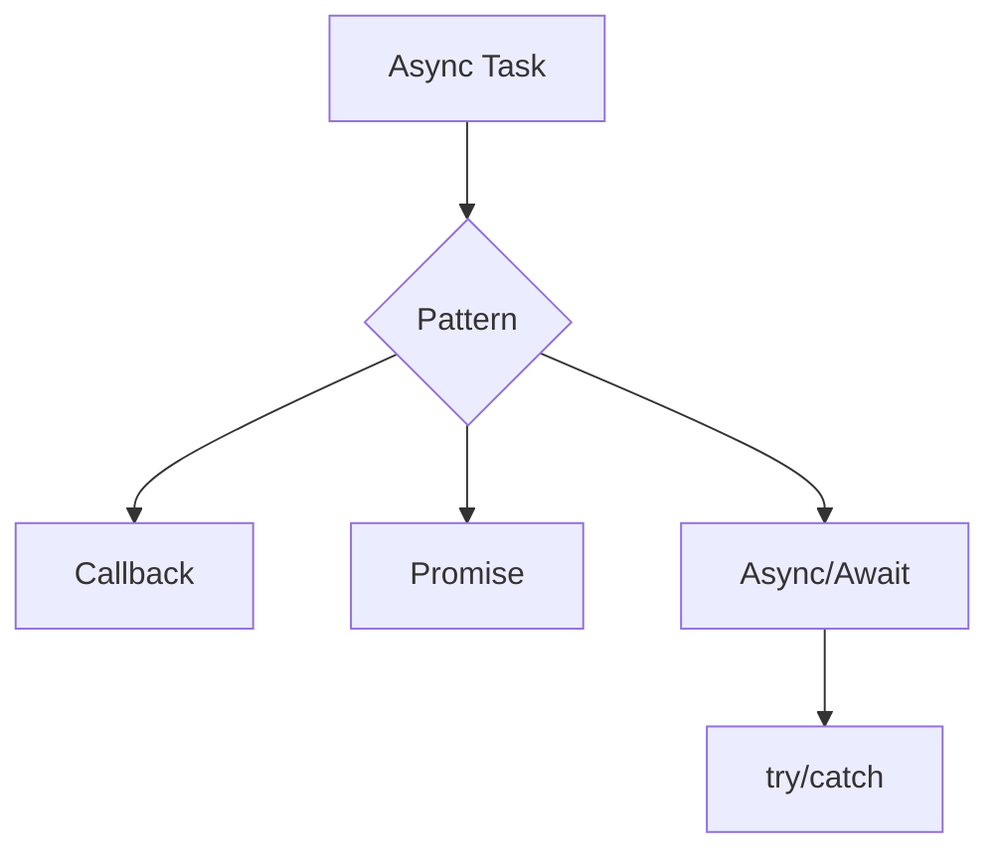

# Day 012 [Beginner]: Async Patterns - Callbacks, Promises, Async/Await

## Index

- Goal
- Prerequisites
- Explanation
- Topic by Topic
- Key Concepts
- Visual Concept Map
- End-to-End Practical
- Hands-on Coding
- Mini Exercise
- Assessment Quiz
- Task
- Self Check
- Interview Questions and Answers
- Day Outcome

## Goal

Master Node asynchronous patterns and choose the right model for readable, reliable backend workflows.

## Prerequisites

- Day 011 Buffer concepts
- JavaScript functions and error basics

## Explanation

Node I/O is asynchronous by design. Understanding callback style, Promise chains, and async/await is critical for clean APIs and robust error handling.

## Topic by Topic

### Topic 1: Callback Pattern

Theory:
Classic Node callbacks use error-first style: `(err, data)`.

Practical:
Wrap callback APIs when migrating legacy code.

**Explanation:** The callback pattern is the historical base of async Node.js code, so understanding it helps explain many older APIs and legacy codebases.

**Key Points:**

- Callbacks are an important Node.js foundation.
- Many older APIs still use them.
- They can become hard to manage at scale.

### Topic 2: Promises and Chaining

Theory:
Promises improve composition and centralized error handling.

Practical:
Use `.then/.catch` for sequential operations.

**Explanation:** Promises improve async readability by making sequencing and error handling more structured than nested callbacks.

**Key Points:**

- Promises flatten nested async flows.
- Chaining supports ordered async logic.
- Error handling becomes easier to centralize.

### Topic 3: Async/Await Style

Theory:
Async/await gives linear syntax over promise behavior.

Practical:
Use try/catch with awaited calls.

**Explanation:** Async/await gives promise-based code a more synchronous-looking style, which often improves maintainability.

**Key Points:**

- Async/await improves readability.
- It still runs on promises underneath.
- Use try/catch for async error handling.

### Topic 4: Parallel vs Sequential Execution

Theory:
Independent tasks should use parallel execution.

Practical:
Use `Promise.all` for concurrency gains.

**Explanation:** Parallel and sequential execution choices affect both performance and correctness depending on whether tasks depend on each other.

**Key Points:**

- Run independent work in parallel when safe.
- Keep dependent work sequential.
- Execution strategy changes response time.

### Topic 6: Timeouts and Partial-failure Strategy

Theory:
Real services need time limits and sometimes partial success instead of full failure.

Practical:
Use timeout wrappers and `Promise.allSettled` where partial results are acceptable.

**Explanation:** Timeouts and partial-failure handling matter because not every async task succeeds, and waiting forever is often unacceptable.

**Key Points:**

- Plan for delays and partial failures.
- Use time limits where appropriate.
- Build async logic for resilience, not only success.

### Topic 5: Common Mistakes and Fixes

Theory:
Forgotten `await`, unhandled rejections, and mixed styles create hidden bugs.

Practical:
Apply linting and explicit return patterns.

**Explanation:** Common mistakes in async code usually come from lost error handling, missing awaits, or choosing the wrong execution model.

**Key Points:**

- Watch for forgotten awaits and swallowed errors.
- Keep async flows explicit.
- Debugging becomes easier when patterns stay consistent.

## Key Concepts

- Error-first callback mental model
- Promise chaining and propagation
- Async/await readability patterns
- Concurrency with Promise utilities
- Promise.all vs Promise.allSettled decision
- Timeout boundaries for external calls
- Unhandled rejection prevention

## Visual Concept Map



## End-to-End Practical

1. Build function that fetches user, orders, and payment status.
2. Implement callback version.
3. Refactor to Promise version.
4. Refactor to async/await version.
5. Add parallel optimization with Promise.all.

## Hands-on Coding

### Example 1: Case - Callback Style

Scenario:
Legacy library exposes callback APIs for profile loading.

```js
function getProfile(id, cb) {
  setTimeout(() => {
    if (!id) return cb(new Error("id required"));
    cb(null, { id, name: "Asha" });
  }, 100);
}

getProfile(101, (err, user) => {
  if (err) return console.error(err.message);
  console.log(user);
});
```

### Example 2: Case - Promise + Async/Await Refactor

Scenario:
Service team wants cleaner async flow and error control.

```js
function getOrders(userId) {
  return new Promise((resolve, reject) => {
    if (!userId) return reject(new Error("userId required"));
    setTimeout(() => resolve([{ id: "O-1" }, { id: "O-2" }]), 120);
  });
}

async function run() {
  try {
    const orders = await getOrders(101);
    console.log(orders);
  } catch (error) {
    console.error(error.message);
  }
}

run();
```

### Example 3: Case - Parallel Async Calls

Scenario:
Dashboard requires user, tasks, and alerts quickly.

```js
const wait = (ms, value) => new Promise((r) => setTimeout(() => r(value), ms));

async function loadDashboard() {
  const [user, tasks, alerts] = await Promise.all([
    wait(100, { id: 1, name: "Asha" }),
    wait(120, ["task-1", "task-2"]),
    wait(80, ["alert-1"]),
  ]);
  return { user, tasks, alerts };
}

loadDashboard().then(console.log);
```

### Example 4: Case - Partial Success with allSettled

Scenario:
Dashboard should show available data even if one source fails.

```js
const tasks = [
  wait(100, { user: "Asha" }),
  Promise.reject(new Error("alerts service down")),
  wait(80, { stats: [1, 2] }),
];

const results = await Promise.allSettled(tasks);
console.log(results.map((r) => r.status));
```

### Example 5: Case - Simple Timeout Wrapper

Scenario:
External API call must fail fast after fixed limit.

```js
function withTimeout(promise, ms) {
  return Promise.race([
    promise,
    new Promise((_, reject) =>
      setTimeout(() => reject(new Error("Operation timed out")), ms),
    ),
  ]);
}
```

## Mini Exercise

Scenario:
Create user-report builder that collects data from three async sources and handles partial failures.

Expected output:

- Uses async/await with try/catch
- Uses Promise.all for independent tasks
- Includes one retry or fallback behavior

## Assessment Quiz

### Quiz Questions

1. Why did Node historically use callbacks?
2. When should you prefer Promise.all?
3. True or False: Skipping edge-case handling is acceptable in production.
4. What is callback hell and how do you avoid it?
5. When should you choose Promise.allSettled over Promise.all?

### Quiz Answers

1. Non-blocking I/O required asynchronous completion handling.
2. When tasks are independent and can run in parallel.
3. False.
4. Deep nested callbacks; use promises/async functions and modular helpers.
5. When you need all outcomes, even if some operations fail.

## Task

- Implement one async workflow in callback and async/await style
- Add one parallel optimization with Promise.all
- Complete mini exercise and quiz.

## Self Check

- You can refactor between callback, promise, and async/await styles.
- You can debug common asynchronous failure patterns.
- You can answer at least 4 out of 5 quiz questions.

## Interview Questions and Answers

### Beginner

Question: What is async/await solving compared to callbacks?

Answer: It reduces nesting and makes asynchronous logic easier to read and maintain.

### Middle

Question: Is Promise.all always better than sequential awaits?

Answer: Only when operations are independent; dependent operations should stay sequential.

### Advanced

Question: How do you design resilient async services?

Answer: Combine clear error boundaries, retries/timeouts, and observability for rejected operations.

## Day 012 Outcome

- You can choose the right async pattern by scenario
- You can improve performance via safe concurrency
- You are ready for robust error handling patterns in Day 013
