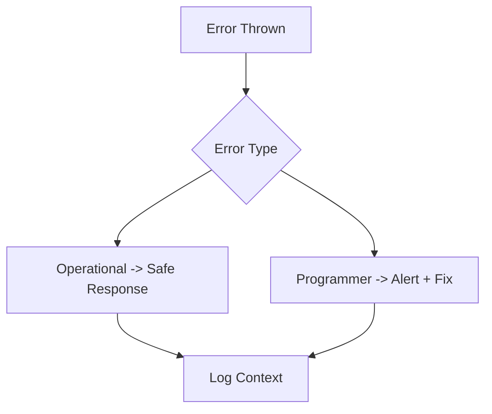

# Day 013 [Beginner]: Error Handling Patterns

## Index

- Goal
- Prerequisites
- Explanation
- Topic by Topic
- Key Concepts
- Visual Concept Map
- End-to-End Practical
- Hands-on Coding
- Mini Exercise
- Assessment Quiz
- Task
- Self Check
- Interview Questions and Answers
- Day Outcome

## Goal

Build production-friendly error handling in Node applications with clear user messages and actionable logs.

## Prerequisites

- Day 012 async patterns
- Basic understanding of HTTP status codes

## Explanation

Backend reliability depends on how errors are classified, propagated, logged, and surfaced. Good error handling reduces outages and accelerates debugging.

## Topic by Topic

### Topic 1: Error Taxonomy

Theory:
Differentiate operational errors (expected) and programmer errors (bugs).

Practical:
Return safe responses for operational errors.

**Explanation:** Error taxonomy helps teams classify failures so handling and logging can match the type and severity of the problem.

**Key Points:**

- Not all errors should be treated the same way.
- Categorization improves response quality.
- Clear error types aid debugging and monitoring.

### Topic 2: Try/Catch Boundaries

Theory:
Use local try/catch where recovery is possible; centralize where shared handling is required.

Practical:
Wrap async handlers and map to standard API response shape.

**Explanation:** Try/catch boundaries matter because error handling should happen at deliberate layers, not randomly everywhere.

**Key Points:**

- Catch errors where you can act on them.
- Avoid hiding useful failure details.
- Keep handling boundaries intentional.

### Topic 3: Custom Error Classes

Theory:
Custom error types carry status code and machine-readable code.

Practical:
Implement `AppError` for validation and not-found scenarios.

**Explanation:** Custom error classes make failures easier to identify and handle because they carry clearer meaning than generic errors.

**Key Points:**

- Use custom classes for domain-specific failures.
- Add structure to important error cases.
- Clear error types support safer fallback logic.

### Topic 4: Logging and Observability

Theory:
Logs should include context but avoid sensitive data.

Practical:
Add request id and operation name in error logs.

**Explanation:** Logging and observability ensure that failures are visible and actionable instead of disappearing silently in production.

**Key Points:**

- Log errors with useful context.
- Connect failures to monitoring when possible.
- Observability improves incident response.

### Topic 5: Process-level Safety

Theory:
Handle uncaught exceptions and unhandled rejections to avoid silent failures.

Practical:
Gracefully shutdown and restart via process manager.

**Explanation:** Process-level safety matters because some errors affect the health of the whole running service, not just one request.

**Key Points:**

- Understand when the whole process is at risk.
- Guard global failure paths carefully.
- Stability depends on safe process behavior.

### Topic 6: Error Cause and Safe Fallback

Theory:
Sometimes one error is caused by another lower-level error. Keep that cause for debugging, while returning a safe message to users.

Practical:
Wrap low-level errors in AppError and preserve original cause for logs.

## Error Response Table

| Situation          | Status | Message (Client)      | Log Detail (Server) |
| ------------------ | ------ | --------------------- | ------------------- |
| Validation failed  | 400    | Invalid request data  | field-level detail  |
| Resource missing   | 404    | Resource not found    | id + lookup context |
| Unexpected failure | 500    | Internal server error | stack + trace id    |

**Explanation:** Error cause and safe fallback patterns help services degrade gracefully instead of failing in confusing or dangerous ways.

**Key Points:**

- Preserve useful cause information.
- Use fallbacks where they are safe.
- Prefer controlled degradation over hidden failure.

## Key Concepts

- Operational vs programmer errors
- Error boundaries in async flow
- Custom error metadata strategy
- Structured server logging
- Process-level crash safety
- Error cause chaining for better debugging
- Safe fallback messages for unknown failures

## Visual Concept Map



## End-to-End Practical

1. Define AppError class.
2. Throw typed errors from service layer.
3. Catch errors in centralized handler.
4. Map to API response contract.
5. Log details with correlation id.

## Hands-on Coding

### Example 1: Case - AppError Class

Scenario:
API should return meaningful status and code.

```js
class AppError extends Error {
  constructor(message, status = 500, code = "INTERNAL_ERROR") {
    super(message);
    this.status = status;
    this.code = code;
  }
}

throw new AppError("Email already exists", 409, "EMAIL_CONFLICT");
```

### Example 2: Case - Centralized Handler

Scenario:
Consistent JSON response across all API failures.

```js
function errorHandler(err, req, res, next) {
  const status = err.status || 500;
  const code = err.code || "INTERNAL_ERROR";

  console.error({
    traceId: req.headers["x-trace-id"],
    path: req.url,
    code,
    message: err.message,
  });

  res.status(status).json({
    success: false,
    code,
    message: status === 500 ? "Internal server error" : err.message,
  });
}
```

### Example 3: Case - Async Route Wrapper

Scenario:
Avoid repetitive try/catch in every route.

```js
const asyncHandler = (fn) => (req, res, next) =>
  Promise.resolve(fn(req, res, next)).catch(next);

app.get(
  "/users/:id",
  asyncHandler(async (req, res) => {
    const user = await findUser(req.params.id);
    if (!user) throw new AppError("User not found", 404, "USER_NOT_FOUND");
    res.json(user);
  }),
);
```

### Example 4: Case - Preserve Root Cause

Scenario:
Database layer fails, but API should return a clean message and keep debug context.

```js
class AppError extends Error {
  constructor(message, status = 500, code = "INTERNAL_ERROR", cause) {
    super(message);
    this.status = status;
    this.code = code;
    this.cause = cause;
  }
}

async function getUserSafe(id) {
  try {
    return await db.findUser(id);
  } catch (error) {
    throw new AppError("Could not fetch user", 503, "USER_FETCH_FAILED", error);
  }
}
```

## Mini Exercise

Scenario:
Build user profile API with typed errors and centralized error middleware.

Expected output:

- Typed errors for validation/not-found
- Consistent API error response shape
- Trace-id based error logs

## Assessment Quiz

### Quiz Questions

1. Difference between operational and programmer errors?
2. Why use custom error classes?
3. True or False: Skipping edge-case handling is acceptable in production.
4. Why avoid exposing raw stack traces to clients?
5. Why keep original error cause in server logs?

### Quiz Answers

1. Operational errors are expected runtime cases; programmer errors are code defects.
2. They standardize status/code/message behavior.
3. False.
4. It leaks internals and can expose security details.
5. It helps faster root-cause analysis without exposing internals to clients.

## Task

- Implement custom error class + centralized handler
- Add one logging strategy with trace/correlation id
- Complete mini exercise and quiz.

## Self Check

- You can classify and respond to backend errors correctly.
- You can build safer, diagnosable error pipelines.
- You can answer at least 4 out of 5 quiz questions.

## Interview Questions and Answers

### Beginner

Question: Why is centralized error handling important?

Answer: It ensures consistent responses and reduces duplicated error logic.

### Middle

Question: Should all errors return 500?

Answer: No, known errors should map to meaningful status codes like 400/404/409.

### Advanced

Question: What is one tradeoff of rich error abstraction?

Answer: Better consistency but slightly more setup and discipline across teams.

## Day 013 Outcome

- You can create robust Node error handling patterns
- You can build API-safe responses with useful observability
- You are ready for raw HTTP server work in Day 014
