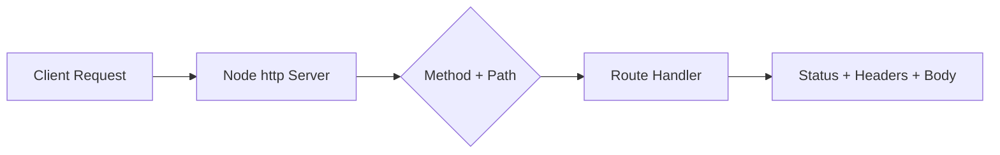

# Day 014 [Beginner]: HTTP Module Basics

## Index

- Goal
- Prerequisites
- Explanation
- Topic by Topic
- Key Concepts
- Visual Concept Map
- End-to-End Practical
- Hands-on Coding
- Mini Exercise
- Assessment Quiz
- Task
- Self Check
- Interview Questions and Answers
- Day Outcome

## Goal

Build and test raw Node HTTP servers, handle routing basics, and return structured API responses.

## Prerequisites

- Day 013 error handling patterns
- Basic JSON format understanding

## Explanation

Before frameworks, Node offers the built-in http module. Learning it clarifies request/response flow, headers, status codes, and manual routing logic.

## Topic by Topic

### Topic 1: Request-Response Lifecycle

Theory:
Server receives request object and writes response object.

Practical:
Return status, headers, and body manually.

**Explanation:** The request-response lifecycle is the core of HTTP work in Node.js, so understanding it helps every later API topic make sense.

**Key Points:**

- Every HTTP interaction follows a request-response flow.
- Node.js gives low-level control over this lifecycle.
- Strong lifecycle understanding supports better API design.

### Topic 2: Basic Routing Without Framework

Theory:
Routing can be done with URL path and method checks.

Practical:
Implement GET and POST routes.

**Explanation:** Basic routing without a framework teaches the underlying mechanics before Express or other abstractions hide the details.

**Key Points:**

- Manual routing shows how servers decide behavior.
- Useful for learning HTTP fundamentals.
- Framework knowledge is stronger after low-level understanding.

### Topic 3: Reading Request Body

Theory:
Incoming data arrives in chunks.

Practical:
Accumulate body and parse JSON safely.

**Explanation:** Reading request bodies correctly is important because APIs often need to process incoming data safely and predictably.

**Key Points:**

- Request bodies arrive as streamed data.
- Parsing must be done carefully.
- Body handling affects correctness and security.

### Topic 6: URL Parsing and Body-size Guard

Theory:
Raw HTTP handlers should parse query params safely and limit request body size to reduce abuse risk.

Practical:
Use URL parsing and reject oversized payloads with 413 status.

**Explanation:** URL parsing and body-size guards protect server logic from malformed or oversized requests.

**Key Points:**

- Parse URLs deliberately.
- Limit body size for safety.
- Guards reduce abuse and instability.

### Topic 4: Status Codes and Headers

Theory:
Correct headers/status create predictable client behavior.

Practical:
Set `Content-Type: application/json` and proper status.

**Explanation:** Status codes and headers carry essential HTTP meaning, so they should be used intentionally instead of as afterthoughts.

**Key Points:**

- Status codes describe the result clearly.
- Headers carry important metadata.
- Good HTTP semantics improve client-server contracts.

### Topic 5: Limitations and Evolution

Theory:
Raw http is educational but verbose for larger apps.

Practical:
Identify when to move to Express/Fastify.

## Quick Decision Table

| Requirement                   | Raw http Module | Framework |
| ----------------------------- | --------------- | --------- |
| Learn low-level flow          | Excellent       | Moderate  |
| Fast feature development      | Weak            | Strong    |
| Built-in middleware ecosystem | No              | Yes       |

**Explanation:** Understanding limitations and evolution helps explain why low-level HTTP knowledge is useful even if most projects later adopt frameworks.

**Key Points:**

- Core HTTP APIs teach the underlying model.
- Frameworks solve real complexity on top of these basics.
- Knowing the lower level improves debugging later.

## Key Concepts

- Low-level request/response handling
- Manual route dispatching
- Body parsing through stream chunks
- Query-string parsing basics
- Request size safety guard
- Standards-based HTTP responses
- Framework migration tradeoffs

## Visual Concept Map



## End-to-End Practical

1. Create raw HTTP server on port 3000.
2. Add GET /health and GET /users route.
3. Add POST /users with JSON body parsing.
4. Return proper status codes and errors.
5. Test via curl or Postman.

## Hands-on Coding

### Example 1: Case - Minimal JSON Server

Scenario:
Team needs internal health endpoint.

```js
const http = require("http");

const server = http.createServer((req, res) => {
  if (req.method === "GET" && req.url === "/health") {
    res.writeHead(200, { "Content-Type": "application/json" });
    return res.end(JSON.stringify({ status: "ok" }));
  }

  res.writeHead(404, { "Content-Type": "application/json" });
  res.end(JSON.stringify({ message: "Not found" }));
});

server.listen(3000, () => console.log("Server on 3000"));
```

### Example 2: Case - POST Body Parsing

Scenario:
Client submits JSON to create user.

```js
if (req.method === "POST" && req.url === "/users") {
  let body = "";

  req.on("data", (chunk) => {
    body += chunk;
  });

  req.on("end", () => {
    try {
      const data = JSON.parse(body);
      res.writeHead(201, { "Content-Type": "application/json" });
      res.end(JSON.stringify({ id: Date.now(), ...data }));
    } catch {
      res.writeHead(400, { "Content-Type": "application/json" });
      res.end(JSON.stringify({ message: "Invalid JSON" }));
    }
  });
}
```

### Example 3: Case - Route Registry Refactor

Scenario:
As endpoints grow, route logic should stay maintainable.

```js
const routes = {
  "GET:/health": (req, res) => {
    res.writeHead(200, { "Content-Type": "application/json" });
    res.end(JSON.stringify({ status: "ok" }));
  },
};

const key = `${req.method}:${req.url}`;
if (routes[key]) return routes[key](req, res);
```

### Example 4: Case - Query Param Parsing

Scenario:
Products endpoint supports optional category filter.

```js
const { URL } = require("node:url");

const url = new URL(req.url, `http://${req.headers.host}`);
const category = url.searchParams.get("category");
```

### Example 5: Case - Request Body Limit Guard

Scenario:
Server should reject too-large POST payloads.

```js
let body = "";
const MAX_BYTES = 1_000_000; // 1 MB

req.on("data", (chunk) => {
  body += chunk;
  if (Buffer.byteLength(body) > MAX_BYTES) {
    res.writeHead(413, { "Content-Type": "application/json" });
    res.end(JSON.stringify({ message: "Payload too large" }));
    req.destroy();
  }
});
```

## Mini Exercise

Scenario:
Create raw HTTP API for products with GET /products and POST /products.

Expected output:

- Proper status and JSON headers
- Safe invalid JSON handling
- Cleaner route organization

## Assessment Quiz

### Quiz Questions

1. Why should backend devs learn raw http module?
2. How is request body received in Node http server?
3. True or False: Skipping edge-case handling is acceptable in production.
4. Why is Content-Type header important?
5. Why should raw HTTP servers enforce body-size limits?

### Quiz Answers

1. It explains low-level HTTP mechanics and improves debugging skills.
2. Through streamed chunks and end event.
3. False.
4. Clients depend on correct parsing expectations.
5. It protects memory and reduces misuse or accidental oversized requests.

## Task

- Build one raw HTTP server with at least 2 routes
- Add body parsing + invalid JSON handling
- Complete mini exercise and quiz.

## Self Check

- You can build and test low-level Node HTTP servers.
- You can reason clearly about request/response internals.
- You can answer at least 4 out of 5 quiz questions.

## Interview Questions and Answers

### Beginner

Question: What does http.createServer give you?

Answer: A low-level server where you control routing, headers, status, and response body.

### Middle

Question: Is raw http suitable for enterprise APIs?

Answer: Usually no for large systems; frameworks are faster for scalable architecture.

### Advanced

Question: What is the biggest tradeoff of raw http?

Answer: Full control and learning value, but more boilerplate and slower feature delivery.

## Day 014 Outcome

- You can implement a working API using only Node core http
- You can handle request parsing and response shaping correctly
- You are ready for REST API design basics in Day 015
