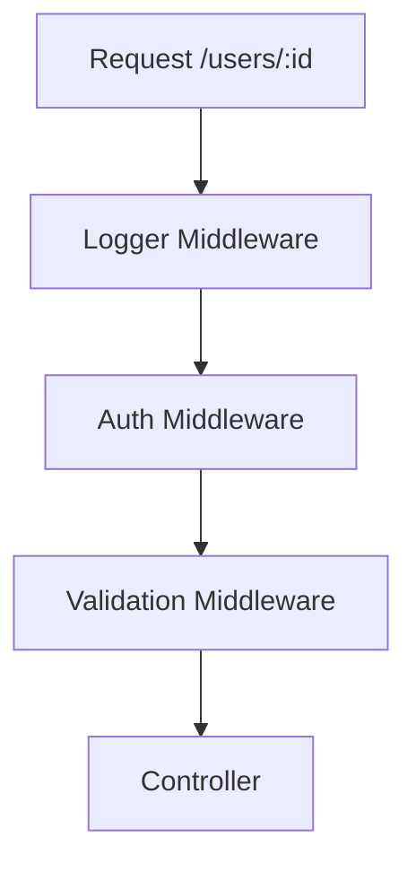

# Day 017 [Beginner]: Express Routing and Middleware

## Index

- Goal
- Prerequisites
- Explanation
- Topic by Topic
- Key Concepts
- Visual Concept Map
- End-to-End Practical
- Hands-on Coding
- Mini Exercise
- Assessment Quiz
- Task
- Self Check
- Interview Questions and Answers
- Day Outcome

## Goal

Design maintainable Express route modules and reusable middleware chains for real API workflows.

## Prerequisites

- Day 016 Express fundamentals
- Basic REST route naming

## Explanation

As APIs grow, route files can become messy. Router-level organization and middleware composition keep code readable and safer.

## Topic by Topic

### Topic 1: Router-level Modular Design

Theory:
Use Express Router to split feature domains.

Practical:
Create users.routes and orders.routes modules.

**Explanation:** Router-level modular design keeps route logic grouped by feature or domain instead of collecting everything in one central file.

**Key Points:**

- Group related routes together.
- Modular routers scale better than one large route file.
- Clear boundaries improve team ownership.

### Topic 2: Middleware Types

Theory:
Global, route-specific, and error middleware serve different needs.

Practical:
Apply auth middleware only to protected routes.

**Explanation:** Middleware types matter because different middleware serve different responsibilities like auth, logging, validation, or transformation.

**Key Points:**

- Use middleware for focused responsibilities.
- Different middleware types serve different layers.
- Clear separation improves readability.

### Topic 3: Route Parameters and Query Patterns

Theory:
Params identify resources; query refines collections.

Practical:
Add route GET /users/:id and filter query role=admin.

**Explanation:** Route parameters and query patterns help APIs accept dynamic input in a structured and readable way.

**Key Points:**

- Params identify specific resources.
- Queries modify search or filtering behavior.
- Use each pattern intentionally.

### Topic 4: Middleware Chaining

Theory:
Multiple middleware can run before final controller.

Practical:
Compose validation + auth + handler.

**Explanation:** Middleware chaining is powerful because it lets a request pass through multiple reusable steps before the final handler runs.

**Key Points:**

- Chain middleware in a deliberate order.
- Keep each middleware focused.
- Good chaining reduces repeated logic.

### Topic 6: Async Middleware and Shared Context

Theory:
Async middleware can fail silently if errors are not forwarded, and `res.locals` is useful for passing trusted data between middleware and controller.

Practical:
Store authenticated user in `res.locals` and call `next(error)` on failures.

**Explanation:** Async middleware and shared context become important when request processing includes database calls, auth checks, or per-request data.

**Key Points:**

- Async middleware needs safe error handling.
- Shared context can reduce duplicate lookups.
- Keep request-scoped data well defined.

### Topic 5: Common Routing Pitfalls

Theory:
Route order and wildcard placement can hide endpoints.

Practical:
Place specific routes before generic wildcard handlers.

**Explanation:** Common routing pitfalls often come from ambiguous paths, badly ordered middleware, or unclear parameter usage.

**Key Points:**

- Watch route and middleware order carefully.
- Avoid path designs that confuse clients.
- Simpler routing usually scales better.

## Key Concepts

- Feature-based route modules
- Middleware scope and composition
- Param and query handling patterns
- Async middleware error forwarding
- `res.locals` for shared request context
- Route ordering correctness
- Clean API expansion strategy

## Visual Concept Map



## End-to-End Practical

1. Create modular routers for users and orders.
2. Add global logger middleware.
3. Add route-level auth middleware for orders.
4. Add params and query-based endpoints.
5. Add not-found and error middleware.

## Hands-on Coding

### Example 1: Case - Router Module Split

Scenario:
API team wants domain-wise separation.

```js
const express = require("express");
const usersRouter = express.Router();

usersRouter.get("/", (req, res) => {
  res.json({ success: true, data: [] });
});

usersRouter.get("/:id", (req, res) => {
  res.json({ success: true, userId: req.params.id });
});

module.exports = usersRouter;
```

### Example 2: Case - Auth Middleware on Protected Routes

Scenario:
Only authenticated users can access orders APIs.

```js
function requireAuth(req, res, next) {
  const token = req.headers.authorization;
  if (!token)
    return res.status(401).json({ success: false, message: "Unauthorized" });
  next();
}

app.use("/orders", requireAuth, ordersRouter);
```

### Example 3: Case - Composed Middleware Chain

Scenario:
Order creation requires auth + body validation.

```js
const validateOrder = (req, res, next) => {
  if (!req.body.itemName) {
    return res
      .status(400)
      .json({ success: false, message: "itemName required" });
  }
  next();
};

app.post("/orders", requireAuth, validateOrder, (req, res) => {
  res.status(201).json({ success: true, data: req.body });
});
```

### Example 4: Case - Shared Context with res.locals

Scenario:
Auth middleware resolves user once and makes it available to later handlers.

```js
async function requireAuth(req, res, next) {
  try {
    const token = req.headers.authorization;
    if (!token)
      return res.status(401).json({ success: false, message: "Unauthorized" });

    // Simulated user lookup
    res.locals.user = { id: "u-101", role: "member" };
    next();
  } catch (error) {
    next(error);
  }
}
```

### Example 5: Case - Async Middleware Error Forwarding

Scenario:
Database check fails in middleware and should go to central error handler.

```js
const checkOrderWindow = async (req, res, next) => {
  try {
    const isOpen = await Promise.resolve(true);
    if (!isOpen)
      return res
        .status(403)
        .json({ success: false, message: "Ordering closed" });
    next();
  } catch (error) {
    next(error);
  }
};
```

## Mini Exercise

Scenario:
Build users and orders modules with route-level auth and validation middleware.

Expected output:

- Domain routers implemented
- Middleware chain for protected routes
- Proper 404 fallback handler

## Assessment Quiz

### Quiz Questions

1. Why split APIs using Express Router modules?
2. Difference between global and route middleware?
3. True or False: Skipping edge-case handling is acceptable in production.
4. Why does route declaration order matter?
5. Why use `res.locals` in middleware chains?

### Quiz Answers

1. It improves maintainability and keeps features isolated.
2. Global runs for all routes; route middleware runs only for targeted paths.
3. False.
4. Generic routes can shadow specific routes if placed early.
5. It passes trusted request-scoped data between middleware and handlers.

## Task

- Build one modular router structure with two features
- Add at least two middleware layers before controller
- Complete mini exercise and quiz.

## Self Check

- You can compose middleware safely for real routes.
- You can structure API routing for growth.
- You can answer at least 4 out of 5 quiz questions.

## Interview Questions and Answers

### Beginner

Question: Why is middleware called the backbone of Express APIs?

Answer: It centralizes cross-cutting concerns like auth, logging, validation, and error handling.

### Middle

Question: Should every route have auth middleware?

Answer: No, only protected routes should enforce auth.

### Advanced

Question: What is one middleware architecture tradeoff?

Answer: Better reuse and separation, but debugging flow can be harder if middleware stacks are deep.

## Day 017 Outcome

- You can organize scalable Express routing modules
- You can apply middleware chains with confidence
- You are ready for request validation patterns in Day 018
