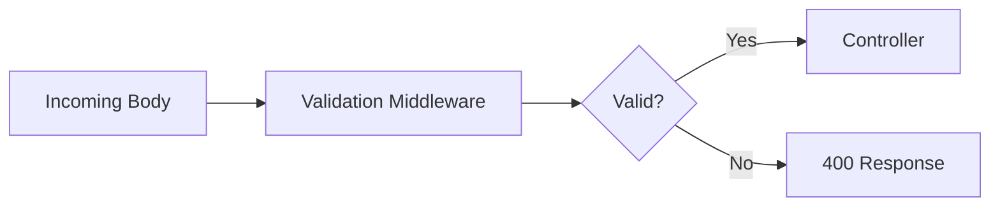

# Day 018 [Beginner]: Request Validation with Zod or Joi

## Index

- Goal
- Prerequisites
- Explanation
- Topic by Topic
- Key Concepts
- Visual Concept Map
- End-to-End Practical
- Hands-on Coding
- Mini Exercise
- Assessment Quiz
- Task
- Self Check
- Interview Questions and Answers
- Day Outcome

## Goal

Validate incoming request data reliably using schema-first techniques with Zod or Joi.

## Prerequisites

- Day 017 routing and middleware
- Basic JSON payload understanding

## Explanation

Validation prevents invalid data from reaching business logic. Schema libraries provide readable contracts and consistent error messages.

## Topic by Topic

### Topic 1: Why Validation Matters

Theory:
Bad input causes logic bugs, database errors, and security risks.

Practical:
Reject invalid payloads early in middleware.

**Explanation:** Validation matters because backend systems should never trust incoming request data by default.

**Key Points:**

- Unvalidated input creates bugs and security risk.
- Validation improves API reliability.
- Clear validation makes client behavior easier to debug.

### Topic 2: Schema-first Workflow

Theory:
Define schema once, reuse across routes.

Practical:
Build create-user schema and validate body.

**Explanation:** Schema-first workflow makes validation easier to reason about because rules are written explicitly instead of scattered through handler logic.

**Key Points:**

- Centralize validation rules in schemas.
- Schemas improve reuse and clarity.
- Explicit rules are easier to test.

### Topic 3: Zod vs Joi

Theory:
Both are strong; choice depends on team style and ecosystem.

Practical:
Implement one route example for each.

**Explanation:** Zod and Joi both solve similar problems, so choosing between them should depend on project needs and team preference.

**Key Points:**

- Learn the strengths of each library.
- Pick one consistent validation approach.
- Avoid mixing tools without reason.

### Topic 4: Error Response Strategy

Theory:
Clients need structured validation feedback.

Practical:
Return array of field-level messages.

**Explanation:** Error response strategy matters because validation failures should be helpful to clients without exposing unnecessary internals.

**Key Points:**

- Keep validation errors structured.
- Help clients fix bad requests quickly.
- Avoid vague or inconsistent error messages.

### Topic 5: Reusable Validation Middleware

Theory:
Keep controllers clean by handling validation centrally.

Practical:
Create validate(schema) middleware factory.

**Explanation:** Reusable validation middleware keeps handlers cleaner by separating input checks from business logic.

**Key Points:**

- Move validation out of controllers when possible.
- Reuse middleware across similar routes.
- Cleaner handlers are easier to maintain.

### Topic 6: Validate Query and Params Too

Theory:
Only validating body is not enough. IDs and query filters also need validation.

Practical:
Validate `req.params` and `req.query`, and block unknown fields when needed.

## Comparison Table

| Criteria           | Zod                   | Joi                     |
| ------------------ | --------------------- | ----------------------- |
| TypeScript synergy | Strong                | Moderate                |
| API style          | Functional and modern | Mature and feature-rich |
| Error formatting   | Good defaults         | Highly customizable     |

**Explanation:** Query strings and route params need validation too, because unsafe input is not limited to request bodies.

**Key Points:**

- Validate every external input surface.
- Queries and params can break logic too.
- Consistent validation improves trust in the API.

## Key Concepts

- Schema-driven contract enforcement
- Validation middleware composition
- Field-level error design
- Body, params, and query validation coverage
- Unknown-field handling policy
- Library choice tradeoffs
- Controller simplification through middleware

## Visual Concept Map



## End-to-End Practical

1. Define user and product schemas.
2. Build reusable validate middleware factory.
3. Apply schemas on POST/PATCH routes.
4. Format consistent validation error responses.
5. Test with valid and invalid payloads.

## Hands-on Coding

### Example 1: Case - Zod Validation Middleware

Scenario:
Signup API must enforce name, email, and password rules.

```js
const { z } = require("zod");

const signupSchema = z.object({
  name: z.string().min(2),
  email: z.string().email(),
  password: z.string().min(8),
});

const validate = (schema) => (req, res, next) => {
  const result = schema.safeParse(req.body);
  if (!result.success) {
    return res
      .status(400)
      .json({ success: false, errors: result.error.issues });
  }
  req.body = result.data;
  next();
};
```

### Example 2: Case - Joi Validation Example

Scenario:
Orders API uses Joi in existing codebase.

```js
const Joi = require("joi");

const orderSchema = Joi.object({
  itemName: Joi.string().required(),
  quantity: Joi.number().integer().min(1).required(),
});

app.post("/orders", (req, res) => {
  const { error, value } = orderSchema.validate(req.body, {
    abortEarly: false,
  });
  if (error) {
    return res
      .status(400)
      .json({ success: false, errors: error.details.map((d) => d.message) });
  }
  res.status(201).json({ success: true, data: value });
});
```

### Example 3: Case - Route Integration

Scenario:
Validation should run before controller logic.

```js
app.post("/users", validate(signupSchema), (req, res) => {
  res.status(201).json({ success: true, user: req.body });
});
```

### Example 4: Case - Params Validation (Zod)

Scenario:
Route `/users/:id` should reject non-numeric ids.

```js
const idParamSchema = z.object({
  id: z.coerce.number().int().positive(),
});

app.get("/users/:id", (req, res) => {
  const result = idParamSchema.safeParse(req.params);
  if (!result.success) {
    return res
      .status(400)
      .json({ success: false, errors: result.error.issues });
  }
  res.json({ success: true, userId: result.data.id });
});
```

### Example 5: Case - Unknown-field Rejection (Joi)

Scenario:
Signup should reject extra fields not in contract.

```js
const strictSignup = Joi.object({
  name: Joi.string().min(2).required(),
  email: Joi.string().email().required(),
}).unknown(false);
```

## Mini Exercise

Scenario:
Create POST /customers with validation rules and structured field errors.

Expected output:

- Middleware-based validation flow
- Invalid payload rejection with 400
- Consistent error payload shape

## Assessment Quiz

### Quiz Questions

1. Why validate at route boundary instead of inside service logic?
2. What is the benefit of schema reuse?
3. True or False: Skipping edge-case handling is acceptable in production.
4. Why should validation errors be client-friendly?
5. Why validate query params and route params too?

### Quiz Answers

1. It blocks bad data early and keeps core logic clean.
2. Consistency and reduced duplication across endpoints.
3. False.
4. API consumers need actionable field-level correction details.
5. Because invalid IDs or filters can break logic even when body is valid.

## Task

- Implement one route schema and validation middleware
- Add unified error output for invalid requests
- Complete mini exercise and quiz.

## Self Check

- You can protect APIs with schema-based validation.
- You can produce stable, usable validation errors.
- You can answer at least 4 out of 5 quiz questions.

## Interview Questions and Answers

### Beginner

Question: Why is validation middleware preferred in Express?

Answer: It centralizes input checks and keeps controllers focused on business actions.

### Middle

Question: Should validation stop at required fields only?

Answer: No, it should also include format, range, and domain constraints.

### Advanced

Question: What is one schema-validation tradeoff?

Answer: Better reliability and contracts, with a small overhead in schema maintenance.

## Day 018 Outcome

- You can implement route-level validation confidently
- You can choose practical patterns between Zod and Joi
- You are ready for logging and observability in Day 019
