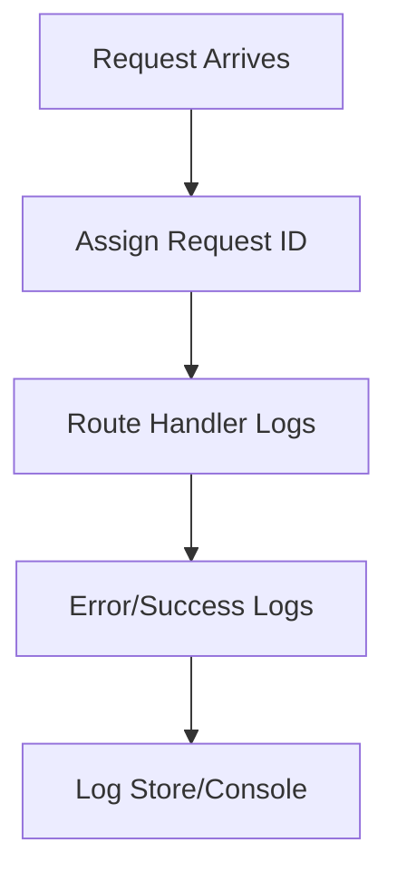

# Day 019 [Beginner]: Logging with Pino or Winston

## Index

- Goal
- Prerequisites
- Explanation
- Topic by Topic
- Key Concepts
- Visual Concept Map
- End-to-End Practical
- Hands-on Coding
- Mini Exercise
- Assessment Quiz
- Task
- Self Check
- Interview Questions and Answers
- Day Outcome

## Goal

Implement structured logging in Node APIs using Pino or Winston with useful operational context.

## Prerequisites

- Day 018 request validation
- Basic understanding of HTTP status and errors

## Explanation

Logs are your primary debugging signal in production. Structured logs with levels, metadata, and correlation identifiers make incidents faster to diagnose.

## Topic by Topic

### Topic 1: Logging Levels and Semantics

Theory:
Use trace, debug, info, warn, and error intentionally.

Practical:
Choose level by impact and audience.

**Explanation:** Logging levels and semantics matter because not every event has the same importance or urgency.

**Key Points:**

- Use levels consistently.
- Match log level to real severity.
- Good semantics improve filtering and alerting.

### Topic 2: Structured Logging

Theory:
JSON logs are machine-readable and searchable.

Practical:
Log request id, route, duration, and status.

**Explanation:** Structured logging makes logs easier for systems and teams to parse, search, and analyze at scale.

**Key Points:**

- Prefer structured fields over loose text when practical.
- Better structure improves observability.
- Machine-readable logs scale better.

### Topic 3: Pino vs Winston

Theory:
Pino is faster by default; Winston is highly configurable with transports.

Practical:
Pick one based on performance vs features.

**Explanation:** Pino and Winston have different strengths, so the choice should reflect team needs, performance goals, and ecosystem fit.

**Key Points:**

- Compare tools by real use case, not popularity alone.
- Performance and feature needs both matter.
- Standardize on one logging approach per project.

### Topic 4: Request Correlation IDs

Theory:
Correlation id ties logs for one request path.

Practical:
Inject/request id middleware and attach to logs.

**Explanation:** Request correlation IDs help teams follow one request across logs, which is essential in multi-step or distributed systems.

**Key Points:**

- Correlation makes debugging faster.
- Useful for tracing a single user flow.
- Particularly valuable in service-heavy architectures.

### Topic 5: Logging Pitfalls

Theory:
Never log secrets or full PII payloads.

Practical:
Mask sensitive fields in auth/payment routes.

**Explanation:** Logging pitfalls usually come from too much noise, missing context, or logging sensitive data carelessly.

**Key Points:**

- Avoid noisy or repetitive logs.
- Include context, not chaos.
- Treat sensitive data carefully.

### Topic 6: Request-scoped Logger and Noise Control

Theory:
Use a child logger per request so every log line automatically includes request context. Also avoid too many noisy logs in high-traffic routes.

Practical:
Create request-scoped logger and sample debug logs only when needed.

## Quick Comparison Table

| Criteria             | Pino      | Winston    |
| -------------------- | --------- | ---------- |
| Default speed        | Very high | Moderate   |
| Ecosystem/transports | Good      | Very broad |
| Setup complexity     | Low       | Medium     |

**Explanation:** Request-scoped logging and noise control keep logs useful under load by adding relevant context while avoiding clutter.

**Key Points:**

- Scope logs to the request when helpful.
- Reduce low-value logging noise.
- Log quality matters more than log quantity.

## Key Concepts

- Structured log philosophy
- Level-based logging discipline
- Correlation id tracing
- Sensitive data masking
- Request-scoped child logger usage
- Log volume and signal balance
- Logger library tradeoffs

## Visual Concept Map



## End-to-End Practical

1. Configure logger instance.
2. Add request-logging middleware.
3. Add error logger middleware.
4. Add correlation id in all logs.
5. Verify readable logs under success/failure routes.

## Hands-on Coding

### Example 1: Case - Pino Setup

Scenario:
Service wants fast JSON logs in production.

```js
const pino = require("pino");

const logger = pino({ level: process.env.LOG_LEVEL || "info" });
logger.info({ service: "catalog-api" }, "Logger initialized");
```

### Example 2: Case - Request Logging Middleware

Scenario:
Track latency and status for each HTTP request.

```js
app.use((req, res, next) => {
  const start = Date.now();
  const requestId = crypto.randomUUID();
  req.requestId = requestId;

  res.on("finish", () => {
    logger.info(
      {
        requestId,
        method: req.method,
        path: req.originalUrl,
        statusCode: res.statusCode,
        durationMs: Date.now() - start,
      },
      "request.completed",
    );
  });

  next();
});
```

### Example 3: Case - Error Logging with Context

Scenario:
Capture failures without exposing secrets.

```js
app.use((err, req, res, next) => {
  logger.error(
    {
      requestId: req.requestId,
      path: req.originalUrl,
      code: err.code,
      message: err.message,
    },
    "request.failed",
  );

  res
    .status(err.status || 500)
    .json({ success: false, message: "Internal server error" });
});
```

### Example 4: Case - Child Logger per Request

Scenario:
Controllers should log with request id without repeating fields every time.

```js
app.use((req, res, next) => {
  req.log = logger.child({ requestId: req.requestId, path: req.originalUrl });
  next();
});

app.get("/users", (req, res) => {
  req.log.info({ action: "users.list" }, "users fetched");
  res.json({ success: true, data: [] });
});
```

### Example 5: Case - Simple Debug Log Sampling

Scenario:
High-traffic endpoint should not flood debug logs.

```js
function shouldSample(rate = 0.1) {
  return Math.random() < rate;
}

if (shouldSample(0.05)) {
  logger.debug({ route: "/feed" }, "sampled debug log");
}
```

## Mini Exercise

Scenario:
Add structured logging to users API with request ids and failure logs.

Expected output:

- Structured logs at route and error boundaries
- Correlation id through request lifecycle
- No raw secret logging

## Assessment Quiz

### Quiz Questions

1. Why prefer structured JSON logs over plain console text?
2. What should be logged for each request?
3. True or False: Skipping edge-case handling is acceptable in production.
4. Why avoid logging passwords/tokens?
5. Why use a request-scoped child logger?

### Quiz Answers

1. They are searchable and easier for log aggregation tools.
2. Method, path, status, duration, and request id.
3. False.
4. It creates severe security and compliance risk.
5. It attaches shared context automatically and keeps logs consistent.

## Task

- Add structured logging middleware in one API project
- Include request and error logs with context fields
- Complete mini exercise and quiz.

## Self Check

- You can design useful logs for operations and debugging.
- You can choose practical logging libraries by tradeoff.
- You can answer at least 4 out of 5 quiz questions.

## Interview Questions and Answers

### Beginner

Question: Why is logging not optional in production APIs?

Answer: Without logs, diagnosing incidents and reliability issues becomes very slow and risky.

### Middle

Question: Is console.log enough for production?

Answer: Usually no, because it lacks structured levels, metadata, and consistent formatting.

### Advanced

Question: What is one tradeoff in richer logging?

Answer: Better observability with small overhead in storage and formatting discipline.

## Day 019 Outcome

- You can implement production-grade structured logs
- You can trace request lifecycles using correlation ids
- You are ready for environment config and dotenv in Day 020
