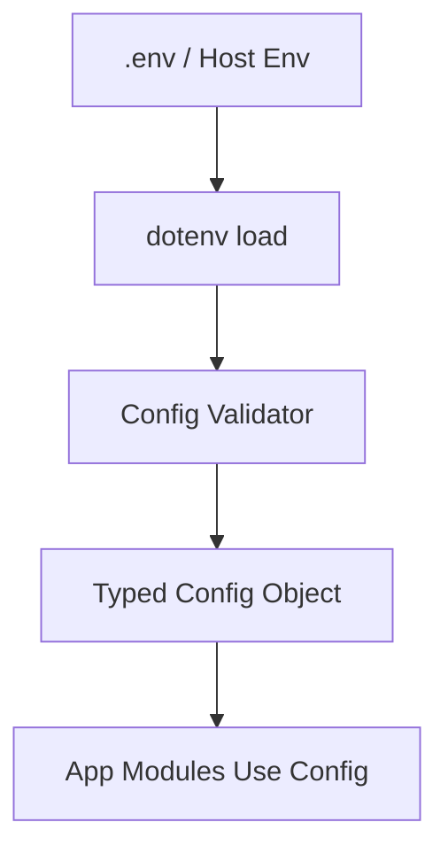

# Day 020 [Beginner]: Environment Config and dotenv

## Index

- Goal
- Prerequisites
- Explanation
- Topic by Topic
- Key Concepts
- Visual Concept Map
- End-to-End Practical
- Hands-on Coding
- Mini Exercise
- Assessment Quiz
- Task
- Self Check
- Interview Questions and Answers
- Day Outcome

## Goal

Set up safe and maintainable environment-based configuration using dotenv and validation practices.

## Prerequisites

- Day 019 logging and operational basics
- Basic understanding of deployment environments

## Explanation

Configuration should never be hardcoded. Environment variables enable different runtime behavior for local, staging, and production without code changes.

## Topic by Topic

### Topic 1: Config as Data

Theory:
Code should read configuration from environment, not literals.

Practical:
Move port/db/url values from source to env vars.

**Explanation:** Config as data means application behavior should come from clearly defined configuration values instead of hidden hardcoded constants.

**Key Points:**

- Treat config as a first-class part of the system.
- Separate environment values from source logic.
- Clear config improves portability.

### Topic 2: dotenv Workflow

Theory:
dotenv loads local env vars from .env file during development.

Practical:
Load dotenv once in app startup entrypoint.

**Explanation:** `dotenv` workflow helps local development by loading environment values from a file in a predictable way.

**Key Points:**

- Keep local env setup consistent.
- Do not commit secret env files carelessly.
- Use dotenv to simplify local configuration.

### Topic 3: Config Validation

Theory:
Missing env vars should fail fast at startup.

Practical:
Validate required variables and exit with clear message.

**Explanation:** Config validation matters because missing or malformed values can break the app at startup or create dangerous runtime behavior.

**Key Points:**

- Validate config early.
- Fail fast on invalid required values.
- Safer config reduces hidden runtime bugs.

### Topic 4: Multi-environment Strategy

Theory:
Dev/stage/prod need different values with same keys.

Practical:
Use NODE_ENV-aware config object.

**Explanation:** Multi-environment strategy is important because development, test, staging, and production often need different safe defaults.

**Key Points:**

- Separate environment concerns clearly.
- Keep behavior predictable across environments.
- Use consistent config patterns everywhere.

### Topic 5: Security Practices

Theory:
Never commit secrets to repository.

Practical:
Use .env.example and secret manager in production.

**Explanation:** Security practices matter because configuration frequently includes secrets, service URLs, and operational settings.

**Key Points:**

- Protect secrets carefully.
- Avoid leaking sensitive values in logs or source control.
- Treat config handling as part of security design.

### Topic 6: Typed Parsing and Config Precedence

Theory:
Environment values are strings by default. Parse numbers/booleans carefully and define clear precedence rules.

Practical:
Convert values safely and prefer host environment values over local .env defaults.

## Configuration Checklist Table

| Practice                 | Why it matters              |
| ------------------------ | --------------------------- |
| Use .env.example         | Documents required keys     |
| Validate at startup      | Prevents runtime surprises  |
| Keep secrets out git     | Reduces leak risk           |
| Centralize config module | Avoids scattered env access |

**Explanation:** Typed parsing and precedence rules improve predictability by making config loading explicit and consistent when multiple sources exist.

**Key Points:**

- Parse config values intentionally.
- Document source precedence clearly.
- Predictable config loading reduces surprises.

## Key Concepts

- Environment-driven runtime configuration
- dotenv local development usage
- Fail-fast config validation
- Multi-environment consistency
- Typed value parsing from strings
- Explicit config precedence rules
- Secret-handling hygiene

## Visual Concept Map



## End-to-End Practical

1. Add dotenv and create .env.example.
2. Create centralized config module.
3. Validate required variables.
4. Replace hardcoded values in app.
5. Test with missing and valid env setups.

## Hands-on Coding

### Example 1: Case - dotenv Initialization

Scenario:
Local development requires env-driven API port and DB URL.

```js
require("dotenv").config();

const PORT = process.env.PORT || 3000;
const DB_URL = process.env.DB_URL;

console.log({ PORT, hasDbUrl: Boolean(DB_URL) });
```

### Example 2: Case - Startup Validation

Scenario:
App should fail immediately if critical config missing.

```js
const required = ["DB_URL", "JWT_SECRET"];

for (const key of required) {
  if (!process.env[key]) {
    console.error(`Missing required environment variable: ${key}`);
    process.exit(1);
  }
}
```

### Example 3: Case - Centralized Config Module

Scenario:
Avoid scattered process.env usage across files.

```js
const config = {
  env: process.env.NODE_ENV || "development",
  port: Number(process.env.PORT || 3000),
  dbUrl: process.env.DB_URL,
  logLevel: process.env.LOG_LEVEL || "info",
};

module.exports = config;
```

### Example 4: Case - Safe Boolean and Number Parsing

Scenario:
Feature flag and timeout values should be typed correctly.

```js
function toBool(value, fallback = false) {
  if (value === undefined) return fallback;
  return ["1", "true", "yes", "on"].includes(String(value).toLowerCase());
}

const requestTimeoutMs = Number(process.env.REQUEST_TIMEOUT_MS || 5000);
const featureXEnabled = toBool(process.env.FEATURE_X_ENABLED, false);
```

### Example 5: Case - Clear Precedence Rule

Scenario:
Production host env should override local defaults.

```js
const config = {
  // process.env is the final source; dotenv only helps populate it in local dev.
  port: Number(process.env.PORT || 3000),
};
```

## Mini Exercise

Scenario:
Set up config module for API app with validated DB_URL, JWT_SECRET, and PORT.

Expected output:

- dotenv loading works locally
- Missing critical vars fail fast
- Config module consumed by routes/server

## Assessment Quiz

### Quiz Questions

1. Why should secrets never be hardcoded?
2. What is the role of dotenv in development?
3. True or False: Skipping edge-case handling is acceptable in production.
4. Why validate env vars during startup?
5. Why should config values be parsed into correct types?

### Quiz Answers

1. Hardcoded secrets can leak and are hard to rotate.
2. It loads local variables from .env into process.env.
3. False.
4. It prevents hidden runtime failures from missing configuration.
5. Because env values are strings and wrong types can cause runtime bugs.

## Task

- Implement centralized config with validation
- Add .env.example and startup checks
- Complete mini exercise and quiz.

## Self Check

- You can configure Node apps by environment safely.
- You can prevent configuration-related production bugs.
- You can answer at least 4 out of 5 quiz questions.

## Interview Questions and Answers

### Beginner

Question: Why use a central config file in backend projects?

Answer: It keeps configuration consistent, testable, and easy to maintain.

### Middle

Question: Should dotenv be the only strategy in production?

Answer: No, production often uses platform environment variables or secret managers.

### Advanced

Question: What tradeoff exists in strict config validation?

Answer: Slight startup complexity, but much safer and more predictable runtime behavior.

## Day 020 Outcome

- You can build secure, environment-aware Node configuration
- You can validate and centralize config in professional style
- You are ready for deeper Node architecture and database integration topics next
