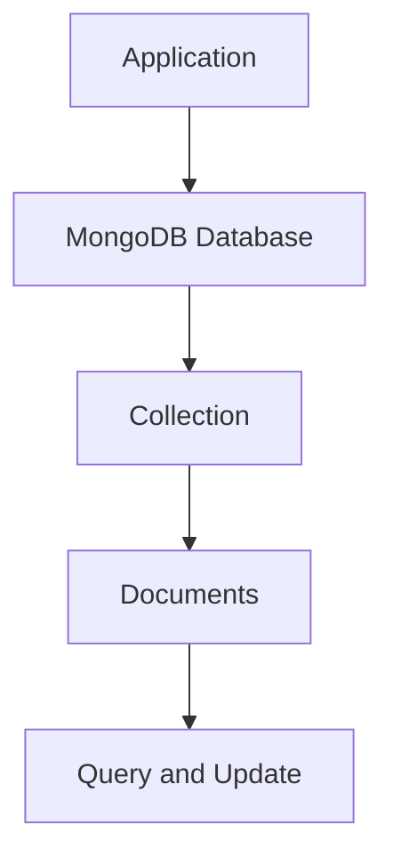

# Day 021 [Beginner]: MongoDB Basics

## Index

- Goal
- Prerequisites
- Explanation
- Topic by Topic
- Key Concepts
- Visual Concept Map
- End-to-End Practical
- Hands-on Coding
- Mini Exercise
- Assessment Quiz
- Task
- Self Check
- Interview Questions and Answers
- Day Outcome

## Goal

Understand MongoDB fundamentals and perform practical document operations for backend APIs.

## Prerequisites

- Day 020 environment configuration
- Basic JSON structure understanding

## Explanation

MongoDB is a document database that stores flexible JSON-like records (BSON). It is useful when schema evolution and nested data modeling are important.

## Topic by Topic

### Topic 1: MongoDB Data Model

Theory:
Data is stored in database -> collections -> documents.

Practical:
Model product, user, and order records as documents.

**Explanation:** MongoDB’s document model is one of its core ideas, so understanding how data is stored as flexible documents is the right starting point.

**Key Points:**

- MongoDB stores data in documents.
- The document model differs from relational tables.
- Good data modeling affects query simplicity later.

### Topic 2: CRUD Basics

Theory:
Core actions are insert, find, update, delete.

Practical:
Run CRUD operations for a products collection.

**Explanation:** CRUD basics cover the essential operations every application performs when creating, reading, updating, and deleting data.

**Key Points:**

- CRUD is the foundation of database usage.
- Learn the basic operations before advanced querying.
- Strong CRUD knowledge supports API design later.

### Topic 3: Query Operators

Theory:
Use filters like `$gt`, `$in`, and `$regex` for precise matching.

Practical:
Query products by price range and category.

**Explanation:** Query operators let you filter and shape data more precisely than simple exact-match lookups.

**Key Points:**

- Operators make queries expressive.
- Filtering power grows with operator knowledge.
- Understand query intent before optimizing it.

### Topic 6: ObjectId, Projection, and Pagination Basics

Theory:
MongoDB document ids are usually ObjectId values, and list APIs should return only needed fields with paging.

Practical:
Convert id strings safely, use projection, and apply skip/limit for paging.

**Explanation:** ObjectId, projection, and pagination basics matter because real applications need selective reads and scalable listing patterns.

**Key Points:**

- ObjectId handling is common in MongoDB apps.
- Projection reduces unnecessary returned data.
- Pagination becomes important as data grows.

### Topic 4: Indexes and Performance

Theory:
Indexes speed up reads but add write overhead.

Practical:
Add index on frequently queried fields.

**Explanation:** Indexes and performance matter because flexible data models still need efficient access patterns to scale well.

**Key Points:**

- Indexes improve query speed when chosen well.
- Performance depends on data access patterns.
- Poor indexing can hurt both reads and writes.

### Topic 5: Schema Flexibility Tradeoff

Theory:
Flexible schemas are fast to evolve but require app-level discipline.

Practical:
Define field conventions and validation strategy.

## Core Command Table

| Operation | Example                                        |
| --------- | ---------------------------------------------- |
| Insert    | `insertOne({ name: "Mouse", price: 799 })`     |
| Read      | `find({ price: { $gt: 500 } })`                |
| Update    | `updateOne({ _id }, { $set: { price: 699 } })` |
| Delete    | `deleteOne({ _id })`                           |

**Explanation:** Schema flexibility is powerful, but it comes with tradeoffs in consistency, validation, and long-term maintenance.

**Key Points:**

- Flexibility should be used intentionally.
- Too much variation can create data quality issues.
- Tradeoffs matter in growing applications.

## Key Concepts

- Document-oriented modeling
- Collection-level CRUD workflow
- Query operator patterns
- ObjectId-safe query handling
- Projection and pagination-ready reads
- Index-aware design
- Flexibility vs consistency tradeoff

## Visual Concept Map



## End-to-End Practical

1. Connect to MongoDB instance.
2. Create products collection.
3. Insert sample documents.
4. Query with filters and sorting.
5. Update and delete records safely.

## Hands-on Coding

### Example 1: Case - Connect and Insert

Scenario:
Catalog team needs to seed initial product data.

```js
const { MongoClient } = require("mongodb");

async function seed() {
  const client = new MongoClient(process.env.MONGO_URL);
  await client.connect();

  const db = client.db("shopdb");
  await db.collection("products").insertOne({
    name: "Mechanical Keyboard",
    price: 3499,
    category: "electronics",
  });

  await client.close();
}
```

### Example 2: Case - Query with Filters

Scenario:
Frontend wants products by category and minimum rating.

```js
const result = await db
  .collection("products")
  .find({
    category: "electronics",
    rating: { $gte: 4 },
  })
  .sort({ price: 1 })
  .limit(10)
  .toArray();

console.log(result);
```

### Example 3: Case - Update and Soft-delete Pattern

Scenario:
Product should be deactivated instead of hard delete.

```js
await db
  .collection("products")
  .updateOne(
    { _id: productId },
    { $set: { isActive: false, updatedAt: new Date() } },
  );
```

### Example 4: Case - Safe ObjectId Lookup

Scenario:
API receives id from route params and must query exact document.

```js
const { ObjectId } = require("mongodb");

function toObjectId(id) {
  if (!ObjectId.isValid(id)) throw new Error("Invalid id format");
  return new ObjectId(id);
}

const product = await db
  .collection("products")
  .findOne({ _id: toObjectId(req.params.id) });
```

### Example 5: Case - Projection with Pagination

Scenario:
List endpoint should return only useful fields and support paging.

```js
const page = Math.max(1, Number(req.query.page || 1));
const limit = Math.max(1, Number(req.query.limit || 10));

const items = await db
  .collection("products")
  .find({ isActive: true }, { projection: { name: 1, price: 1, category: 1 } })
  .skip((page - 1) * limit)
  .limit(limit)
  .toArray();
```

## Mini Exercise

Scenario:
Build a products collection workflow that inserts 5 products, fetches products above a given price, and updates one product stock.

Expected output:

- Seed data inserted
- Filtered query returns expected docs
- One update operation confirmed

## Assessment Quiz

### Quiz Questions

1. What is the difference between collection and document?
2. Why use indexes in MongoDB?
3. True or False: MongoDB documents must all have identical fields.
4. Which operator helps query numeric range?
5. Why should API list endpoints use projection and pagination?

### Quiz Answers

1. Collection is a group of documents; document is one record.
2. To speed up query performance.
3. False.
4. `$gt`, `$gte`, `$lt`, `$lte`.
5. To reduce payload size and keep list performance predictable.

## Task

- Create one collection and run all CRUD operations
- Add one indexed field and test query speed
- Complete mini exercise and quiz

## Self Check

- You can model data as MongoDB documents
- You can run practical CRUD and query operations
- You can answer at least 4 out of 5 quiz questions

## Interview Questions and Answers

### Beginner

Question: Why choose MongoDB for some projects?

Answer: It supports flexible document structures and fast development for evolving schemas.

### Middle

Question: How do you avoid schema chaos in MongoDB?

Answer: Use application-level validation, conventions, and schema tools like Mongoose.

### Advanced

Question: What are index tradeoffs in MongoDB?

Answer: Faster reads and filtering, but extra memory and slower writes due to index maintenance.

## Day 021 Outcome

- You can work with MongoDB collections and documents confidently
- You can apply query and update patterns for real APIs
- You are ready for Mongoose schemas and models in Day 022
