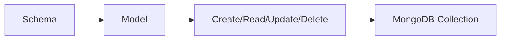

# Day 022 [Beginner]: Mongoose Models and Schema

## Index

- Goal
- Prerequisites
- Explanation
- Topic by Topic
- Key Concepts
- Visual Concept Map
- End-to-End Practical
- Hands-on Coding
- Mini Exercise
- Assessment Quiz
- Task
- Self Check
- Interview Questions and Answers
- Day Outcome

## Goal

Use Mongoose schemas and models to enforce structure, validation, and reusable data logic in Node APIs.

## Prerequisites

- Day 021 MongoDB basics
- Basic JavaScript classes and objects

## Explanation

Mongoose adds a modeling layer on top of MongoDB with schema definitions, field validation, hooks, and helper methods.

## Topic by Topic

### Topic 1: Schema Definition

Theory:
Schema defines field types, defaults, and constraints.

Practical:
Create Product schema with required and enum fields.

**Explanation:** Schema definition in Mongoose adds structure on top of MongoDB so applications can work with more predictable data rules.

**Key Points:**

- Schemas define expected document shape.
- Structured models improve consistency.
- Good schema design supports safer application logic.

### Topic 2: Model-based CRUD

Theory:
Model methods simplify create/find/update/delete actions.

Practical:
Implement Product model operations using async/await.

**Explanation:** Model-based CRUD gives you a higher-level API for interacting with MongoDB through domain-oriented abstractions.

**Key Points:**

- Models simplify common database actions.
- Mongoose adds convenience over raw driver usage.
- CRUD stays more application-focused.

### Topic 3: Schema Validation

Theory:
Validation should reject invalid values before DB persistence.

Practical:
Add min/max/email/enum validators.

Note:
For update APIs, enable validators explicitly on update operations.

**Explanation:** Schema validation matters because applications should reject invalid data before it spreads into the database.

**Key Points:**

- Validation improves data quality.
- Catch bad input close to the model layer.
- Rules should be explicit and reviewable.

### Topic 4: Hooks and Timestamps

Theory:
Pre/post hooks automate lifecycle logic.

Practical:
Auto-generate slug before save.

**Explanation:** Hooks and timestamps add lifecycle behavior and metadata automatically, which is useful for many real backend workflows.

**Key Points:**

- Hooks support model-level automation.
- Timestamps reduce repeated boilerplate.
- Lifecycle features should stay understandable.

### Topic 5: Lean Queries and Performance

Theory:
`lean()` returns plain objects and improves read performance.

Practical:
Use lean for read-heavy list endpoints.

**Explanation:** Lean queries and performance trade convenience for speed by reducing the cost of returning full Mongoose documents when not needed.

**Key Points:**

- Use lean reads when document helpers are unnecessary.
- Performance can improve with simpler return shapes.
- Choose query style based on workload needs.

### Topic 6: Index and Update Validation Nuances

Theory:
`unique: true` creates an index behavior, not a full validation message by itself, and updates need `runValidators: true` for schema checks.

Practical:
Add unique index for email-like fields and enable validators in update paths.

## Mongoose Schema Features Table

| Feature    | Purpose                      |
| ---------- | ---------------------------- |
| required   | Ensures field presence       |
| enum       | Restricts allowed values     |
| default    | Fills missing value          |
| timestamps | Auto createdAt and updatedAt |

**Explanation:** Index and update validation nuances matter because create-time safety does not always guarantee update-time safety without deliberate rules.

**Key Points:**

- Understand validation behavior in updates.
- Index strategy still matters with Mongoose.
- Subtle model rules affect production reliability.

## Key Concepts

- Schema-driven validation
- Model abstraction for CRUD
- Hook-based lifecycle automation
- Update-time validation controls
- Unique index vs validation understanding
- Query optimization basics
- Data consistency through constraints

## Visual Concept Map



## End-to-End Practical

1. Connect Mongoose to MongoDB.
2. Define Product schema with constraints.
3. Build Product model and CRUD handlers.
4. Add validation and custom error messages.
5. Add one pre-save hook and one query optimization.

## Hands-on Coding

### Example 1: Case - Product Schema and Model

Scenario:
Ecommerce API needs strict product structure.

```js
const mongoose = require("mongoose");

const productSchema = new mongoose.Schema(
  {
    name: { type: String, required: true, trim: true },
    price: { type: Number, required: true, min: 1 },
    category: {
      type: String,
      enum: ["electronics", "fashion", "books"],
      required: true,
    },
    inStock: { type: Boolean, default: true },
  },
  { timestamps: true },
);

const Product = mongoose.model("Product", productSchema);
```

### Example 2: Case - Validation and Save

Scenario:
Reject invalid price before writing to DB.

```js
try {
  const product = await Product.create({
    name: "Pen",
    price: 0,
    category: "books",
  });
  console.log(product);
} catch (error) {
  console.error("Validation failed:", error.message);
}
```

### Example 3: Case - Pre-save Hook for Slug

Scenario:
Product pages need SEO-friendly slug from product name.

```js
productSchema.add({ slug: String });

productSchema.pre("save", function (next) {
  this.slug = this.name.toLowerCase().replace(/\s+/g, "-");
  next();
});
```

### Example 4: Case - Update with Validators Enabled

Scenario:
Update route must still enforce schema rules.

```js
await Product.findByIdAndUpdate(
  productId,
  { $set: { price: 0 } },
  { new: true, runValidators: true },
);
```

### Example 5: Case - Unique Index Field

Scenario:
Catalog requires unique SKU per product.

```js
productSchema.add({
  sku: { type: String, required: true, unique: true, trim: true },
});
```

## Mini Exercise

Scenario:
Build Product model with schema validation, timestamping, and one pre-save hook.

Expected output:

- Schema with required and enum rules
- Validation errors handled clearly
- Hook-enhanced data formatting

## Assessment Quiz

### Quiz Questions

1. Why use Mongoose instead of raw MongoDB driver for many apps?
2. What does required in schema enforce?
3. True or False: Skipping edge-case handling is acceptable in production.
4. Why can overly flexible schemas create issues?
5. Why enable runValidators in update operations?

### Quiz Answers

1. It provides structure, validation, and model-based developer ergonomics.
2. It prevents saving documents without that field.
3. False.
4. Inconsistent documents can complicate query logic and analytics.
5. Updates can otherwise bypass important schema constraints.

## Task

- Build one schema-driven model with 4+ fields
- Add validation and one lifecycle hook
- Complete mini exercise and quiz.

## Self Check

- You can design and validate Mongoose models confidently.
- You can apply hooks for cleaner data workflows.
- You can answer at least 4 out of 5 quiz questions.

## Interview Questions and Answers

### Beginner

Question: What is the role of a Mongoose schema?

Answer: It defines the structure and validation rules for MongoDB documents.

### Middle

Question: When should lean queries be considered?

Answer: For read-heavy endpoints where model instance features are not needed.

### Advanced

Question: What is one Mongoose tradeoff?

Answer: Strong modeling convenience with some abstraction overhead compared to raw driver control.

## Day 022 Outcome

- You can implement structured MongoDB models with confidence
- You can enforce validation and lifecycle rules reliably
- You are ready for Express + MongoDB CRUD integration in Day 023
