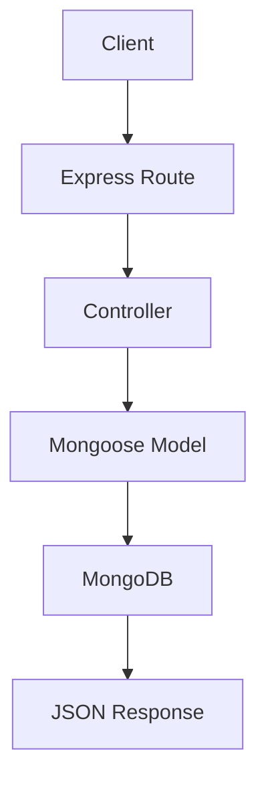

# Day 023 [Beginner]: CRUD with Express and MongoDB

## Index

- Goal
- Prerequisites
- Explanation
- Topic by Topic
- Key Concepts
- Visual Concept Map
- End-to-End Practical
- Hands-on Coding
- Mini Exercise
- Assessment Quiz
- Task
- Self Check
- Interview Questions and Answers
- Day Outcome

## Goal

Build a complete CRUD API using Express and MongoDB with validation, error handling, and clean route design.

## Prerequisites

- Day 022 Mongoose schemas and models
- Day 017 routing and middleware

## Explanation

This lesson combines routing, model validation, and database operations into one practical API module similar to a real backend service.

## Topic by Topic

### Topic 1: Resource-centric API Design

Theory:
CRUD endpoints should map clearly to one resource.

Practical:
Create `/api/v1/products` endpoint set.

**Explanation:** Resource-centric API design keeps endpoints focused on business entities, which makes APIs easier to understand and grow.

**Key Points:**

- Design endpoints around real resources.
- Keep naming clear and consistent.
- Resource thinking supports maintainable APIs.

### Topic 2: Controller + Model Separation

Theory:
Route should delegate business logic to controller/service.

Practical:
Keep route files small and readable.

**Explanation:** Separating controllers from models improves maintainability because request handling and data access have different responsibilities.

**Key Points:**

- Keep route logic separate from database logic.
- Separation improves testing and readability.
- Layered structure scales better over time.

### Topic 3: Validation and Error Mapping

Theory:
Mongoose errors need consistent API responses.

Practical:
Convert validation and cast errors to 400.

**Explanation:** Validation and error mapping matter because APIs should respond predictably when input is invalid or data operations fail.

**Key Points:**

- Validate before writing to the database.
- Map failures to clear API responses.
- Predictable errors improve client integration.

### Topic 4: Pagination and Filtering

Theory:
List endpoints should support page and limit.

Practical:
Implement query-driven pagination.

**Explanation:** Pagination and filtering keep list endpoints useful as the amount of stored data increases.

**Key Points:**

- Large collections need controlled retrieval.
- Filtering improves endpoint usefulness.
- Pagination is essential for scalability.

### Topic 5: Update Patterns

Theory:
Use partial updates carefully with field whitelisting.

Practical:
Allow only editable fields in PATCH.

**Explanation:** Update patterns matter because partial updates, full replacements, and safe field changes need different treatment.

**Key Points:**

- Choose update style intentionally.
- Protect important fields from unsafe overwrites.
- Updates should remain predictable and auditable.

### Topic 6: Safe ID Handling and Update Whitelisting

Theory:
Invalid ids can cause cast errors, and unrestricted updates can overwrite protected fields.

Practical:
Validate id format early and allow updates only for approved fields.

## Endpoint Map Table

| Method | Endpoint             | Action          |
| ------ | -------------------- | --------------- |
| GET    | /api/v1/products     | List products   |
| GET    | /api/v1/products/:id | Get one product |
| POST   | /api/v1/products     | Create product  |
| PATCH  | /api/v1/products/:id | Update product  |
| DELETE | /api/v1/products/:id | Delete product  |

**Explanation:** Safe ID handling and update whitelisting reduce security and data-integrity problems by ensuring only allowed identifiers and fields are processed.

**Key Points:**

- Validate IDs before using them.
- Whitelist allowed update fields.
- Trust boundaries matter in CRUD APIs.

## Key Concepts

- Full CRUD route design
- Controller/model separation
- Error-safe database operations
- Pagination for scalability
- Secure update strategies
- Safe ObjectId input boundaries
- Field whitelist for PATCH safety

## Visual Concept Map



## End-to-End Practical

1. Build Product model and routes.
2. Add controllers for all CRUD actions.
3. Add validation and centralized error handling.
4. Add pagination for list route.
5. Test with Postman or curl scenarios.

## Hands-on Coding

### Example 1: Case - Create and List Endpoints

Scenario:
Team needs quick inventory APIs for admin panel.

```js
app.post("/api/v1/products", async (req, res, next) => {
  try {
    const created = await Product.create(req.body);
    res.status(201).json({ success: true, data: created });
  } catch (error) {
    next(error);
  }
});

app.get("/api/v1/products", async (req, res, next) => {
  try {
    const items = await Product.find().limit(20);
    res.json({ success: true, data: items });
  } catch (error) {
    next(error);
  }
});
```

### Example 2: Case - Get, Update, Delete by ID

Scenario:
Admin must manage one product by id.

```js
app.patch("/api/v1/products/:id", async (req, res, next) => {
  try {
    const updated = await Product.findByIdAndUpdate(req.params.id, req.body, {
      new: true,
      runValidators: true,
    });
    if (!updated)
      return res.status(404).json({ success: false, message: "Not found" });
    res.json({ success: true, data: updated });
  } catch (error) {
    next(error);
  }
});
```

### Example 3: Case - Pagination and Filter

Scenario:
Product list should support category and page.

```js
app.get("/api/v1/products", async (req, res, next) => {
  try {
    const page = Number(req.query.page || 1);
    const limit = Number(req.query.limit || 10);
    const skip = (page - 1) * limit;

    const query = req.query.category ? { category: req.query.category } : {};
    const items = await Product.find(query).skip(skip).limit(limit).lean();

    res.json({ success: true, page, limit, data: items });
  } catch (error) {
    next(error);
  }
});
```

### Example 4: Case - ObjectId Validation Guard

Scenario:
Route should reject invalid document ids before DB query.

```js
const mongoose = require("mongoose");

app.get("/api/v1/products/:id", async (req, res, next) => {
  try {
    if (!mongoose.isValidObjectId(req.params.id)) {
      return res
        .status(400)
        .json({ success: false, message: "Invalid product id" });
    }

    const item = await Product.findById(req.params.id).lean();
    if (!item)
      return res.status(404).json({ success: false, message: "Not found" });
    res.json({ success: true, data: item });
  } catch (error) {
    next(error);
  }
});
```

### Example 5: Case - PATCH Field Whitelist

Scenario:
Only specific fields should be editable.

```js
const ALLOWED_FIELDS = ["name", "price", "category", "isActive"];

function pickAllowedUpdates(input) {
  return Object.fromEntries(
    Object.entries(input).filter(([key]) => ALLOWED_FIELDS.includes(key)),
  );
}

const updateData = pickAllowedUpdates(req.body);
```

## Mini Exercise

Scenario:
Build a notes API with full CRUD plus pagination and error-safe id handling.

Expected output:

- All CRUD routes functional
- 404 and validation errors handled
- Pagination implemented in list route

## Assessment Quiz

### Quiz Questions

1. Why separate route and controller layers?
2. What does runValidators do in findByIdAndUpdate?
3. True or False: Skipping edge-case handling is acceptable in production.
4. Why return 404 for missing document id?
5. Why use an update whitelist in PATCH routes?

### Quiz Answers

1. Better readability, testability, and maintainability.
2. It applies schema validation to update operations.
3. False.
4. It correctly signals resource absence and avoids misleading success.
5. It prevents accidental or unsafe updates to protected fields.

## Task

- Build full CRUD endpoints for one resource
- Add pagination and 2+ error handling scenarios
- Complete mini exercise and quiz.

## Self Check

- You can build complete Mongo-backed Express CRUD APIs.
- You can apply practical reliability improvements in endpoints.
- You can answer at least 4 out of 5 quiz questions.

## Interview Questions and Answers

### Beginner

Question: What is the first production concern after basic CRUD works?

Answer: Input validation, error consistency, and pagination for scale.

### Middle

Question: Why avoid writing DB logic directly inside routes for large apps?

Answer: It creates tight coupling and makes testing or refactoring difficult.

### Advanced

Question: What tradeoff appears with richer API response wrappers?

Answer: Slight response verbosity, but much better consistency for clients.

## Day 023 Outcome

- You can build end-to-end CRUD APIs with MongoDB
- You can handle validations, errors, and pagination professionally
- You are ready for PostgreSQL integration patterns in Day 024
