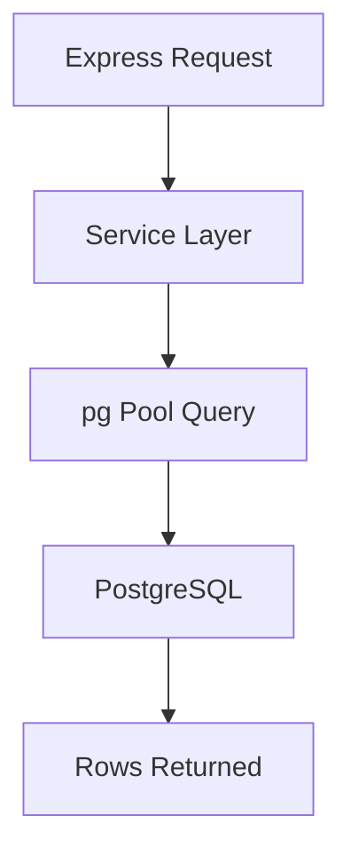

# Day 024 [Beginner]: PostgreSQL with node-postgres

## Index

- Goal
- Prerequisites
- Explanation
- Topic by Topic
- Key Concepts
- Visual Concept Map
- End-to-End Practical
- Hands-on Coding
- Mini Exercise
- Assessment Quiz
- Task
- Self Check
- Interview Questions and Answers
- Day Outcome

## Goal

Connect Node.js to PostgreSQL using node-postgres and implement safe SQL operations with parameterized queries.

## Prerequisites

- SQL basics (SELECT/INSERT/UPDATE/DELETE)
- Day 020 environment config

## Explanation

PostgreSQL is a relational database with strong consistency and SQL power. node-postgres (pg) gives direct SQL control from Node services.

## Topic by Topic

### Topic 1: Connection and Pooling

Theory:
Use connection pools to avoid creating a new connection per request.

Practical:
Initialize one shared pool module.

**Explanation:** Connection and pooling are important because database access should be efficient and controlled rather than opening new connections constantly.

**Key Points:**

- Use pools for efficient database access.
- Manage connections deliberately.
- Good pooling supports stable performance.

### Topic 2: Parameterized Queries

Theory:
Parameterized SQL prevents injection and improves safety.

Practical:
Use placeholders like $1, $2 in all dynamic queries.

**Explanation:** Parameterized queries help prevent SQL injection and keep SQL input handling safer and clearer.

**Key Points:**

- Never build SQL from raw untrusted strings.
- Use parameters to separate data from query text.
- Safer queries are a baseline requirement.

### Topic 3: Transactions Basics

Theory:
Use BEGIN/COMMIT/ROLLBACK for multi-step consistency.

Practical:
Implement fund transfer transaction.

**Explanation:** Transaction basics matter when multiple SQL operations must succeed or fail together as one logical unit.

**Key Points:**

- Transactions protect data consistency.
- Group related operations carefully.
- Learn when atomicity is required.

### Topic 4: Error Handling and Constraints

Theory:
Unique/foreign key violations should map to useful API messages.

Practical:
Catch DB error codes and return appropriate status.

**Explanation:** Error handling and constraints help keep relational data consistent and make failure cases easier to diagnose.

**Key Points:**

- Database constraints enforce important rules.
- Handle query failures explicitly.
- Constraints and app logic should work together.

### Topic 5: SQL-first Tradeoffs

Theory:
Raw SQL is explicit and powerful but needs discipline and query management.

Practical:
Keep query helpers organized by feature.

**Explanation:** SQL-first tradeoffs matter because writing SQL directly gives control and power, but also requires stronger database knowledge.

**Key Points:**

- SQL-first gives flexibility and precision.
- It can increase complexity for some teams.
- Choose this style with clear intent.

### Topic 6: Timeout and Pool Lifecycle Safety

Theory:
Slow queries and unmanaged pools can hurt service stability.

Practical:
Set query timeout where needed and close pool gracefully on shutdown.

## Common PostgreSQL Error Codes

| Code  | Meaning                     | Typical API Mapping |
| ----- | --------------------------- | ------------------- |
| 23505 | unique_violation            | 409 Conflict        |
| 23503 | foreign_key_violation       | 400 Bad Request     |
| 22P02 | invalid_text_representation | 400 Bad Request     |

**Explanation:** Timeout and pool lifecycle safety help ensure that database access remains healthy under production conditions and failure scenarios.

**Key Points:**

- Timeouts protect the app from hanging operations.
- Pool lifecycle should be managed cleanly.
- Safety around DB access matters in production.

## Key Concepts

- Pooled connection management
- SQL injection-safe querying
- Transaction reliability patterns
- Constraint-aware error handling
- Query timeout awareness
- Graceful pool shutdown
- SQL organization for maintainability

## Visual Concept Map



## End-to-End Practical

1. Configure pg pool using env variables.
2. Create table and seed sample rows.
3. Build create/read/update/delete query functions.
4. Add transaction for multi-step update.
5. Handle constraint errors gracefully.

## Hands-on Coding

### Example 1: Case - Pool Setup and Read Query

Scenario:
API needs reusable DB connection and simple list endpoint.

```js
const { Pool } = require("pg");

const pool = new Pool({
  connectionString: process.env.DATABASE_URL,
});

async function getUsers() {
  const { rows } = await pool.query(
    "SELECT id, name, email FROM users ORDER BY id DESC LIMIT 20",
  );
  return rows;
}
```

### Example 2: Case - Parameterized Insert

Scenario:
Create user securely without SQL injection risk.

```js
async function createUser(name, email) {
  const sql =
    "INSERT INTO users(name, email) VALUES($1, $2) RETURNING id, name, email";
  const { rows } = await pool.query(sql, [name, email]);
  return rows[0];
}
```

### Example 3: Case - Transaction Pattern

Scenario:
Wallet transfer must update two accounts atomically.

```js
async function transfer(fromId, toId, amount) {
  const client = await pool.connect();
  try {
    await client.query("BEGIN");
    await client.query(
      "UPDATE accounts SET balance = balance - $1 WHERE id = $2",
      [amount, fromId],
    );
    await client.query(
      "UPDATE accounts SET balance = balance + $1 WHERE id = $2",
      [amount, toId],
    );
    await client.query("COMMIT");
  } catch (error) {
    await client.query("ROLLBACK");
    throw error;
  } finally {
    client.release();
  }
}
```

### Example 4: Case - Statement Timeout for Slow Queries

Scenario:
Reporting endpoint should fail fast instead of hanging too long.

```js
const { rows } = await pool.query({
  text: "SELECT * FROM reports WHERE created_at >= NOW() - INTERVAL '7 days'",
  statement_timeout: 3000,
});
```

### Example 5: Case - Graceful Pool Shutdown

Scenario:
App receives termination signal and should close DB resources cleanly.

```js
process.on("SIGTERM", async () => {
  console.log("SIGTERM received, closing database pool...");
  await pool.end();
  process.exitCode = 0;
});
```

## Mini Exercise

Scenario:
Build tasks API backed by PostgreSQL with parameterized CRUD queries and one transaction.

Expected output:

- Parameterized SQL everywhere
- Proper pool usage and release
- Transaction with rollback path

## Assessment Quiz

### Quiz Questions

1. Why use pool instead of one-off DB connections?
2. How do parameterized queries improve security?
3. True or False: Skipping edge-case handling is acceptable in production.
4. When do you need a transaction?
5. Why is graceful pool shutdown important?

### Quiz Answers

1. Pooling improves performance and avoids connection exhaustion.
2. User input is treated as values, not executable SQL.
3. False.
4. When multiple operations must succeed or fail together.
5. It prevents leaked connections and cleaner service termination.

## Task

- Build one SQL-backed CRUD module with pg
- Add transaction and one constraint error mapping
- Complete mini exercise and quiz.

## Self Check

- You can implement safe SQL operations from Node.js.
- You can manage pool, transactions, and DB errors effectively.
- You can answer at least 4 out of 5 quiz questions.

## Interview Questions and Answers

### Beginner

Question: Why do many teams prefer PostgreSQL for transactional systems?

Answer: It provides strong consistency, rich SQL, and reliable relational constraints.

### Middle

Question: Is raw SQL harder than ORM usage?

Answer: It can be, but it gives precise control and often better query clarity.

### Advanced

Question: What is one raw SQL tradeoff?

Answer: Better control and performance insights, but higher responsibility for query organization.

## Day 024 Outcome

- You can build practical Node services using PostgreSQL
- You can design secure and reliable SQL workflows
- You are ready for Prisma ORM fundamentals in Day 025
