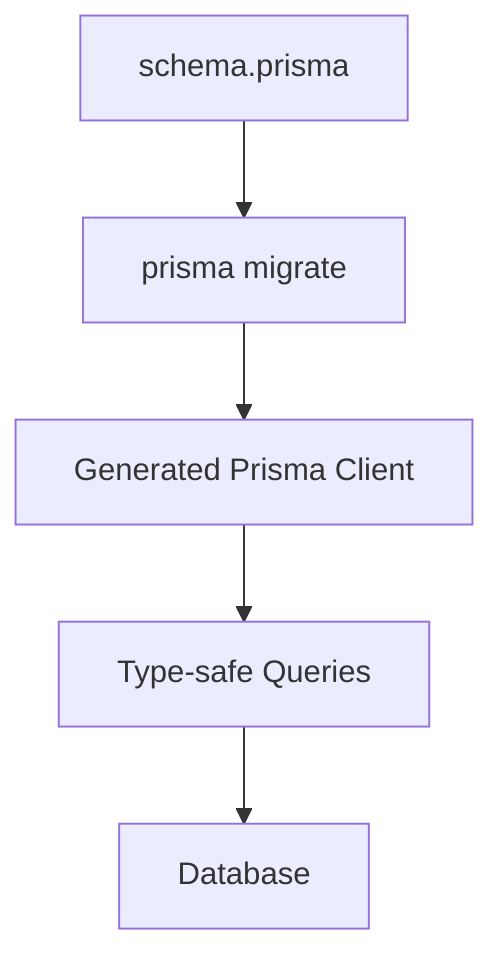

# Day 025 [Beginner]: Prisma ORM Basics

## Index

- Goal
- Prerequisites
- Explanation
- Topic by Topic
- Key Concepts
- Visual Concept Map
- End-to-End Practical
- Hands-on Coding
- Mini Exercise
- Assessment Quiz
- Task
- Self Check
- Interview Questions and Answers
- Day Outcome

## Goal

Use Prisma ORM to model relational data, run migrations, and build type-safe database operations in Node.js.

## Prerequisites

- Day 024 PostgreSQL with node-postgres
- Basic SQL relation understanding

## Explanation

Prisma provides schema-based modeling, migrations, and a type-safe query client. It speeds up development while keeping relational consistency.

## Topic by Topic

### Topic 1: Prisma Workflow

Theory:
Typical flow: define schema -> migrate -> generate client -> query.

Practical:
Build first User and Post models.

**Explanation:** Prisma workflow is centered around schema-driven development, so understanding its overall flow makes the tool easier to use correctly.

**Key Points:**

- Prisma uses a schema-first development model.
- Workflow includes schema, migration, and client generation.
- The toolchain is designed for consistency.

### Topic 2: Models and Relations

Theory:
Relations are defined declaratively in schema.prisma.

Practical:
Create one-to-many relation (User -> Posts).

**Explanation:** Models and relations define how data entities connect, which is essential for working with structured relational systems.

**Key Points:**

- Model design affects data clarity and query usability.
- Relations should match real domain behavior.
- Strong modeling supports safer data access.

### Topic 3: Prisma Client Queries

Theory:
Client methods support find/create/update/delete with include/select.

Practical:
Query user with posts in one call.

**Explanation:** Prisma Client queries provide a typed and ergonomic way to interact with the database from application code.

**Key Points:**

- Prisma Client abstracts repetitive SQL work.
- Typed queries improve safety.
- Query design still requires good data understanding.

### Topic 4: Migration Discipline

Theory:
Migrations should be versioned and reviewed before production rollout.

Practical:
Generate migration after schema change.

**Explanation:** Migration discipline matters because schema changes should be planned and traceable, not applied casually.

**Key Points:**

- Treat schema changes as controlled operations.
- Keep migration history reviewable.
- Disciplined migrations reduce production risk.

### Topic 5: ORM Tradeoffs

Theory:
ORMs improve productivity but may hide SQL details for complex cases.

Practical:
Use raw SQL only when needed for advanced queries.

**Explanation:** ORM tradeoffs are important to understand because convenience, abstraction, and performance do not always align equally in every project.

**Key Points:**

- ORMs improve speed for many tasks.
- Abstraction can hide useful lower-level details.
- Choose the tool based on real team needs.

### Topic 6: Transactions and Client Lifecycle

Theory:
Some operations must succeed together, and PrismaClient should be reused carefully to avoid too many DB connections.

Practical:
Use Prisma transactions for related writes and keep one shared Prisma client instance per app runtime.

## Prisma vs Raw SQL Snapshot

| Aspect                | Prisma ORM | Raw SQL   |
| --------------------- | ---------- | --------- |
| Developer speed       | High       | Medium    |
| Type safety           | Strong     | Manual    |
| Complex query control | Moderate   | Very high |

**Explanation:** Transactions and client lifecycle management matter because ORM convenience does not remove the need for safe connection and consistency practices.

**Key Points:**

- Handle transactions deliberately.
- Manage the client lifecycle responsibly.
- Backend safety still matters with abstractions.

## Key Concepts

- Schema-first data modeling
- Migration-driven DB evolution
- Type-safe query construction
- Relation querying patterns
- Transaction-safe write operations
- PrismaClient lifecycle awareness
- ORM productivity vs control tradeoff

## Visual Concept Map



## End-to-End Practical

1. Initialize Prisma in Node project.
2. Define User and Post models in schema.
3. Run migration and generate client.
4. Build CRUD operations with Prisma Client.
5. Query relation data and handle known errors.

## Hands-on Coding

### Example 1: Case - Basic Prisma Schema

Scenario:
Blog backend needs users and posts relation.

```prisma
model User {
  id    Int    @id @default(autoincrement())
  email String @unique
  name  String
  posts Post[]
}

model Post {
  id       Int    @id @default(autoincrement())
  title    String
  content  String?
  authorId Int
  author   User   @relation(fields: [authorId], references: [id])
}
```

### Example 2: Case - Create and Fetch with Relation

Scenario:
Create user and fetch user with all posts.

```js
const { PrismaClient } = require("@prisma/client");
const prisma = new PrismaClient();

await prisma.user.create({
  data: { email: "asha@example.com", name: "Asha" },
});

const user = await prisma.user.findUnique({
  where: { email: "asha@example.com" },
  include: { posts: true },
});

console.log(user);
```

### Example 3: Case - Known Error Handling

Scenario:
Return clear API message when unique email constraint fails.

```js
try {
  await prisma.user.create({
    data: { email: "asha@example.com", name: "Duplicate" },
  });
} catch (error) {
  if (error.code === "P2002") {
    console.error("Email already exists");
  } else {
    throw error;
  }
}
```

### Example 4: Case - Transaction for Multi-step Write

Scenario:
Create user and initial profile together or roll back both.

```js
await prisma.$transaction(async (tx) => {
  const user = await tx.user.create({
    data: { email: "riya@example.com", name: "Riya" },
  });

  await tx.profile.create({
    data: { userId: user.id, bio: "New user profile" },
  });
});
```

### Example 5: Case - Shared Prisma Client Module

Scenario:
Avoid creating a new DB client in each route file.

```js
const { PrismaClient } = require("@prisma/client");

const prisma = new PrismaClient();
module.exports = prisma;
```

## Mini Exercise

Scenario:
Build mini blog API with User and Post models using Prisma migration and relation queries.

Expected output:

- Prisma schema and migration setup complete
- CRUD with relation fetch implemented
- Unique constraint errors handled safely

## Assessment Quiz

### Quiz Questions

1. Why do teams adopt Prisma for Node relational apps?
2. What does prisma migrate do?
3. True or False: Skipping edge-case handling is acceptable in production.
4. Why is relation modeling important in schema design?
5. When is Prisma transaction support important?

### Quiz Answers

1. Type-safe queries and faster schema-driven development.
2. Applies schema changes to DB in versioned migration files.
3. False.
4. Poor relation design causes awkward queries and data inconsistency.
5. When multiple DB changes must succeed or fail together.

## Task

- Build one Prisma project with 2 related models
- Add one migration and one relation query endpoint
- Complete mini exercise and quiz.

## Self Check

- You can design and query relational data with Prisma.
- You can apply migration and error handling best practices.
- You can answer at least 4 out of 5 quiz questions.

## Interview Questions and Answers

### Beginner

Question: What is Prisma Client?

Answer: It is an auto-generated, type-safe API for querying your database models.

### Middle

Question: Are migrations necessary for small projects?

Answer: Yes, they keep schema evolution reproducible and team-friendly.

### Advanced

Question: What is one Prisma tradeoff compared to raw SQL?

Answer: Faster development and type safety, but less direct control for some advanced query cases.

## Day 025 Outcome

- You can build relational CRUD with Prisma and Node
- You can model relations and manage migrations professionally
- You are ready for authentication and authorization topics next
