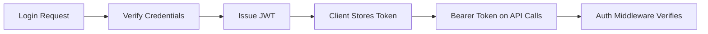

# Day 026 [Beginner]: Authentication with JWT

## Index

- Goal
- Prerequisites
- Explanation
- Topic by Topic
- Key Concepts
- Visual Concept Map
- End-to-End Practical
- Hands-on Coding
- Mini Exercise
- Assessment Quiz
- Task
- Self Check
- Interview Questions and Answers
- Day Outcome

## Goal

Implement practical JWT-based authentication flow in Node APIs with secure token generation and verification.

## Prerequisites

- Day 025 Prisma ORM basics
- Basic HTTP headers and cookies knowledge

## Explanation

JWT (JSON Web Token) is commonly used for stateless authentication. After login, server issues a signed token that clients send in each protected request.

## Topic by Topic

### Topic 1: JWT Anatomy

Theory:
JWT has header, payload, and signature.

Practical:
Store only non-sensitive claims in payload.

**Explanation:** JWT anatomy matters because understanding the token structure helps developers reason about what JWTs can and cannot safely do.

**Key Points:**

- JWTs contain structured token data.
- Understanding the parts improves security awareness.
- Tokens should be used with clear trust boundaries.

### Topic 2: Login and Token Issuance

Theory:
After credential verification, issue short-lived access token.

Practical:
Include user id and role claims.

**Explanation:** Login and token issuance are the start of the auth flow, where credentials are verified and a signed token is created for future requests.

**Key Points:**

- Issue tokens only after strong credential checks.
- Keep issuance logic explicit and secure.
- Authentication flow begins here.

### Topic 3: Verification Middleware

Theory:
Protected routes should verify token signature and expiry.

Practical:
Build auth middleware for bearer token.

**Explanation:** Verification middleware protects routes by checking that incoming tokens are valid before allowing access.

**Key Points:**

- Middleware centralizes auth checks.
- Verify before protected logic runs.
- Route protection should stay consistent.

### Topic 4: Expiry and Revocation Strategy

Theory:
Access tokens should be short-lived.

Practical:
Handle expired token response cleanly.

**Explanation:** Expiry and revocation strategy matters because tokens should not stay valid forever, especially when accounts or sessions change.

**Key Points:**

- Plan token lifetime deliberately.
- Know how tokens are invalidated when needed.
- Expiry is part of security design.

### Topic 6: Refresh Tokens and Role Authorization Basics

Theory:
Access tokens are short-lived, so many systems use refresh tokens for new access tokens. Also, authentication (who user is) and authorization (what user can do) are different checks.

Practical:
Add refresh endpoint pattern and role-check middleware for protected admin routes.

**Explanation:** Refresh tokens and role authorization basics connect authentication to longer-lived sessions and access control decisions.

**Key Points:**

- Refresh extends session safely when designed well.
- Roles add authorization on top of identity.
- Auth and access control work together.

### Topic 5: Common Security Pitfalls

Theory:
Never hardcode secrets or store JWT insecurely.

Practical:
Use env secret and strict auth error handling.

## JWT Decision Table

| Concern        | Good Practice                                |
| -------------- | -------------------------------------------- |
| Token lifetime | Keep access token short (for example, 15m)   |
| Secret storage | Use environment variable or secret manager   |
| Payload data   | Avoid sensitive fields (password, otp, etc.) |
| Transport      | Use HTTPS only                               |

**Explanation:** Common security pitfalls usually come from weak secret handling, overly long-lived tokens, or misplaced trust in token contents.

**Key Points:**

- Avoid insecure JWT assumptions.
- Protect secrets and token flow carefully.
- Security mistakes in auth can be severe.

## Key Concepts

- Stateless auth flow design
- Signed token verification
- Middleware-driven route protection
- Token expiry management
- Refresh-token based session continuity
- Role-based authorization checks
- Secure secret handling

## Visual Concept Map



## End-to-End Practical

1. Build login endpoint.
2. Verify credentials against DB.
3. Sign JWT with expiry.
4. Add auth middleware for protected routes.
5. Test valid, invalid, and expired token flows.

## Hands-on Coding

### Example 1: Case - JWT Issue on Login

Scenario:
User logs in to access protected dashboard API.

```js
const jwt = require("jsonwebtoken");

function issueAccessToken(user) {
  return jwt.sign(
    { sub: user.id, role: user.role },
    process.env.JWT_ACCESS_SECRET,
    { expiresIn: "15m" },
  );
}
```

### Example 2: Case - Auth Middleware

Scenario:
Protect profile route from unauthenticated access.

```js
function authenticate(req, res, next) {
  const auth = req.headers.authorization || "";
  const token = auth.startsWith("Bearer ") ? auth.slice(7) : null;
  if (!token)
    return res.status(401).json({ success: false, message: "Missing token" });

  try {
    req.user = jwt.verify(token, process.env.JWT_ACCESS_SECRET);
    next();
  } catch {
    res
      .status(401)
      .json({ success: false, message: "Invalid or expired token" });
  }
}
```

### Example 3: Case - Protected Route

Scenario:
Profile API returns logged-in user data only.

```js
app.get("/api/v1/me", authenticate, async (req, res) => {
  const user = await User.findById(req.user.sub).select("name email role");
  res.json({ success: true, data: user });
});
```

### Example 4: Case - Role Authorization Middleware

Scenario:
Only admins can access certain management routes.

```js
function allowRoles(...roles) {
  return (req, res, next) => {
    if (!req.user || !roles.includes(req.user.role)) {
      return res.status(403).json({ success: false, message: "Forbidden" });
    }
    next();
  };
}

app.get(
  "/api/v1/admin/stats",
  authenticate,
  allowRoles("admin"),
  (req, res) => {
    res.json({ success: true, data: { users: 1200 } });
  },
);
```

### Example 5: Case - Refresh Token Endpoint Pattern

Scenario:
Client needs new access token after access token expiry.

```js
app.post("/api/v1/auth/refresh", async (req, res) => {
  const refreshToken = req.body.refreshToken;
  if (!refreshToken) {
    return res
      .status(401)
      .json({ success: false, message: "Missing refresh token" });
  }

  // Verify refresh token + lookup session in DB/redis in real implementation.
  const accessToken = issueAccessToken({ id: "u-101", role: "member" });
  res.json({ success: true, accessToken });
});
```

## Mini Exercise

Scenario:
Build login and profile endpoints with JWT auth middleware.

Expected output:

- Login returns signed token
- Protected route rejects missing/invalid token
- Valid token can access profile data

## Assessment Quiz

### Quiz Questions

1. What problem does JWT solve in APIs?
2. Where should JWT secret be stored?
3. True or False: JWT payload should contain plaintext password.
4. Why should access tokens expire quickly?
5. What is the difference between authentication and authorization?

### Quiz Answers

1. Stateless identity verification across requests.
2. Environment variable or secret manager.
3. False.
4. To reduce blast radius if token leaks.
5. Authentication verifies identity, authorization checks permissions.

## Task

- Implement login endpoint with JWT issuance
- Implement authentication middleware
- Complete mini exercise and quiz

## Self Check

- You can implement JWT issue and verify flow
- You can secure routes with auth middleware
- You can answer at least 4 out of 5 quiz questions

## Interview Questions and Answers

### Beginner

Question: What is JWT in simple words?

Answer: A signed token that proves user identity between client and server.

### Middle

Question: Why avoid long-lived access tokens?

Answer: If stolen, attackers keep access for longer; short expiry limits risk.

### Advanced

Question: What are key JWT architecture risks?

Answer: Secret leakage, weak expiry strategy, missing rotation, and insecure token storage.

## Day 026 Outcome

- You can build JWT-based login and route protection
- You can reason about token lifecycle and risks
- You are ready for refresh token strategy in Day 027
