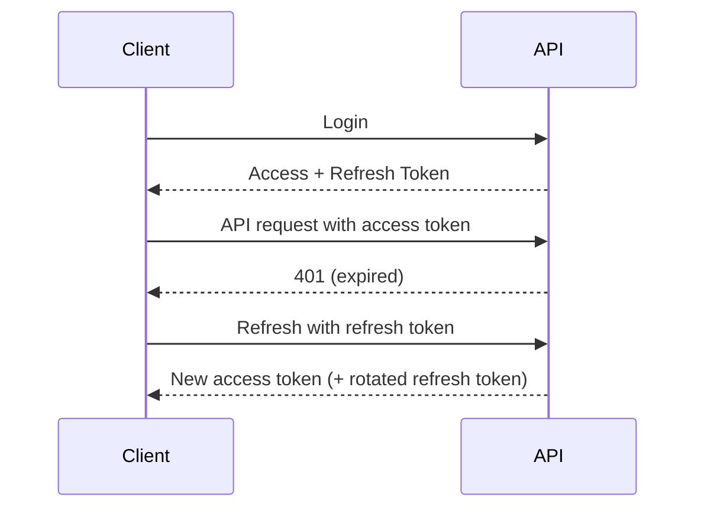

# Day 027 [Beginner]: Refresh Tokens and Session Strategy

## Index

- Goal
- Prerequisites
- Explanation
- Topic by Topic
- Key Concepts
- Visual Concept Map
- End-to-End Practical
- Hands-on Coding
- Mini Exercise
- Assessment Quiz
- Task
- Self Check
- Interview Questions and Answers
- Day Outcome

## Goal

Design secure refresh-token based session strategy for long-lived user sessions without long-lived access tokens.

## Prerequisites

- Day 026 JWT authentication
- Basic understanding of cookies and headers

## Explanation

Access tokens should be short-lived. Refresh tokens allow clients to obtain new access tokens without forcing repeated login.

## Topic by Topic

### Topic 1: Access vs Refresh Token Roles

Theory:
Access token authorizes API calls, refresh token renews access token.

Practical:
Use short access token and longer refresh token.

**Explanation:** Access and refresh tokens serve different purposes, and a strong session strategy depends on using each one appropriately.

**Key Points:**

- Separate short-lived access from session renewal.
- Different token roles reduce risk.
- Good session design starts with this distinction.

### Topic 2: Storage Strategy

Theory:
Refresh token should be stored securely (often httpOnly cookie + DB record).

Practical:
Persist hashed refresh tokens server-side.

**Explanation:** Storage strategy matters because where tokens live affects both user experience and security exposure.

**Key Points:**

- Choose storage based on threat model and architecture.
- Session storage decisions affect security posture.
- Storage is a design choice, not a default.

### Topic 3: Rotation and Reuse Detection

Theory:
Rotate refresh token on each refresh to reduce replay risk.

Practical:
Invalidate old refresh token and issue new one.

**Explanation:** Rotation and reuse detection strengthen refresh-token security by reducing the impact of stolen or replayed tokens.

**Key Points:**

- Rotate refresh tokens deliberately.
- Detect reuse as a security signal.
- Session safety depends on lifecycle controls.

### Topic 4: Logout and Session Revocation

Theory:
Logout should revoke refresh token server-side.

Practical:
Delete token/session record from DB.

**Explanation:** Logout and session revocation are important because users and systems need a reliable way to end trust intentionally.

**Key Points:**

- Support explicit session invalidation.
- Revocation matters after compromise or logout.
- Ending sessions cleanly is part of auth quality.

### Topic 5: Multi-device Session Strategy

Theory:
Track sessions per device/browser for granular control.

Practical:
Store device id and createdAt in session table.

**Explanation:** Multi-device session strategy matters because real users often sign in from more than one environment at a time.

**Key Points:**

- Plan session behavior across devices.
- Keep user control and security balanced.
- Session visibility improves trust.

### Topic 6: Reuse Detection and Cookie Security Basics

Theory:
If an old refresh token is used again, it may indicate token theft. Also, cookie settings should match your client type and CSRF risk model.

Practical:
Track token family/version and revoke full session chain on suspicious reuse.

## Strategy Comparison Table

| Strategy                | Pros                      | Risk                           |
| ----------------------- | ------------------------- | ------------------------------ |
| Long-lived access token | Simple                    | Higher compromise impact       |
| Access + refresh tokens | Better security balance   | More implementation complexity |
| Server session only     | Strong revocation control | Stateful scaling overhead      |

**Explanation:** Reuse detection and cookie security basics connect token protection with browser-safe delivery and session hardening.

**Key Points:**

- Secure cookies can reduce token exposure.
- Reuse signals help detect abuse.
- Browser delivery details affect backend auth security.

## Key Concepts

- Dual token lifecycle design
- Refresh token rotation
- Session revocation patterns
- Device-scoped session management
- Replay attack mitigation basics
- Refresh token reuse detection
- Cookie security attribute choices

## Visual Concept Map



## End-to-End Practical

1. Login endpoint issues access + refresh tokens.
2. Refresh token saved in session store.
3. Refresh endpoint rotates token pair.
4. Logout endpoint revokes refresh token.
5. Test token reuse and expiry scenarios.

## Hands-on Coding

### Example 1: Case - Issue Token Pair

Scenario:
Login endpoint creates session-aware token pair.

```js
function issueTokens(user) {
  const accessToken = jwt.sign(
    { sub: user.id },
    process.env.JWT_ACCESS_SECRET,
    { expiresIn: "15m" },
  );
  const refreshToken = jwt.sign(
    { sub: user.id },
    process.env.JWT_REFRESH_SECRET,
    { expiresIn: "7d" },
  );
  return { accessToken, refreshToken };
}
```

### Example 2: Case - Refresh Endpoint with Rotation

Scenario:
Client requests new access token after expiry.

```js
app.post("/api/v1/auth/refresh", async (req, res) => {
  const token = req.cookies.refreshToken;
  if (!token)
    return res
      .status(401)
      .json({ success: false, message: "Missing refresh token" });

  const payload = jwt.verify(token, process.env.JWT_REFRESH_SECRET);
  const user = await User.findById(payload.sub);
  if (!user)
    return res.status(401).json({ success: false, message: "Invalid session" });

  const tokens = issueTokens(user);
  res.cookie("refreshToken", tokens.refreshToken, {
    httpOnly: true,
    secure: true,
    sameSite: "strict",
  });
  res.json({ success: true, accessToken: tokens.accessToken });
});
```

### Example 3: Case - Logout Session Revocation

Scenario:
User logs out from one device.

```js
app.post("/api/v1/auth/logout", async (req, res) => {
  const token = req.cookies.refreshToken;
  if (token) {
    await Session.deleteOne({ refreshTokenHash: hashToken(token) });
  }
  res.clearCookie("refreshToken");
  res.json({ success: true, message: "Logged out" });
});
```

### Example 4: Case - Reuse Detection by Token Version

Scenario:
Server receives refresh token with stale version for the same session.

```js
// Stored session has current refreshVersion, token payload has version.
function isTokenReuse(session, tokenPayload) {
  return tokenPayload.version !== session.refreshVersion;
}

if (isTokenReuse(session, payload)) {
  // Revoke entire session family and force login.
  await Session.updateMany(
    { familyId: session.familyId },
    { $set: { revoked: true } },
  );
  return res
    .status(401)
    .json({ success: false, message: "Session revoked. Please login again." });
}
```

### Example 5: Case - Cookie Settings by Environment

Scenario:
Use safe cookie defaults for browser clients.

```js
res.cookie("refreshToken", tokens.refreshToken, {
  httpOnly: true,
  secure: process.env.NODE_ENV === "production",
  sameSite: "strict",
  path: "/api/v1/auth/refresh",
});
```

## Mini Exercise

Scenario:
Implement login, refresh, and logout flow with rotating refresh tokens.

Expected output:

- Token pair lifecycle works end-to-end
- Refresh endpoint validates and rotates tokens
- Logout revokes server-side session

## Assessment Quiz

### Quiz Questions

1. Why not keep access tokens valid for weeks?
2. What is refresh token rotation?
3. True or False: Skipping edge-case handling is acceptable in production.
4. Why track sessions per device?
5. Why is refresh-token reuse detection important?

### Quiz Answers

1. It increases compromise impact and weakens security.
2. Replacing old refresh token with a new one at each refresh.
3. False.
4. Allows selective revocation without logging user out everywhere.
5. It helps detect token theft and block continued unauthorized access.

## Task

- Build refresh flow with token rotation
- Add logout revocation behavior
- Complete mini exercise and quiz.

## Self Check

- You can implement robust session lifecycle management.
- You can reduce token replay risk with rotation patterns.
- You can answer at least 4 out of 5 quiz questions.

## Interview Questions and Answers

### Beginner

Question: What is the purpose of refresh tokens?

Answer: They allow renewing short-lived access tokens without frequent login.

### Middle

Question: Where should refresh tokens be stored on web clients?

Answer: Commonly in secure httpOnly cookies to reduce script-level theft risk.

### Advanced

Question: What is the major tradeoff of refresh token systems?

Answer: Better security and user experience, but more complexity in session/state management.

## Day 027 Outcome

- You can build access-refresh token session flow securely
- You can implement rotation and revocation patterns
- You are ready for authorization design in Day 028
