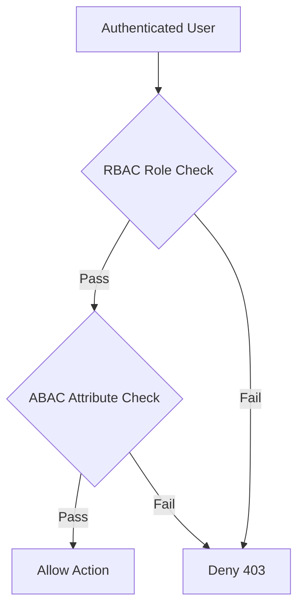

# Day 028 [Beginner]: Authorization RBAC and ABAC

## Index

- Goal
- Prerequisites
- Explanation
- Topic by Topic
- Key Concepts
- Visual Concept Map
- End-to-End Practical
- Hands-on Coding
- Mini Exercise
- Assessment Quiz
- Task
- Self Check
- Interview Questions and Answers
- Day Outcome

## Goal

Implement practical authorization checks using RBAC and ABAC strategies in Node APIs.

## Prerequisites

- Day 027 refresh/session strategy
- Basic user role and permissions understanding

## Explanation

Authentication confirms who user is. Authorization decides what the user can do. RBAC uses roles, while ABAC evaluates attributes and context.

## Topic by Topic

### Topic 1: Authn vs Authz Boundary

Theory:
Auth middleware should run before permission middleware.

Practical:
Attach req.user first, then evaluate permissions.

**Explanation:** Authentication and authorization are related but different, so separating them clearly prevents many security design mistakes.

**Key Points:**

- Authentication identifies who the user is.
- Authorization decides what they can do.
- Mixing the two concepts creates confusion.

### Topic 2: RBAC Fundamentals

Theory:
RBAC assigns permissions by roles (admin, manager, user).

Practical:
Protect admin-only endpoints with role checks.

**Explanation:** RBAC fundamentals are important because role-based access control is one of the simplest and most common authorization approaches.

**Key Points:**

- Roles group permissions logically.
- RBAC is easy to reason about initially.
- Good role design reduces policy chaos.

### Topic 3: ABAC Fundamentals

Theory:
ABAC decisions use resource owner, department, time, location, and other attributes.

Practical:
Allow edit only if user owns resource.

**Explanation:** ABAC adds more flexible conditions by considering attributes such as ownership, department, region, or request context.

**Key Points:**

- ABAC is more dynamic than simple role checks.
- Attributes allow finer-grained decisions.
- Extra flexibility also adds complexity.

### Topic 4: Combining RBAC and ABAC

Theory:
Many systems use RBAC for broad control and ABAC for fine control.

Practical:
Admin can edit all; users can edit their own documents.

**Explanation:** Combining RBAC and ABAC is common in real systems where roles alone are too broad, but free-form policies alone are too complex.

**Key Points:**

- Mixed strategies often fit real business rules best.
- Combine simplicity with precision.
- Keep combined policies understandable.

### Topic 5: Policy Maintainability

Theory:
Permission logic scattered in controllers causes drift.

Practical:
Centralize policy checks in helper functions.

**Explanation:** Policy maintainability matters because authorization logic becomes dangerous when rules are spread around the codebase without structure.

**Key Points:**

- Centralize or standardize policy logic.
- Keep rules easy to review.
- Maintainability is a security concern too.

### Topic 6: Default-deny and Policy Test Matrix

Theory:
Authorization should deny by default and allow only explicit cases.

Practical:
Create allow/deny matrix tests for role-resource combinations.

## RBAC vs ABAC Table

| Model  | Best For                          | Limitation               |
| ------ | --------------------------------- | ------------------------ |
| RBAC   | Simple team-level permissioning   | Coarse-grained control   |
| ABAC   | Fine-grained context-aware access | More policy complexity   |
| Hybrid | Real production systems           | Needs disciplined design |

**Explanation:** Default-deny and policy testing improve safety by ensuring access is granted only when rules explicitly allow it.

**Key Points:**

- Default-deny reduces accidental exposure.
- Test policy combinations deliberately.
- Authorization should be verified like any other critical logic.

## Key Concepts

- Role-based permission checks
- Attribute-based resource ownership checks
- Hybrid authorization architecture
- Policy centralization
- Least-privilege principles
- Default-deny authorization posture
- Policy matrix testing discipline

## Visual Concept Map



## End-to-End Practical

1. Add role field in user identity claim.
2. Create requireRole middleware.
3. Add ownership check helper.
4. Apply hybrid checks on update endpoint.
5. Test allow/deny matrix by role and owner.

## Hands-on Coding

### Example 1: Case - RBAC Middleware

Scenario:
Only admin can list all system users.

```js
function requireRole(...allowed) {
  return (req, res, next) => {
    if (!req.user || !allowed.includes(req.user.role)) {
      return res.status(403).json({ success: false, message: "Forbidden" });
    }
    next();
  };
}

app.get("/api/v1/admin/users", authenticate, requireRole("admin"), listUsers);
```

### Example 2: Case - ABAC Ownership Check

Scenario:
Users can edit only their own profile.

```js
function canEditProfile(requester, targetUserId) {
  return requester.role === "admin" || requester.sub === targetUserId;
}

app.patch(
  "/api/v1/users/:id",
  authenticate,
  (req, res, next) => {
    if (!canEditProfile(req.user, req.params.id)) {
      return res.status(403).json({ success: false, message: "Forbidden" });
    }
    next();
  },
  updateProfile,
);
```

### Example 3: Case - Hybrid Policy Helper

Scenario:
Document edit allowed for admin or owner in same department.

```js
function canEditDocument(user, doc) {
  if (user.role === "admin") return true;
  return doc.ownerId === user.sub && doc.department === user.department;
}
```

### Example 4: Case - Default-deny Guard

Scenario:
If no explicit rule matches, deny access.

```js
function authorize(action, user, resource) {
  if (action === "doc:edit" && user.role === "admin") return true;
  if (action === "doc:edit" && resource.ownerId === user.sub) return true;
  return false; // default deny
}
```

### Example 5: Case - Permission Matrix Test Idea

Scenario:
Validate policy behavior for admin, editor, and viewer roles.

```js
const cases = [
  { role: "admin", owns: false, expected: true },
  { role: "editor", owns: true, expected: true },
  { role: "viewer", owns: true, expected: false },
];
```

## Mini Exercise

Scenario:
Build documents API with admin role control and owner-based ABAC checks.

Expected output:

- RBAC and ABAC middleware integrated
- Correct 403 behavior for unauthorized attempts
- Centralized policy helper functions

## Assessment Quiz

### Quiz Questions

1. What is the difference between RBAC and ABAC?
2. Why should auth middleware run before authorization checks?
3. True or False: Skipping edge-case handling is acceptable in production.
4. Why is hardcoding permissions in controllers risky?
5. Why should authorization use default-deny behavior?

### Quiz Answers

1. RBAC uses roles; ABAC uses contextual attributes.
2. Authorization needs trusted user identity first.
3. False.
4. It creates inconsistent behavior and policy drift.
5. It reduces accidental over-permission and is safer by design.

## Task

- Implement both role check and ownership check middleware
- Add one policy helper reused across routes
- Complete mini exercise and quiz.

## Self Check

- You can design role and attribute based access control.
- You can enforce least-privilege route behavior.
- You can answer at least 4 out of 5 quiz questions.

## Interview Questions and Answers

### Beginner

Question: Why is authorization not equal to authentication?

Answer: Authentication identifies user; authorization decides allowed actions.

### Middle

Question: Is RBAC enough for all systems?

Answer: Often no; systems with ownership/context requirements usually need ABAC too.

### Advanced

Question: What is ABAC tradeoff compared to RBAC?

Answer: Better precision but higher policy complexity and testing needs.

## Day 028 Outcome

- You can apply practical RBAC and ABAC policies in APIs
- You can structure maintainable authorization logic
- You are ready for account security implementation in Day 029
