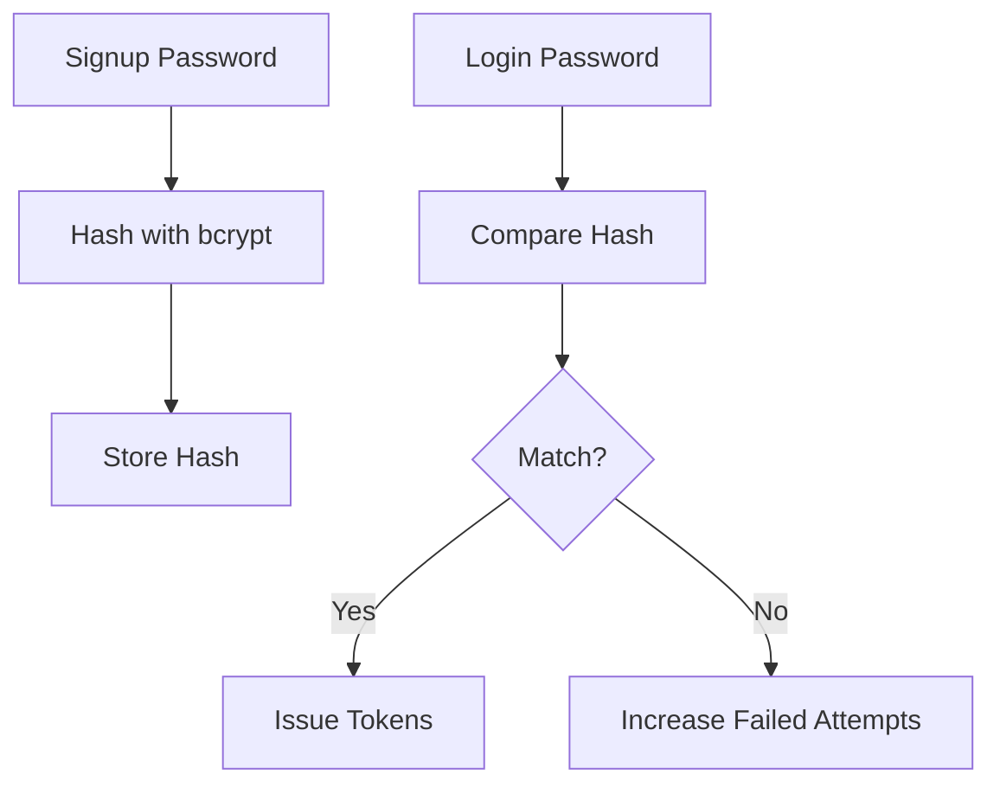

# Day 029 [Beginner]: Password Hashing and Account Security

## Index

- Goal
- Prerequisites
- Explanation
- Topic by Topic
- Key Concepts
- Visual Concept Map
- End-to-End Practical
- Hands-on Coding
- Mini Exercise
- Assessment Quiz
- Task
- Self Check
- Interview Questions and Answers
- Day Outcome

## Goal

Implement secure password handling and account-protection controls for Node authentication systems.

## Prerequisites

- Day 028 authorization fundamentals
- Basic crypto and hashing concepts

## Explanation

Passwords must never be stored as plaintext. Account security also includes brute-force protection, secure reset flow, and suspicious-login handling.

## Topic by Topic

### Topic 1: Hashing Fundamentals

Theory:
Use adaptive password hashing (bcrypt or argon2), not encryption.

Practical:
Hash on signup, compare on login.

**Explanation:** Hashing fundamentals matter because passwords should never be stored in plain text or reversible forms.

**Key Points:**

- Hash passwords before storing them.
- Hashing is different from encryption.
- Safe credential storage starts here.

### Topic 2: Salt and Work Factor

Theory:
Salt and cost factor slow brute-force attempts.

Practical:
Tune bcrypt rounds for security and performance balance.

**Explanation:** Salt and work factor strengthen password storage by making precomputed attacks and brute-force attempts much harder.

**Key Points:**

- Salts protect against reused-hash attacks.
- Work factor affects cost for attackers and servers.
- Hash settings should be chosen deliberately.

### Topic 3: Login Protection

Theory:
Track failed attempts and temporary lockouts.

Practical:
Block repeated failed login attempts.

**Explanation:** Login protection matters because authentication systems must defend not only stored passwords but also repeated attack attempts.

**Key Points:**

- Protect login endpoints from abuse.
- Limit repeated failed attempts appropriately.
- Account security includes runtime defenses.

### Topic 4: Password Reset Security

Theory:
Reset links should be short-lived and one-time use.

Practical:
Store hashed reset token with expiry.

**Explanation:** Password reset security is critical because recovery flows are a common target and can bypass normal login protections.

**Key Points:**

- Reset flows need strong token handling.
- Recovery paths should expire safely.
- Treat resets as high-risk auth operations.

### Topic 5: Account Security Hygiene

Theory:
Use strong password policy and suspicious activity alerts.

Practical:
Notify user on password change and unusual login location.

**Explanation:** Account security hygiene includes the broader set of practices that keep user accounts resilient beyond password hashing alone.

**Key Points:**

- Account safety goes beyond stored credentials.
- Good hygiene reduces avoidable security weaknesses.
- Security practices should be layered.

### Topic 6: Hash Upgrade and Session Invalidation

Theory:
Security settings improve over time. Old password hashes may need upgrade, and changing password should invalidate old sessions.

Practical:
Rehash on login when needed and revoke existing refresh sessions after password reset/change.

## Security Control Table

| Control                 | Purpose                      |
| ----------------------- | ---------------------------- |
| Hashing (bcrypt/argon2) | Protect password if DB leaks |
| Login attempt limits    | Reduce brute force success   |
| Reset token expiry      | Limit takeover window        |
| Audit logs              | Track security events        |

**Explanation:** Hash upgrades and session invalidation matter because security standards evolve and old sessions may remain risky after key changes.

**Key Points:**

- Upgrade password storage strategies over time.
- Invalidate risky sessions when needed.
- Long-term account safety needs maintenance.

## Key Concepts

- Secure password hashing lifecycle
- Cost factor and performance tradeoff
- Brute-force mitigation
- Secure password reset design
- Security event observability
- Password-hash upgrade strategy
- Session invalidation after credential change

## Visual Concept Map



## End-to-End Practical

1. Hash password on registration.
2. Verify hash on login.
3. Add failed-attempt counter and lockout.
4. Add secure reset token workflow.
5. Add security event logs and alerts.

## Hands-on Coding

### Example 1: Case - Hash on Signup

Scenario:
Prevent plaintext password storage in users table.

```js
const bcrypt = require("bcryptjs");

async function registerUser({ email, password }) {
  const passwordHash = await bcrypt.hash(password, 12);
  return User.create({ email, passwordHash });
}
```

### Example 2: Case - Verify on Login + Lockout

Scenario:
Stop repeated brute force attempts.

```js
async function login(email, password) {
  const user = await User.findOne({ email });
  if (!user || user.lockedUntil > Date.now())
    throw new Error("Invalid credentials");

  const ok = await bcrypt.compare(password, user.passwordHash);
  if (!ok) {
    user.failedAttempts += 1;
    if (user.failedAttempts >= 5)
      user.lockedUntil = Date.now() + 15 * 60 * 1000;
    await user.save();
    throw new Error("Invalid credentials");
  }
}
```

### Example 3: Case - Password Reset Token

Scenario:
Allow secure forgot-password flow.

```js
const crypto = require("crypto");

function createResetToken() {
  const raw = crypto.randomBytes(32).toString("hex");
  const hash = crypto.createHash("sha256").update(raw).digest("hex");
  return { raw, hash, expiresAt: new Date(Date.now() + 10 * 60 * 1000) };
}
```

### Example 4: Case - Rehash on Login (Cost Upgrade)

Scenario:
User logs in with valid password, but stored hash uses older lower cost.

```js
const TARGET_ROUNDS = 12;

async function loginWithUpgrade(user, password) {
  const ok = await bcrypt.compare(password, user.passwordHash);
  if (!ok) throw new Error("Invalid credentials");

  if (bcrypt.getRounds(user.passwordHash) < TARGET_ROUNDS) {
    user.passwordHash = await bcrypt.hash(password, TARGET_ROUNDS);
    await user.save();
  }
}
```

### Example 5: Case - Revoke Sessions After Password Change

Scenario:
Password reset should log out old sessions from other devices.

```js
await Session.updateMany(
  { userId: user.id, revoked: { $ne: true } },
  { $set: { revoked: true, revokedReason: "password_changed" } },
);
```

## Mini Exercise

Scenario:
Build signup/login/reset-password flow with hashing and login-attempt lockout.

Expected output:

- Passwords stored only as hashes
- Lockout after repeated failures
- Reset token expiry and one-time use logic

## Assessment Quiz

### Quiz Questions

1. Why is password hashing mandatory?
2. What does bcrypt cost factor impact?
3. True or False: Skipping edge-case handling is acceptable in production.
4. Why should reset tokens be hashed in DB?
5. Why revoke existing sessions after password reset?

### Quiz Answers

1. It protects user credentials if database is compromised.
2. Security strength and CPU time for hashing.
3. False.
4. DB leaks should not expose usable reset tokens.
5. To block stolen old tokens from continuing access.

## Task

- Implement hashing + compare in auth flow
- Add one brute-force mitigation control
- Complete mini exercise and quiz.

## Self Check

- You can build secure password lifecycle implementations.
- You can reduce common account takeover risks.
- You can answer at least 4 out of 5 quiz questions.

## Interview Questions and Answers

### Beginner

Question: Why not encrypt passwords instead of hashing?

Answer: Password verification needs one-way protection; hashing is safer for credential storage.

### Middle

Question: Is bcrypt enough without login rate limits?

Answer: No, hashing helps storage security but rate limiting and lockout protect against active attacks.

### Advanced

Question: What is one hashing tradeoff?

Answer: Stronger cost factor improves security but increases login CPU overhead.

## Day 029 Outcome

- You can implement secure account protection controls
- You can combine hashing with operational safeguards
- You are ready for API hardening with headers and rate limits in Day 030
