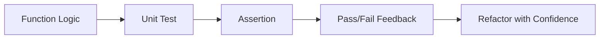

# Day 031 [Beginner]: Testing with Jest or Vitest

## Index

- Goal
- Prerequisites
- Explanation
- Topic by Topic
- Key Concepts
- Visual Concept Map
- End-to-End Practical
- Hands-on Coding
- Mini Exercise
- Assessment Quiz
- Task
- Self Check
- Interview Questions and Answers
- Day Outcome

## Goal

Build strong fundamentals for automated backend tests using Jest or Vitest.

## Prerequisites

- Day 030 API security basics
- Basic JavaScript functions and modules

## Explanation

Unit tests catch regressions early, improve confidence during refactors, and document expected behavior.

## Topic by Topic

### Topic 1: Why Unit Testing Matters

Theory:
Unit tests verify small pieces of logic in isolation.

Practical:
Test utility and service functions with deterministic inputs.

**Explanation:** Unit testing matters because it gives fast feedback about logic correctness before bugs reach integration or production.

**Key Points:**

- Unit tests catch logic issues early.
- Fast feedback improves development confidence.
- Strong test basics reduce regression risk.

### Topic 2: Jest vs Vitest Basics

Theory:
Both provide test runner, assertions, and mocks.

Practical:
Choose one tool and standardize team usage.

**Explanation:** Jest and Vitest solve similar testing problems, so learning their core ideas helps you choose a tool without confusion.

**Key Points:**

- Both tools support modern Node.js testing workflows.
- Choose based on project fit and team preference.
- Core testing concepts matter more than tool branding.

### Topic 3: Test Structure

Theory:
Arrange-Act-Assert improves readability.

Practical:
Write explicit test names and single responsibility tests.

**Explanation:** Good test structure keeps test files readable, focused, and easy to extend as behavior grows.

**Key Points:**

- Organize tests clearly by behavior.
- Keep setup and assertions easy to read.
- Structure affects long-term maintainability.

### Topic 4: Async Testing

Theory:
Promises and async functions require await or returned promise.

Practical:
Test resolved and rejected cases.

**Explanation:** Async testing is essential in Node.js because many functions depend on promises, timers, or I/O operations.

**Key Points:**

- Handle async tests deliberately.
- Await the behavior you are testing.
- Async mistakes can cause false positives or flaky failures.

### Topic 5: Coverage and Reliability

Theory:
Coverage is useful, but quality assertions matter more.

Practical:
Focus on business-critical paths and edge cases.

**Explanation:** Coverage and reliability matter because test success should reflect meaningful verification, not just a high number.

**Key Points:**

- Coverage alone is not enough.
- Reliable tests matter more than broad but weak tests.
- Aim for trustable feedback.

### Topic 6: Mock Cleanup and Time-based Testing

Theory:
Tests can become flaky if mocks leak between test cases. Time-based logic also needs deterministic control.

Practical:
Reset mocks after each test and use fake timers for expiry/deadline functions.

## Quick Tool Table

| Aspect             | Jest         | Vitest                       |
| ------------------ | ------------ | ---------------------------- |
| Ecosystem maturity | Very high    | High                         |
| Startup speed      | Good         | Very fast with Vite projects |
| API familiarity    | Widely known | Jest-like API                |

**Explanation:** Mock cleanup and time-based testing matter because shared mock state and timers can leak across tests and create hard-to-debug failures.

**Key Points:**

- Clean up mocks consistently.
- Control timers carefully in tests.
- Isolation keeps the suite stable.

## Key Concepts

- Unit test purpose and boundaries
- Assertion quality
- Async test patterns
- Stable test design
- Mock isolation between tests
- Deterministic testing for time logic
- Coverage tradeoffs

## Visual Concept Map



## End-to-End Practical

1. Set up test runner.
2. Add utility function tests.
3. Add async service tests.
4. Add error-path assertions.
5. Review coverage for critical modules.

## Hands-on Coding

### Example 1: Case - Basic Unit Test

Scenario:
Discount utility should calculate final price correctly.

```js
// discount.js
function applyDiscount(price, percent) {
  return price - (price * percent) / 100;
}
module.exports = { applyDiscount };

// discount.test.js
const { applyDiscount } = require("./discount");

test("applies 10 percent discount", () => {
  expect(applyDiscount(1000, 10)).toBe(900);
});
```

### Example 2: Case - Async Success and Failure

Scenario:
Profile service fetches user data asynchronously.

```js
async function getUserById(id) {
  if (!id) throw new Error("id required");
  return { id, name: "Asha" };
}

test("returns user for valid id", async () => {
  await expect(getUserById(10)).resolves.toEqual({ id: 10, name: "Asha" });
});

test("throws for missing id", async () => {
  await expect(getUserById()).rejects.toThrow("id required");
});
```

### Example 3: Case - Table-driven Tests

Scenario:
Tax calculator has multiple predictable cases.

```js
function addTax(amount, taxRate) {
  return amount + (amount * taxRate) / 100;
}

test.each([
  [100, 5, 105],
  [200, 10, 220],
  [500, 18, 590],
])("addTax(%i, %i)", (amount, tax, expected) => {
  expect(addTax(amount, tax)).toBe(expected);
});
```

### Example 4: Case - Reset Mocks After Each Test

Scenario:
Mock call counts should not leak across test cases.

```js
afterEach(() => {
  vi.restoreAllMocks(); // use jest.restoreAllMocks() in Jest
});
```

### Example 5: Case - Fake Timer for Expiry Logic

Scenario:
Session helper marks token as expired after timeout.

```js
vi.useFakeTimers(); // use jest.useFakeTimers() in Jest

test("expires after 5 minutes", () => {
  const start = Date.now();
  const expiresAt = start + 5 * 60 * 1000;

  vi.setSystemTime(expiresAt + 1);
  expect(Date.now() > expiresAt).toBe(true);
});
```

## Mini Exercise

Scenario:
Create tests for a `calculateShipping` function with normal, free-shipping, and invalid-input cases.

Expected output:

- At least 3 passing tests
- One error case assertion
- Clear test naming

## Assessment Quiz

### Quiz Questions

1. Why write unit tests for simple utility functions?
2. What happens if you forget await in async test?
3. True or False: High coverage always means high quality tests.
4. What is Arrange-Act-Assert?
5. Why should mocks be reset/cleared between tests?

### Quiz Answers

1. They prevent regressions and document intended behavior.
2. Tests may pass/fail incorrectly due to unresolved async operations.
3. False.
4. A structure: setup input, execute logic, assert output.
5. To avoid hidden state leaks and flaky, order-dependent behavior.

## Task

- Set up Jest or Vitest in one project
- Write 5 unit tests including 2 edge cases
- Complete mini exercise and quiz

## Self Check

- You can write deterministic unit tests
- You can test async success and failure paths
- You can answer at least 4 out of 5 quiz questions

## Interview Questions and Answers

### Beginner

Question: What is a unit test?

Answer: A test that checks a small isolated piece of logic, usually a single function.

### Middle

Question: How do you make tests less flaky?

Answer: Avoid external dependencies, control inputs, and mock unstable sources.

### Advanced

Question: How do you balance speed and confidence in test suites?

Answer: Keep many fast unit tests, targeted integration tests, and a smaller E2E layer.

## Day 031 Outcome

- You can build and run practical unit tests with Jest or Vitest
- You can test synchronous and asynchronous backend logic safely
- You are ready for API testing with Supertest in Day 032
