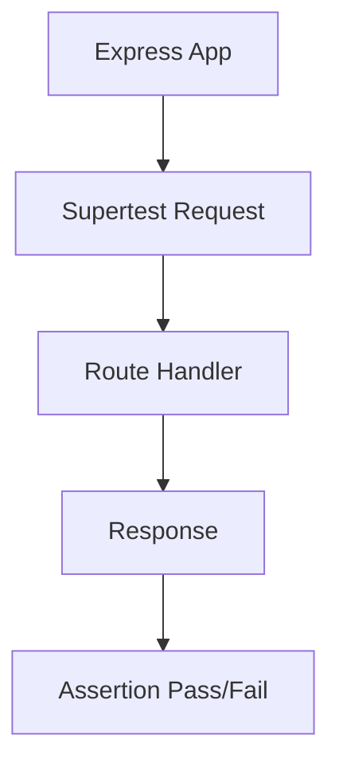

# Day 032 [Beginner]: Supertest for API Testing

## Index

- Goal
- Prerequisites
- Explanation
- Topic by Topic
- Key Concepts
- Visual Concept Map
- End-to-End Practical
- Hands-on Coding
- Mini Exercise
- Assessment Quiz
- Task
- Self Check
- Interview Questions and Answers
- Day Outcome

## Goal

Test Express API endpoints reliably using Supertest with status, headers, and response validation.

## Prerequisites

- Day 031 testing basics
- Express route fundamentals

## Explanation

Supertest allows API testing without manually running server on a port. It executes requests directly against Express app instance.

## Topic by Topic

### Topic 1: Why Supertest

Theory:
It provides fluent HTTP assertions and simplifies API contract tests.

Practical:
Assert status codes and JSON body quickly.

**Explanation:** Supertest matters because it lets you test HTTP behavior directly without manually spinning up external clients for each case.

**Key Points:**

- Supertest is designed for API testing.
- It keeps HTTP assertions simple.
- Useful API tests improve backend confidence.

### Topic 2: App/Test Separation

Theory:
Export app separately from listen call.

Practical:
Use `module.exports = app` for test imports.

**Explanation:** App and test separation makes API testing cleaner because the application can be imported into tests without production-only startup behavior.

**Key Points:**

- Separate server bootstrap from app creation.
- Cleaner separation makes tests easier to run.
- Testability improves architecture quality.

### Topic 3: Auth and Header Testing

Theory:
Protected routes need header and token checks.

Practical:
Test missing token and valid token paths.

**Explanation:** Auth and header testing matter because real APIs depend on tokens, content types, and request metadata to behave correctly.

**Key Points:**

- Test headers and auth deliberately.
- Request metadata often changes behavior.
- Protected-route verification is important.

### Topic 4: Error-path Testing

Theory:
API quality depends on correct failure behavior too.

Practical:
Test 400, 401, 404, and 500 responses.

**Explanation:** Error-path testing is critical because APIs must fail predictably, not only succeed correctly.

**Key Points:**

- Test expected failure cases too.
- Error responses are part of the contract.
- Stable failure behavior improves clients and debugging.

### Topic 5: Data Isolation

Theory:
Tests should not depend on shared mutable state.

Practical:
Reset DB or mock repository between tests.

**Explanation:** Data isolation keeps API tests trustworthy by preventing one test’s changes from leaking into another.

**Key Points:**

- Keep test data independent.
- Isolation reduces flaky failures.
- Test databases or seeded states should be controlled.

### Topic 6: Session Agent and Cleanup Strategy

Theory:
Some auth flows use cookies and multi-step requests. You need a persistent test client and cleanup between tests.

Practical:
Use Supertest agent for cookie sessions and clear test data in setup/teardown hooks.

## Assertion Table

| Assertion  | Example                               |
| ---------- | ------------------------------------- |
| Status     | `.expect(201)`                        |
| Header     | `.expect("Content-Type", /json/)`     |
| Body field | `expect(res.body.success).toBe(true)` |

**Explanation:** Session agents and cleanup strategies matter when tests need persistent auth state or when resources must be reset after execution.

**Key Points:**

- Use session helpers when auth state spans requests.
- Clean up after tests consistently.
- Stateful tests need extra discipline.

## Key Concepts

- API contract verification
- App bootstrapping for testability
- Auth route testing strategy
- Error path confidence
- Test data isolation principles
- Cookie/session flow testing
- Setup and teardown hygiene

## Visual Concept Map



## End-to-End Practical

1. Export Express app for testing.
2. Add health endpoint test.
3. Add create-resource endpoint test.
4. Add auth-protected endpoint test.
5. Add invalid input and not-found tests.

## Hands-on Coding

### Example 1: Case - Health Endpoint Test

Scenario:
Verify API boot and JSON contract.

```js
const request = require("supertest");
const app = require("../app");

test("GET /health returns ok", async () => {
  const res = await request(app).get("/health").expect(200);
  expect(res.body.status).toBe("ok");
});
```

### Example 2: Case - POST Validation Error Test

Scenario:
Product API should reject missing name.

```js
test("POST /products rejects invalid body", async () => {
  const res = await request(app)
    .post("/products")
    .send({ price: 100 })
    .expect(400);

  expect(res.body.success).toBe(false);
});
```

### Example 3: Case - Protected Route with Token

Scenario:
Profile route requires valid bearer token.

```js
test("GET /me requires auth", async () => {
  await request(app).get("/me").expect(401);
});

test("GET /me with token returns profile", async () => {
  const token = createTestToken({ sub: "u1", role: "user" });
  const res = await request(app)
    .get("/me")
    .set("Authorization", `Bearer ${token}`)
    .expect(200);

  expect(res.body.success).toBe(true);
});
```

### Example 4: Case - Cookie Session Flow with Agent

Scenario:
Login sets cookie and next request uses same session.

```js
const agent = request.agent(app);

test("login then access protected route", async () => {
  await agent
    .post("/login")
    .send({ email: "a@b.com", password: "secret" })
    .expect(200);
  await agent.get("/me").expect(200);
});
```

### Example 5: Case - Test Data Cleanup Hooks

Scenario:
Each test should start from known database state.

```js
beforeEach(async () => {
  await resetTestDatabase();
});

afterAll(async () => {
  await closeTestResources();
});
```

## Mini Exercise

Scenario:
Write API tests for users module with success, validation error, and unauthorized cases.

Expected output:

- Endpoint behavior covered across success/failure
- Headers and status codes asserted
- Auth edge case included

## Assessment Quiz

### Quiz Questions

1. Why use Supertest instead of manual API calls in Postman for CI?
2. What enables app testing without starting a network listener?
3. True or False: Skipping edge-case handling is acceptable in production.
4. Why must error responses be tested too?
5. When should Supertest agent be used?

### Quiz Answers

1. It automates repeatable API checks in pipelines.
2. Exporting app instance directly to Supertest.
3. False.
4. Most production bugs happen in edge/failure flows.
5. When tests need cookie/session state across multiple requests.

## Task

- Write at least 5 endpoint tests with Supertest
- Include 2 negative test scenarios
- Complete mini exercise and quiz.

## Self Check

- You can test Express APIs in an automated way.
- You can assert contracts for both success and failure paths.
- You can answer at least 4 out of 5 quiz questions.

## Interview Questions and Answers

### Beginner

Question: What is the biggest benefit of Supertest?

Answer: Fast, automated endpoint checks without needing manual API testing each time.

### Middle

Question: Should API tests validate only status code?

Answer: No, they should also validate headers and response body contract.

### Advanced

Question: What is one API-test tradeoff?

Answer: More setup than manual checks, but much stronger regression protection.

## Day 032 Outcome

- You can build reliable API tests with Supertest
- You can validate auth, input, and contract behavior
- You are ready for mocking and test doubles in Day 033
